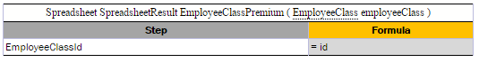
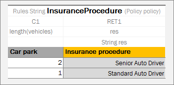

## Working with Arrays

An **array** is a collection of values of the same type. Separate values of an array are called **array elements**. An **array element** is a value of any data type available in the system, such as Integer, Double, Boolean, and String. For more information on OpenL Tablets Data Types, see [Working with Data Types](working-with-data-types.md#working-with-data-types).

Square brackets in the name of the data type indicate that there is an array of values in the user's rule to be dealt with. For example, the `String[]` expression can be used to represent an array of text elements of the **String** data type, such as US state names, for example, CA, NJ, and VA. Users use arrays for different purposes, such as calculating statistics and representing multiple rates.

The following topics are included in this section:

-   [Working with Arrays from Rules](#working-with-arrays-from-rules)
-   [Array Index Operators](#array-index-operators)
-   [Operators and Functions to Work with Arrays](#operators-and-functions-to-work-with-arrays)
-   [Rules Applied to Array](#rules-applied-to-array)
-   [Rules with Variable Length Arguments](#rules-with-variable-length-arguments)

### Working with Arrays from Rules

Data type arrays can be used in rules as follows:

| Method                                       | Description                                                                                                                                                                                                                                                                                                                                                                                                                                                                                                                                                                                                                                                                                                                                                                                               |
|----------------------------------------------|-----------------------------------------------------------------------------------------------------------------------------------------------------------------------------------------------------------------------------------------------------------------------------------------------------------------------------------------------------------------------------------------------------------------------------------------------------------------------------------------------------------------------------------------------------------------------------------------------------------------------------------------------------------------------------------------------------------------------------------------------------------------------------------------------------------|
| By numeric index,  starting from 0            | In this case, by calling `drivers[5]`, a user gets the sixth element of the data type array.                                                                                                                                                                                                                                                                                                                                                                                                                                                                                                                                                                                                                                                                                                              |
| By user defined index                        | This case is a little more complicated. The first field of data type is considered to be the user defined index.   For example, if there is a **Driver** data type with the first String field name, a data table can be created, initializing two instances  of **Driver** with the following names: John and David. Then in rules, the required instance can be called by `drivers["David"]`.   All Java types, including primitives, and data types can be used for user specific indexes.  When the first field of data type is of `int` type called `id,` to call the instance from array, wrap it with quotes as in  `drivers["7"]`. In this case, a user does not get the eighth element in the array, but the **Driver** with ID=7.  For more information on data tables, see [Data Table](../../02-working-with-openl-tables/03-table-types/07-data-table/01-using-simple-data-tables.md#data-table). |
| By conditional index                         | Another case is to use conditions that consider which elements must be selected.  For this purpose, SELECT operators are used, which specify conditions for selection.  For more information on how to use SELECT operators, see [Array Index Operators](#array-index-operators).                                                                                                                                                                                                                                                                                                                                                                                                                                                                                                                           |
| By other array index  operators and functions | Any index operator listed in [Array Index Operators](#array-index-operators) or a function designed to work with arrays can be applied to an array in user rules.  The full list of OpenL Tablets array functions is provided in [Array Functions](../../05-appendices/02-array-functions.md).                                                                                                                                                                                                                                                                                                                                                                                                                                                             |

When referencing the non-existing element by array[index], for primitive types, the default value is returned, and for other types, null is returned.

### Array Index Operators

**Array index operators** are operators which facilitate working with arrays in rules. Index operators are specified in square brackets of the array and apply particular actions to array elements.

This section provides detailed description of index operators along with examples. OpenL Tablets supports the following index operators:

-   [SELECT Operators](#select-operators)
-   [ORDER BY Operators](#order-by-operators)
-   [SPLIT BY Operator](#split-by-operator)
-   [TRANSFORM TO Operators](#transform-to-operators)
-   [Array Index Operators and Arrays of the SpreadsheetResult Type](#array-index-operators-and-arrays-of-the-spreadsheetresult-type)
-   [Advanced Usage of Array Index Operators](#advanced-usage-of-array-index-operators)

#### SELECT Operators

There are cases requiring conditions that determine the elements of the array to be selected. For example, if there is a data type **Driver** with such fields as **name** of the String type, **age** of the Integer type, and other similar data, and all drivers with the name **John** aged under **20** must be selected, use the following SELECT operator realizing conditional index:

`arrayOfDrivers[select all having name == "John" and age < 20]`

The following table describes the SELECT operator types:

| Type                                               | Description                                                                                                                                                                                                                                                      |
|----------------------------------------------------|------------------------------------------------------------------------------------------------------------------------------------------------------------------------------------------------------------------------------------------------------------------|
| Returns the first element  satisfying the condition | Returns the first matching element or null if there is no such element.  **Syntax:** `array[!@ <condition>]` or `array[select first having <condition>]` or `array[select first where <condition>]`  **Example:** `arrayOfDrivers[!@ name == "John" and age < 20]` |
| Returns all elements  satisfying the condition      | Returns the array of matching elements or empty array if there are no such elements.  **Syntax:** `array[@ <condition>]` or `array [select all having <condition>]` or `array[select all where <condition>]`  **Example:** `arrayOfDrivers[@ numAccidents > 3]`    |

#### ORDER BY Operators

These operators are intended to sort elements of the array. Consider a data type **Claim** with such fields as **lossDate** of the Date type, **paymentAmount** of the Double type, and other similar data, and all claims must be sorted by loss date starting with the earliest one. In this case, use the ORDER BY operator, such as `claims[order by lossDate]`.

The following table describes ways of sorting:

| Method                            | Description                                                                                                                                            |
|-----------------------------------|--------------------------------------------------------------------------------------------------------------------------------------------------------|
| Sort elements by increasing order | **Syntax:** `array[^@ <expression>]` or `array[order by <expression>] `or `array[order increasing by <expression>]`  **Example:** `claims[^@ lossDate]` |
| Sort elements by decreasing order | **Syntax:** `array[v@ <expression>]` or `array[order decreasing by <expression>]`  **Example:** `claims[v@ paymentAmount]`                              |

**Note:** The operator returns the array with ordered elements. It saves element order in case of equal elements. `<expression>` by which ordering is performed must have a comparable type, such as Date, String, Number.

#### SPLIT BY Operator

To split array elements into groups by definite criteria, use SPLIT BY operator, which returns a collection of arrays with elements in each array of the same criteria. For example, `codes = {"5000", "2002", "3300", "2113"}; codes[split by substring(0,1)]` will produce three collections, `{"5000"}, {"2002", "2113"} and {"3300"}` united by codes with the equal first number.

**Syntax:** `array[~@ <expression>]` or `array[split by <expression>]`

**Example:** `orders[~@ orderType]`

where orders of `Order[]` data type, custom data type **Order** has a field **orderType** for defining a category of **Order**. The operator in the example produces `Order[][]` split by different categories.

The SPLIT BY operator returns a two-dimensional array containing arrays of elements split by an equal value of `<expression>`. The relative element order is preserved.

#### TRANSFORM TO Operators

This operator turns source array elements into another transformed array in a quick way. Assume that a collection of claims is available and **claim ID** and **loss date** information for each claim in the form of array of strings needs to be returned. Use the TRANSFORM TO operator, such as `claims[transform to id + " - " + dateToString(lossDate, "dd.MM.YY")]`.

The following table describes methods of transforming:

| Method                                                                        | Description                                                                                                                                                                                                                                                                                                             |
|-------------------------------------------------------------------------------|-------------------------------------------------------------------------------------------------------------------------------------------------------------------------------------------------------------------------------------------------------------------------------------------------------------------------|
| Transforms elements and returns  the whole transformed array                   | **Syntax:** `array[*@ <expression>]` or `array[transform to <expression>]`  **Example:** `drivers[transform to name]` or `drivers[*@ name]`                                                                                                                                                                                |
| Transforms elements and returns  unique elements of the transformed array only | **Syntax:** `array[*!@ <expression>]` or `array[transform unique to <expression>]`  **Example:** `drivers[transform unique to vehicle]` or `drivers[*!@ vehicle]`  **Example:** `otherProducts [ (p) transform unique to p]` returns a unique list of products where "p" is the name  given by a user for the transformed array. |

The example above produces collection of vehicles, and in this collection, each vehicle is listed only once, without identical vehicles.

The operator returns array of the `<expression> `type. The order of the elements is preserved.

Any field, method of the collection element, or any OpenL Tablets function can be used in `<condition>` / `<expression>,` for example: `claims[order by lossDate], `where `lossDate `is a field of the **Claim** array element;`arrayOfCarModels[@ contains("Toyota")],`where `contains` is a method of String element of the `arrayOfCarModels` array.

#### Array Index Operators and Arrays of the SpreadsheetResult Type

Array index operators can be used with arrays which elements are of SpreadsheetResult data type. To refer to a cell of SpreadsheetResult element in the operator condition, the full `$columnName$rowName `or simplified reference format is used.

Consider an example with select operator. There is a rule which selects and returns spreadsheet result with value **2** in the \$Formula\$EmployeeClassId cell.

*Index operator applied on array of SpreadsheetResults*

where the spreadsheet result element of allEmployeeClassPremiums array is calculated from the following spreadsheet table:

*Spreadsheet for allEmployeeClassPremiums array result calculation*

#### Advanced Usage of Array Index Operators

Consider a case when the name of the array element needs to be referred explicitly in condition or expression. For example, the policy has a collection of drivers of Driver[] data type and a user wants to select all policy drivers of the age less than 19, except for the primary driver. The following syntax with an explicit definition of the `(elementName) `collection element can be used:

`policy.drivers[(elementName) @ elementName != policy.primaryDriver && elementName.age < 19]`

**Note for experienced users:** An expression can be written using the explicit type definition, via the (Datatype x) syntax, and array index operators can be applied to lists. Examples are as follows.

    -   List claims = policy.getClaims(); claims[(Claim claim) order by claim.date]
    -   List claims = policy.getClaims(); claims[(Claim claim) ^@ date]

### Operators and Functions to Work with Arrays

This section describes operators and functions used in work with arrays and includes the following topics:

-   [Length Function](#length-function)
-   [Comparison Operators](#comparison-operators)

For more information on array functions, see [Array Functions](../../05-appendices/02-array-functions.md).

#### Length Function

The **Length** array function returns the number of elements in the array as a result value. An example is as follows.

*Rule table with the length function*

In this example, the **Insurance** procedure depends on the number of vehicles. The policy includes vehicles field represented as array.

*Test table for rule table with length function*

Policy2 contains two vehicles as illustrated in the following data table.

*Data table for a test table*

**Note:** The length function can be used for maps, in the same way as it is used for collections and arrays.

#### Comparison Operators

== and != comparison operators can be applied to arrays. Array elements are compared one-by-one, and for each element pair, if comparison result is true, all array comparison result is true. For more information on operators, see [Operators Used in OpenL Tablets](../../05-appendices/01-bex-language-overview.md#operators-used-in-openl-tablets).

### Rules Applied to Array

OpenL Tablets allows applying a rule intended for work with one value to an array of values. The following example demonstrates this feature in a very simple way.

*Applying a rule to an array of values*

The **VehicleCalculation** rule is designed for working with one vehicle as an input parameter and returns one spreadsheet as a result. In the example, this rule is applied to an array of vehicles, which means that it is executed for each vehicle and returns an array of spreadsheet results.

If several input parameters for a rule are arrays where the rule expects only a single value, the rule is separately calculated for each element of these arrays, and the result is an array of the return type. In other words, OpenL Tablets executes the rule for each combination of input values from arrays and return a collection of all these combinations' results. The order in which these arrays are iterated is not specified.

**Note:** OpenL Tablets engine may run parts of one request in parallel and Dev property `Concurrent Execution` is used to enable or disable this behavior in case when the rule table is applied to an array of value instead of a single value. `Concurrent Execution` is useful for complex rule sets where parallel execution will improve performance for a single request. But note that modifying arguments of the rule are not thread safe.

### Rules with Variable Length Arguments

If the last input of the table is an array, OpenL Tablets allows passing this array as an array or a set of comma-separated elements.

An example is as follows:

`Spreadsheet Integer RatingFunction(Integer index, String customerName, Double[] rates)`

It can be called as follows:

`RatingFunction(5, "SomeCompany", 10, 12, 14, 13)`

In this example, OpenL recognizes and transforms all last numbers-inputs into a single array of numbers-input.
