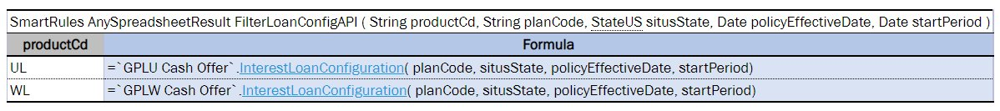

## Project, Module, and Rule Dependencies

**Dependencies** provide more flexibility and convenience. They may divide rules into different modules and structure them in a project or add other related projects to the current one. For example, if a user has several projects with different modules, all user projects share the same domain model or use similar helpers rules, and to avoid rules duplication, put the common rules and data to a separate module and add this module as dependency for all required modules.

| Term               | Description                                                                                                                          |
|--------------------|--------------------------------------------------------------------------------------------------------------------------------------|
| Dependency module  | Module that is used as a dependency.                                                                                                 |
| Dependency project | Project that is used as a dependency.                                                                                                |
| Root module        | Module that has dependency declaration, explicit via environment or implicit via project dependency, to replace with another module. |
| Root project       | Project that has dependency declaration to replace with another project.                                                             |

The following topics are included in this section:

-   [Dependencies Description](#dependencies-description)
-   [Dependencies Configuration](#dependencies-configuration)
-   [Import Configuration](#import-configuration)
-   [Components Behavior](#components-behavior)

### Dependencies Description

The **module dependency** feature allows making a hierarchy of modules when rules of one module depend on rules of another module. As mentioned before, all modules of one project have mutual access to each other's tables. Therefore, module dependencies are intended to order them in the project if it is required for compilation purposes. Module dependencies are commonly established among modules of the same project. An exception is as follows.

The following diagram illustrates a project in which the content of **Module_1** and **Module_2** depends on the content of **Module_3**, where thin black arrows are module dependencies:


*Example of a project with modules hierarchy*

In addition, **project dependency** enables accessing modules of other projects from the current one:


*Example of a project dependency with all modules*

The previous diagram displays that any module of **Project1** can execute any table of any module of **Project2**: thick gray arrow with the **All Modules** label is a project dependency with all dependency project modules included. This is equivalent to the following schema when each module of **Project1** has implicit dependency declaration to each module of **Project2**:


*Interpretation of a project dependency (with all modules)*

The project dependency with the **All Modules** setting switched on provides access to any module of a dependency project from the current root project.

Users may combine module and project dependencies if only a particular module of another project must be used. An example is as follows:


*Example of a project and module dependencies combined*

In the example, for defined external **Project2**, only the content of **Module2_2** is accessible from **Project1**: thick gray arrow without label is a project dependency which defines other projects where dependency module can be located.

If the project dependency does not have the **All Modules** setting enabled, dependencies are determined on the module level, and such project dependencies serve the isolation purpose thus enabling getting a dependency module from particular external projects.


*Defining dependencies for projects in OpenL Studio*

After adding a dependency, all its rules, data fields, and data types are accessible from the root module. The root module can call dependency rules.

Dependencies can also be used to call a specific rule from another project that have a similar structure or similar approach to rules model naming, for example, datatype table naming or using rules with the same or similar signature. To add a dependency rule, use the following syntax:

```
`Project`.tableName()
`Project/module`.tableName()
```

`Project`.tableName() must be used if the table name is unique within the whole project.
`Project/module`.tableName() must be used if the table name is not unique among the modules.



*Example of calling a rule from another project*

This syntax is applicable when there is a dependency on a project and the **All Modules** option is disabled. It allows accessing a specific rule of a different project while all the other tables remain invisible.

### Dependencies Configuration

This section describes dependencies configuration.

1.  To add a dependency to a module, add the instruction to a configuration table as described in [Configuration Table](../../02-working-with-openl-tables/03-table-types/09-configuration-table/01-configuration-table-description.md#configuration-table) using the **dependency** command and the name of the module to be added.

    A module can contain any number of dependencies. Dependency modules can also have dependencies. Avoid using cyclic dependencies.

    

    *Example of configuring module dependencies*

1.  To configure a project dependency, in a rules project descriptor, in the `rules.xml` file created in the project root folder, in the **Dependency** section, for the **name** tag used for defining the dependency project name, set the **autoIncluded** tag to **true** or **false**.

    

    *Example of configuring project dependencies – fragment of rules.xml*

For more information on configuring rules.xml, see [OpenL Tablets Developers Guide > Rules Project Descriptor](https://openldocs.readthedocs.io/en/latest/documentation/guides/developer_guide#rules-project-descriptor).

By a business user, project dependencies are easily set and updated in OpenL Studio as described in [OpenL Studio Guide > Defining Project Dependencies](https://openldocs.readthedocs.io/en/latest/documentation/guides/webstudio_user_guide#defining-project-dependencies).

A project can contain any number of dependencies. Dependency projects may also have dependencies. Avoid cyclic dependencies.

When OpenL Tablets is processing a module, if there is any dependency declaration, it is loaded and compiled before the root module. When all required dependencies are successfully compiled, OpenL Tablets compiles the root module with awareness about rules and data from dependencies.

### Import Configuration

Using import instructions allows adding external rules and data types from developer created artifacts, such as jars, Java classes, and Groovy scripts, located outside the Excel based rule tables. In the import instruction, list all Java packages, Java classes, and libraries that must become accessible in the module.

Import configuration is defined using the **Environment** table as described in [Configuration Table](../../02-working-with-openl-tables/03-table-types/09-configuration-table/01-configuration-table-description.md#configuration-table). Configuration can be made for any user mode, single-user mode or multi-user mode. For proper import configuration, classpath must be registered in project sources as described in [Project Sources](project-structure.md#project-sources).

In the following example, the **Environment** table contains an import section with reference to the corresponding Java package:


*Example of configuring module import*

**Note:** For importing packages or classes, the same syntax is used. Firstly, OpenL Tablets tries to import the specified class. If it is not found, the system identifies it as a package and imports all classes from the specified package.

To import the library to the module, the following syntax is used:

```
org.packagename.ClassName.*
```

It adds all static methods from the corresponding class. A user can call these methods inside OpenL rules directly without indicating the class name. An example is using `rotate(str, shift)` instead of `StringUtils.rotate(str, shift)`.

Common Java imports can be placed only into the main, or dependency, project or module. When working with a dependent project, there is no need to specify **Import** in this project. Import data is retrieved directly from the dependency project. Dependency instruction makes all import instructions applied to the dependent module.

### Components Behavior

All OpenL Tablets components can be divided into three types:

-   Rules in rule tables as described in [Decision Table](../../02-working-with-openl-tables/03-table-types/02-decision-tab../02-decision-table-overview-and-structure.md#decision-table), [Spreadsheet Table](../../02-working-with-openl-tables/03-table-types/03-spreadsheet-table/01-parsing-a-spreadsheet-table.md#spreadsheet-table), [Method Table](../../02-working-with-openl-tables/03-table-types/11-less-common-table-types/02-method-table.md#method-table), [TBasic Table](../../02-working-with-openl-tables/03-table-types/11-less-common-table-types/05-tbasic-table.md#tbasic-table).
-   Data in data tables as described in [Data table](../../02-working-with-openl-tables/03-table-types/07-data-table/01-using-simple-data-tables.md#data-table).
-   Data types in data type tables as described in [Datatype Table](../../02-working-with-openl-tables/03-table-types/01-datatype-table/01-introducing-datatype-tables.md#datatype-table).

The following table describes behavior of different OpenL Tablets components in dependency infrastructure:

| Operations or components                                      | Rules                                                                                                                                                                                                                                                                                                                                                                                                                                          | Datatypes                                                | Data                                                     |
|---------------------------------------------------------------|------------------------------------------------------------------------------------------------------------------------------------------------------------------------------------------------------------------------------------------------------------------------------------------------------------------------------------------------------------------------------------------------------------------------------------------------|----------------------------------------------------------|----------------------------------------------------------|
| Can access components in a <br/>root module from dependency.       | Yes.                                                                                                                                                                                                                                                                                                                                                                                                                                           | Yes.                                                     | Yes.                                                     |
| Both root and dependency <br/>modules contain <br/>a similar component. | 1. Rules with the same signature and without <br/>dimension properties: duplicate exception. <br/>2. Methods with the same signature <br/>and with a number of dimension properties: <br/>wrapped by Method Dispatcher.<br/>At runtime, a method that matches the runtime<br/> context properties is executed. <br/>3. Methods with the same signature and with <br/>property active: <br/>only one table can be set to true. <br/>Appropriate validation checks <br/>this case at compilation time. | Duplicate exception.                                     | Duplicate exception.                                     |
| None of root and dependency <br/>modules contain the component.    | **There is no such method** <br/>exception during compilation.                                                                                                                                                                                                                                                                                                                                                                                      | **There is no such data type** <br/>exception during compilation. | **There is no such field** <br/>exception during compilation. |
