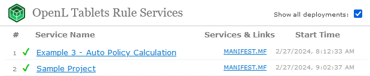

## Appendix G: Manifest File for Deployed Projects

When a user deploys the OpenL Tablets project from OpenL Studio or using the OpenL Tablets Maven plugin, the MANIFEST.MF file is generated. This file contains information about deployment author, deployment time, project version, and OpenL Tablets version used for deployment.

If OpenL Tablets Maven plugin is used for deployment, the manifest file contains the following information:

| Attribute              | Description                                                                    |
|------------------------|--------------------------------------------------------------------------------|
| Manifest-Version       | `1.0`.                                                                         |
| Build-Date             | Current zone datetime in the ISO8601 format.                                   |
| Built-By               | Name of the user currently logged in.                                          |
| Created-By             | `OpenL Maven Plugin v<OpenL version>`.                                         |
| Implementation-Title   | Deployment project name. Default format is project.groupId:project.artifactId. |
| Implementation-Version | Project version from the Maven pom.xml file.                                   |
| Implementation-Vendor  | Name of the project organization from the Maven pom.xml file. Absent if the pom.xml does not declare an organization. |

The `addDefaultManifest` parameter of the plugin switches these attributes off when it is set to `false`, and the `manifestEntries` parameter adds attributes or overrides their values.

If the project is deployed in OpenL Studio, the manifest file contains the following information:

| Attribute              | Description                                                                 |
|------------------------|-----------------------------------------------------------------------------|
| Manifest-Version       | `1.0`.                                                                      |
| Build-Date             | Current zone datetime in the ISO8601 format.                                |
| Build-Number           | Git revision ID or database revision value.                                 |
| Built-By               | Name of the user currently logged in OpenL Studio.                          |
| Implementation-Title   | Deployment project name.                                                    |
| Implementation-Version | Version of the deployed project revision.                                   |
| Build-Branch           | Git branch if the project is connected to Git.                              |
| Created-By             | `OpenL Studio v.<OpenL version>`.                                           |

The manifest file is available in OpenL Rule Services, on the main page, for each deployed service.



*Manifest file available for the deployed project*

If the project was deployed in a different way and it does not contain the manifest file, no link to it appears after the project name.

An example of the file contents is as follows:

```json
{
  "entries": {},
  "mainAttributes": {
    "Manifest-Version": "1.0",
    "Build-Date": "2026-08-19T10:47:06.894013+02:00",
    "Built-By": "openl",
    "Implementation-Title": "Sample Project",
    "Implementation-Version": "1.0.0",
    "Created-By": "OpenL Studio v.6.4.0",
    "Build-Branch": "master",
    "Build-Number": "0123abcd968574142536fedc01cc"
  }
}
```

OpenL Tablets Documentation is licensed under a Creative Commons Attribution 4.0 International License.
