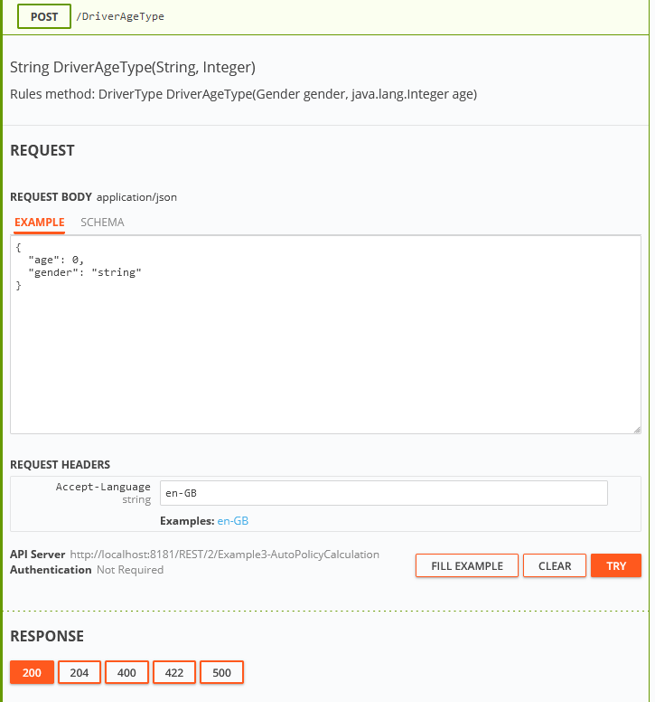

## Appendix D: OpenAPI Support

**Swagger** is an open-source software framework backed by a large ecosystem of tools that helps developers design, build, document, and consume RESTful web services. While most users identify Swagger by the Swagger UI tool, the Swagger toolset includes support for automated documentation, code generation, and test-case generation. For more information on Swagger, see <https://swagger.io/docs/>.

In OpenL, Swagger v3 (OpenAPI) is used. It allows directly accessing project methods, data types, and methods, and enables simple, convenient, and quick running or testing of rules deployed as services.

To use Swagger, in OpenL Rule Services, click the Swagger (UI) link, select the required rule, click **Try it out,** enter input parameters, and click **Try.**

*Using Swagger UI*

