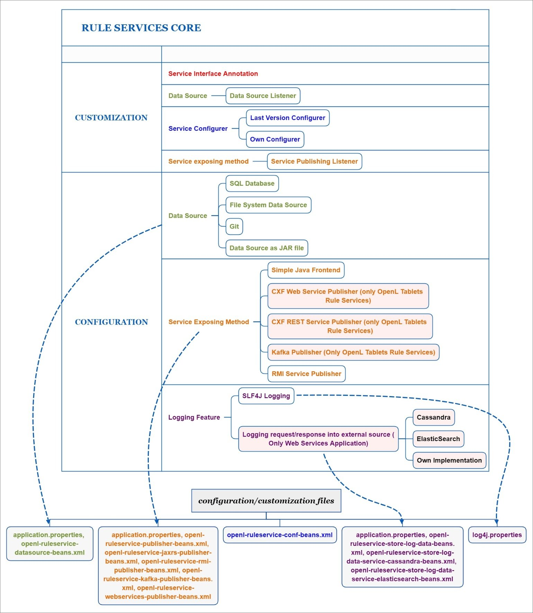

## Introduction

The majority of OpenL Tablets customers need to expose business rules as REST web services. For this purpose, OpenL Rule Services is provided. To meet requirements of various customer project implementations, OpenL Rule Services provides the ability to dynamically create web services for customer rules and offers extensive configuration and customization capabilities.

Overall architecture of OpenL Rule Services is expandable and customizable. All functionality is divided into pieces; each of them is responsible for a small part of functionality and can be replaced by another implementation if it is required. Usually, default implementation is enough to cover all requirements of most customers.

*Overall OpenL Rule Services architecture*

OpenL Rule Services provides the following key features and benefits:

-   easily integrating customer business rules into various applications running on different platforms
-   using different data sources, such as a central OpenL Tablets production repository or file system of a proper structure
-   exposing multiple projects and modules as a single web service according to a project logical structure

The subsequent chapters describe how to set up a data source, Service Configurer, and a service exposing method, and how to integrate OpenL Tablets into the existing application.

OpenL Rule Services is based on Rule Services Core and supports all features provided by the Rule Services Core module.

The following diagram identifies all components to be configured and customized.

*Configurable and customizable components of Rule Services Core*

