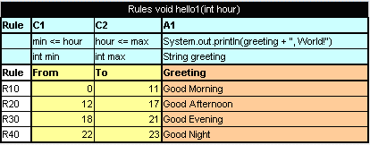
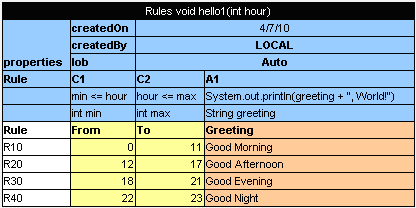
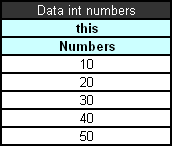
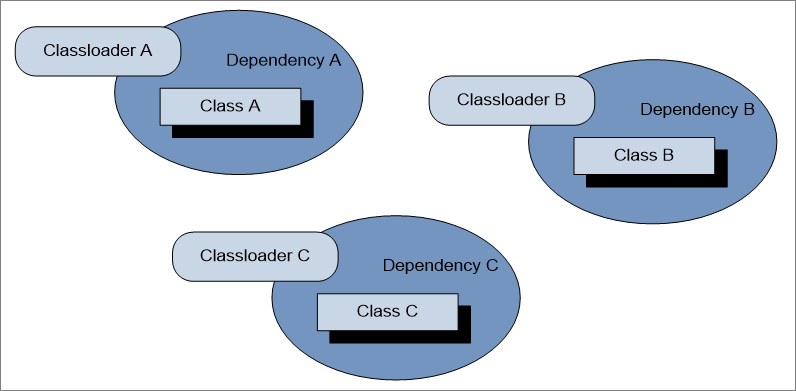

## OpenL Tablets Rules Projects
This chapter describes how to create and use OpenL Tablets Rules projects.

The following topics are included in this chapter:

-   [OpenL Rules Project](#openl-rules-project)
-   [Rules Project Descriptor](#rules-project-descriptor)
-   [Project Resolving](#project-resolving)
-   [How to Start with OpenL Rules Project](#how-to-start-with-openl-rules-project)
-   [Customizing Table Properties](#customizing-table-properties)
-   [Tables Validation](#tables-validation)
-   [Module Dependencies: Classloaders](#module-dependencies-classloaders)
-   [Peculiarities of OpenL Tablets Implementation](#peculiarities-of-openl-tablets-implementation)

### OpenL Rules Project
**OpenL Rules project** is a project that contains Excel files with OpenL Tablets rules and may contain a rules project descriptor. The rules project descriptor is an XML file that defines project configuration and allows setting project dependencies.

OpenL Rules project can easily use rules from other projects via dependency functionality.

### Rules Project Descriptor
A rules project descriptor is an XML file that contains information about the project and configuration details used by OpenL to load and compile the rules project. The predefined name that is used for a rules project descriptor is *rules.xml.*

This section includes the following topics:

-   [Quick Overview](#quick-overview)
-   [Descriptor Elements](#descriptor-elements)

#### Quick Overview
The following code fragment is an example of the rules project descriptor:

```
<project>
	<!-- Project name. -->
	<name>Project name</name>
	<!-- Optional. Comment string to project. -->
	<comment>comment</comment>

	<!-- OpenL project includes one or more rules modules.  -->
	<modules>

		<module>
			<name>MyModule1</name>
						
<!-- 
				Rules document which is usually an excel file in the project. 
			-->
			<rules-root path="MyModule1.xls"/>

		</module>	
		
		<module>
			<name>MyModule2</name>
			
<!-- 
				Rules document which is usually an excel file in the project. 
			-->
			<rules-root path="MyModule2.xls"/>
			<method-filter>
				<includes>
					<value> * </value>
				</includes>
			</method-filter>
		</module>	
	</modules>

<dependencies>
		<dependency>
			<name>projectName</name>
			<autoIncluded>false</autoIncluded>
		</dependency>
	</dependencies>
	<properties-file-name-pattern>{lob}</properties-file-name-pattern>
	<properties-file-name-processor>default.DefaultPropertiesFileNameProcessor</properties-file-name-processor>
	<!-- Project's classpath (list of all source dependencies). -->
	<classpath>
		<entry path="path1"/>
		<entry path="path2"/>
	</classpath>
	
</project>
```

#### Descriptor Elements
The descriptor file contains several sections that describe project configuration:

-   [Project Configurations](#project-configurations)
-   [Module Configurations](#module-configurations)
-   [Dependency Configurations](#dependency-configurations)
-   [Classpath Configurations](#classpath-configurations)

##### Project Configurations
The project configurations are as follows:

| Tag                            | Required | Description                                                                                                                                |
|--------------------------------|----------|--------------------------------------------------------------------------------------------------------------------------------------------|
| name                           | yes      | Project name. It is a string value which defines a user-friendly project name.                                                             |
| comment                        | no       | Comment for project.                                                                                                                       |
| dependency                     | no       | Dependencies to projects.                                                                                                                  |
| modules                        | yes      | Project modules. A project can have one or several modules.                                                                                |
| classpath                      | no       | Project relative classpath.                                                                                                                |
| properties-file-name-pattern   | no       | File name pattern to be used by the file name processor. <br/>The file name processor adds extracted module properties from a module file name. |
| properties-file-name-processor | no       | Custom implementation of `org.openl.rules.project.PropertiesFileNameProcessor` used instead of default implementation.                     |

##### Module Configurations
The module configurations are as follows:

| Tag          | Required | Description                                                                                                                                                                                                                                         |
|--------------|----------|-----------------------------------------------------------------------------------------------------------------------------------------------------------------------------------------------------------------------------------------------------|
| name         | yes/no   | Module name. It is a string value which defines a user-friendly module name.  <br/>**Note:** It is used by OpenL Studio application as a module display name. It is not required for modules defined via wildcard.                            |
| type         | yes      | Module instantiation type. Possible values are case-insensitive and can be **dynamic**, **api**, or **static** (deprecated). <br/>It defines the way of OpenL project instantiation.                                                                     |
| classname    | yes/no   | Name of rules interface. It is used together with *type*. It is not required for the **api** type.                                                                                                                                                  |
| method-filer | no       | Filter that defines tables to be used for interface generation. Java regular expression can be used to define a filter for multiple methods.                                                                                                        |
| rules-root   | yes/no   | Path to the main file of a rules module. It is used together with **type**. Ant pattern can be used to define multiple modules via wildcard. <br/>For more information on Ant patterns, see [Ant patterns](https://ant.apache.org/manual/dirtasks.html). |

When working with a large project that, for example, includes huge amounts of tests, you may want to avoid loading modules that the current module does not depend on. To do this, the compileThisModuleOnly attribute must be added to the rules.xml file, <module> section as follows:

```
<modules>
  <module>
	<name>Tests</name>
	<rules-root path="rules/Test*.xlsx"/>
	<webstudioConfiguration>
	  <compileThisModuleOnly>true</compileThisModuleOnly>
	</webstudioConfiguration>
  </module>
</modules>
```

##### Dependency Configurations
The dependency configurations are as follows:

| Tag          | Required | Description                                                                                                                                                                                                                                                                                               |
|--------------|----------|-----------------------------------------------------------------------------------------------------------------------------------------------------------------------------------------------------------------------------------------------------------------------------------------------------------|
| name         | yes      | Dependency project name.                                                                                                                                                                                                                                                                                  |
| autoIncluded | yes      | Identifier, which, if set to **true**, that all modules from the dependency project will be used in this project module. <br/>If it is set to **false**, modules from the dependency project can be used in this project as dependencies, <br/>and each module will define its own list of used dependency modules. |

##### Classpath Configurations
The classpath configurations are as follows:

| Tag   | Required | Description                                                 |
|-------|----------|-------------------------------------------------------------|
| entry | no       | Path for the classpath entry, that is, classes or jar file. |

### Project Resolving
The `org.openl.rules.project.resolving.ProjectResolver` resolves OpenL Tablets projects in folders sent to the method for scanning and tries to detect OpenL Tablets projects by predefined strategies. To use ProjectResolver, call the `instance` static method that returns an instance of ProjectResolver.

Resolving strategies are defined via `org.openl.rules.project.resolving.ResolvingStrategy` SPI.

Resolving strategies used by default are as follows:

| Number | Strategy                              | Description                                                                                                                                                              |
|--------|---------------------------------------|--------------------------------------------------------------------------------------------------------------------------------------------------------------------------|
| 1.     | Project descriptor resolving strategy | The strictest resolving strategy. It is based on the descriptor file as described previously in this section.                                                            |
| 2.     | Excel file resolving strategy         | A resolving strategy for the simplest OpenL project. <br/>It contains only Excel files in root folder without wrappers and descriptor. <br/>Each Excel file represents a module. |

### How to Start with OpenL Rules Project
Firstly, an OpenL Tablets project must be created. It can be done in the following ways:

-   using Maven archetype
-   using OpenL Studio
-   manually

See the following sections for detailed information:

-   [Creating a Project Using the Maven Archetype](#creating-a-project-using-the-maven-archetype)
-   [Creating a Project in OpenL Studio](#creating-a-project-in-openl-studio)
-   [Creating a Project Manually](#creating-a-project-manually)
-   [Editing Rules](#editing-rules)
-   [Using OpenL Tablets Rules from Java Code](#using-openl-tablets-rules-from-java-code)
-   [Handling Data and Data Types in OpenL Tablets](#handling-data-and-data-types-in-openl-tablets)

#### Creating a Project Using the Maven Archetype
OpenL Tablets provides the Maven archetype which can be used to create a simple OpenL Rules project.

To create a project using the Maven archetype, proceed as follows:

1.  Execute the following command in command line:
	`mvn archetype:generate`
	Maven runs the archetype console wizard.
1.  Select the **openl-simple-project-archetype** menu item.
	As an alternative way is using the following command:  
	`mvn archetype:generate 
	–DarchetypeGroupId=org.openl.rules 
	–DarchetypeArtifactId=openl-simple-project-archetype
	\-DarchetypeVersion=5.X.X`
1.  Follow with the Maven creation wizard.
	After all steps are completed, a new Maven based project appears in the file system. It is an OpenL Rules project which has one module with simple rules in it.
1.  Execute the following command in the command line from the root of the project folder to compile the project:
	```
	mvn install
	```
	After executing this command, the following files can be found in the target folder:
1.  zip file with "-deployable" suffix for importing the project to OpenL Studio.
	For more information, see [OpenL Studio Guide](https://openldocs.readthedocs.io/en/latest/documentation/guides/webstudio_user_guide).
1.  zip file (with "-runnable" suffix) that can be executed after extracting it.
	It demonstrates how OpenL Tablets rules can be invoked from Java code.
1.  jar file that contains only compiled Java classes.
	This jar can be put in classpath of the project and used as a depended library.

#### Creating a Project in OpenL Studio
OpenL Studio allows users to create new rule projects in the Repository in one of the following ways:

-   creating a rule project from template
-   creating a rule project from Excel files
-   creating a rule project from zip archive
-   importing a rule project from workspace

The following diagram explains how projects are stored in OpenL Studio and then deployed and used by OpenL Rule Services:


*OpenL Studio and OpenL Rule Services Integration*

When a user starts editing a project, it is extracted from Design Repository and placed in the file system, in a user workspace. The project becomes locked in Design Repository for editing by other users. After editing is finished, the user saves the project. An updated version of the project is saved to Design Repository and becomes available for editing by other users.

OpenL Rule Services use separate repository instance, Production Repository. OpenL Studio can be configured to deploy complete and tested rules projects to that repository.

For more information, see [OpenL Studio Guide](https://openldocs.readthedocs.io/en/latest/documentation/guides/webstudio_user_guide).

#### Creating a Project Manually
OpenL does not oblige a user to use predefined ways of project creation and enables using the user’s own project structure. The [Project Resolving](#project-resolving) mechanism can be used as a base for the project structure definition. Depending on the resolving strategy, more or less files and folders are to be created, but several project elements definition is mandatory. For more information on manually creating a project, see [OpenL Rules Project](#openl-rules-project).

#### Editing Rules
When a project is created, business rules must be defined. It can be done using OpenL Studio or manually using MS Excel. If the simple rules project is used, there are several simple predefined rules that can be used as an example.

#### Using OpenL Tablets Rules from Java Code
For access to rules and data in Excel tables, OpenL Tablets API is used. OpenL Tablets provides a wrapper to facilitate easier usage.
This section illustrates the creation of a wrapper for a **Simple** project in IDE. There is only one rule **hello1** in the **Simple** project by default.



*The hello1 rule table*

Proceed as follows:

1.  In the project `src` folder, create an interface as follows:
	```
	public interface Simple {
			void hello1(int i);
	}
	```
1.  Create a wrapper object as follows:
	```
	import static java.lang.System.out;
	import org.openl.rules.runtime.RulesEngineFactory;
	
	public class Example {
	
			public static void main(String[] args) {
				//define the interface
				RulesEngineFactory<Simple > rulesFactory = 
					new RulesEngineFactory<Simple>("TemplateRules.xls", 
										Simple.class);
	
				Simple rules = (Simple) rulesFactory.newInstance();
				rules.hello1(12);
			
			}
	}
	```
When the class is run, it executes and displays **Good Afternoon, World!**

The interface can be generated by OpenL Tablets in runtime if the developer does not define it when initializing the rule engine factory. In this case, rules can be executed via reflection.

The following example illustrates using a wrapper with a generated interface in runtime:
```
public static void callRulesWithGeneratedInterface(){
	// Creates new instance of OpenL Rules Factory
	RulesEngineFactory<?> rulesFactory = 
new RulesEngineFactory<Object>("TemplateRules.xls");
				//Creates new instance of dynamic Java Wrapper for our lesson
Object rules = rulesFactory.newInstance();
		
	   //Get current hour
	Calendar = Calendar.getInstance();
	int hour = calendar.get(Calendar.HOUR_OF_DAY);

	Class<?> clazz = rulesFactory.getInterfaceClass();

try{
Method method = clazz.getMethod("hello1”, int.class);
out.println("* Executing OpenL rules...\n");
method.invoke(rules, hour);
}catch(NoSuchMethodException e){
}catch (InvocationTargetException e) {
}catch (IllegalAccessException e) {
}
}
```

This section includes the following topics:

- [Using OpenL Tablets Rules with the Runtime Context](#using-openl-tablets-rules-with-the-runtime-context)
- [Using OpenL Tablets Projects from Java Code](#using-openl-tablets-projects-from-java-code)
- [Accessing a Test Table from Java Code](#accessing-a-test-table-from-java-code)
- [Generating Java Classes from Datatype Tables](#generating-java-classes-from-datatype-tables)

##### Using OpenL Tablets Rules with the Runtime Context
This section describes using runtime context for dispatching versioned rules by dimension properties values.
For example, two rules are overloaded by dimension properties. Both rules have the same name.
The first rule, covering an Auto line of business, is as follows:



*The Auto rule*
Pay attention to the rule line with the LOB property.

The second rule, covering a Home line of business, is as follows:


*The Home rule*

A wrapper enables the user to define which of these rules must be executed:
```
// Getting runtime environment which contains context
IRuntimeEnv env = ((IEngineWrapper) rules).getRuntimeEnv();

// Creating context
IRulesRuntimeContext context = new DefaultRulesRuntimeContext();
env.setContext(context);
// define context
context.setLob("Home”);
```

As a result, the code of the wrapper with the run-time context resembles the following:
```
import static java.lang.System.out;

import org.openl.rules.context.DefaultRulesRuntimeContext;
import org.openl.rules.context.IRulesRuntimeContext;
import org.openl.rules.runtime.RulesEngineFactory;
import org.openl.runtime.IEngineWrapper;
import org.openl.vm.IRuntimeEnv;
public class ExampleOfUsingRuntimeContext {

		public static void main(String[] args) {
			//define the interface
			RulesEngineFactory<simple> rulesFactory = new RulesEngineFactory<Simple>("TemplateRules.xls", Simple.class);
			Simple rules = (Simple) rulesFactory.newInstance();
			// Getting runtime environment which contains context 
				IRuntimeEnv env = ((IEngineWrapper) rules).getRuntimeEnv();
				// Creating context (most probably in future, the code will be different)
			IRulesRuntimeContext context = RulesRuntimeContextFactory. buildRulesRuntimeContext();			env.setContext(context);
			context.setLob("Home");
			rules.hello1(12);
		
	}
}
```

Run this class. In the console, ensure that the rule with **lob = Home** was executed. With the input parameter **int = 12**, the **It is Afternoon, Guys** phrase is displayed.

##### Using OpenL Tablets Projects from Java Code
OpenL Tablets projects can be instantiated via SimpleProjectEngineFactory. This factory is designed to be created via SimpleProjectEngineFactoryBuilder. A builder has to be configured. The main builder method is setProject(String location). The project location folder has to be specified via this method.

The following example instantiates the OpenL Tablets project:

```
ProjectEngineFactory<Object> projectEngineFactory = new SimpleProjectEngineFactory.SimpleProjectEngineFactoryBuilder<Object>().setProject(<project location>) .build();
Object instance = projectEngineFactory.newInstance();
```
The above example instantiates the OpenL Tablets project generated in runtime interface. A method from instantiated project can be invoked via reflection mechanism. `ProjectEngineFactory` returns generated interface via the getInterfaceClass() method.

If a static interface must be used, the interface must be specified in SimpleProjectEngineFactoryBuilder. The following example illustrates how to instantiate a project with a static interface.

```
SimpleProjectEngineFactory<SayHello> simpleProjectEngineFactory = new SimpleProjectEngineFactoryBuilder<SayHello>().setProject<project location>)
				.setInterfaceClass(SayHello.class)
				.build();
SayHello instance = simpleProjectEngineFactory.newInstance();
```

SimpleProjectEngineFactoryBuilder has additional methods to configure an engine factory. Examples are as follows:

-   The setWorkspace()method defines a project workspace for dependent projects resolving.
-   The execution mode can be changed via the setExecutionMode() method.

By default, runtime execution mode is enabled.

-   The `setProvideRuntimeContext(true) `method is used to provide runtime context for an instance class.
-   The `setProvideVariations(true)` method is used to enable variation support for an instance class, which is disabled by default.
-   The `setModule(String moduleName)` method is used to compile a single module from a project.
-   The `setClassLoader(ClassLoader classLoader)` method is used to set up a custom class loader to be used as a primary one in the OpenL Tablets engine.

##### Accessing a Test Table from Java Code
Test results can be accessed through the test table API. For example, the following code fragment executes all test runs in a test table called **insuranceTest** and displays the number of failed test runs:

```
RulesEngineFactory<?> rulesFactory = new RulesEngineFactory<?>("Tutorial_1.xls");
IOpenClass openClass = rulesFactory.getCompiledOpenClass();
IRuntimeEnv env = SimpleVMFactory.buildSimpleVM().getRuntimeEnv();
Object target = openClass.newInstance(env);
IOpenMethod method = openClass.getMatchingMethod("testMethodName", testMethodParams);
TestUnitsResults res = (TestUnitsResults) testMethod.invoke(engine, new Object[0], env);
```

##### Generating Java Classes from Datatype Tables
Some rules require complex data models as input parameters. Developers have to generate classes for each datatype defined in an Excel file for using them in a static interface as method arguments. The static interface can be used in engine factory. For more information on how to create and use a wrapper, see [Using OpenL Tablets Rules from Java Code](#using-openl-tablets-rules-from-java-code).

**Note:** Datatype is an OpenL table of the Datatype type created by a business user. It defines a custom data type. Using these data types inside the OpenL Tablets rules is recommended as the best practice. For more information on datatypes, see [OpenL Tablets Reference Guide > Datatype Table](https://openldocs.readthedocs.io/en/latest/documentation/guides/reference_guide/#datatype-table).
To generate datatype classes, proceed as follows:

1.  For Maven, configure the OpenL Maven plugin as described in [Configuring the OpenL Maven Plugin](#configuring-the-openl-maven-plugin) and run the Maven script.
2.  For Ant, configure the Ant task file as described in [Configuring the Ant Task File](#configuring-the-ant-task-file) and execute the Ant task file.

###### Configuring the OpenL Maven Plugin
To generate an interface for rules and datatype classes defined in the MS Excel file, add the following Maven configuration to the `pom.xml` file:

```
<build>
  [...]
  <plugins>
	  [...]
	  <plugin>
		  <groupId>org.openl.rules</groupId>
		  <artifactId>openl-maven-plugin</artifactId>
		  <version>${openl.rules.version}</version>
		  <configuration>
			  <generateInterfaces>
				  <generateInterface>
					  <srcFile>src/main/openl/rules/TemplateRules.xls</srcFile>
					  <targetClass>
						org.company.gen.TemplateRulesInterface
					  </targetClass>
				  </generateInterface>
			  </generateInterfaces>
		  </configuration>
		  <executions>
			  <execution>
				  <goals>
					  <goal>generate</goal>
				  </goals>
			  </execution>
		  </executions>
	  </plugin>

  </plugins>
  [...]
</build>
```

In this case, classes and rules project descriptor, `rules.xml`, is generated on each Maven run on generate-sources phase.

Each `<generateInterface>` section has a number of parameters described in the following table.

| Name                   | Type      | Required | Description                                                                                                                                                                                                                                                       |
|------------------------|-----------|----------|-------------------------------------------------------------------------------------------------------------------------------------------------------------------------------------------------------------------------------------------------------------------|
| `srcFile`              | `String`  | `true`   | Reference to the Excel file for which an interface class must be generated.                                                                                                                                                                                       |
| `targetClass`          | `String`  | `true`   | Full name of the interface class to be generated. <br/>OpenL Studio recognizes modules in projects by interface classes and uses their names in UI. <br/>If there are multiple wrappers with identical names, only one is recognized as a module in OpenL Studio. |
| `displayName`          | `String`  | `false`  | End user-oriented title of the file that appears in OpenL Studio. <br/>A default value is Excel file name without extension.                                                                                                                                      |
| `targetSrcDir`         | `String`  | `false`  | Folder where the generated interface class must be placed. An example is src/main/java. <br/>The default value is ${project.build.sourceDirectory}.                                                                                                               |
| `openlName`            | `String`  | `false`  | OpenL Tablets configuration to be used. For OpenL Tablets, the org.openl.xls value must always be used.<br/>The default value is org.openl.xls.                                                                                                                   |
| `userHome`             | `String`  | `false`  | Location of user-defined resources relative to the current OpenL Tablets project. The default value is ..                                                                                                                                                         |
| `userClassPath`        | `String`  | `false`  | Reference to the folder with additional compiled classes imported by the module when the interface is generated. <br/>The default value is null.                                                                                                                  |
| `ignoreTestMethods`    | `boolean` | `false`  | If true, test methods are not added to interface class. It is used only in JavaInterfaceAntTask. <br/>The default value is true.                                                                                                                                  |
| `generateUnitTests`    | `boolean` | `false`  | Parameter that overwrites the base generateUnitTests value.                                                                                                                                                                                                       |
| `unitTestTemplatePath` | `String`  | `false`  | Parameter that overwrites the base unitTestTemplatePath value.                                                                                                                                                                                                    |
| `overwriteUnitTests`   | `boolean` | `false`  | Parameter that overwrites the base overwriteUnitTests value.                                                                                                                                                                                                      |

For more configuration options, see [OpenL Tablets Maven Plugin Guide](https://openldocs.readthedocs.io/en/latest/documentation/guides/maven_plugin_guide/).

###### Configuring the Ant Task File
An example of the build file is as follows:

```
<project name="GenJavaWrapper" default="generate" basedir="../">
<taskdef name="openlgen" classname="org.openl.conf.ant.JavaWrapperAntTask"/>

<target name="generate">
<echo message="Generating wrapper classes..."/>

<openlgen openlName="org.openl.xls" userHome="." 
srcFile="rules/Rules.xls"
targetClass="com.exigen.claims.RulesWrapper"
displayName="Rule datatypes"
targetSrcDir="gen"
>
</openlgen>

<openlgen openlName="org.openl.xls" userHome="." 
srcFile="rules/Data.xls"
targetClass=" com.exigen.claims.DataWrapper"
displayName="Data datatypes"
targetSrcDir="gen"
>
</openlgen>	

</target>
</project>
```

When the file is executed, it automatically creates Java classes for datatypes for specified Excel files. The Ant task file must be adjusted to match contents of the specific project.

For each Excel file, an individual `<openlgen>` section must be added between the `<target>` and `</target>` tags.

Each `<openlgen>` section has a number of parameters that must be adjusted as described in the following table:

| Parameter      | Description                                                                                               |
|----------------|-----------------------------------------------------------------------------------------------------------|
| `openlName`    | OpenL Tablets configuration to be used. For OpenL Tablets, the `org.openl.xls` value must always be used. |
| `userHome`     | Location of user-defined resources relative to the current OpenL Tablets project.                         |
| `srcFile`      | Reference to the Excel file for which a wrapper class must be generated.                                  |
| `targetClass`  | Full name of the wrapper class to be generated.                                                           |
| `displayName`  | End user-oriented title of the file that appears in OpenL Studio.                              |
| `targetSrcDir` | Folder where the generated wrapper class must be placed.                                                  |

#### Handling Data and Data Types in OpenL Tablets
This section includes the following `topics` about data and data types handling in OpenL Tablets:

-   [Datatype Lifecycle](#datatype-lifecycle)
-   [Inheritance in Datatypes](#inheritance-in-datatypes)
-   [Byte Code Generation at Runtime](#byte-code-generation-at-runtime)
-   [Java Files Generation](#java-files-generation)
-   [OpenL Internals: Accessing a Datatype at Runtime and After Building an OpenL Wrapper](#openl-internals-accessing-a-datatype-at-runtime-and-after-building-an-openl-wrapper)
-   [Data Table](#data-table)

##### Datatype Lifecycle
Datatype lifecycle is as follows:

1.  A Datatype table is created in the rules file.
	At runtime, Java class is generated for each datatype as described in [Byte Code Generation at Runtime](#byte-code-generation-at-runtime).
1.  If Java classes are generated from a Datatype table as described in [Generating Java Classes from Datatype Tables](#generating-java-classes-from-datatype-tables), the appropriate generated Java classes must be included in classpath as described in [Java Files Generation](#java-files-generation).

##### Inheritance in Datatypes
In OpenL Tablets, one datatype can be inherited from another one. The new data type inherited from another one has access to all fields defined in the parent data type. If a child datatype contains fields defined in the parent datatype, and the field is declared with different types in the child and the parent datatype, warnings or errors appear.

The constructor with all fields of the child datatype contains all fields from the parent datatype, and the `toString`, `equals` and `hashCode` methods use all fields form the parent datatype.

##### Byte Code Generation at Runtime
At runtime, when OpenL Tablets engine instance is being built, for each datatype component, Java byte code is generated as described in [Java Files Generation](#java-files-generation) in case there are no previously generated Java files on classpath. It represents a simple Java bean for this datatype. This byte code is loaded to classloader so the object of type `Class<?>` can be accessed. When using this object through reflections, new instances are created and fields of datatypes are initialized. For more information, see the `DatatypeOpenClass` and `DatatypeOpenField` classes.

**Attention!** If Java class files for the datatypes on classpath are previously generated, they are used at runtime, regardless of changes made in Excel. To apply these changes, remove Java files and generate Java classes from the Datatype tables as described in [Generating Java Classes from Datatype Tables](#generating-java-classes-from-datatype-tables).

##### Java Files Generation
As generation of datatypes is performed at runtime and developers cannot access these classes in their code, the mechanism described at [Generating Java Classes from Datatype Tables](#generating-java-classes-from-datatype-tables) is introduced. It allows generating Java files and putting them on the file system so users can use these data types in their code.

##### OpenL Internals: Accessing a Datatype at Runtime and After Building an OpenL Wrapper
After parsing, each data type is put to compilation context and becomes accessible for rules during binding. All data types are placed to `IOpenClass` of the whole module and are accessible from `CompiledOpenClass#getTypes` when the OpenL Tablets wrapper is generated.

Each `TableSyntaxNode` of the `xls.datatype` type contains an object of data type as its member.

##### Data Table
A **data table** contains relational data that can be referenced as follows:

-   from other tables within OpenL Tablets
-   from Java code through wrappers as Java arrays
-   through the OpenL Tablets runtime API as a field of the `Rules` class instance



*Simple data table*

In this example, information in the data table can be accessed from the Java code as illustrated in the following code example:
```
int[] num = tableWrapper.getNumbers();

for (int i = 0; i < num.length; i++) {
System.out.println(num[i]);
}
```

where `tableWrapper` is an instance of the wrapper class of the Excel file.


*Datatype table and a corresponding data table*

In Java code, the data table `p1` can be accessed as follows:
```
Person[] persArr = tableWrapper.getP1();

for (int i = 0; i < persArr.length; i++) {
System.out.println(persArr[i].getName() + ' ' + persArr[i].getSsn());
}
```

where `tableWrapper` is an instance of the Excel file wrapper.

### Customizing Table Properties
This section describes how to customize table properties and introduces table priority rules. The following topics are included:

-   [Understanding Table Properties Customization](#understanding-table-properties-customization)
-   [Tables Priority Rules](#tables-priority-rules)

#### Understanding Table Properties Customization
The OpenL Tablets design allows customizing available table properties. OpenL Tablets Engine employs itself to provide support of properties customization. The `TablePropertiesDefinitions.xlsx` file contains all declaration required to handle and process table properties.

Updating table properties requires recompiling the OpenL Tablets product. The developer has to contact the OpenL Tablets provider to retrieve the table properties file. When the changes are made, the developer has to send the file back to the provider, and a new OpenL Tablets package is delivered to the developer.

Alternatively, the developer can recompile OpenL Tablets from sources of their own.

#### Tables Priority Rules
To make tables dispatching more flexible, **tablesPriorityRules** DataTable in `TablePropertiesDefinitions.xlsx `is used. Each element of this table defines one rule of how to compare two tables using their properties to find more suitable table if several tables are matched by properties. Priority rules are used sequentially in comparison of two tables: if one priority rule gives result of the same priority of tables, the next priority rule is used.

Priority rules are used differently in the Dispatcher table approach and Java code dispatching but have the same sense: select suitable table if there are several tables matched by dimension Properties.

In case of the Dispatching table, priority rules are used to sort methods of an overloaded group. Each row of the Dispatcher table represents a rule, so after sorting, high priority rules are at the top of decision tables, and if several rows of the decision table are fired, only the first one, of the highest priority, is executed.

In case of Java code, dispatching priority rules is used after selecting tables that correspond to the current runtime context: all matched tables are sorted in order to select one with the highest priority. If it is impossible to find the priority with the highest rule when several tables have the same priority and are of a higher priority than all other tables, `AmbiguousMethodException` is thrown.

There are two predefined priority rules and possibility to implement Java class that compares two tables using their properties:

-   **min(\<property name\>)**
	<br/>A table that has lower value of property specified will have a higher priority. The property specified by name must be `instanceof Comparable<class of property value>`.
-   **max(\<property name\>)**
	<br/>A table that has a higher value of property specified will have a higher priority. The property specified by name must be `instanceof Comparable<class of property value>`.

To specify the Java comparator of tables, the `javaclass:<java class name>` expression must be used. Java class must implement `Comparator<ITableProperties>`.

### Tables Validation
The validation phase follows the binding phase and allows checking all tables for errors and accumulating all errors.

All possible validators are stored in `ICompileContext` of the OpenL class. The default compile context is `org.openl.xls.RulesCompileContext` that is generated automatically.  
Validators get the OpenL Tablets and array of `TableSyntaxNodes` that represent tables for check and must return `ValidationResult`. Validation results are as follows:

-   status, which can be fail or success
-   all error and warning messages that occurred

This section includes the following topics:

-   [Table Properties Validators](#table-properties-validators)
-   [Existing Validators](#existing-validators)

#### Table Properties Validators
The table properties that are described in `TablePropertyDefinition.xlsx` can have constraints. Some constraints have predefined validators associated with them.

To add a property validator, proceed as follows:

1.  Add constraint as follows:
2.  Define constraint in `TablePropertyDefinition.xlsx`, in the constraints field.
3.  Create constraint class and add it to `ConstraintFactory`.
4.  Create a validator as follows:
5.  Create a class of the validator and define it in the method `org.openl.codegen.tools.type.TablePropertyValidatorsWrapper.init() `constraint associated with the validator.
6.  If necessary, modify the velocity script `RulesCompileContext-validators.vm` in project `org.openl.rules.gen` that generates `org.openl.xls.RulesCompileContext`*.*
7.  To generate new `org.openl.xls.RulesCompileContext` with the validator, run `org.openl.codegen.tools.GenRulesCode.main(String[])`.
8.  Write unit tests.

#### Existing Validators
The existing validators are as follows:

-   **Unique in module** **validator** verifies uniqueness in a module of a property.
-   **Active table validator** verifies correctness of an "active" property.

There can be only one active table validator per active table.

-   **Regular expression validator** verifies string properties matching against the predefined regex pattern.
-   **Gap/overlap validator** makes gap and overlap analysis for decision tables with the **validateDT** property set to **on**.
-   **Dimension properties validator**.

### Module Dependencies: Classloaders
The dependency class resolution mechanism is implemented using specialized classloading.
Each dependency has its own Java classloader so all classes used in compiling a specified module, including generated datatype Java classes, are stored in the dependency classloader.


*Dependency classloaders*

The root module contains references to all its dependencies classloaders. When loading any class, the following algorithm is executed:

1.  Get all dependencies classloaders.
2.  Search for the required class in each dependency classloader, one by one.
3.  If a class is found, return it.
4.  If a class does not exist, search for the class by its classloader.


*Load class from root module*

For the dependency management feature, provide an appropriate `DependencyManager` object to the entry point for the OpenL Tablets compilation.

**Note:** Using the same class in two classloaders can cause an error because the class will be loaded by two different classloaders.

### Peculiarities of OpenL Tablets Implementation
This section describes OpenL Tablets implementation specifics and includes the following topics:

-   [Lookup Tables Implementation Details](#lookup-tables-implementation-details)
-   [Range Types Instantiation](#range-types-instantiation)

#### Lookup Tables Implementation Details
At first, a lookup table goes through parsing and validation. In parsing, all parts of the table, such as header, column headers, vertical conditions, horizontal conditions, return column, and their values are extracted. In validation, OpenL checks if the table structure is proper.

To work with this kind of a table, the `TransformedGridTable` object is created with the constructor parameters it had in the original grid table of the lookup table, without a header, and `CoordinatesTransformer` that converts table coordinates to work with both vertical and horizontal conditions.

As a result, a `GridTable` is received. It works as a decision table structure. All coordinate transformations with lookup structure go inside. The work with columns and rows is based on the physical, not logical, structure of the table.

#### Range Types Instantiation
`IntRange` can be created in one of the following ways:

| Format                                         | Description                                                                  |
|------------------------------------------------|------------------------------------------------------------------------------|
| `new IntRange(int min_number, int max_number)` | Covers all numbers between `min_number` and `max_number`, including borders. |
| `new IntRange(Integer value)`                  | Covers only a given value as the beginning and the end of the range.         |
| `new IntRange(String rangeExpression)`         | Borders are parsed by formats of `rangeExpression`.                          |

The same formats and restrictions are used in `DoubleRange`.

