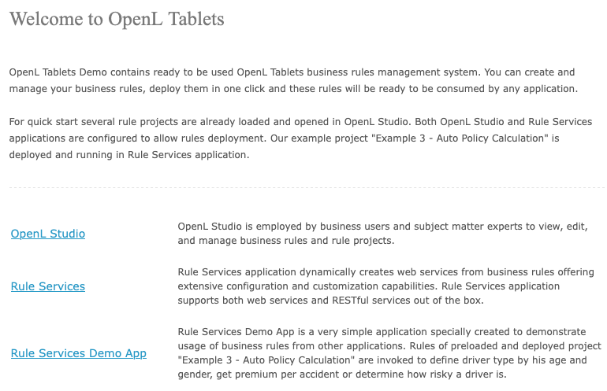
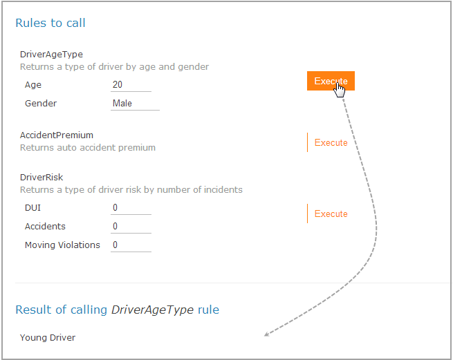

# OpenL Tablets BRMS Demo Package Guide

**Status**: ✅ Migrated from OpenLdocs
**Source**: [OpenLdocs Demo Package Guide](https://github.com/EISTW/OpenLdocs/blob/master/docs/documentation/guides/demo_package_guide.md)
**Last Updated**: 2025-11-05

---

## Preface

This guide introduces the OpenL Tablets Demo Package, which provides a ready-to-use infrastructure for exploring the OpenL Tablets product. The package enables users to develop business rules in OpenL Studio and execute them as web services.

---

## Getting Started with the OpenL Tablets Demo

The Demo offers the quickest path to explore OpenL Tablets features. It arrives with pre-loaded example projects and includes a Rule Services Demo Client for testing business rule execution.

---

## 1. Download and Install

Download the **Demo (ZIP)** file from: https://openl-tablets.org/downloads

Unzip the package into a folder on your computer.

### Package Contents 📦

The unzipped folder includes:

* **Startup Files**: `start.cmd` (Windows) or `start` (MacOS/Linux)
* **Settings Files**: Default configurations
* **Application Folder (`webapps/`)**: Core application files
* **Version File (`openl.version`)**: Version number reference

---

## 2. The First Launch: Automatic Setup

The startup script automatically downloads and configures necessary components on first run:

* `jre/` → Java Runtime Environment
* `jetty-home/` → Jetty Web Server
* `webapps/` → OpenL Studio and Rule Services applications
* `jetty-home/lib/ext/` → JDBC drivers for databases

---

## 3. What's Pre-configured for You? ✨

### OpenL Studio

* Operates in single-user mode
* Uses internal **H2 database** for user settings
* Stores work locally in the `openl-demo/` subfolder
* Includes pre-initialized local 'design' Git repository at `openl-demo/repositories/design/`
* Includes pre-initialized 'deployment' repository for Rule Services integration

### Rule Services

* Pre-connected to OpenL Studio
* Allows all CORS requests for developer convenience

---

## 4. Launching the Demo Application 🚀

### On Windows 🪟

Double-click the **`start.cmd`** file.

### On MacOS & Linux 🍏🐧

Double-click the **`start`** file, or in terminal:

```bash
bash start
```

*(Grant execute permissions with `chmod +x start` if needed)*

---

## 5. Optional: Use a Shared Folder for Your Projects 📂

By default, projects save to `openl-demo/`. To preserve work during upgrades, configure an external folder.

**Note:** External folder mode won't auto-create examples and tutorials.

### Simple Method: The `OpenL_Home` Folder

1. Navigate to your Desktop
2. Create a new folder named **`OpenL_Home`**

Terminal command for MacOS, Linux, or Windows:

```bash
mkdir "$HOME/Desktop/OpenL_Home"
```

The Demo will automatically use this folder on next launch.

### Advanced Method: Using an Environment Variable

For custom locations:

1. Choose or create a folder anywhere on your computer
2. Create a system environment variable named **`OPENL_HOME`**
3. Set its value to the folder's full path

**Important:** The folder must exist before launching the Demo, and the application needs write permissions.

### Learn More 📚

For advanced deployment topics, see the official documentation:

* [OpenL Tablets Installation Guide > Deploying OpenL Studio](../installation/index.md#deploying-openl-studio)

---

## 6. Accessing the Welcome Page

After launching, your default web browser opens automatically. Otherwise, navigate to:

`http://localhost:8080/`

From the welcome page, access OpenL Studio, Rule Services, and the Rule Services Demo Client.



---

## OpenL Studio in a Demo Package

OpenL Studio operates in single-user mode with automatic sign-in and a welcome start page.

### Rules Editor

Several examples and tutorials are already in the **No Changes** status, therefore available in **Rules Editor** by default. See [OpenL Studio Guide > Using Rules Editor](../webstudio/index.md) for management details.


*Projects in Rules Editor available for editing*

### Repository Editor

Users manage projects in the Repository and create new ones. The "Example 3 – Auto Policy Calculation" project deploys automatically and integrates with Rule Services and the Demo Client. For details, see [OpenL Studio Guide > Using Repository Editor](../webstudio/index.md).

All projects in the Repository are created and modified by the "DEFAULT" user in single-user mode.


*Complete list of rules projects in Repository*

---

## OpenL Rule Services in a Demo Project

By default, a project from the "Example 3 – Auto Policy Calculation" template is deployed to Deployment Repository from OpenL Studio by a startup script.

The configuration includes wildcards for *DriverRisk*, *DriverAgeType*, and *AccidentPremium*, enabling use via the Demo Client.


*OpenL Rule Services main page and deployed project*

Users can deploy other projects without restrictions. **Swagger UI** is available for testing services. See [OpenL Tablets Rule Services Usage and Customization Guide](../rule-services/index.md) for details.

---

## OpenL Rule Services Demo Client in a Demo Package

The Demo Client is a web application demonstrating rule access via OpenL Tablets Rule Services.

**Note:** The OpenL Rule Services Demo Client invokes only several methods of a particular pre-deployed "Example 3 – Auto Policy Calculation" project.

The application enables users to define driver types by age and gender, calculate premiums, and assess driver risk.



*Executing DriverAgeType rule via OpenL Rule Services Demo Client*

Users modify input parameter values and click **Execute** to see results. The Demo Client uses a simple HTTP client with zero dependencies, illustrating custom client development.

---

## Using the Demo as a Deployment Blueprint 🗺️

The OpenL Demo package serves as a practical template for real-world deployments. Its configuration provides guidance for deploying OpenL Tablets in your own environment.

### A Typical Deployment Pattern

Standard setup involves two steps:

1. **Deploy Components**: Install OpenL Studio, OpenL Rule Services, and Database on a server
2. **Configure the Connection**: Set both applications to use the same **`deployment`** repository

The critical step involves ensuring identical **`deployment` repository** configuration in both applications. The Demo package configuration files demonstrate this correctly.

### Configuration Files Location

In the demo package:

* **OpenL Studio Config**: `webapps/webstudio/WEB-INF/classes/application.properties`
* **Rule Services Config**: `webapps/ruleservice/WEB-INF/classes/application.properties`

Examine these files to understand how to configure the connection between OpenL Studio and Rule Services in production environments.

---

## Exploring the Pre-loaded Examples

The demo package includes several example projects:

### Example 1: Auto Insurance Tutorial
A step-by-step tutorial for creating auto insurance rating rules.

**What you'll learn:**
- Creating decision tables
- Data types and testing
- Basic rule structure

### Example 2: Life Insurance Tutorial
More advanced tutorial covering life insurance calculations.

**What you'll learn:**
- Complex decision logic
- Multiple table interactions
- Advanced data structures

### Example 3: Auto Policy Calculation
Production-ready example deployed by default.

**Features:**
- Driver risk assessment
- Premium calculations
- Age-based driver types
- Accident premium adjustments

### Additional Examples
- Validation rules examples
- Data table examples
- Algorithm examples
- Method dispatch examples

---

## Next Steps After Exploring the Demo

### For Business Users

1. **Modify Existing Rules**: Edit the example projects to understand rule editing
2. **Create New Tables**: Add decision tables to existing projects
3. **Test Your Changes**: Use the Test Run feature to validate modifications
4. **Deploy to Rule Services**: Practice deploying projects

### For Developers

1. **Examine the REST API**: Use Swagger UI at `http://localhost:8080/ruleservice`
2. **Study the Demo Client**: Review the source code to build your own client
3. **Test Custom Integration**: Call rules from your applications
4. **Review Configuration**: Understand repository and deployment settings

### For Administrators

1. **Study the Configuration**: Review `application.properties` files
2. **Understand the Architecture**: See how Studio and Services connect
3. **Plan Production Deployment**: Use demo config as a template
4. **Review Security Settings**: Understand authentication modes

---

## Transitioning from Demo to Production

When you're ready to move beyond the demo:

### 1. Choose Your Deployment Mode

**Option A: Single-user Development**
- Similar to demo but with persistent storage
- Use file system or Git repository
- No authentication required

**Option B: Multi-user Team**
- Database-backed repositories
- User authentication and authorization
- Suitable for teams of 5-50 users

**Option C: Enterprise Deployment**
- Clustered OpenL Studio instances
- SSO integration (SAML, OAuth2, Active Directory)
- High-availability Rule Services
- Load balancing and failover

### 2. Set Up Persistent Storage

Replace the demo's embedded H2 database with:
- MySQL / MariaDB (recommended)
- PostgreSQL
- Oracle
- MS SQL Server

See [Installation Guide > Database Configuration](../installation/index.md#configure-database-optional) for details.

### 3. Configure Security

Move from demo mode to proper authentication:
- Enable user management
- Set up role-based access control
- Configure external identity providers if needed

See [Security Configuration](../../configuration/security.md) for details.

### 4. Plan Your Repository Strategy

Choose the right repository for your needs:
- **JDBC**: Best for centralized, database-backed storage
- **Git**: Best for version control integration and distributed teams
- **AWS S3**: Best for cloud-native deployments

### 5. Set Up Rule Services

Deploy Rule Services separately:
- Dedicated server for production rules
- Configure connection to deployment repository
- Set up monitoring and logging
- Configure caching and performance tuning

See [Rule Services Guide](../rule-services/index.md) for production configuration.

---

## Troubleshooting Common Demo Issues

### Port 8080 Already in Use

**Problem**: Another application is using port 8080

**Solution**:
1. Stop the conflicting application, OR
2. Edit the demo's Jetty configuration to use a different port
3. Look for `jetty-home/start.ini` or `start.cmd`/`start` script

### Demo Doesn't Start

**Possible Causes**:
- Java not installed or not in PATH
- Insufficient permissions
- Antivirus blocking execution

**Solutions**:
1. Verify Java installation: `java -version`
2. Run as administrator (Windows) or with sudo (Linux/macOS)
3. Add exception to antivirus
4. Check console output for error messages

### Browser Doesn't Open Automatically

**Solution**: Manually navigate to `http://localhost:8080/`

### Projects Don't Load

**Possible Causes**:
- First-time initialization not complete
- Corrupted `openl-demo/` folder

**Solutions**:
1. Wait for initial startup to complete (can take 1-2 minutes)
2. Stop the demo and delete the `openl-demo/` folder
3. Restart - it will recreate examples

### Changes Don't Persist After Restart

**This is by design in demo mode!**

**Solution**: Configure an external `OPENL_HOME` folder as described in section 5.

---

## Additional Resources

- **Installation Guide**: [Full Installation Guide](../installation/index.md)
- **WebStudio User Guide**: [WebStudio Documentation](../webstudio/index.md)
- **Rule Services Guide**: [Rule Services Documentation](../rule-services/index.md)
- **Configuration**: [Configuration Overview](../../configuration/overview.md)
- **Official Website**: [openl-tablets.org](https://openl-tablets.org)
- **Downloads**: [openl-tablets.org/downloads](https://openl-tablets.org/downloads)

---

**Need Help?**
- [Troubleshooting Guide](../../onboarding/troubleshooting.md)
- [GitHub Issues](https://github.com/openl-tablets/openl-tablets/issues)
- [Community Support](https://github.com/openl-tablets/openl-tablets/discussions)

---

*Release 6.0*

*OpenL Tablets Documentation is licensed under a Creative Commons Attribution 3.0 United States License.*

*Migrated from OpenLdocs repository as part of documentation consolidation (Batch 3)*
