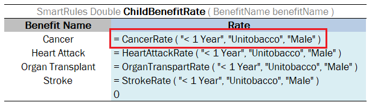
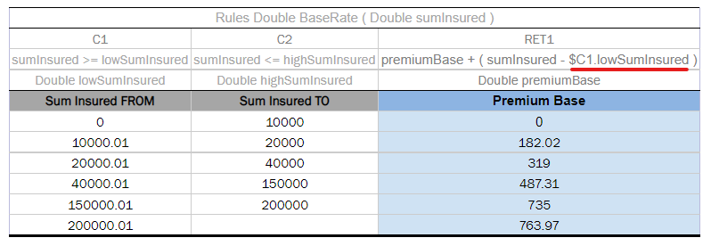
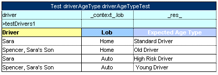
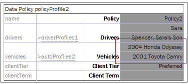
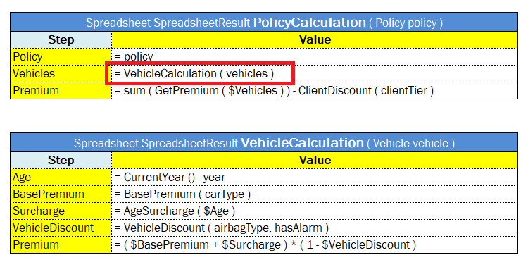
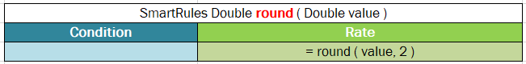
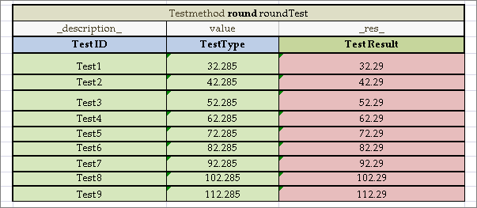
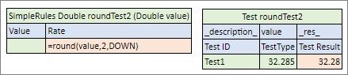

# OpenL Tablets BRMS Reference Guide

**Status**: ✅ Migrated from OpenLdocs
**Source**: [OpenLdocs Reference Guide](https://github.com/EISTW/OpenLdocs/blob/master/docs/documentation/guides/reference_guide.md)
**Last Updated**: 2025-11-05

---

# OpenL Tablets BRMS Reference Guide

## Preface

This preface is an introduction to the OpenL Tablets Reference Guide. The following topics are included in this preface:

-   [Audience](#audience)
-   [Related Information](#related-information)
-   [Typographic Conventions](#typographic-conventions)

### Audience

This guide is mainly intended for analysts and developers who create applications employing the table based decision making mechanisms offered by OpenL Tablets technology. However, other users can also benefit from this guide by learning the basic OpenL Tablets concepts described herein.

Basic knowledge of Excel® is required to use this guide effectively. Basic knowledge of Java is required to follow the development related sections.

### Related Information

The following table lists sources of information related to contents of this guide:

| Title                                                                                                                                                       | Description                                                                                                               |
|-------------------------------------------------------------------------------------------------------------------------------------------------------------|---------------------------------------------------------------------------------------------------------------------------|
| [OpenL Studio Guide](https://openldocs.readthedocs.io/en/latest/documentation/guides/webstudio_user_guide) | Document describing OpenL Studio, a web application for managing OpenL Tablets projects through a web browser. |
| <https://openl-tablets.org/>                                                                                                                                | OpenL Tablets open source project website.                                                                                |

### Typographic Conventions

The following styles and conventions are used in this guide:

| Convention                 | Description                                                                                                                                                                                                                                                                                                                         |
|----------------------------|-------------------------------------------------------------------------------------------------------------------------------------------------------------------------------------------------------------------------------------------------------------------------------------------------------------------------------------|
| **Bold**                   | Represents user interface items such as check boxes, command buttons, dialog boxes, drop-down list values, field names, menu commands, <br/>menus, option buttons, perspectives, tabs, tooltip labels, tree elements, views, and windows. <br/>Represents keys, such as **F9** or **CTRL+A**. <br/>Represents a term the first time it is defined. |
| `Courier`                  | Represents file and directory names, code, system messages, and command-line commands.                                                                                                                                                                                                                                              |
| Select **File \> Save As** | Represents a command to perform, such as opening the **File** menu and selecting **Save As**.                                                                                                                                                                                                                                       |
| *Italic*                   | Represents any information to be entered in a field. Represents documentation titles.                                                                                                                                                                                                                                               |
| \< \>                      | Represents placeholder values to be substituted with user specific values.                                                                                                                                                                                                                                                          |
| Hyperlink                  | Represents a hyperlink. Clicking a hyperlink displays the information topic or external source.                                                                                                                                                                                                                                     |


## Introducing OpenL Tablets

This chapter introduces OpenL Tablets and describes its main concepts.

The following topics are included in this section:

-   [What Is OpenL Tablets?](#what-is-openl-tablets)
-   [Basic Concepts](#basic-concepts)
-   [System Overview](#system-overview)
-   [Installing OpenL Tablets](#installing-openl-tablets)
-   [Tutorials and Examples](#tutorials-and-examples)

### What Is OpenL Tablets?

**OpenL Tablets** is a Business Rules Management System (BRMS) and Business Rules Engine (BRE) based on tables presented in Excel documents. Using unique concepts, OpenL Tablets facilitates treating business documents containing business logic specifications as executable source code. Since the format of tables used by OpenL Tablets is familiar to business users, OpenL Tablets bridges a gap between business users and developers, thus reducing costly enterprise software development errors and dramatically shortening the software development cycle.

In a very simplified overview, OpenL Tablets can be considered as a table processor that extracts tables from Excel documents and makes them accessible from software applications.

The major advantages of using OpenL Tablets are as follows:

-   OpenL Tablets removes the gap between software implementation and business documents, rules, and policies.
-   Business rules become transparent to developers.
-   OpenL Tablets verifies syntax and type errors in all project document data, providing convenient and detailed error reporting.
-   OpenL Tablets can directly point to a problem in an Excel document.
-   OpenL Tablets provides calculation explanation capabilities, enabling expansion of any calculation result by pointing to source arguments in the original documents.
-   OpenL Tablets provides cross-indexing and search capabilities within all project documents.
-   OpenL Tablets provides the ability to create compact and easily readable business rules that become a part of business documentation.
-   Knowledge of Java or any other programming language is not required to create business rules with OpenL Tablets.

OpenL Tablets supports the `.xls, .xlsx, `and `.xlsm` file formats.

### Basic Concepts

This section describes the following main OpenL Tablets concepts:

-   [Rules](#rules)
-   [Tables](#tables)
-   [Projects](#projects)

#### Rules

In OpenL Tablets, a **rule** is a logical statement consisting of conditions and actions. If a rule is called and all its conditions are true, then the corresponding actions are executed. Basically, a rule is an IF-THEN statement. The following is an example of a rule expressed in human language:

*If a service request costs less than 1,000 dollars and takes less than 8 hours to execute, then the service request must be approved automatically.*

Instead of executing actions, rules can also return data values to the calling program.

#### Tables

Basic information OpenL Tablets deals with, such as rules and data, is presented in **tables**. Tables within one project must be unique and it is denoted by table name and input parameters. Nevertheless, different versions of the same table can have the same name and input parameters.

Tables are referenced by calling their names.

Different types of tables serve different purposes. For more information on table types, see [Table Types](#table-types).

#### Projects

An **OpenL Tablets project** is a container of all resources required for processing rule related information. Usually, a project contains Excel files, which are called **modules** of the project, and optionally Java code, library dependencies, and other components. For more information on projects, see [Working with Projects](#working-with-projects).

There can be situations where OpenL Tablets projects are used in the development environment but not in production, depending on the technical aspects of a solution.

### System Overview

The following diagram displays how OpenL Tablets is used by different types of users.


*OpenL Tablets overview*

A typical lifecycle of an OpenL Tablets project is as follows:

1.  A business analyst creates an OpenL Tablets project in OpenL Studio.
2.  Optionally, development team may provide the analyst with a project in case of complex configuration.
3.  The business analyst creates correctly structured tables in Excel files based on requirements and includes them in the project.
    
    Typically, this task is performed through Excel or OpenL Studio in a web browser.
    
1.  Business analyst performs unit and integration tests by creating test tables and performance tests on rules through OpenL Studio.
    
    As a result, fully working rules are created and ready to be used.
    
1.  Development team creates other parts of the solution and employs business rules directly through the OpenL Tablets engine or remotely through web services.
2.  Whenever required, a business user updates or adds new rules to project tables.

OpenL Tablets business rules management applications, such as OpenL Studio, Rules Repository, and OpenL Rule Services, can be set up to provide self-service environment for business user changes.

### Installing OpenL Tablets

OpenL Tablets installation instructions are provided in [OpenL Tablets Installation Guide > Deploying OpenL Studio](https://openldocs.readthedocs.io/en/latest/documentation/guides/installation_guide/#deploying-openl-tablets-webstudio).
The development environment is required only for creating OpenL Tablets projects and launching OpenL Studio or OpenL Rule Services. If OpenL Tablets projects are accessed through OpenL Studio or web services, no specific software needs to be installed.

### Tutorials and Examples

OpenL Tablets provides a number of preconfigured projects developed for new users who want to learn working with OpenL Tablets quickly.

These projects are organized into following groups:

-   [Tutorials](#tutorials)
-   [Examples](#examples)

#### Tutorials

OpenL Tablets provides a set of the tutorial projects demonstrating basic OpenL Tablets features starting from very simple and following with more advanced projects. Files in the tutorial projects contain detailed comments allowing new users to grasp basic concepts quickly.

To create a tutorial project, proceed as follows:

1.  To open Repository Editor, in OpenL Studio, in the top line menu, click the **Repository** item.
2.  Click the **Create Project** button .
3.  In the **Create Project from** window, click the required tutorial name.
4.  Click **Create** to complete.
    
    The project appears in the **Projects** list of Repository Editor.
    
    
   
    *Creating tutorial projects*
    
1.  In the top line menu, click **Rules Editor**.

The project is displayed in the **Projects** list and available for usage. It is highly recommended to start from reading Excel files for examples and tutorials which provide clear explanations for every step involved.


*Tutorial project in the OpenL Studio*

#### Examples

In addition to tutorials, OpenL Tablets provides several example projects that demonstrate how OpenL Tablets can be used in various business domains.

To create an example project, follow the steps described in [Tutorials](#tutorials), and in the **Create Project from** dialog, select an example to explore. When completed, the example appears in the OpenL Studio Rules Editor.

## Creating Tables for OpenL Tablets

This chapter describes how OpenL Tablets processes tables and provides reference information for each table type used in OpenL Tablets.

The following topics are included in this chapter:

-   [Table Recognition Algorithm](#table-recognition-algorithm)
-   [Naming Conventions](#naming-conventions)
-   [Table Types](#table-types)
-   [Table Properties](#table-properties)

### Table Recognition Algorithm

This section describes an algorithm of how the OpenL Tablets engine looks for supported tables in Excel files. It is important to build tables according to the requirements of this algorithm; otherwise, the tables are not recognized correctly.

OpenL Tablets utilizes Excel concepts of workbooks and worksheets, which can be represented and maintained in multiple Excel files. OpenL Tablets does not use any of Excel's formula capabilities though. Any calculations performed in OpenL Tablets are done using OpenL syntax, which is completely distinct from any formula syntax used by Excel. Excel worksheets can be named and arranged within one workbook in the order convenient to a user. Each worksheet, in its turn, is comprised of one or more tables. Workbooks can include tables of different types, each one supporting different underlying logic.

The general table recognition algorithm is as follows:

1.  The engine looks into each spreadsheet and tries to identify logical tables.
    
    Logical tables must be separated by at least one empty row or column or start at the very first row or column. Table parsing is performed from left to right and from top to bottom. The first populated cell that does not belong to a previously parsed table becomes the top-left corner of a new logical table.
    
1.  The engine reads text in the top left cell of a recognized logical table to determine its type.
    
    If the top left cell of a table starts with a predefined keyword, such table is recognized as an OpenL Tablets table.
    
    The following are the supported keywords:
    
    | Keyword               | Table type                                  |
    |-----------------------|---------------------------------------------|
    | Constants           | [Constants Table](#constants-table)        |
    | ColumnMatch         | [Column Match Table](#column-match-table)   |
    | Data                | [Data Table](#data-table)                  |
    | Datatype            | [Datatype Table](#datatype-table)           |
    | Environment         | [Configuration Table](#configuration-table) |
    | Method              | [Method Table](#method-table)               |
    | Properties          | [Properties Table](#properties-table)       |
    | Rules               | [Decision Table](#decision-table)           |
    | Run                 | [Run Table](#run-table)                    |
    | SimpleLookup        | [Simple Lookup Table](#simple-lookup-table) |
    | SimpleRules         | [Simple Rules Table](#simple-rules-table)   |
    | SmartLookup         | [Smart Lookup Table](#smart-lookup-table)   |
    | SmartRules          | [Smart Rules Table](#smart-rules-table)    |
    | Spreadsheet         | [Spreadsheet Table](#spreadsheet-table)     |
    | TablePart           | [Table Part](#table-part)                   |
    | TBasic or Algorithm | [TBasic Table](#tbasic-table)               |
    | Test                | [Test Table](#test-table)                  |
    
    All tables that do not have any of the preceding keywords in the top left cell are ignored. They can be used as comments in Excel files.
    
1.  The engine determines the width and height of the table using populated cells as clues.

It is a good practice to merge all cells in the first table row, so the first row explicitly specifies the table width. The first row is called the table **header**.

**Note:** To put a table title before the header row, an empty row must be used between the title and the first row of the actual table.

### Naming Conventions

The following conventions apply to the rule, field, and function names:

-   The first character of the name must be **Java letter,** that is, a Unicode character, underscore, or dollar sign.
-   The name must consist of Java letters and Java digits.

A **Java digit** is a collection of numbers from 0 to 9.


*Examples of correct and incorrect rule table names*


### Table Types

OpenL Tablets supports the following table types:

-   [Decision Table](#decision-table)
-   [Datatype Table](#datatype-table)
-   [Data Table](#data-table)
-   [Test Table](#test-table)
-   [Run Table](#run-table)
-   [Method Table](#method-table)
-   [Configuration Table](#configuration-table)
-   [Properties Table](#properties-table)
-   [Spreadsheet Table](#spreadsheet-table)
-   [TBasic Table](#tbasic-table)
-   [Column Match Table](#column-match-table)
-   [Constants Table](#constants-table)
-   [Table Part](#table-part)

#### Decision Table

A **decision table** contains a set of rules describing decision situations where the state of a number of conditions determines execution of a set of actions and returned value. It is a basic table type used in OpenL Tablets decision making.


*Decision table example*

The following topics are included in this section:

-   [Decision Table Structure](#decision-table-structure)
-   [Decision Table Interpretation](#decision-table-interpretation)
-   [Simple and Smart Rules Tables](#simple-and-smart-rules-tables)
-   [Simple and Smart Lookup Tables](#simple-and-smart-lookup-tables)
-   [External Tables Usage in Smart Decision Tables](#external-tables-usage-in-smart-decision-tables)
-   [Ranges and Arrays in Smart and Simple Decision Tables](#ranges-and-arrays-in-smart-and-simple-decision-tables)
-   [Rules Tables](#rules-tables)
-   [Collecting Results in Decision Table](#collecting-results-in-decision-table)
-   [Local Parameters in Decision Table](#local-parameters-in-decision-table)
-   [Transposed Decision Tables](#transposed-decision-tables)
-   [Representing Values of Different Types](#representing-values-of-different-types)
-   [Using Calculations in Table Cells](#using-calculations-in-table-cells)
-   [Referencing Attributes](#referencing-attributes)
-   [Calling a Table from Another Table](#calling-a-table-from-another-table)
-   [Using Referents from Return Column Cells](#using-referents-from-return-column-cells)
-   [Using Rule Names and Rule Numbers in the Return Column](#using-rule-names-and-rule-numbers-in-the-return-column)
-   [Using References to Expressions](#using-references-to-expressions)

##### Decision Table Structure

An example of a decision table is as follows:


*Decision table*

The following table describes the full structure of a decision table with the **Rules** keyword:

| Row <br/>number  | Mandatory | Description                                                                                                                                                                                                                                                                                                                                                                                                                                                                                                                                                                                                                                                                                                                                                                                                                                                                                                                                                                                                                                                                                                                                                                                                                                                                                                                                                                                                                                                                                                                                                                                                                                                                                                                                                         |
|-------------|-----------|---------------------------------------------------------------------------------------------------------------------------------------------------------------------------------------------------------------------------------------------------------------------------------------------------------------------------------------------------------------------------------------------------------------------------------------------------------------------------------------------------------------------------------------------------------------------------------------------------------------------------------------------------------------------------------------------------------------------------------------------------------------------------------------------------------------------------------------------------------------------------------------------------------------------------------------------------------------------------------------------------------------------------------------------------------------------------------------------------------------------------------------------------------------------------------------------------------------------------------------------------------------------------------------------------------------------------------------------------------------------------------------------------------------------------------------------------------------------------------------------------------------------------------------------------------------------------------------------------------------------------------------------------------------------------------------------------------------------------------------------------------------------|
| 1           | Yes       | Table header, which has the following pattern: `<keyword> <rule header>` where `<keyword>` is either 'Rules' or 'DT' and `<rule header>` is <br/>a signature of a table with names and types of the rule and its parameters used to access the decision table and provide input parameters.                                                                                                                                                                                                                                                                                                                                                                                                                                                                                                                                                                                                                                                                                                                                                                                                                                                                                                                                                                                                                                                                                                                                                                                                                                                                                                                                                                                                                                                                              |
| 2           | Yes       | Row consisting of the following cell types: <br/><br/>- **Condition column header** <br/>Identifies that the column contains a rule condition and its parameters. <br/>It must start with the “C” character followed by a number or be “MC1” for the 1st column with merged rows. <br/>If the condition has several parameters, the cell must be merged on all its parameter columns. <br/>**Examples**: `C1, C5, C8, MC1` <br/><br/>- **Horizontal condition column header** <br/>Identifies that the column contains a horizontal rule condition and its parameter (horizontal condition can have only one parameter). <br/>It must start with the “HC” character followed by a number. Horizontal conditions are used in lookup tables only. <br/>**Examples**: `HC1, HC5, HC8` <br/><br/>- **Action column header** <br/>Identifies that the column contains rule actions. It must start with the “A” character followed by a number. <br/>**Examples:**` A1, A2, A5` <br/><br/>- **Return value column header** <br/>Identifies that the column contains values to be returned to the calling program. <br/>A table can have multiple return columns, however, only the first fired non-empty value is returned.<br/> **Example:** `RET1` <br/><br/>All other cells in this row are ignored and can be used as comments. <br/>If a table contains action columns, the engine executes actions for all rules with true conditions. <br/>If a table has a return column, the engine stops processing rules after the first executed rule with true conditions and non-empty result found.                                                                                                                                                                                                                                                                                                        |
| 3           | Yes       | Row containing cells with expression statements for condition, action, and return value column headers. <br/>OpenL Tablets supports Java grammar enhanced with OpenL Tablets Business Expression (BEX) grammar features. <br/>For more information on the BEX language, see [Appendix A: BEX Language Overview](#appendix-a-bex-language-overview). <br/><br/>In most cases, OpenL Tablets Business Expression grammar covers all the variety of expression statements <br/>and an OpenL user does not need to learn Java syntax. <br/>The code in these cells can use any objects and functions visible to the OpenL Tablets engine as elsewhere. <br/>For more information on enabling the OpenL Tablets engine to use custom Java packages, see [Configuration Table](#configuration-table). <br/><br/>Purpose of each cell in this row depends on the cell above is as follows: <br/><br/>- **Condition column header** <br/>Specifies the logical expression of the condition. It can reference parameters in the table header and parameters in cells below. <br/>The cell can contain several expressions, but the last expression must return a Boolean value. <br/>All condition expressions must be true to execute a rule. <br/><br/>- **Horizontal condition** <br/>The same as **Condition column header.** <br/><br/>- **Action column header** <br/>Specifies expression to be executed if all conditions of the rule are true. <br/>The expression can reference parameters in the rule header and parameters in the cells below. <br/><br/>- **Return value column header** <br/>Specifies expression used for calculating the return value. <br/>The type of the last expression must match the return value specified in the rule header. <br/>The explicit return statement with the keyword “return” is also supported. <br/>This cell can reference parameters in the rule header and parameters in the cells below. |
| 4           | Yes       | Row containing parameter definition cells. Each cell in this row specifies the type and name of parameters in the cells below it. <br/>Parameter name must be one word long. <br/>Parameter type must be one of the following: simple data types aggregated data types or Java classes visible to the engine arrays <br/>of the above types as described in [Representing Arrays](#representing-arrays).                                                                                                                                                                                                                                                                                                                                                                                                                                                                                                                                                                                                                                                                                                                                                                                                                                                                                                                                                                                                                                                                                                                                                                                                                                                                                                                                                                            |
| 5           | Yes       | Descriptive column titles. The rule engine does not use them in calculations but they are intended for business users working with the table. <br/>Cells in this row can contain any arbitrary text and be of any layout that does not correspond to other table parts. <br/>The height of the row is determined by the first cell in the row.                                                                                                                                                                                                                                                                                                                                                                                                                                                                                                                                                                                                                                                                                                                                                                                                                                                                                                                                                                                                                                                                                                                                                                                                                                                                                                                                                                                                                                |
| 6 and <br/>below | Yes       | Concrete parameter values. Any cell can contain formula, a mathematical one or a rule call, instead of concrete value and calculate the value. <br/>This formula can reference parameters in the rule header and any parameters of condition columns in the return column.                                                                                                                                                                                                                                                                                                                                                                                                                                                                                                                                                                                                                                                                                                                                                                                                                                                                                                                                                                                                                                                                                                                                                                                                                                                                                                                                                                                                                                                                                               |

A user can merge cells of parameter values to substitute multiple single cells when the same value needs to be defined in these single cells. During rule execution, OpenL Tables unmerges these cells.

The additional **Rule** column with merged cells is used as the first column when the return value must be a list of values written in multiple rows of the same column, that is, a vertically arranged array. The Rule column determines the height of the result value list.


*A table with the Rule column as the first column*


*Result in the vertically arranged array format*

The rule column can be defined for rules tables and smart rules tables.

##### Decision Table Interpretation

Rules inside decision tables are processed one by one in the order they are placed in the table. A rule is executed only when all its conditions are true. If at least one condition returns false, all other conditions in the same row are ignored.

Blank parameter value cell of the condition is interpreted as a true condition and this condition is ignored for a particular rule row or column. If the condition column has several parameters, the condition with all its parameter cells blank is interpreted as a true condition.

**Note:** As OpenL Tablets returns the first true condition, it is a good practice to list all possible non-blank parameters and their combinations in case of multiple conditioning first, and then list the blank parameters.

Blank parameter value cell of the return/action column is ignored, the system does not calculate the return/action expression of the current rule and starts processing the next rule. If the return/action column has several parameters, all parameters cells need to be blank to ignore the rule.

If the empty return value is calculated by the expression, the system starts processing the next rule searching for a non-empty result.

The following example contains empty case interpretation. For **Senior Driver**, the marital status of the driver does not matter. Although there is no combination of **Senior Driver** and **Single** mode, the result value is 500 as for an empty marital status value.


*Empty case interpretation in the Decision table*

##### Simple and Smart Rules Tables

Practice shows that most of decision tables have a simple structure: there are conditions for input parameters of a decision table that check equality of input and condition values, and a return value. Because of this, OpenL Tablets have simplified decision table representations. A simplified decision table allows skipping condition and return columns declarations, and thus the table consists of a header, column titles and condition and return values, and, optionally, properties.

The following topics are included in this section:

-   [Simple Rules Table](#simple-rules-table)
-   [Smart Rules Table](#smart-rules-table)
-   [Multiple Return Columns in Smart Rules Tables](#multiple-return-columns-in-smart-rules-tables)
-   [Result of Custom Data Type in Smart and Simple Rules Tables](#result-of-custom-data-type-in-smart-and-simple-rules-tables)

###### Simple Rules Table

A simplified decision table which has simple conditions for each parameter and a simple return can be easily represented as a **simple rules table**.

Unlike smart rules, a simple rule table uses all input parameters to associate them with condition columns in strict order, determined by simple logic, and using no titles. The value of the first column is compared with the value of the first input parameter, and so on. The value of the last column (return column) returns as a result. This means that input parameters must be in the same order as the corresponding condition columns, and the number of inputs must be equal to the number of conditions.

The simple rules table header format is as follows:

`SimpleRules <Return type> RuleName(<Parameter type 1> parameterName1, (<Parameter type 2> parameterName 2….)`

The following is an example of a simple rules table header:


*Simple rules table example*

**Note:** If a string value contains a comma, the value must be delimited with the backslash (\\) separator followed by a comma. Otherwise, it is treated as an array of string elements as described in [Ranges and Arrays in Smart and Simple Decision Tables](#ranges-and-arrays-in-smart-and-simple-decision-tables).

Restrictions for a simplified decision table are as follows:

-   Condition values must be of the same type or be an array or range of the same type as corresponding input parameters.
-   Return values must have the type of the return type from the decision table header.

###### Smart Rules Table

A decision table which has simple conditions for input parameters and a direct return (without expression) can be easily represented as a **smart rules table**. Comparing to a simple rules table, a smart rules table type is used more frequently because smart rules are more flexible and cover wider range of business requirements.

The smart rules table header format is as follows:

`SmartRules <Return type> RuleName(<Parameter type 1> parameterName1, (<Parameter type 2> parameterName 2…)`


*Smart rules table with simple return value*

OpenL Tablets identifies which condition сolumns correspond to which input parameters by condition titles and parameter names. First of all, OpenL parses a parameter name and splits it into words, as it interprets a part starting with a capital letter as a separate word. Then it calculates the percentage of matching words in all columns and selects the column with the highest percentage of coincidence. If the analysis returns more than one result, OpenL throws an error and requires a more unique name for the column.

**Note:** OpenL Tablets matches input parameters or its fields to the conditions columns using the score. The score is calculated based on words used in parameter naming. If the particular parameter has the highest score for the particular condition, matching occurs. If several parameters have the same score, the system displays a warning message “Ambiguous matching of column titles to DT columns. Use more appropriate titles.” To overcome this issue and improve matching, use extended names for conditions.


In case of a custom datatype input, OpenL verifies all fields of the input object to match them separately with appropriate conditions using field names, in addition to input names, and column titles.


*Smart rules table with object-input*

OpenL is capable of matching abbreviations as well.

During rules execution, the system checks condition and input values on equality or inclusion and returns the result from the return columns, that is, the last columns identified as the result.

In the example above, the **driverType** value is compared with values from the **Type of Driver** column, the **maritalStatus** value is compared with the **Marital Status** column values, and the value from the **Driver Premium** column is returned as the result.

**Note:** To insure the system checks a condition with an appropriate input parameter, the user can ”hover” with a mouse over the column title and see the hint with this information in OpenL Studio.

If a string value of the condition contains a comma, the value must be delimited with the backslash (\\) separator followed by the comma. Otherwise, it is treated as an array of string elements as described in [Ranges and Arrays in Smart and Simple Decision Tables](#ranges-and-arrays-in-smart-and-simple-decision-tables):


*Comma within a string value in a Smart table*

To define a range of values, two columns of the condition can be merged. In this case, the whole condition is interpreted as` min <= input parameter && input parameter < max`.


*Using min and max values for a range in the condition column*

Special conditions not matching any particular input fields can be used in smart rules tables, for example, for validation rules definition. Column header for such condition must contain the word ‘true’. If there are other condition headers containing the word ‘true’, the name must be explicitly declared as “Is True?”. All values in such column are expressions or Boolean values. Such condition can also be used in the smart lookup tables.


*Example of a condition that is a Boolean expression*

If there is a horizontal condition of the Boolean type and the condition title is not a merged cell, it is preferable to use the title **is true?** instead of **true** because the title can be interpreted as a horizontal condition and cause wrong compilation.

A smart rule table can contain multiple and compound returns as described in [Multiple Return Columns in Smart Rules Tables](#multiple-return-columns-in-smart-rules-tables) and use external tables as described in [External Tables Usage in Smart Decision Tables](#external-tables-usage-in-smart-decision-tables).


###### Multiple Return Columns in Smart Rules Tables

A smart rules table can contain up to three return columns. If the first return column contains a non-empty result, it is returned, otherwise, the next return column is scanned until the non-empty result is found or the last return column is verified.

The following example illustrates a table with multiple return columns.


*Example of a smart rules table with multiple return columns*

In this example, the **QuoteVolume** rule has one condition, **Coverage Type,** and two return columns, **Volume 1** and **Volume 2.** An example of the test table for this rule table is as follows.


*Example of the test table for a rule table with multiple return columns*

In the test table, **Plan 1** is not of the **Medical** coverage type, so the second rule line is applied. In the test table, for the first test case, both **History Premium** and **History Rate** are provided, so **Volume** is calculated as 480 by the rule of **Volume 1** column. For the second and third test case, one of inputs is missing, so **Volume 1** returns an empty result, and the second return column calls another rule causing the result of 500 returned.

**Note for experienced users:** In case of a complex return object, only one compound return consisting of several return columns is allowed. All other returns can be defined using the formulas, that is, the `new() `operator or by calling another rule that returns the object of the corresponding type. For more information on complex return objects, see [Result of Custom Data Type in Smart and Simple Rules Tables](#result-of-custom-data-type-in-smart-and-simple-rules-tables).


###### Result of Custom Data Type in Smart and Simple Rules Tables

A simplified rules table can return the value of compound type (custom data type) – the whole data object. To accomplish this, the user must make return column titles close to the corresponding fields of the object so the system can associate the data from the return columns with the returned object fields correctly. For more information on datatype tables, see [Datatype Table](#datatype-table).

In the example below, the rule **VehicleDiscount** determines the vehicles’s discount type and rate depending on air bags type and alarm indicator:


*Smart rules table with compound return value*

**Note:** To insure the system matches the return column with an appropriate return object field, the user can ”hover” over the column title and see the hint with this information in OpenL Studio.

**Note:** Return object fields are automatically filled in with input values if the return field name and input field name are matched.


*Return object fields automatically filled in with input values*

If the rule returns the result of a very complex object (with nested objects inside), then there are several options for creating column titles:

-   titles in one row with names that can be matched to the object fields unambiguously (the previously described approach) as shown in the example below, rule **VehicleDiscount1**;
-   titles in several rows to define the hierarcy (structure) of the return object; in this case the user can merge cells associated with fields of a nested object as shown on the example below, rule **VehicleDiscount2**. Using this option, merging condition titles is required.


*Smart rules tables with compound return value*


##### Simple and Smart Lookup Tables

This section introduces lookup tables and includes the following topics:

-   [Understanding Lookup Tables](#understanding-lookup-tables)
-   [Lookup Tables Implementation Details](#lookup-tables-implementation-details)
-   [Simple Lookup Table](#simple-lookup-table)
-   [Smart Lookup Table](#smart-lookup-table)

###### Understanding Lookup Tables

A **lookup table** is a special modification of the decision table which simultaneously contains vertical and horizontal conditions and returns value on crossroads of matching condition values.

That means condition values can appear either on the left of the lookup table or on the top of it. The values on the left are called **vertical** and values on the top are called **horizontal**. Any lookup table must have at least one vertical and at least one horizontal value.


*A lookup table example*

###### Lookup Tables Implementation Details

This section describes internal OpenL Tablets logic.

At first, the table goes through parsing and validation.

-   On parsing, all parts of the table, such as header, columns headers, vertical conditions, horizontal conditions, return column, and their values, are extracted.
-   On validation, OpenL checks if the table structure is proper.

Then OpenL Tablets transforms a lookup table into a regular decision table internally and processes it as a regular decision table.


###### Simple Lookup Table

A lookup decision table with simple conditions that check equality of an input parameter and a condition value and a simple return can be easily represented as **simple lookup table**. This table is similar to simple rules table but has horizontal conditions. The number of parameters to be associated with horizontal conditions is determined by the height of the first column title cell.

The simple lookup table header format is as follows:

`SimpleLookup <Return type> RuleName(<Parameter type 1> parameterName1, (<Parameter type 2> parameterName2,….)`

The following is an example of a simple lookup table.


*Simple lookup table example*


###### Smart Lookup Table

A lookup decision table with simple conditions that check equality or inclusion of an input parameter with a condition value and a direct return (without expression) can be easily represented as a **smart lookup table**. This table resembles a smart rules table but has horizontal conditions.

The smart lookup table header format is as follows:

`SmartLookup <Return type> RuleName(<Parameter type 1> parameterName1, (<Parameter type 2> parameterName2,….)`


*Smart lookup table example*

Condition matching algorithm for smart lookup tables is the same as for smart rules tables. For vertical conditions, the system searches for input parameters suitable by title and then, for horizontal conditions, the system selects input parameters starting with the first of the rest inputs.

Boolean conditions can be used in the smart lookup tables as column headers. For more information on these conditions, see [Smart Rules Table](#smart-rules-table).

The number of horizontal conditions is determined by the height of the first column title cell. This means that title cells of the vertical conditions must be merged on all rows which go for horizontal conditions.

The following is an example of a smart lookup table with several horizontal conditions:


*Smart lookup table with several horizontal conditions*

OpenL Tablets supports titles for horizontal conditions. A horizontal condition title is defined either together with the last vertical condition header, separated by a slash character, or as a separate column after all vertical conditions.


*Slash character in a red cell indicating that the cell contains condition titles for a vertical condition "Rating of Agency" and a horizontal condition "Total Assets*


*Algorithm identifying the third column as horizontal condition titles because the third column values are empty*

If the height of the horizontal condition is 1, and there is a vertical condition with an empty column, the horizontal titles must be started with a slash /.


##### External Tables Usage in Smart Decision Tables

Conditions, returns, and actions declarations can be separated and stored in specific tables and then used in Smart Decision Tables via column titles. It allows using the Smart Table type for Decision rule even in case of the complicated condition or return calculation logic. Another benefit is that condition and return declarations can be reused in several rules, for example, Conditions table as a template. An example is as follows.


*Using external conditions in a smart rules table*

In this example, the first condition definition is taken from a separate Conditions table, an external table, and matched by column titles **Agency** and **Rating of Agency.** In OpenL Studio, such titles have links leading to the corresponding table. Other conditions are matched implicitly with input parameters by their names. In OpenL Studio, such titles have hints with all corresponding information.

Names of external tables have higher priority over input parameters. First of all, the engine checks if an external table with such name exists and if it is not found, the engine treats the column title as an input parameter. In the preceding example, OpenL Tablets first searches for an external table named **Agency** and finds it. Otherwise, the engine would treat **Agency** as input parameter.

External condition/return/action title must exactly match the title of the condition/return/action in the smart decision table. Inputs are matched by smart logic analyzing data types and names. Exact name matching is not required.

The external element table structure is as follows:

1.  The first row is the header containing the keyword, such as **Actions**, **Conditions**, or **Returns**, and optionally the name of the table.
2.  The first column under the header contains keyword, such as **Inputs**, **Expression**, **Parameter**, and **Title.**
3.  Every column, starting from the second one, represents the element, that is, condition, action, and return definition.
    
    Rows with the corresponding keyword contain the following information in the condition, action, and return definition rows:
    
    | **Element** | **Description**                                                                                                                                                                                     |
    |-------------|-------------------------------------------------------------------------------------------------------------------------------------------------------------------------------------------------|
    | Input       | Defines input parameters required for expression calculation of the element. It can be common for several expressions when cells are merged. <br/>Input is optional for **Returns** and **Actions**. |
    | Expression  | Specifies the logical expression of the element. It must be merged accordingly if an element includes several parameters defined below.                                                         |
    | Parameter   | Stores parameter definition of the element.                                                                                                                                                     |
    | Title       | Provides a descriptive column title that is later used in the Smart Decision rule.                                                                                                              |
    
1.  The first column with keywords can be omitted if the default order **Inputs – Expression – Parameter – Title** is used.

##### Ranges and Arrays in Smart and Simple Decision Tables

Range and array data types can be used in simplified and smart rules and lookup tables. If a condition is represented as an array or range, the rule is executed for any value from that array or range. As an example, in the following image, there is the same Car Price for all regions of Belarus and Great Britain, so, using an array, three rows for each of these countries can be replaced by a single one as displayed in the following table.


*Simple lookup table with an array*

If a string value contains a comma, the value must be delimited with the backslash (\\) separator followed by a comma as illustrated for **Driver\\, Passenger\\, Side** in the following example. Otherwise, it is treated as an array of string elements.


*Comma within a string value in a Simple Rule table*

The following example explains how to use a range in a simple rules table.


*Simple rules table with a Range*

OpenL looks through the **Condition** column, that is, **ZIP Code**, meets a range, which is not necessarily the first one, and defines that all the data in the column are IntRange, where Integer is defined in the header, **Integer vehicleZip**.

Simple and smart rules and smart lookup tables support using arrays of ranges. In the following example, the Z100-Z105, Z107, Z109 condition is a string range array where single elements Z107, Z109 are treated by system as ranges Z107-Z107, Z109-Z109.


*Using arrays of ranges in a table*

**Note:** String ranges are only supported in smart rules tables. For more information on range data types in OpenL Tablets, see [Range Data Types](#range-data-types).


##### Rules Tables

A **rules table** is a regular decision table with vertical and optional horizontal conditions where the structure of the condition and return columns is explicitly declared by a user by starting column headers with the characters specific for each column as described in [Decision Table Structure](#decision-table-structure).

By default, each row of the decision table is a separate rule. Even if some cells of condition columns are merged, OpenL Tablets treats them as unmerged. This is the most common scenario.

Vertical conditions are marked with the Cn and MC1 characters. The MC1 column plays the role of the Rule column in a table. It determines the height of the result value list. An example is as follows.


*A Decision table with merged condition values*

Earthquake Coverage for Brand Y and Brand X has a different list of values, so they are not merged although their first condition is the same.


*A list of values as a result*

The horizontal conditions are marked as HC1, HC2 and so on. Every lookup matrix must start from the HC or RET column. The first HC or RET column must go after all vertical conditions, such as C, Rule, and comment columns. There can be no comment column in the horizontal conditions part. The RET section can be placed in any place of the lookup headers row. HC columns do not have the Titles section.


*A lookup table example*

The first cell of column titles must be merged on all rows that contain horizontal condition values. The height of the titles row is determined by the first cell in the row. For example, see the **Country** cell in the previous example.

To use multiple column parameters for a condition, return, or action, merge the column header and expression cells. Use this approach if a condition cannot be presented as a simple AND combination of one-parameter conditions.


*Example of the merged column header and expression cells*

Any type of decision tables described previously, that is, Simple Rules, Smart Rules, Simple Lookup, and Smart Lookup, can be transformed into a Rules table with a detailed condition and return column declaration. Rules table is the most generic but least frequently used table type because other table types have simplified syntax and inbuilt logic satisfying specific business needs in a more user-friendly way.

Colors identify how values are related to conditions. The same table represented as a decision table is as follows:


*Lookup table representation as a decision table*


##### Collecting Results in Decision Table

A decision table returns only the first fired, non-empty result in common case. But there are business cases when all rules in a table must be checked and all results found returned. To do so, use:

-   `Collect` keyword right before `<Return type> `in the table header for Simple and Smart rule table types;
-   `CRET` as the return value column header for a regular decision table type;
-   Define `<Return type> `as an array.

In the example below, rule **InterestTable** returns the list of interest schemes of a particular plan:


*Collecting results in Smart and Simple rule table*

In the following example, rule **PriceTable** collects car price information for desired specified country and/or ”make” of a car:


*Collecting results in regular Decision table*

**Note for experienced users:** Smart and Simple rule tables can return the collection of List, Set, or Collection type. To define a type of a collection element, use the following syntax: `Collect as <Element type> <Collection type> `for example, `SmartRules Collect as String List Greeting (Integer hour).`


##### Local Parameters in Decision Table

When declaring a decision table, the header must contain the following information:

-   column type
-   code snippet
-   declarations of parameters
-   titles

Recent experience shows that in 95% of cases, users add very simple logic within code snippet, such as just access to a field from input parameters. In this case, parameter declaration for a column is useless and can be skipped.

The following topics are included in this section:

-   [Simplified Declarations](#simplified-declarations)
-   [Performance Tips](#performance-tips)

###### Simplified Declarations

**Case\#1**

The following image represents a situation when users must provide an expression and simple equal operation for condition declaration.


*Decision table requiring an expression and simple equal operation for condition declaration*

This code snippet can be simplified as displayed in the following example.


*Simplified decision table*

OpenL Engine creates the required parameter automatically when a user omits parameter declaration with the following information:

1.  The parameter name will be **P1**, where 1 is index of the parameter.
2.  The type of the parameter will be the same as the expression type.

In this example, it will be Boolean.

In the next step, OpenL Tablets will create an appropriate condition evaluator.

**Note:** The parameter name can be omitted in the situation when the `contains(P1, expression value)` operation for condition declaration is to be applied. The type of the parameter must be an array of the expression value type.


*Simplified condition declaration*


**Case\#2**

The following example illustrates the **Greeting** rule with the **min \<= value and value \< max** condition expression.


*The Greeting rule*

Instead of the full expression **min \<= value and value \< max**, a user can simply use **value** and OpenL Tablets automatically recognizes the full condition.


*Simplified Greeting rule*


###### Performance Tips

Time for executing the OpenL Tablets rules heavily depends on complexity of condition expressions. To improve performance, use simple or smart decision table types and simplified condition declarations.

To speed up rules execution, put simple conditions before more complicated ones. In the following example, simple condition is located before a more complicated one.


*Simple condition location*

The main benefit of this approach is performance: expected results are found much faster.

OpenL Tablets enables users to create and maintain tests to ensure reliable work of all rules. A business analyst performs unit and integration tests by creating test tables on rules through OpenL Studio. As a result, fully working rules are created and ready to be used.

For test tables, to test the rule table performance, a business analyst uses the Benchmark functionality. For more information on this functionality, see [OpenL Studio Guide](https://openldocs.readthedocs.io/en/latest/documentation/guides/webstudio_user_guide).


##### Transposed Decision Tables

Sometimes decision tables look more convenient in the transposed format where columns become rows and rows become columns. For example, an initial and transposed version of decision table resembles the following:


*Transposed decision table*

OpenL Tablets automatically detects transposed tables and is able to process them correctly.

##### Representing Values of Different Types

The following sections describe how to present some values – list or range of numbers, dates, logical values – in OpenL table cells. The following topics are included in this section:

-   [Representing Arrays](#representing-arrays)
-   [Representing Date Values](#representing-date-values)
-   [Representing Boolean Values](#representing-boolean-values)
-   [Representing Range Types](#representing-range-types)

###### Representing Arrays

For all tables that have properties of the `enum[]` type or fields of the array type, arrays can be defined as follows:

-   horizontally
-   vertically
-   as comma separated arrays

The first option is to arrange array values horizontally using multiple subcolumns. The following is an example of this approach:


*Arranging array values horizontally*

In this example, the contents of the `set` variable for the first rule are `[1,3,5,7,9],` and for the second rule, `[2,4,6,8]`. Values are read from left to right.

The second option is to present parameter values vertically as follows:


*Arranging array values vertically*

In the second case, the boundaries between rules are determined by the height of the leftmost cell. Therefore, an additional column must be added to the table to specify boundaries between arrays.

In both cases, empty cells are not added to the array.

The third option is to define an array by separating values by a comma. If the value itself contains a comma, it must be escaped using back slash symbol “`\`”` `by putting it before the comma.


*Array values separated by comma*

In this example, the array consists of the following values:

-   test 1
-   test 3, 4
-   test 2


*Array values separated by comma. The second example*

In this example, the array consists of the following values:

-   value1
-   value2
-   value3

Two-dimensional arrays can be used in rules tables, where mixing values and expressions in arrays is allowed. An example is as follows:


*Using two-dimensional arrays in a rules table*

###### Representing Date Values

To represent date values in table cells, either Excel format or one of the following format must be used for the text:
* `<year>-<month>-<date>` (ISO 8601)
* `<month>/<date>/<year>` (US)

Note: In Excel, inputted text can be treated as a date and converted into Excel's date format. To prevent this, it's necessary to precede the text with an apostrophe to signify that it should be treated as text. Excel recognizes these values as simple text and does not automatically convert them into a date format.

The following are valid date value examples:
* `1980-07-12`
* `5/7/1981`
* `10/20/2002`

OpenL Tablets recognizes all Excel date formats.

###### Representing Boolean Values

OpenL Tablets supports either Excel Boolean format or the following formats of Boolean values as a text:

-   true, yes, y
-   false, no, n

OpenL Tablets recognizes the Excel Boolean value, such as native Excel Boolean value TRUE or FALSE. For more information on Excel Boolean values, see Excel help.

###### Representing Range Types

In OpenL, the following data types are designed to work with ranges:

-   IntRange
-   DoubleRange

For more information on these data types used for ranges, see [Range Data Types](#range-data-types).


*Decision table with IntRange*

**Note:** Be careful with using `Integer.MAX_VALUE` in a decision table. If there is a range with the border `max_number `equals to `Integer.MAX_VALUE`, for example, `[100; 2147483647]`, it is not included to the range. This is a known limitation.

##### Using Calculations in Table Cells

OpenL Tablets can perform mathematical calculations involving method input parameters in table cells. For example, instead of returning a concrete number, a rule can return a result of a calculation involving one of the input parameters. The calculation result type must match the type of the cell. When editing tables in Excel files, start the text in the cells containing calculations with an apostrophe followed by =, and for the tables in OpenL Studio, start the text with =, without an apostrophe. Excel treats such values as a plain text.

The following decision table demonstrates calculations in table cells.


*Decision table with calculations*

The table transforms a twelve hour time format into a twenty four hour time format. The column `RET1` contains two cells that perform calculations with the input parameter `ampmHr`.

Calculations use regular Java syntax, similar to the one used in conditions and actions.

**Note:** Excel formulas are not supported by OpenL Tablets. They are used as pre-calculated values.

##### Referencing Attributes

To address an attribute of an object in a rule, use the following syntaxes:

-   \<object name\>.\<attribute name\>
    
    
    
    *Defining an object attribute*
    
-   \<attribute name\> (\<object name\>)
    
    
    
    *Defining an object attribute*
    
The following rules apply:

-   When a complex object is used as an input parameter in a rule, it is recommended to use a simplified reference without the input parameter name to address the direct attributes of this object.
-   If input parameters do not have objects with the same attributes, the input parameter name can be omitted in the reference.
-   If a complex object X is used as an input parameter in a rule, and this object has complex object Y as its attribute, when referencing object Y attributes in a rule, the input parameter name of the object X can be omitted.

An example of a redundant reference as follows:


*A spreadsheet with a redundant reference*

A full reference is redundant here and can be omitted as numberOfFamilies is an attribute of the policyEndorsementForm input paramter. The correct way to use the reference is as follows:


*A spreadsheet with correct reference*

An example of referencing an attribute of a complex object that is an attribute of a complex object input parameter is as follows:


*A model describing complex objects structure and their attributes*


*A rule that is using reference to the attributes of the nested complex object*

In this example, the input parameter in the rule is a complex object Policy, and one of its attributes is a complex object Plan. The Plan object includes its own attributes where one of them, Coverage, is a complex object as well.

Part of the rule logic is to check rate basis across all plans and coverages to make sure it is the same across all policy. To get to the rate basis attribute from the Policy object, go 2 levels down and omit the Policy level as Policy is already used as an input parameter: Plan (1st level down) \> Coverage (2nd level down).

policyNumber, situsState do not have the policy.situsState reference as they are direct attributes of Policy. This means omitting input parameter reference of the top level.

The same syntax can be used in the array of objects, for example, cars.model or model(cars). The models of all cars in the received array are returned.

##### Calling a Table from Another Table

When one table’s results are required for calculation in another table, the first table can be called using `‘= TableName ( <inputParameter1 attribute name>, <inputParameter2 attribute name>, <inputParameterN attribute name> ) `where input parameters can be retrieved as follows:

-   from the current table
-   specifically declared as in the following ChildBenefitRate table example
-   calculated using expressions, that is, formulas or by calling other rules

The input parameter attribute type is not specified when calling a nested rule.

In the following example, a nested rule table **HeapedCommissionStrategy** is called from the **CommissionCalculation** smart rule table.


*Calling a nested rule table from a rule table*

The return value type of the nested rule table must match the return value type of the current rule table.

Sometimes specific values must be sent to the nested table. In this case, input parameter values can be specified as follows:

-   decalred in the quatation marks “” for String values
-   set to true or false for Boolean values
-   provided as a number for Double and Integer values
-   set to null for empty values

For example, usually the detailed information about children is not included in the insurance policy and so default values are used to get the rates:




*Declaring specific inputs when calling a nested rule table*

##### Using Referents from Return Column Cells

When a condition value from a cell in the Return column must be called, specify the value by using `$C<n>.<variable name> `in the **Return** column.



*A Decision table with referents inside the Return column*


*Tracing Decision table with referents*

Conditions, actions, and result parameters can be accessed from another condition, action, or result using simplified syntax. The same syntax can be also used for smart rules if external tables are used for condition, action, or result.


*Accessing a condition parameter from a return expression by simplified syntax*

##### Using Rule Names and Rule Numbers in the Return Column

Rule names and numbers can be used in the return expression to find out which rule is executed. `$RuleId` is an implicit number of the rule in the rule table. `$Rule` is used to get the rule name explicitly defined by the Rule column.

In the following rule example, the second rule row is executed, and rule ID \#2 is stored in the **priority** field of the return:


*Using $RuleId and $Rule in the rules table*

##### Using References to Expressions

References to expressions can be used in decision tables. They can be referenced from table headers and within table body.

-	**$Expr.C1** is used to reference the expression for condition C1. To address action or return expression use RET1 and A1 respectively.

-	**$Expr.$C1.param1** is an expression defined as a value in a column for the **param1** condition parameter. $C1 is optional. For instance, in the example below, parameter **cond** is the condition parameter for condition C2. It's important to use named parameters which is possible in decision tables of [Rules type](#decision-table-structure) or when working with [external conditions, actions, or returns](#external-tables-usage-in-smart-decision-tables) in smart tables.


`$Expr.C1, $Expr.$C1.param1` return the expression type that contains following attributes:
- `ast` - returns AST (Abstract Syntax Tree) tree for the expression
- `textValue` - returns a string representing an expression

Note: If a cell, which is expected to contain an expression or formula, is empty, it will return null.

#### Datatype Table

This section describes datatype tables and includes the following topics:

-   [Introducing Datatype Tables](#introducing-datatype-tables)
-   [Inheritance in Data Types](#inheritance-in-data-types)
-   [Vocabulary Data Types](#vocabulary-data-types)

##### Introducing Datatype Tables

A **Datatype table** defines an OpenL Tablets data structure. A Datatype table is used for the following purposes:

-   create a hierarchical data structure combining multiple data elements and their associated data types in hierarchy
-   define the default values
-   create vocabulary for data elements

A compound data type defined by Datatype table is called a **custom data type**. Datatype tables enable users to create their own data model which is logically suited for usage in a particular business domain.

For more information on creating vocabulary for data elements, see [Vocabulary Data Types](#vocabulary-data-types).

A Datatype table has the following structure:

1.  The first row is the header containing the **Datatype** keyword followed by the name of the data type.
2.  Every row, starting with the second one, represents one attribute of the data type.
    
    The first column contains attribute types, and the second column contains corresponding attribute names.
    
    **Note:** While there are no special restrictions, usually an attribute type starts with a capital letter and attribute name starts with a small letter.
    
1.  The third column is optional and defines default values for fields.

Consider the case when a hierarchical logical data structure must be created. The following example of a Datatype table defines a custom data type called **Person**. The table represents a structure of the **Person** data object and combines **Person’s** data elements, such as name, social security number, date of birth, gender, and address.


*Datatype table Person*

Note that data attribute, or element, address of **Person** has, by-turn, custom data type **Address** and consists of zip code, city, and street attributes.


*Datatype table Address*

The following example extends the **Person** data type with default values for specific fields.


*Datatype table with default values*

The **Gender** field has the given value **Male** for all newly created instances if other value is not provided. If a value is provided, it has a higher priority over the default value and overrides it.

One attribute type can be used for many attribute names if their data elements are the same. For example, insuredGender and spouseGender attribute names may have Gender attribute type as the same list of values (Male, Female) is defined for them.

**Note for experienced users:** Java beans can be used as custom data types in OpenL Tablets. If a Java bean is used, the package where the Java bean is located must be imported using a configuration table as described in [Configuration Table](#configuration-table).

Consider an example of a Datatype table defining a custom data type called Corporation. The following table represents a structure of the Corporation data object and combines Corporation data elements, such as ID, full name, industry, ownership, and number of employees. If necessary, default values can be defined in the Datatype table for the fields of complex type when combination of fields exists with default values.


*Datatype table containing value \_DEFAULT\_*

FinancialData refers to the FinancialData data type for default values.


*Datatype table with defined default values*

During execution, the system takes default values from FinancialData data type.


*Datatype table with default values*

**Note:** For array types \_DEFAULT_creates an empty array.

**Note:** It is strongly recommended to leave an empty column right after the third column with default values if such column is used. Otherwise, in case the data type has 3 or less attributes, errors occur due to transposed tables support in OpenL Tablets.


*Datatype table with comments nearby*

**Note:** A default value can be defined for String fields of the Datatype table by assigning the "" empty string.

For more information on using runtime context properties in Datatype tables, see [Runtime Context Properties in Datatype Tables](#runtime-context-properties-in-datatype-tables).

Datatype table output results can be customized the same way as spreadsheets as described in [Spreadsheet Result Output Customization](#spreadsheet-result-output-customization).
  
If a spreadsheet returns a data type rather than SpreadsheetResult and the attributes of this data type must be filtered, that is, included or excluded from the final output structure, attributes of this data type must be marked with ~ or *. An example is available in [Introducing Datatype Tables](https://openldocs.readthedocs.io/en/latest/documentation/guides/reference_guide/#introducing-datatype-tables).
  


*Filtering data type attributes for the output structure*

##### Inheritance in Data Types

In OpenL Tablets, one data type can be inherited from another one.

A new data type that inherits from another one contains all fields defined in the parent data type. If a child data type defines fields that are already defined in the parent data type, warnings, or errors, if the same field is declared with different types in the child and the parent data type, are displayed.

To specify inheritance, the following header format is used in the Datatype table:

`Datatype <TypeName> extends <ParentTypeName>`

##### Vocabulary Data Types

**Vocabulary data types** are used to define a list of possible values for a particular data type, that is, to create a vocabulary for data.

The vocabulary data type is created as follows:

1.  The first row is the header.
    
    It starts with the **Datatype** keyword, followed by the vocabulary data type name. The predefined data type is in angle brackets based on which the vocabulary data type is created at the end.
    
1.  The second and following rows list values of the vocabulary data type.
    
    The values can be of the indicated predefined data type only.

In the example described in [Introducing Datatype Tables](#introducing-datatype-tables), the data type **Person** has an attribute **gender** of the **Gender** data type which is the following vocabulary data type.


*Example of vocabulary datatype table with String parameters*

Thus, data of Gender data type can only be **Male** or **Female**.

OpenL Tablets checks all data of the vocabulary data type one whether its value is in the defined list of possible values. If the value is outside of the valid domain, or defined vocabulary, OpenL Tablets displays an appropriate error. Usage of vocabulary data types provides data integrity and allows users to avoid accidental mistakes in rules.

#### Data Table

A **data table** contains relational data that can be referenced by its table name from other OpenL Tablets tables or Java code as an array of data.

Data tables are widely used during testing rules process when a user defines all input test data in data tables and reuses them in several test tables of a project by referencing the data table from test tables. As a result, different tests use the same data tables to define input parameter values, for example, to avoid duplicating data.

Data tables can contain data types supported by OpenL Tablets or types loaded in OpenL Tablets from other sources. For more information on data types, see [Datatype Table](#datatype-table) and [Working with Data Types](#working-with-data-types).

The following topics are included in this section:

-   [Using Simple Data Tables](#using-simple-data-tables)
-   [Using Advanced Data Tables](#using-advanced-data-tables)
-   [Specifying Data in Data Tables with List and Map Fields](#specifying-data-in-data-tables-with-list-and-map-fields)
-   [Specifying Data for Aggregated Objects](#specifying-data-for-aggregated-objects)
-   [Ensuring Data Integrity](#ensuring-data-integrity)

##### Using Simple Data Tables

Simple data tables define a list of values of data types that have a simple structure.

1.  The first row is the header of the following format:
    
    `Data <data type> <data table name>`
    
    where data type is a type of data the table contains, it can be any predefined or vocabulary data type. For more information on predefined and vocabulary data types, refer to [Working with Data Types](#working-with-data-types) and [Datatype Table](#datatype-table).
    
1.  The second row is a keyword **this**.
2.  The third row is a descriptive table name intended for business users.
3.  In the fourth and following rows, values of data are provided.

An example of a data table containing an array of numbers is as follows.


*Simple data table*

##### Using Advanced Data Tables

Advanced data tables are used for storing information of a complex structure, such as custom data types and arrays. For more information on data types, see [Datatype Table](#datatype-table).

1.  The first row of an advanced data table contains text in the following format:
    
    `Data <data type> <data table name>`
   
1.  Each cell in the second row contains an attribute name of the data type.
    
    For an array of objects, the [i] syntax can be used to define an array of simple datatypes, and [i]. \<attributeName\> to define an array of custom datatypes.
    
1.  The third row contains attribute display names.
2.  Each row starting from the fourth one contains values for specific data rows.

The following diagram displays a datatype table and a corresponding data table with concrete values below it.


*Datatype table and a corresponding data table*

**Note:** There can be blank cells left in data rows of the table. In this case, OpenL Tablets considers such data as non-existent for the row and does not initialize any value for it, that is, there will be a **null** value for attributes or even **null** for the array of values if all corresponding cells for them are left blank.

There might be a situation when a user needs a Data table column with unique values, while other columns contain values that are not unique. In this case, add a column with the predefined \_PK\_ attribute name, standing for the primary key. It is called an **explicit definition** of the primary key.


*A Data table with unique \_PK\_ column*

If the \_PK\_ column is not defined, the first column of the table is used as a primary key. This is called an **implicit definition** of the primary key.


*Referring from one Data table to another using a primary key*

A user can call any value from a data table using the following syntax:

```
<datatable name>[<number of row>] Example: testcars[0]
<datatable name>["<value of PK>"] Example: testcars["BMW 35"]
```

##### Specifying Data in Data Tables with List and Map Fields

A **list** represents an ordered sequence of objects. Unlike array, a list can contain elements of any type.
A **map** is a collection of key-value pairs. Each element of the map always has two values, a key and a value.

To define data table for lists and maps, use the following syntax:

-   for lists, [i]:\<element datatype\>
    
    [i] is order number
    
-   for maps, [“key”]:\<element datatype\>

If a datatype table field is a list or a map, use the following syntax:

-   for lists, \<attribute name\>[i]:\<element datatype\>
-   for maps, \<attribute name\>[“key”]:\<element datatype\>

An example of the data table with a list of values used for zip codes is as follows:


*Data table using a list field defined in the datatype table*

Values of the list type can also be defined as a comma-separated list.

An example of the datatype table for this data table is as follows:


*Datatype table with a list field*

An example of the data table with a map of values used for zip codes is as follows:


*Data table for the Map data type containing an aggregated object*

An example of the datatype table for this table is as follows:


*A datatype table for the address custom data type*

##### Specifying Data for Aggregated Objects

Assume that the data, which values are to be specified and stored in a data table, is an object of a complex structure with an attribute that is another complex object. The object that includes another object is called an **aggregated object**. To specify an attribute of an aggregated object in a data table, the following name chain format must be used in the row containing data table attribute names:

`<attribute name of aggregated object>.<attribute name of object>`

To illustrate this approach, assume there are two data types, `ZipCode` and `Address,` defined:


*Complex data types defined by Datatype tables*

In the data type structure, the `Address` data type contains a reference to the `ZipCode` data type as its attribute `zip`. An example of a data table that specifies values for both data types at the same time is as follows.


*Specifying values for aggregated objects*

In the preceding example, columns **Zip1** and **Zip2** contain values for the `ZipCode` data type referenced by the `Address` aggregated data type.

**Note:** The attribute name chain can be of any arbitrary depth, for example, `account.person.address.street`.

If a data table must store information for an array of objects, OpenL Tablets allows defining attribute values for each element of an array.

**The first option** is to use the following format in the row of data table attribute names:

`<attribute name of aggregated object>[i].<attribute name of object>`

where `i` – sequence number of an element, starts from 0.

The following example illustrates this approach.


*Specifying values for an array of aggregated objects using the flatten structure*

The first policy, **Policy1**, contains two vehicles: **Honda Odyssey** and **Ford C-Max**; the second policy, **Policy2**, contains the only vehicle **Toyota Camry**; the third policy, **Policy3**, contains two vehicles: **VW Bug** and **Mazda 3**.

**Note:** The approach is valid for simple cases with an array of simple data type values, and for complex cases with a nested array of an array, for example, `policy.vehicles[0].coverages[2].limit`.

**The second option** is to leave the format as is, omitting the [] syntax in column definition  
`<attribute name of aggregated object>.<attribute name of object>, `and define elements of an array in several rows, or in several columns in case of a transposed table.


*Specifying values for an array of aggregated objects using the matrix structure*

The following rules and limitations apply:

-   The cells of the first column, or aggregated object or test case keys, must be merged with all lines of the same aggregated object or test case.

    A primary key column can be defined if data columns cannot be used for this purpose, for example, for complicated cases with duplicates.

-   The cells of the first column holding array of objects data, or array element keys, must be merged to all lines related to the same element, or have the same value in all lines of the element, or have the first value provided and other left blank thus indicating duplication of the previous value.

    A primary key column can be defined, for example, `policy.vehicles._PK_,` if data columns cannot be used for this purpose. Thus, the primary key cannot be left empty.

-   In non-keys columns where only one value is expected to be entered, the value is retrieved from the first line of the test case and all other lines are ignored.
    
    Even if these following lines are filled with values, no equality verification is performed.
    
-   Primary key columns must be put right before the corresponding object data.
    
    In particular, all primary keys cannot be defined in the very beginning of the table.

**Note:** All mentioned formats of specifying data for aggregated objects are applicable to the input values or expected result values definition in the Test and Run tables.

##### Ensuring Data Integrity

If a data table contains values defined in another data table, it is important to specify this relationship. The relationship between two data tables is defined using **foreign keys**, a concept that is used in database management systems. Reference to another data table must be specified in an additional row below the row where attribute names are entered. The following format must be used:

`> <referenced data table name> <column name of the referenced data table>`

In the following example, the **cities** data table contains values from the **states** table. To ensure that correct values are entered, a reference to the **code** column in the **states** table is defined.


*Defining a reference to another data table*

If an invalid state abbreviation is entered in the **cities** table, OpenL Tablets reports an error.

The target column definition is not required if it is the first column or \_PK\_ column in the referenced data table. For example, if a reference is made to the **name** column in the **states** **table**, the following simplified reference can be used:

`>states`

If a data table contains values defined as a part of another data table, the following format can be used:

`> <referenced data table name>.<attribute name> <column name>`

The difference from the previous format is that an attribute name of the referenced data table, which corresponding values are included in the other data table, is specified additionally.

If `<column name>` is omitted, the reference by default is constructed using the first column or \_PK\_ column of the referenced data table.

In the following diagram, the **claims** data table contains values defined in the **policies** table and related to the **vehicle** attribute. A reference to the **name** column of the **policies** table is omitted as this is the first column in the table.


*Defining a reference to another data table*

**Note:** To ensure that correct values are provided, cell data validation lists can be used in Excel, thus limiting the range of values that can be entered.

**Note:** The same syntax of data integration is applicable to the input values or expected result values definition in the Test and Run tables.

**Note:** The attribute path can be of any arbitrary depth, for example, `>policies.coverage.limit`.

If the array is stored in the field object of the data table, array elements can be referred. An example is as follows.


*Referring array elements in a test table*

#### Test Table

This section describes test tables and context variables available in these tables. The following topics are included:

-   [Understanding Test Tables](#understanding-test-tables)
-   [Context Variables Available in Test Tables](#context-variables-available-in-test-tables)
-   [Creating a Test Table for a Spreadsheet or Decision Table with SpreadsheetResult as Input Parameter](#creating-a-test-table-for-a-spreadsheet-or-decision-table-with-spreadsheetresult-as-input-parameter)

##### Understanding Test Tables

A **test table** is used to perform unit and integration tests on executable rule tables, such as decision tables, spreadsheet tables, and method tables. It calls a particular table, provides test input values, and checks whether the returned value matches the expected value.

For example, in the following diagram, the table on the left is a decision table but the table on the right is a unit test table that tests data of the decision table.


*Decision table and its unit test table*

A test table has the following structure:

1.  The first row is the table header, which has the following format:
    
    `Test <rule table name> <test table name>`
    
    **Test** is a keyword that identifies a test table. The second parameter is the name of the rule table to be tested. The third parameter is the name of the test table and is optional.
   
1.  The second row provides a separate cell for each input parameter of the rule table followed by the **\_res\_** column, which typically contains the expected test result values.
2.  The third row contains display values intended for business users.
3.  Starting with the fourth row, each row is an individual test case.

For more information on how to specify values of input parameters and expected test results of complex constructions, see [Specifying Data for Aggregated Objects](#specifying-data-for-aggregated-objects) and [Ensuring Data Integrity](#ensuring-data-integrity).

If a test table field is a list or a map, it can be used to create a data table or test table in the same way as for data tables as described in [Specifying Data in Data Tables with List and Map Fields](#specifying-data-in-data-tables-with-list-and-map-fields).

**Note for experienced users:** Test tables can be used to execute any Java method. In this case, a method table must be used as a proxy.

When a test table is called, the OpenL Tablets engine calls the specified rule table for every row in the test table and passes the corresponding input parameters to it.

If there are several rule tables with a different number of parameters but identical names and a test table is applicable to all rule tables, the test table is matched with the rule table which list of test input parameters matches exactly the list of rules input parameters in the test table. If there are extra parameters in all rule tables, or input parameters of multiple rule tables match test input parameters exactly, the **Method is ambiguous** message is displayed.

Application runtime context values are defined in the runtime environment. Test tables for a table, overloaded by business dimension properties, must provide values for the runtime context significant for the tested table. Runtime context values are accessed in the test table through the **\_context\_** prefix. An example of a test table with the context value Lob follows:



*An example of a test table with a context value*

For a full list of runtime context variables available, their description, and related Business Dimension versioning properties, see [Context Variables Available in Test Tables](#context-variables-available-in-test-tables).

Tests are numbered automatically. In addition to that, ID (*id*) can be assigned to the test table thus enabling a user to use it for running specific test tables by their IDs as described in [OpenL Studio Guide > Defining the ID Column for Test Cases](https://openldocs.readthedocs.io/en/latest/documentation/guides/webstudio_user_guide/#defining-the-id-column-for-test-cases).

The **\_description\_** column can be used for entering useful information.

The **\_error\_** column of the test table can be used for a test algorithm where the **error** function is used. The OpenL Tablets Engine compares an error message to the value of the **\_error\_** column to decide if test is passed.


*An example of a test table with an expected error column*

If OpenL Tablets projects are accessed and modified through OpenL Studio, UI provides convenient utilities for running tests and viewing test results. For more information on using OpenL Studio, see [OpenL Studio Guide](https://openldocs.readthedocs.io/en/latest/documentation/guides/webstudio_user_guide).

##### Context Variables Available in Test Tables

The following runtime context variables are used in OpenL Tablets and their values can be specified in OpenL test tables using syntax \_`context_.<context name> `in a column header:

| Context          | Context name <br/>in rule tables | Type     | Related versioning <br/>properties | Property names <br/>in rule tables | Description                                                           |
|------------------|----------------------------------|----------|-------------------------------|------------------------------------|-----------------------------------------------------------------------|
| Current Date     | `currentDate`                    | `Date`   | Effective / Expiration dates  | `effectiveDate, expirationDate`    | Date on which the rule is performed. <br/>It is not equal to today’s date. |
| Request Date     | `requestDate`                    | `Date`   | Start / End Request dates     | `startRequestDate, endRequestDate` | Date when the rule is applied.                                        |
| Line of Business | `lob`                            | `String` | LOB (Line of Business)        | `lob`                              | Line of business the rule is applied for.                       |
| US State         | `usState`                        | `Enum`   | US States                     | `state`                            | US state where the rule is applied.                                   |
| Country          | `country`                        | `Enum`   | Countries                     | `country`                          | Country where the rule is applied.                                    |
| US Region        | `usRegion`                       | `Enum`   | US Region                     | `usregion`                         | US region where the rule is applied.                                  |
| Currency         | `currency`                       | `Enum`   | Currency                      | `currency`                         | Currency with which the rule is applied.                              |
| Language         | `lang`                           | `Enum`   | Language                      | `lang`                             | Language in which the rule is applied.                                |
| Region           | `region`                         | `Enum`   | Region                        | `region`                           | Economic region where the rule is applied.                            |
| Canada Province  | caProvince                       | `Enum`   | Canada Province               | caProvinces                        | Canada province of operation where the rule is applied.               |
| Canada Region    | caRegion                         | `Enum`   | Canada Region                 | caRegions                          | Canada region of operation where the rule is applied.                 |
| Nature           | nature                           | `String` | Nature                        | nature                             | User-defined business meaning value a rule is applied to.     |
| locale           | locale                           | `java.lang.Locale` | n/a                        | n/a                             | Property commonly used for internationalization and localization purposes.     |

For more information on how property values relate to runtime context values and what rule table is executed, see [Business Dimension Properties](#business-dimension-properties) and [Rules Runtime Context](#rules-runtime-context).

##### Creating a Test Table for a Spreadsheet or Decision Table with SpreadsheetResult as Input Parameter

To create a test table for a spreadsheet or decision table that has another SpreadsheetResult as an input parameter, define the test table input as follows:

\<Input_name\>.\$\<column_name\>\$\<row_name\>

\<Input_name\> is the name of the input parameter. Spreadsheetresult, column_name, and row_name are names from the spreadsheet table used as input for a table to be tested.

Consider the following spreadsheet table.


*Sample spreadsheet table*

There is also one more spreadsheet table that uses fields from the first spreadsheet table.


*Another spreadsheet table referencing fields of the first spreadsheet table*

The following syntax is used to define the bankRatings value from SpreadsheetResult BankRatingCalculation as input for the test table.


*A test table for a spreadsheet table with SpreadsheetResult as input parameter*

#### Run Table

A **run table** calls a particular rule table multiple times and provides input values for each individual call. Therefore, run tables are similar to test tables, except they do not perform a check of values returned by the called method.

**Note for experienced users:** Run tables can be used to execute any Java method.

An example of a run method table is as follows.


*Run table*

This example assumes there is a rule `append` defined with two input parameters, `firstWord` and `secondWord`. The run table calls this rule three times with three different sets of input values.

A run table has the following structure:

1.  The first row is a table header, which has the following format:
    
    ```
    Run <name of rule table to call> <run table name>
    ```
    
    The run table name is optional.
    
1.  The second row contains cells with rule input parameter names.
2.  The third row contains display values intended for business users.
3.  Starting with the fourth row, each row is a set of input parameters to be passed to the called rule table.

For more information on how to specify values of input parameters which have complex constructions, see [Specifying Data for Aggregated Objects](#specifying-data-for-aggregated-objects) and [Ensuring Data Integrity](#ensuring-data-integrity).

#### Method Table

A **method table** is a Java method described within a table. An example of a method table is as follows:


*Method table*

The first row is a table header, which has the following format:

`<keyword> <return type> <table name> (<input parameters>)`

where `<keyword>` is either **Method** or **Code**.

The second row and the following rows are the actual code to be executed. They can reference parameters passed to the method and all Java objects and tables visible to the OpenL Tablets engine. Code rows may not contain the `<return>` keyword. In this case, the last row of the table is returned as the table result.

This table type is intended for users experienced in programming in developing rules of any logic and complexity.

#### Configuration Table

This section describes the structure of the **configuration** table and includes the following topics:

-   [Configuration Table Description](#configuration-table-description)
-   [Defining Dependencies between Modules in the Configuration Table](#defining-dependencies-between-modules-in-the-configuration-table)

##### Configuration Table Description

OpenL Tablets allows splitting business logic into multiple Excel files, or modules. There are cases when rule tables of one module need to call rule tables placed in another module. A **configuration table** is used to indicate module dependency.

Another common purpose of a configuration table is when OpenL Tablets rules need to use objects and methods defined in the Java environment. To enable use of Java objects and methods in Excel tables, the module must have a configuration table. A **configuration table** provides information to the OpenL Tablets engine about available Java packages.

A configuration table is identified by the keyword **Environment** in the first row. No additional parameters are required. Starting with the second row, a configuration table must have two columns. The first column contains commands, and the second column contains input strings for commands.

The following commands are supported in configuration tables:

| Command      | Description                                                                                                                                                                                                                                                                                                                                       |
|--------------|---------------------------------------------------------------------------------------------------------------------------------------------------------------------------------------------------------------------------------------------------------------------------------------------------------------------------------------------------|
| `dependency` | Adds a dependency module by its name. All data from that module becomes accessible in the current module. <br/>A dependency module can be located in the current project or its dependency projects. In simple words, this is how modules, <br/>often represented by Excel files, ‘communicate’ with each other if tables are split into different modules. |
| `import`     | Imports the specified Java package, class, or library so that its objects and methods can be used in tables.                                                                                                                                                                                                                                      |
| `language`   | Provides language import functionality.                                                                                                                                                                                                                                                                                                           |
| `extension`  | Expands OpenL Tablets capabilities with external set of rules. After adding, external rules are complied with OpenL Tablets rules and work jointly.                                                                                                                                                                                               |

For more information on dependency and import configurations, see [Project, Module, and Rule Dependencies](#project-module-and-rule-dependencies).

##### Defining Dependencies between Modules in the Configuration Table

Often several or even all modules in the project have the same symbols in the beginning of their name. In such case, there are several options how to list several dependency modules in the **Environment** table:

-   adding each dependency module by its name
-   adding a link to all dependency modules using the common part of their names and the asterisk \* symbol for the varying part
-   adding a link to several dependency modules using the question mark ? symbol to replace one symbol anywhere in the name

All modules that have any letter or number at the position of the question mark symbol will be added as dependency.

The second option, that is, using the asterisk symbol after the common part of names, is considered a good practice because of the following reasons:

-   Any new version of dependency module is not omitted in future and requires no changes to the configuration table.
-   The configuration table looks simpler.


*Configuration table with dependency modules added by their name*


*Configuration table with link to all dependency modules*

**Note:** When using the asterisk \* symbol, if the name of the module where dependency is defined matches the pattern, this module is automatically excluded from dependent modules to avoid circular dependencies.

The following example illustrates how displaying dependency modules in the configuration table impacts resulting values calculation. The following modules are defined in the project for an auto insurance policy:

-   `Auto-Rating Algorithm.xlsx`
-   `Auto-Rating-Domain Model.xlsx`
-   `Auto-Rating-FL-01012016.xlsx`
-   `Auto-Rating-OK-01012016.xlsx`
-   `Auto-Rating Test Data.xlsx`

The purpose of this project is to calculate the Vehicle premium. The main algorithm is located in the `Auto-Rating Algorithm.xlsx` Excel file.


*Rule with the algorithm to calculate the Vehicle premium*

This file also contains the configuration table with the following dependency modules:

| Module                          | Description                                                                       |
|---------------------------------|-----------------------------------------------------------------------------------|
| `Auto-Rating-Domain Model.xlsx` | Contains the domain model.                                                        |
| `Auto-Rating-FL-01012016.xlsx`  | Contains rules with the FL state specific values used in the premium calculation. |
| `Auto-Rating-OK-01012016.xlsx`  | Contains rules with the OK state specific values.                                 |

All these modules have a common part at the beginning of the name, `Auto-Rating-.`

The configuration table can be defined with a link to all these modules as follows:


*Configuration table in the Auto-Rating Algorithm.xlsx file*

**Note:** The dash symbol `-` added to the dependency modules names in a common part helps to prevent inclusion of dependency on `Auto-Rating Algorithm` itself.

#### Properties Table

A **properties** table is used to define the module and category level properties inherited by tables. The properties table has the following structure:

| Element    | Description                                                                                                                                                                                                                                                                                                                                                                                                                                                                                                                                                                                                                                                                                |
|------------|--------------------------------------------------------------------------------------------------------------------------------------------------------------------------------------------------------------------------------------------------------------------------------------------------------------------------------------------------------------------------------------------------------------------------------------------------------------------------------------------------------------------------------------------------------------------------------------------------------------------------------------------------------------------------------------------|
| Properties | Reserved word that defines the type of the table. It can be followed by a Java identifier. In this case, the properties table value <br/>becomes accessible in rules as a field of such name and of the **TableProperties** type.                                                                                                                                                                                                                                                                                                                                                                                                                                                               |
| scope      | Identifies levels on which the property inheritance is defined. Available values are as follows: <br/>- **Module** <br/>Identifies properties defined for the whole module and inherited by all tables in it. <br/>There can be only one table with the **Module** scope in one module. <br/> <br/>*A properties table with the Module level scope* <br/><br/>- **Category** <br/>Identifies properties applied to all tables where the category name equals the name specified in the **category** element. <br/>By default, a category name equals to the worksheet name. <br/> <br/>*A properties table with the Category level scope* |
| category   | Defines the category if the **scope** element is set to **Category**. If no value is specified, the category name is retrieved from the sheet name.                                                                                                                                                                                                                                                                                                                                                                                                                                                                                                                                        |
| Module     | Identifies whether properties can be overridden and inherited on the module level.                                                                                                                                                                                                                                                                                                                                                                                                                                                                                                                                                                                                         |

#### Spreadsheet Table

In OpenL Tablets, a **spreadsheet** table is an analogue of the Excel table with rows, columns, formulas, and calculations as contents even though none of Excel formulas are used in OpenL Tables. Spreadsheets can also call decision tables or other executable tables to make decisions on values, and based on those, make calculations.

The format of the spreadsheet table header is as follows:

```
Spreadsheet SpreadsheetResult <table name> (<input parameters>)
```

or

```
Spreadsheet <return type> <table name> (<input parameters>)
```

The following table describes the spreadsheet table header syntax:

| Element              | Description                                                                                                                                                                                                                                   |
|----------------------|-----------------------------------------------------------------------------------------------------------------------------------------------------------------------------------------------------------------------------------------------|
| Spreadsheet          | Reserved word that defines the type of the table.                                                                                                                                                                                             |
| SpreadsheetResult    | Type of the return value. SpreadsheetResult returns the calculated content of the whole table.                                                                                                                                                |
| \<return type\>      | Data type of the returned value. If only a single value is required, its type must be defined here as a return data type and calculated <br/>in the row or column named RETURN, or in the last row or column if the RETURN keyword is not defined. |
| \<table name\>       | Valid name of the table as for any executable table.                                                                                                                                                                                          |
| \<input parameters\> | Input parameters as for any executable table.                                                                                                                                                                                                 |

The first column and row of a spreadsheet table, after the header, make the table column and row names. Values in other cells are the table values. An example is as follows.


*Spreadsheet table organization*

It is common practice to create a spreadsheet table with two columns only: **Step** where business step names are specified, and **Formula** containing action description. A spreadsheet table cell can contain:

-   simple values, such as a string or numeric values
-   values of other data types
-   formulas, which can be mathematical expressions, rule calls, and other operators or functions

Formulas are preceded by an apostrophe followed by = if editing a table in Excel, or directly with = if editing a table in OpenL Studio.

-   another cell value or a range of another cell values referenced in a cell formula

The following table describes how a cell value can be referenced in a spreadsheet table.

| Cell name             | Reference       | Description                                                   |
|-----------------------|-----------------|---------------------------------------------------------------|
| `$columnName`         | By column name. | Used to refer to the value of another column in the same row. |
| `$rowName`            | By row name.    | Used to refer to the value of another row in the same column. |
| `$columnName$rowName` | Full reference. | Used to refer to the value of another row and column.         |

For more information on how to specify a range of cells, see [Using Ranges in Spreadsheet Table](#using-ranges-in-spreadsheet-table). Below is an example of a spreadsheet table with different calculations for an auto insurance policy. Table cells contain simple values, formulas, references to the value of another cell, and other information.


*Spreadsheet table with calculations as content*

The data type for each cell can be determined by OpenL Tablets automatically or it can be defined explicitly for each row or column. The data type for a whole row or column can be specified using the following syntax:

```
<column name or row name> : <data type>
```

**Note:** If both column and row of the cell have a data type specified, the data type of the column is taken.

In OpenL Rule Services, spreadsheet output can be customized by adding or removing rows and columns to display as described in [Spreadsheet Result Output Customization](#spreadsheet-result-output-customization).

The following topics are included in this section:

-   [Parsing a Spreadsheet Table](#parsing-a-spreadsheet-table)
-   [Accessing Spreadsheet Result Cells](#accessing-spreadsheet-result-cells)
-   [Using Ranges in Spreadsheet Table](#using-ranges-in-spreadsheet-table)
-   [Auto Type Discovery Usage](#auto-type-discovery-usage)
-   [Custom Spreadsheet Result](#custom-spreadsheet-result)
-   [Spreadsheet Result Output Customization](#spreadsheet-result-output-customization)
-   [Testing Spreadsheet Result](#testing-spreadsheet-result)

##### Parsing a Spreadsheet Table

OpenL Tablets processes spreadsheet tables in two different ways depending on the return type:

1.  A spreadsheet returns the result of **SpreadsheetResult** data type.
2.  A spreadsheet returns the result of any other data type different from **SpreadsheetResult**.

In the first case, users get the value of SpreadsheetResult type that is an analog of result matrix. All calculated cells of the spreadsheet table are accessible through this result. The following example displays a spreadsheet table of this type.

  


*Spreadsheet table returns the SpreadsheetResult datatype*

In the second case, the returned result type is a data type as in all other rule tables, so there is no need for **SpreadsheetResult** in the rule table header. The value of the last row, or the latest one if there are several columns, is returned. OpenL Tablets calculates line by line as follows:


*Spreadsheet table returning a single value*

##### Accessing Spreadsheet Result Cells

A value of the SpreadsheetResult type means that this is actually a table, or matrix, of values which can be of different types. A cell is defined by its table column and row. Therefore, a value of a particular spreadsheet cell can be accessed by cell’s column and row names as follows:

```
<spreadsheet result variable>.$<column name>$<row name>
```

or

`$<column name>$<row name>(<spreadsheet result variable>)`

If a spreadsheet has one column only, besides the column holding step names, spreadsheet cells can be referenced by row names. If there is one row and multiple columns, a cell can be referenced by the column name.


*Referencing a cell by a row name*

The same functionality is available in test tables as described in [Testing Spreadsheet Result](#testing-spreadsheet-result).

The spreadsheet cell can also be accessed using the `getFieldValue(String <cell name>) `function, for instance, `(Double) $FinancialRatingCalculation.getFieldValue ("$Value$FinancialRating")`. This is a more complicated option.

**Note:** If the cell name in columns or rows contains forbidden symbols, such as space or percentage, the cell cannot be accessed. For more information on symbols that are not allowed, see Java method documentation.

##### Using Ranges in Spreadsheet Table

The following syntax is used to specify a range in a spreadsheet table:

```
$FirstValue:$LastValue
```

An example of using a range this way in the **TotalAmount** column is as follows.


*Using ranges of Spreadsheet table in functions*

**Note:** In expressions, such as `min/max($FirstValue:$LastValue)`, there must be no space before and after the colon ':'  operator.

**Note:** It is impossible to make math operations under ranges which names are specified with spaces. Please use step names without spaces.

##### Auto Type Discovery Usage

OpenL Tablets determines the cell data type automatically without its definition for a row or column. A user can turn on or off this behavior using the **autotype** property. If any row or column contains explicit data type definition, it supersedes automatically determined data type. The following example demonstrates that any data type can be correctly determined in auto mode. A user can put the mouse cursor over the “=” symbol to check the type of the cell value in OpenL Studio.


*Auto Type Discovery Property Usage inside Spreadsheet table*

The SpreadsheetResult cell type is automatically determined if a user refers to it from another table according to the following logic:

1.  Search for a cell with the same name is performed through all spreadsheets, and its type is set for the current cell.
2.  If several spreadsheets have cells with the same name but different types, the nearest common type is set for the current cell.

**Recommendation:** To ensure the system identifies types correctly, within the project, use data of the same type in the steps with the same name.

This logic also works when a user explicitly defines the type of the value as common SpreadsheetResult, for instance, in the following input parameter definition:


*Defining the value type as SpreadsheetResult*

However, there are several limitations of auto type discovering when the system cannot possibly determine the cell data type:

-   Type identification algorithm is not able to properly identify the cell type when a cell refers to another cell with the same name because of occurred circular dependencies.
   
    
    
    *Limitation for referring to another cell with the same name*
    
-   A user explicitly defines the return type of other Rules tables, such as Decision tables, as common SpreadsheetResult as follows:
    
    
    
    *Explicitly defining the return type of other rules tables*
    
    The type of undefined cells must be explicitly defined as a custom spreadsheet result type or any other suitable type to avoid uncertain Object typing.
    
-   There is a circular dependency in a spreadsheet table calling the same spreadsheet rule itself in a cell. This cell type must be explicitly defined to allow correct auto type discovering of the whole spreadsheet table as follows:
    
    
    
    *Defining a cell type explicitly*
    
##### Custom Spreadsheet Result

Usage of spreadsheet tables that return the SpreadsheetResult type is improved by having a separate type for each such spreadsheet table, that is, custom SpreadsheetResult data type, which is determined as follows:

```
SpreadsheetResult<Spreadsheet table name>
```

Custom SpreadsheetResult data type is automatically generated by a system and substitutes common SpreadsheetResult type. This provides the following advantages:

-   The system understands the structure of the spreadsheet result, that is, knows names of columns and rows, and data types of cell values.
    
    In other words, there is no need to indicate a data type when accessing the cell.
    
-   Test spreadsheet cell can be of any complex type.
    
    For more information on test spreadsheet result, see [Testing Spreadsheet Result](#testing-spreadsheet-result).

To understand how this works, consider the following spreadsheet.


*An example of a spreadsheet*

The return type is **SpreadsheetResult**, but it becomes **SpreadsheetResultCoveragePremium** data type. Now it is possible to access any calculated cell in a very simplified way without indicating its data type, for example, as displayed in the following figure.


*Calling Spreadsheet cell*

In this example, the spreadsheet table cell is accessed from the returned custom spreadsheet result.

There is no need to specify a custom SpreadsheetResult data type in the header of the spreadsheet table itself. The return data type is still SpreadsheetResult. Only when passing such spreadsheet as input to another table, the full name must be declared. For example, if the CensusEmployeeCalc spreadsheet is an input parameter for the ClaimCostCalculation spreadsheet, (SpreadsheetResultCensusEmployeeCalc censusCalc) must be included in the list of inputs.


*Example of calling a spreadsheet to be used as input*


*Using a custom spreadsheet as an input parameter*

##### United Spreadsheet Result

The combined SpreadsheetResult type is used when the rules table returns different SpreadsheetResults to prevent the cell type loss. The united SpreadsheetResult is returned in the following cases:

-   A rule returns SpreadsheetResult.
-   Different spreadsheets are called in a ternary operation.
    
    For more information on ternary operations, see [Ternary Operator](#ternary-operator).
    
-   The array of SpreadsheetResult is created by united spreadsheet cells (\$Step1:\$Step10).


*Example of a rule returning a united spreadsheet result*

A united spreadsheet result can be used as an input parameter.

-   If the united spreadsheet result is generated as a result of the rule returning spreadsheet results, the input parameter has the (SpreadsheetResultSpreadsheetName inputValueName) format. **Example:** SpreadsheetResultClaimCost claimCostCalc.
-   If the united spreadsheet result is generated as a result of the ternary operation of by uniting spreadsheet cells, the input parameter has the (SRSpr1 & SRSpr2 ruleName) format.
  
An example is as follows:

```
Rate = coverage.fundingType == "FullyInsured" ? RateCalculation ( rateBasis, $TotalVolume, $NumberOfLives, $MonthlyPremiumPreliminary) : ASORate (calculatedClass.$TotalNetClaimCost, TLR, $NumberOfLives, coverage)
```

If passing results of the Rate step to another rule, the type of the spreadsheet defined in this step is a united spreadsheet SRRateCalculation & SRASORate.


##### Spreadsheet Result Output Customization

To simplify integration with OpenL rules, customize serialization output of SpreadsheetResult objects by adding or removing steps or columns from spreadsheet result output.

- To identify steps or columns to be returned in the SOAP/REST response, mark them using the \* asterisk symbol.
- To ensure that certain steps or columns are not included in output, mark them with the ~ tilde symbol.

Consider the following spreadsheets.


*Spreadsheets example*

For these spreadsheets, output result is as follows.

```
{
  "PremiumCalc": {
    "PolicyID": "P1",
    "VehiclesPremiumCalc": [
      {
        "VehicleID": "V1",
        "CoverageCalculation": [
          {
            "CoverageType": "Bodily Injury",
            "BaseRate": 150,
            "VehicleYearFactor": 1.35,
            "MileageFactor": 1.19,
            "CoverageTotal": 240.98
          },
          {
            "CoverageType": "Property Damage",
            "BaseRate": 130,
            "VehicleYearFactor": 1.35,
            "MileageFactor": 1.19,
            "CoverageTotal": 208.85
          }
        ],
        "VehicleCoveragesSum": 449.83,
        "VehicleDiscounts": 0.08,
        "VehicleDiscountsAmount": 36,
        "TotalVehiclePremium": 413.83
      }
    ],
    "DriversPremiumCalc": [
      {
        "DriverID": "D1",
        "DriverAge": 44,
        "AgeRate": 1,
        "RiskAdjustment": 1,
        "ConvictedDriverFactor": 1.2,
        "TotalDriverPremium": 1.2
      }
    ],
    "PolicyPremiumSubtotal": 415.03,
    "CustomerDiscount": 0.12,
    "TotalPolicyPremium": 365.23
  }
}
```

In the following example, some steps are marked with the asterisk to be included in the output.


*Example of spreadsheets with mandatory steps*

An output for these tables is as follows:

```
{
  "PremiumCalc": {
    "PolicyID": "P1",
    "VehiclesPremiumCalc": [
      {
        "VehicleID": "V1",
        "CoverageCalculation": [
          {
            "CoverageType": "Bodily Injury",
            "CoverageTotal": 240.98
          },
          {
            "CoverageType": "Property Damage",
            "CoverageTotal": 208.85
          }
        ],
        "TotalVehiclePremium": 413.83
      }
    ],
    "DriversPremiumCalc": [
      {
        "DriverID": "D1",
        "TotalDriverPremium": 1.2
      }
    ],
    "TotalPolicyPremium": 365.23
  }
}
```

Within a project, different tables can contain ~ or * markings. Using one or another depends on whether a user needs more steps to include or exclude into the final result. An example is as follows.


*An example of spreadsheets with steps marked to be included and excluded*

An output result for these spreadsheets is as follows.

```
{
  "PremiumCalc": {
    "PolicyID": "P1",
    "VehiclesPremiumCalc": [
      {
        "VehicleID": "V1",
        "CoverageCalculation": [
          {
            "CoverageType": "Bodily Injury",
            "CoverageTotal": 240.98
          },
          {
            "CoverageType": "Property Damage",
            "CoverageTotal": 208.85
          }
        ],
        "TotalVehiclePremium": 413.83
      }
    ],
    "DriversPremiumCalc": [
      {
        "DriverID": "D1",
        "TotalDriverPremium": 1.2
      }
    ],
    "TotalPolicyPremium": 365.23
  }
}
```

It is also possible to filter spreadsheet columns identifying the ones to be displayed or hidden in the output result. Use the ~ or * markings depending on whether there are more columns to include or exclude from the final result. The following naming rules apply:

- If a spreadsheet has two columns, the step name in API is **RowName**.
- If a spreadsheet has more than two columns, the step name in API is **ColumnName_RowName**.

**Note:** If there is only one spreadsheet column marked as mandatory, its name in API is just **RowName.** If there is only one spreadsheet column left after exclusion besides the step column, its name in API is also just **RowName**.

An example is as follows. 
  


*A spreadsheet table with three columns*

An output result for this spreadsheet is as follows.

```
{
  "Value_BankID": "commerz",
  "Description_BalanceDynamicIndexCalculation": "Calculate Indices B, B1, B2, B3 accoding to Financial Data and Quality Indicators",
  "Value_BalanceDynamicIndexCalculation": 0.94,
  "Description_BankQualitativeIndexCalculation": "Calculate Indices B, B1, B2, B3 accoding to Financial Data and Quality Indicators",
  "Value_BankQualitativeIndexCalculation": 0.9,
  "Description_IsAdequateNormativeIndexCalculation": "Calculate Indices B, B1, B2, B3 accoding to Financial Data and Quality Indicators",
  "Value_IsAdequateNormativeIndexCalculation": 1,
  "Description_BankRating": "Bank Rating R = B x B1 x B2 x B3",
  "Value_BankRating": 0.85,
  "Description_BankRatingGroup": "Calculate Bank Rating Group",
  "Value_BankRatingGroup": "R2",
  "Description_LimitIndex": "Calculate Limit Index Kl",
  "Value_LimitIndex": 1,
  "Description_Limit": "Max Limit which Bank is Allowed\nL = Kl x Lmax",
  "Value_Limit": 5000
}	
```

Note that the step names are in the **ColumnName_RowName** format.

An example of the same spreadsheet with one of the columns excluded using the tilda ~ sign is as follows.
  


*A spreadsheet table with excluded column*

An output result for this spreadsheet is as follows.

```
{
  "BankID": "commerz",
  "BalanceDynamicIndexCalculation": 0.94,
  "BankQualitativeIndexCalculation": 0.9,
  "IsAdequateNormativeIndexCalculation": 1,
  "BankRating": 0.85,
  "BankRatingGroup": "R2",
  "LimitIndex": 1,
  "Limit": 5000
}
```

Note that the step names are in the **RowName** format because there is only one column left besides the **Step** column. 
  
Now consider the following example that illustrates simultaneous usage of asterix in columns and steps.
  


*A spreadsheet table with filtered columns and steps*

An output result for this spreadsheet is as follows.

```
{
  "BankID": "commerz",
  "Limit": 5000
}
```
  
**Note:** If the Maven plugin is used for generating a spreadsheet result output model, system integration can be based on generated classes. A default Java package for generated Java beans for particular spreadsheet tables is set using the spreadsheetResultPackage table property. Nevertheless, it is recommended to avoid any integration based on generated classes.

##### Testing Spreadsheet Result

Cells of a spreadsheet result, which is returned by the rule table, can be tested as displayed in the following spreadsheet table.


*A sample spreadsheet table*

Simplified syntax is used to pull results from a spreadsheet table if a spreadsheet table contains only one column besides the row name column:` _res_.$<row name>`.


*Test for the sample spreadsheet table*

Columns marked with the grey color determine income values, and columns marked with yellow determine the expected values for a specific number of cells. It is possible to test as many cells as needed.

The result of running this test in OpenL Studio is provided in the following output table.


*The sample spreadsheet test results*

It is possible to test cells of the resulting spreadsheet which contain values of complex types, such as:

-   array of values
-   custom data type with several attributes
-   other spreadsheets nested in the current one

For this purpose, the same syntax described in [Specifying Data for Aggregated Objects](#specifying-data-for-aggregated-objects) can be used. It also includes simplified options.

```
_res_.$<column name>$<row name>[i]
_res_.$<column name>$<row name>.<attribute name>
_res_.$<column of Main Spreadsheet>$<row of Main Spreadsheet>.$<column of Nested Spreadsheet>$<row of Nested Spreadsheet>
```

\_res_.\$\<column of Main Spreadsheet\>\$\<row of Main Spreadsheet\>[i].\$\<column of Nested Spreadsheet\>\$\<row of Nested Spreadsheet\>

where `i` – sequence number of an element, starts from 0.

Consider an advanced example provided in the following figure. The **PolicyCalculation** spreadsheet table performs lots of calculations regarding an insurance policy, including specific calculations for vehicles and a main driver of the policy. In order to evaluate vehicle and drivers, for example, calculate their score and premium, the **VehicleCalculation** and **DriverCalculation** spreadsheet tables are invoked in cells of the PolicyCalculation rule table.


*Example of the PolicyCalculation spreadsheet table*


*Example of the VehicleCalculation spreadsheet table*


*The advanced sample spreadsheet table*

The structure of the resulting **PolicyCalculation** spreadsheet is rather complex. Any cell of the result can be tested as illustrated in the **PolicyCalculationTest** test table.


*Test for the advanced sample spreadsheet table*

To test a spreadsheet that returns a single value, use the same logic as for decision tables.

#### TBasic Table

A **TBasic** table is used for code development in a more convenient and structured way rather than using Java or Business User Language (BUL). It has several clearly defined structural components. Using Excel cells, fonts, and named code column segments provides clearer definition of complex algorithms.

**Important:** As this table type is Java code related, TBasic table must not be used unless there is a critical need for it and no other table type can represent the logic in a simpler way more comprehensive for business users.

In a definite UI, it can be used as a workflow component.

The format of the TBasic table header is as follows:

```
TBasic <ReturnType> <TechnicalName> (ARGUMENTS)
```

The following table describes the TBasic table header syntax:

| Element       | Description                                       |
|---------------|---------------------------------------------------|
| TBasic        | Reserved word that defines the type of the table. |
| ReturnType    | Type of the return value.                         |
| TechnicalName | Algorithm name.                                   |
| ARGUMENTS     | Input arguments as for any executable table.      |

The following table explains the recommended parts of the structured algorithm:

| **Element**                             | **Description**                                                 |
|-----------------------------------------|-----------------------------------------------------------------|
| Algorithm precondition or preprocessing | Executed when the component starts execution.                   |
| Algorithm steps                         | Represents the main logic of the component.                     |
| Postprocess                             | Identifies a part executed when the algorithm part is executed. |
| User functions and subroutines          | Contains user functions definition and subroutines.             |

#### Column Match Table

A **column match** table has an attached algorithm. The algorithm denotes the table content and how the return value is calculated. Usually, this type of table is referred to as a **decision tree**.

The format of the column match table header is as follows:

```
ColumnMatch <ALGORITHM> <return type> <table name> (<input parameters>)
```

The following table describes the column match table header syntax:

| Element              | Description                                       |
|----------------------|---------------------------------------------------|
| ColumnMatch          | Reserved word that defines the type of the table. |
| \<ALGORITHM\>        | Name of the algorithm. This value is optional.    |
| \<return type\>      | Type of the return value.                         |
| \<table name\>       | Valid name of the table.                          |
| \<input parameters\> | Input parameters as for any executable table.     |

The following predefined algorithms are available:

| Element  | Reference                                 |
|----------|-------------------------------------------|
| MATCH    | [MATCH Algorithm](#match-algorithm)       |
| SCORE    | [SCORE Algorithm](#score-algorithm)       |
| WEIGHTED | [WEIGHTED Algorithm](#weighted-algorithm) |

Each algorithm has the following mandatory columns:

| Column     | Description                                                                                                                                                                                                                                                                                                                                                                                                                                                                                                                                                                                                                                                                                                                                |
|------------|--------------------------------------------------------------------------------------------------------------------------------------------------------------------------------------------------------------------------------------------------------------------------------------------------------------------------------------------------------------------------------------------------------------------------------------------------------------------------------------------------------------------------------------------------------------------------------------------------------------------------------------------------------------------------------------------------------------------------------------------|
| Names      | Names refer to the table or method arguments and bind an argument to a particular row. <br/>The same argument can be referred in multiple rows. Arguments are referenced by their short names. <br/>For example, if an argument in a table is a Java bean with the **some** property, it is enough to specify **some** in the names column.                                                                                                                                                                                                                                                                                                                                                                                                          |
| Operations | The **operations** column defines how to match or check arguments to values in a table. <br/>The following operations are available: <br/>- **match** <br/>Checks for equality or belonging to a range. The argument value must be equal to or within a range of check values. <br/><br/>- **min** <br/>Checks for minimally required value. The argument must not be less than the check value. <br/><br/>- **max** <br/>Checks for a maximally allowed value. The argument must not be greater than the check value. <br/>The **min** and **max** operations work with numeric and date types only. The **min** and **max** operations can be replaced <br/>with the **match** operation and ranges. This approach adds more flexibility because it enables verifying all cases within one row. |
| Values     | The **values** column typically has multiple sub columns containing table values.                                                                                                                                                                                                                                                                                                                                                                                                                                                                                                                                                                                                                                                          |

The following topics are included in this section:

-   [MATCH Algorithm](#match-algorithm)
-   [SCORE Algorithm](#score-algorithm)
-   [WEIGHTED Algorithm](#weighted-algorithm)

##### MATCH Algorithm

The **MATCH** algorithm allows mapping a set of conditions to a single return value.

Besides the mandatory columns, such as names, operations, and values, the **MATCH** table expects that the first data row contains **Return Values**, one of which is returned as a result of the ColumnMatch table execution.


*An example of the MATCH algorithm table*

The MATCH algorithm works from top to bottom and left to right. It takes an argument from the upper row and matches it against check values from left to right. If they match, the algorithm returns the corresponding return value, which is the one in the same column as the check value. If values do not match, the algorithm switches to the next row. If no match is found in the whole table, the **null** object is returned.

If the return type is primitive, such as **int**, **double**, or **Boolean**, a runtime exception is thrown.

The MATCH algorithm supports **AND** conditions. In this case, it checks whether all arguments from a group match the corresponding check values and checks values in the same value sub column each time. The **AND** group of arguments is created by indenting two or more arguments. The name of the first argument in a group must be left indented.

##### SCORE Algorithm

The **SCORE** algorithm calculates the sum of weighted ratings or scores for all matched cases. The **SCORE** algorithm has the following mandatory columns:

-   names
-   operations
-   weight
-   values

The algorithm expects that the first row contains **Score**, which is a list of scores or ratings added to the result sum if an argument matches the check value in the corresponding sub column.


*An example of the SCORE algorithm table*

The SCORE algorithm works up to down and left to right. It takes the argument value in the first row and checks it against values from left to right until a match is found. When a match is found, the algorithm takes the score value in the corresponding sub column and multiples it by the weight of that row. The product is added to the result sum. After that, the next row is checked. The rest of the check values on the same row are ignored after the first match. The 0 value is returned if no match is found.

The following limitations apply:

-   Only one score can be defined for each row.
-   AND groups are not supported.
-   Any number of rows can refer to the same argument.
-   The SCORE algorithm return type is always Integer.

##### WEIGHTED Algorithm

The **WEIGHTED** algorithm combines the SCORE and simple MATCH algorithms. The result of the SCORE algorithm is passed to the MATCH algorithm as an input value. The MATCH algorithm result is returned as the WEIGHTED algorithm result.

The WEIGHTED algorithm requires the same columns as the SCORE algorithm. Yet it expects that first three rows are **Return Values**, **Total Score**, and **Score**. **Return Values** and **Total Score** represent the MATCH algorithm, and the **Score** row is the beginning of the SCORE part.


*An example of the WEIGHTED algorithm table*

The WEIGHTED algorithm requires the use of an extra method table that joins the SCORE and MATCH algorithm. Testing the SCORE part can become difficult in this case. Splitting the WEIGHTED table into separate SCORE and MATCH algorithm tables is recommended.

#### Constants Table

A **constants** table allows defining constants of different non-custom types. These constants can be then used across the whole project and they do not have to be listed as input parameter in the table header.

An example of a constants table and constants usage is as follows.


*Constants table and usage example*

In this example, users can create names for some values and use those in rule cells without the “=” symbol. Constants are used in the body of the table but are not listed in the header as input.

The format of the constants table is as follows:

1.  The first row is a table header, which has the following format:
    
    Constants \<optional table name\>
    
1.  The second row contains cells with a type, name, and value of the constant.

An expression can be used for a constant, for example, 1/3. To define an empty string, use the \_DEFAULT\_ value.

#### Table Part

The **Table Part** functionality enables the user to split a large table into smaller parts, or partial tables. Physically, in the Excel workbook, the table is represented as several table parts which logically are processed as one rules table.

This functionality is suitable for cases when a user is dealing with `.xls` file format using a rules table with more than 256 columns or 65,536 rows. To create such a rule table, a user can split the table into several parts and place each part on a separate worksheet.

Splitting can be vertical or horizontal. In vertical case, the first N1 rows of an original rule table are placed in the first table part, the next N2 rows in the second table part, and so on. In horizontal case, the first N1 columns of the rule table are placed in the first table part, the next N2 columns in the second table part, and so on. The header of the original rule table and its properties definition must be copied to each table part in case of horizontal splitting. Merging of table parts into the rule table is processed as depicted in the following figures.


*Vertical merging of table parts*


*Horizontal merging of table parts*

All table parts must be located within one Excel file.

Splitting can be applied to any tables of decision, data, test and run types.

The format of the TablePart header is as follows:

```
TablePart <table id> <split type> {M} of {N}
```

The following table describes the TablePart header syntax:

| Element        | Description                                                                                                                    |
|----------------|--------------------------------------------------------------------------------------------------------------------------------|
| TablePart      | Reserved word that defines the type of the table.                                                                              |
| \<table id\>   | Unique name of the rules table. It can be the same as the rules table name if the rules table is not overloaded by properties. |
| \<split type\> | Type of splitting. It is set to **row** for vertical splitting and **column** for horizontal splitting.                        |
| {M}            | Sequential number of the table part: 1, 2, and so on.                                                                          |
| {N}            | Total number of table parts of the rule table.                                                                                 |

The following examples illustrate vertical and horizontal splitting of the **RiskOfWorkWithCorporate** decision rule.


*Table Parts example. Vertical splitting part 1*


*Table Parts example. Vertical splitting part2*


*Table Part example. Horizontal splitting part 1*


*Table Parts example. Horizontal splitting part 2*

### Table Properties

For all OpenL Tablets table types, except for [Properties Table](#properties-table), [Configuration Table](#configuration-table) and the **Other** type tables, that is, non-OpenL Tablets tables, properties can be defined as containing information about the table. A list of properties available in OpenL Tablets is predefined, and all values are expected to be of corresponding types. The exact list of available properties can vary between installations depending on OpenL Tablets configuration.

Table properties are displayed in the section which goes immediately after the table **header** and before other table contents. The properties section is optional and can be omitted in the table. The first cell in the properties row contains the **properties** keyword and is merged across all cells in column if more than one property is defined. The number of rows in the properties section is equal to the number of properties defined for the table. Each row in the properties section contains a pair of a property name and a property value in consecutive cells, that is, second and third columns.


*Table properties example*

The following topics are included in this section:

-   [Category and Module Level Properties](#category-and-module-level-properties)
-   [Default Value](#default-value)
-   [System Properties](#system-properties)
-   [Properties for a Particular Table Type](#properties-for-a-particular-table-type)
-   [Rule Versioning](#rule-versioning)
-   [Info Properties](#info-properties)
-   [Dev Properties](#dev-properties)
-   [Properties Defined in the File Name](#properties-defined-in-the-file-name)
-   [Properties Defined in the Folder Name](#properties-defined-in-the-folder-name)
-   [Keywords Usage in a File Name](#keywords-usage-in-a-file-name)

#### Category and Module Level Properties

Table properties can be defined not only for each table separately, but for all tables in a specific category or a whole module. A separate [Properties Table](#properties-table) is designed to define this kind of properties. Only properties allowed to be inherited from the category or module level can be defined in this table. Some properties, such as description, can only be defined for a table.

Besides the **Properties** table, the module level properties can also be defined in a name of the Excel file corresponding to the module. For more information on defining properties in the Excel file name, see [Properties Defined in the File Name](#properties-defined-in-the-file-name).

Properties defined at the category or module level can be overridden in tables. The priority of property values is as follows:

1.  Table.
2.  Category.
3.  Module.
4.  Default value.

    **Note:** The OpenL Tablets engine allows changing property values via the application code when loading rules.

#### Default Value

Some properties can have default values. A **default value** is a predefined value that can be changed only in the OpenL Tablets configuration. The default value is used if no property value is defined in the rule table or in the **Properties** table.

Properties defined by default are not added to the table's properties section and can only be changed in the **Properties** pane on the right side of OpenL Studio Rules Editor.

#### System Properties

System properties can only be set and updated by OpenL Tablets, not by users. OpenL Studio defines the following system properties:

-   Created By
-   Created On
-   Modified By
-   Modified On

For more information on system properties, see [OpenL Studio Guide](https://openldocs.readthedocs.io/en/latest/documentation/guides/webstudio_user_guide).

#### Properties for a Particular Table Type

Some properties are used just for particular types of tables. It means that they make sense just for tables of a special type and can be defined only for those tables. Almost all properties can be defined for [Decision Tables](#decision-table), except for the **Datatype Package** property intended for [Datatype Tables](#datatype-table), the **Scope** property used in [Properties Tables](#properties-table), the [**Auto Type Discovery**](#auto-type-discovery-usage) property used in [Spreadsheet Tables](#spreadsheet-table), and the **Precision** property designed for [Test Tables](#test-table).

OpenL Tablets checks applicability of properties and produces an error if the property value is defined for table not intended to contain the property.

Applications using OpenL Tablets rules can utilize properties for different purposes. All properties are organized into the following groups:

| Group              | Description                                                     |
|--------------------|-----------------------------------------------------------------|
| Business dimension | [Business Dimension Properties](#business-dimension-properties) |
| Version            | [Rule Versioning](#rule-versioning)                             |
| Info               | [Info Properties](#info-properties)                            |
| Dev                | [Dev Properties](#dev-properties)                               |

Properties of the **Business Dimension** and **Rule Versioning** groups are used for rule versioning. They are described in detail further on in this guide.

#### Rule Versioning

In OpenL Tablets, business rules can be versioned in different ways using properties as described in [Table Properties](#table-properties). This section describes the most popular versioning properties:

| Property                                                        | Description                                                                                                                                                                     |
|-----------------------------------------------------------------|---------------------------------------------------------------------------------------------------------------------------------------------------------------------------------|
| [Business Dimension Properties](#business-dimension-properties) | Targets advanced rules usage when several rule sets are used simultaneously. <br/>This versioning mechanism is more extendable and flexible.                                         |
| [Active Table](#active-table)                                | Is more suitable for “what-if” analysis. <br/>It allows storing the previous versions of rule tables in an inactive status in a project to track changes or for any other reference. |

##### Business Dimension Properties

This section introduces the **Business Dimension** group properties and includes the following topics:

-   [Introducing Business Dimension Properties](#introducing-business-dimension-properties)
-   [Using Effective and Expiration Date](#using-effective-and-expiration-date)
-   [Using a Request Date](#using-a-request-date)
-   [Using an Origin Property](#using-an-origin-property)
-   [Overlapping of Properties Values for Versioned Rule Tables](#overlapping-of-properties-values-for-versioned-rule-tables)
-   [Rules Runtime Context](#rules-runtime-context)
-   [Runtime Context Properties in Datatype Tables](#runtime-context-properties-in-datatype-tables)

###### Introducing Business Dimension Properties

The properties of the **Business Dimension** group are used to version rules by *property values*. This type of versioning is typically used when there are rules with the same meaning applied under different conditions. In their projects, users can have as many rules with the same name as needed; the system selects and applies the required rule by its properties. For example, calculating employees’ salary for different years can vary by several coefficients, have slight changes in the formula, or both. In this case using the **Business Dimension** properties enables users to apply appropriate rule version and get proper results for every year.

The following table types support versioning by Business Dimension properties:

-   Decision tables, including rules, simple rules, smart rules, simple lookups, and smart lookup tables
-   Spreadsheet
-   TBasic
-   Method
-   ColumnMatch

**Note:** Test, Datatype, and Data table types cannot be versioned.

When dealing with almost equal rules of the same structure but with slight differences, for example, with changes in any specific date or state, there is a very simple way to version rule tables by Business Dimension properties. Proceed as follows:

1.  Take the original rule table and set Business Dimension properties that indicate by which property the rules must be versioned.
    
    Multiple Business Dimension properties can be set.
    
1.  Copy the original rule table, set new dimension properties for this table, and make changes in the table data as appropriate.
2.  Repeat steps 1 and 2 if more rule versions are required.

Now the rule can be called by its name from any place in the project or application. If there are multiple rules with the same name but different Business Dimension properties, OpenL Tablets reviews all rules and selects the corresponding one according to the specified context variables or, in developers’ language, by runtime context values.
  
**Note: **When creating a versioned rule, keep the input parameter name exactly the same as in the original rule. This is required for backward compatibility.

The following table contains a list of **Business Dimension** properties used in OpenL Tablets:

| Property                     | Name to be used <br/>in rule tables  | Name to be <br/>used in context | Level to define <br/>a property at | Type     | Description                                                                                                                                                                                                                                                      |
|------------------------------|---------------------------------|----------------------------|------------------------------------------|----------|------------------------------------------------------------------------------------------------------------------------------------------------------------------------------------------------------------------------------------------------------------------|
| Effective / <br/>Expiration dates | - effectiveDate <br/>- expirationDate    | currentDate                | Module Category Table                    | Date     | Time interval within which a rule table is active. <br/>The table becomes active on the effective date and inactive <br/>after the expiration date. <br/>Multiple instances of the same table can exist in the same <br/>module with different effective and expiration date ranges. |
| Start / <br/>End Request dates    | - startRequestDate <br/>- endRequestDate | requestDate                | Module Category Table                    | Date     | Time interval within which a rule table is introduced <br/>in the system and is available for usage.                                                                                                                                                                  |
| LOB <br/>(Line of Business)       | lob                             | lob                        | Module Category Table                    | String[] | LOB for a rule table, that is, business area for which <br/>the given rule works and must be used.                                                                                                                                                                    |
| US Region                    | usregion                        | usRegion                   | Module Category Table                    | Enum[]   | US regions for which the table works and must be used.                                                                                                                                                                                                           |
| Countries                    | country                         | country                    | Module Category Table                    | Enum[]   | Countries for which the table works and must be used.                                                                                                                                                                                                            |
| Currency                     | currency                        | currency                   | Module Category Table                    | Enum[]   | Currencies for which the table works and must be used.                                                                                                                                                                                                           |
| Language                     | lang                            | lang                       | Module Category Table                    | Enum[]   | Languages for which this table works and must be used.                                                                                                                                                                                                           |
| US States                    | state                           | usState                    | Module Category Table                    | Enum[]   | US states for which this table works and must be used.                                                                                                                                                                                                           |
| Canada Province              | caProvinces                     | caProvince                 | Module Category Table                    | Enum[]   | Canada provinces of operation to use the table for.                                                                                                                                                                                                  |
| Canada Region                | caRegions                       | caRegion                   | Module Category Table                    | Enum[]   | Canada regions of operation to use the table for.                                                                                                                                                                                                    |
| Region                       | region                          | region                     | Module Category                          | Enum[]   | Economic regions for which the table works and <br/>must be used.                                                                                                                                                                                                     |
| Origin                       | origin                          |                            | Module Category Table                    | Enum     | Origin of rule to enable hierarchy of more generic <br/>and more specific rules.                                                                                                                                                                                      |
| Nature                       | nature                          | nature                     | Module Category Table                    | String   | Property of any kind holding user-defined <br/>business meaning.                                                                                                                                                                                                      |

The table properties can be obtained using the following syntax:

| Variable                     | Description                     |
|------------------------------|---------------------------------|
| **$properties** | Returns the object containing all properties of the current table, for example, the effective date of the rules version <br/>that OpenL determines according to the context data or effective date of the next rule set if such rule set exists. <br/>To access a particular property, use the $properties.usState syntax.  |
| **$dispatchingProperties** | Returns an array of property objects for all tables with the same signature, that is, all tables used in the dispatching logic.     |

**Example:** Use setTime(date,0,0,0,0) for testing endRequestDate or expirationDate as follows:
=setTime($properties.endRequestDate, 0, 0,0,0)  	
  
**Note for experienced users:** A particular rule can be called directly regardless of its dimension properties and current runtime context in OpenL Tablets. This feature is supported by setting the ID property as described in [Dev Properties](#dev-properties), in a specific rule, and using this ID as the name of the function to call. During runtime, direct rule is executed avoiding the mechanism of dispatching between overloaded rules.

For more information on using attributes for runtime context definition, see [Runtime Context Properties in Datatype Tables](#runtime-context-properties-in-datatype-tables).

Illustrative and very simple examples of how to use Business Dimension properties are provided further in the guide on the example of **Effective/Expiration Date** and **Request Date**.

###### Using Effective and Expiration Date

The following Business Dimension properties are intended for versioning business rules depending on specific dates:

| Property            | Description                                                                                                                                                                                                                                                                                      |
|---------------------|--------------------------------------------------------------------------------------------------------------------------------------------------------------------------------------------------------------------------------------------------------------------------------------------------|
| **Effective Date**  | Date as of which a business rule comes into effect and produces required and expected results.                                                                                                                                                                                                   |
| **Expiration Date** | Date after which the rule is no longer applicable. If **Expiration Date** is not defined, the rule works at any time on or after the effective date. <br/>If **Expiration Date** is not defined and several versions of a rule satisfy the context, a rule with the newest effective date is applied. |

The date *for which* the rule is to be performed must fall into the effective and expiration date time interval.

Users can have multiple versions of the same rule table in the same module with different effective and expiration date ranges. However, these dates cannot overlap with each other, that is, if in one version of the rule effective and expiration dates are 1.2.2010 – 31.10.2010, do not create another version of that rule with effective and expiration dates within this dates frame if no other property is applied.

Consider a rule for calculating a car insurance premium quote. The rule is completely the same for different time periods except for a specific coefficient, a Quote Calculation Factor, or **Factor**. This factor is defined for each model of car.

The further examples display how these properties define which rule to apply for a particular date.

The following figure displays a business rule for calculating the quote for 2011.The effective date is 1/1/2011 and the expiration date is 12/31/2011.


*Business rule for calculating a car insurance quote for year 2011*

However, the rule for calculating the quote for the year 2012 cannot be used because the factors for the cars differ from the previous year.

The rule names and their structure are the same but with the factor values differ. Therefore, it is a good idea to use versioning in the rules.

To create the rule for the year 2012, proceed as follows:

1.  To copy the rule table, use the **Copy as New Business Dimension** feature in OpenL Studio as described in [OpenL Studio Guide, Creating Tables by Copying section](https://openldocs.readthedocs.io/en/latest/documentation/guides/webstudio_user_guide/#creating-tables-by-copying).
2.  Change effective and expiration dates to 1/1/2012 and 12/31/2012 appropriately.
3.  Replace the factors as appropriate for the year 2012.

The new table resembles the following:


*Business rule for calculating the same quote for the year 2012*

To check how the rules work, test them for a certain car model and particular dates, for example, 5/10/2011 and 11/2/2012. The test result for BMW is as follows:


*Selection of the Factor based on Effective / Expiration Dates*

In this example, the date on which calculation must be performed, per client’s request, is displayed in the **Current Date** column. In the first row for BMW, the current date value is 5/10/2011, and since 5/10/2011\>= 1/1/2011 and 10/5/2011\<= 12/31/2011, the result factor for this date is **20**.

In the second row, the current date value is 2/11/2012, and since 2/11/2012 \>= 1/1/2012 and 2/11/2012 \<= 12/31/2012, the factor is **25**.

###### Using a Request Date

In some cases, it is necessary to define additional time intervals for which user’s business rule is applicable. Table properties related to dates that can be used for selecting applicable rules have different meaning and work with slightly different logic compared to the previous ones.

| Property               | Description                                                                                                                                  |
|------------------------|----------------------------------------------------------------------------------------------------------------------------------------------|
| **Start Request Date** | Date when the rule is introduced in the system and is available for usage.                                                                   |
| **End Request Date**   | Date from which the system stops using the rule. If not defined, the rule can be used any time on or after the **Start Request Date** value. |

The date when the rule is applied must be within the **Start Request Date** and **End Request Date** interval. In OpenL Tablets rules, this date is defined as a **request date**.

**Note:** Pay attention to the difference between the previous two properties: effective and expiration dates identify the date to which user’s rules are applied. These dates usually bear legal meaning and a user refers to them when a definite milestone is achieved, for example, when some business logic or regulations are approved, and the company becomes legally allowed to use it. In contrast, request dates identify when user’s rules are used, or called from the application.

Users can have multiple rules with different start and end request dates, where dates must intersect. In such cases, priority rules are applied as follows:

1.  The system selects the rule with the latest **Start Request** date.
    
    
    
    *Example of the priority rule applied to rules with intersected Start Request date*
    
1.  If there are rules with the same **Start Request** date, OpenL Tablets selects the rule with the earliest **End Request** date.
    
    
    
    *Example of the priority rule applied to the rules with End Request date*
    
If the start and end request dates coincide completely, the system displays an error message saying that such table already exists.

**Note:** A rule table version with exactly the same **Start Request Date** or **End Request Date** cannot be created because it causes an error message.

**Note:** In particular cases, request date is used to define the date when the business rule was called for the very first time.

Consider the same rule for calculating a car insurance quote but add date properties, **Start Request Date** and **End Request Date**, in addition to the effective and expiration dates.

For some reason, the rule for the year 2012 must be entered into the system in advance, for example, from 12/1/2011. For that purpose, add 12/1/2011 as **Start Request Date** to the rule as displayed in the following figure. Adding this property tells OpenL Tablets that the rule is applicable from the specified **Start Request** date.


*The rule for calculating the quote is introduced from 12/1/2011*

Assume that a new rule with different factors from 2/3/2012 is introduced as displayed in the following figure.


*The rule for calculating the Quote is introduced from2.3.2011*

However, the US legal regulations require that the same rules for premium calculations must be used; therefore, users must follow the previous rules for older policies. In this case, storing a request date in the application helps to solve this issue. By the provided request date, OpenL Tablets will be able to select rules available in the system on the designated date.

The following figure displays results of testing the rules for BMW for particular request dates and effective dates.


*Selection of the Factor based on Start / End Request Dates*

In this example, the dates for which the calculation is performed are displayed in the Current Date column. Remember that it is not today’s date. The dates when the rule is run and calculation is performed are displayed in the **Request Date** column. Request date is the date when the results of the rule call are actually requested.

Pay attention to the row where **Request Date** is 3/10/2012. This date falls in both start and end Request date intervals displayed in Figure 144 and Figure 145. However, the **Start Request** date in Figure 145 is later than the one defined in the rule in Figure 144. As a result, correct factor value is **35**.

###### Using Context Variables as Arguments

Context variables can be used as input parameters. It is one more way to define context, in addition to using a `_context_` object or defining a field in a datatype table.

An example of using a context variable as an argument is as follows:


*Using a context variable as an input parameter*

###### Using an Origin Property

The **Origin** Business Dimension property indicates the origin of rules used to generate a hierarchy of more generic and more specific rules. This property has two values, **Base** and **Deviation**. A rule with the **Deviation** property value has higher priority than a rule with the **Base** value or a rule without property value. A rule with the **Base** property value has higher priority than a rule without property value. As a result, selecting the correct version of the rule table does not require any specific value to be assigned in the runtime context, and the correct rule table is selected based on the hierarchy.

An example is as follows.


*Example Rule table with origin property*

###### Overlapping of Properties Values for Versioned Rule Tables

By using different sets of Business Dimension properties, a user can flexibly apply versioning to rules, keeping all rules in the system. OpenL Tablets runs validation to check gaps and overlaps of properties values for versioned rules.

There are two types of overlaps by Business Dimension properties, “good” and “bad” overlaps. The following diagram illustrates overlap of properties, representing properties value sets of a versioned rule as circles. For simplicity, two sets are displayed.


*Example of logic for “good” and “bad” overlaps*

The **No overlap** case means that property value sets are totally different and the only one rule table can be selected according to the specified client request in runtime context. An example is as follows:


*Example of No overlap case*

The **“Good” overlap** case describes the situation when several rule versions can be selected according to the client request as there are intersections among their sets, but one of the sets completely embeds another one. In this situation, the rule version with the most detailed properties set, that is, the set completely embedded in all other sets, is selected for execution.

**Note:** If a property value is not specified in the table, the property value is all possible values, that is, any value. It also covers the case when a property is defined but its value is not set, that it, the value field is left empty.

**Detailed properties values** mean that all these values are mentioned, or included, or implied in properties values of other tables. Consider the following example.


*Example of a rule with “good” overlapping*

The first rule table is the most general rule: there are no specified states, so this rule is selected for any client request. It is the same as if the property state is defined with all states listed in the table. The second rule table has several states values set, that is, NY, CA, and FL. The last rule version has the most detailed properties set as it can be selected only if the rule is applied to the California state.

The following diagram illustrates example overlapping.


*Logic of properties set inclusion*

For the Delaware state, the only the first rule is applicable, that is, 135\$ Accident Premium. If the rule is applied to the New York state, then the first and second rule versions are suitable by property values, but according to the “good” overlapping logic, the premium is 145\$ because the second rule table is executed. And, finally, Accident Premium for the California state is 150\$ despite the fact that this property is set in all three rule tables: absence of property state in the first table means the full list of states set.

The **“Bad” overlap** is when there is no certain result variant. “Bad” overlap means that sets Si and Sj have intersections but are not embedded. When a “bad” overlap occurs, the system displays the ambiguous error message.

Consider the following example.


*Example of a rule with “bad” overlapping*

For the California state, there are two possible versions of the rule, and “good” overlapping logic is not applicable. Upon running this test case, an error on ambiguous method dispatch is returned.

**Note:** For the matter of simplicity, only one property, **state**, is defined in examples of this section. A rule table can have any number of properties specified which are analyzed on overlapping.

**Note:** Only properties specified in runtime context are analyzed during execution.

**Note:** Overlapping functionality is not supported for the Date properties.

###### Rules Runtime Context

OpenL Tablets supports rules overloading by metadata, or business dimension properties.

Sometimes a user needs business rules that work differently but have the same input.  
Consider provided vehicle insurance and a premium calculation rule defined for it as follows:

`PREMIUM = RISK_PREMIUM + VEHICLE_PREMIUM + DRIVER_PREMIUM - BONUS`

For different US states, there are different bonus calculation policies. In a simple way, for all states there must be different calculations:

```
PREMIUM_1 = RISK_PREMIUM + VEHICLE_PREMIUM + DRIVER_PREMIUM - BONUS_1, for state #1
PREMIUM_2 = RISK_PREMIUM + VEHICLE_PREMIUM + DRIVER_PREMIUM - BONUS_2, for state #2
...
PREMIUM_N = RISK_PREMIUM + VEHICLE_PREMIUM + DRIVER_PREMIUM - BONUS_N, for state #N
                                 
```

OpenL Tablets provides a more elegant solution for this case:

```
PREMIUM = RISK_PREMIUM + VEHICLE_PREMIUM + DRIVER_PREMIUM - BONUS*, where
BONUS* = BONUS_1, for state #1
BONUS* = BONUS_2, for state #2
...
BONUS* = BONUS_N, for state #N
```

So a user has one common premium calculation rule and several different rules for bonus calculation. When running premium calculation rule, provide the current state as an additional input for OpenL Tablets to choose the appropriate rule. Using this information OpenL Tablets makes decision which bonus method must be invoked. This kind of information is called **runtime data** and must be set into runtime context before running the calculations.

The following OpenL Tablets table snippets illustrate this sample in action.


*The group of Decision Tables overloaded by properties*

All tables for bonus calculation have the same header but a different **state** property value.

OpenL Tablets has predefined runtime context which already has several properties.

###### Runtime Context Properties in Datatype Tables

To simplify runtime context definition, declare it in the Datatype table fields. Mark datatype fields as a context field to be used later in rule versioning.

Use one of the following formats for runtime context properties:

-   `<attributeName> : context`
    
    It is used when a model datatype name equals the context variable name.
    
-   `<attributeName> : context.<contextVariable>`

    It is used when a model datatype field name is not equal to the corresponding context variable name.

For more information on the context variable name, see [Introducing Business Dimension Properties](#introducing-business-dimension-properties), the **Name to be used in context** column in the **Business Dimension properties list** table.

Consider the following example.

To vary rules by the date when insurance was applied for, create a dedicated runtime context property for it in the model or use the existed one if applicable.


*RequestDate set as applicationDate in a datatype table*

There are two tables describing discount factors, for different request dates.


*SmartRules tables with data for different request dates*

In the test table, use the attribute name specified in the Datatype table. To test the provided cases, use the applicationDate attribute name only.


*Test table example*

Every time the rule is run, OpenL Tablets consequentially checks the input fields and if a context field is found, it is updated with the corresponding value.

##### Active Table

Rule versioning allows storing the previous versions of the same rule table in the same rules file. The active rule versioning mechanism is based on two properties, **version** and **active**. The **version** property must be different for each table, and only one of them can have **true** as a value for the **active** property.

All rule versions must have the same identity, that is, exactly the same signature and dimensional properties values. Table types also must be the same.

An example of an inactive rule version is as follows.


*An inactive rule version*

#### Info Properties

The **Info** group includes properties that provide useful information. This group enables users to easily read and understand rule tables.

The following table provides a list of **Info** properties along with their brief description:

| Property    | Name to use <br/>in rule tables | Level at which <br/>property can be <br/>defined and overridden | Type     | Description                                                                                                                                                                                                                                                                                   |
|-------------|--------------------------------|-------------------------------------------------------|----------|-----------------------------------------------------------------------------------------------------------------------------------------------------------------------------------------------------------------------------------------------------------------------------------------------|
| Category    | category                       | Category, Table                                       | String   | Category of the table. <br/>By default, it is equal to the name of the Excel sheet where the table is located. <br/>If the property level is specified as **Table**, it defines a category for the current table. <br/>It must be specified if scope is defined as **Category** in the **Properties** table. |
| Description | description                    | Table                                                 | String   | Description of a table that clarifies use of the table. <br/>An example is *Car price for a particular Location/Model*.                                                                                                                                                                            |
| Tags        | tags                           | Table                                                 | String[] | Tag that can be used for search. <br/>The value can consist of any number of comma-separated tags.                                                                                                                                                                                                 |
| Created By  | createdBy                      | Table                                                 | String   | Name of a user who created the table in OpenL Studio.                                                                                                                                                                                                                              |
| Created On  | createdOn                      | Table                                                 | Date     | Date of table creation in OpenL Studio.                                                                                                                                                                                                                                            |
| Modified By | modifiedBy                     | Table                                                 | String   | Name of a user who last modified the table in OpenL Studio.                                                                                                                                                                                                                        |
| Modified On | modifiedOn                     | Table                                                 | Date     | Date of the last table modification in OpenL Studio.                                                                                                                                                                                                                               |

#### Dev Properties

The **Dev** properties group impacts the OpenL Tablets features and enables system behavior management depending on a property value.

For example, the **Scope** property defines whether properties are applicable to a particular category of rules or for the module. If **Scope** is defined as **Module**, the properties are applied for all tables in the current module. If **Scope** is defined as **Category**, use the **Category** property to specify the exact category to which the property is applicable.


*The properties are defined for the ‘Police-Scoring’ category*

The following topics are included in this section:

-   [Dev Properties List](#dev-properties-list)
-   [Variation Related Properties](#variation-related-properties)
-   [Using the Precision Property in Testing](#using-the-precision-property-in-testing)

##### Dev Properties List

The **Dev** group properties are listed in the following table:

| Property                | Name to be used <br/>in rule tables | Type    | Table type             | Level at which property <br/>can be defined | Description                                                                                                                                                                                                                                                                                          |
|-------------------------|--------------------------------|---------|------------------------|----------------------------------------|------------------------------------------------------------------------------------------------------------------------------------------------------------------------------------------------------------------------------------------------------------------------------------------------------|
| ID                      | id                             | Table   | All                    | Table                                  | Unique ID to be used for calling a particular table <br/>in a set of overloaded tables without using <br/>business dimension properties. <br/>**Note:** Constraints for the ID value are the same <Br/>as for any OpenL function.                                                                                        |
| Build Phase             | buildPhase                     | String  | All                    | Module, Category, Table                | Property used to manage dependencies <br/>between build phases. <br/>**Note:** Reserved for future use.                                                                                                                                                                                                        |
| Validate DT             | validateDT                     | String  | Decision Table         | Module, Category, Table                | Validation mode for decision tables. <br/>In the wrong case an appropriate warning is issued. <br/>Possible values are as follows: <br/>- **on**: checks for uncovered or overlapped cases. <br/>- **off**: validation is turned off. <br/>- **gap**: checks for uncovered cases. <br/>- **overlap**: checks for overlapped cases. |
| Fail On Miss            | failOnMiss                     | Boolean | Decision Table         | Module, Category, Table                | Rule behavior in case no rules were matched: <br/>- If the property is set to TRUE, an error occurs <br/>along with the corresponding explanation. <br/><br/>- If the property is set to FALSE, <br/>the table output is set to NULL.                                                                                             |
| Scope                   | scope                          | String  | Properties             | Module, Category                       | Scope for the Properties table.                                                                                                                                                                                                                                                                      |
| Datatype Package        | datatypePackage                | String  | DataType               | Table                                  | Name of the Java package for generating <br/>the data type.                                                                                                                                                                                                                                               |
| Recalculate             | recalculate                    | Enum    |                        | Module, Category, Table                | Way of a table recalculation for a variation. <br/>Possible values are **Always**, **Never**, and **Analyze**.                                                                                                                                                                                            |
| Cacheable               | cacheable                      | Boolean |                        | Module, Category, Table                | Identifier of whether to use cache while <br/>recalculating the table, depending on rule input.                                                                                                                                                                                                       |
| Precision               | precision                      | Integer | Test Table             | Module, Category, Table                | Precision of comparing the returned results <br/>with the expected ones while launching test tables.                                                                                                                                                                                                      |
| Auto Type Discovery     | autoType                       | Boolean | Properties <br/>Spreadsheet | Module, Category, Table                | Auto detection of data type for a value <br/>of the **Spreadsheet** cell with formula. <br/>The default value is `true`. <br/>If the value is `true`, the type can be left undefined.                                                                                                                               |
| Concurrent Execution    | parallel                       | Boolean |                        | Module, Category, Table                | Controls whether to parallel the execution of a rule <br/>when the rule is called for an array instead of a <br/>single value as input parameter. <br/>Default is `false`.                                                                                                                                          |
| Calculate All Cells     | calculateAllCells              | Boolean | Spreadsheet            | Module, Category, Table                | Returns a particular type. <br/>Default is true when calculation is started <br/>from the beginning of the spreadsheet. <br/>If this property is set to false, calculation is started <br/>from the last line of the spreadsheet.                                                                                        |
| Empty Result Processing | emptyResultProcessing          | String  | Decision table         | Module, Category, Table                | Identifier of whether to process blank parameter <br/>value cells and return an empty result if found, when <br/>set to **RETURN**, or ignore and find the first<br/>non-empty result value, when  set to **SKIP** (default).<br/>                                                                                                                                             |

The following example illustrates how the property  **emptyResultProcessing** works depending on property values when x=1:


<!DOCTYPE html>
<html lang="en">
<head>
<meta charset="UTF-8">
<title>Table Example</title>
<style>
    .table-container {
        float: left;
        margin-right: 20px; /* Adjust the space between the tables as needed */
    }
    table, th, td {
        border: 1px solid black;
        border-collapse: collapse;
    }
    th, td {
        padding: 5px;
        text-align: left;
    }
    .yellow-background {
        background-color: yellow;
    }
</style>
</head>
<body>


<div class="table-container">

<table>
  <tr>
    <th colspan="3" >SmartRules Integer codes(Integer x)</th>
  </tr>
  <tr>
    <td>properties</td>
    <td>emptyResultProcessing</td>
    <td><strong>SKIP</strong></td>
  </tr>
  <tr>
    <td>X</td>
    <td colspan="2">RESULT</td>
  </tr>
  <tr>
    <td>1-100</td>
    <td colspan="2"></td>
  </tr>
  <tr>
    <td>1-200</td>
    <td class="yellow-background" colspan="2">3</td>
  </tr>
  <tr>
    <td>1-300</td>
    <td colspan="2">4</td>
  </tr>
</table>

</body>
</html>

</div>

<div class="table-container">

<table>
  <tr>
    <th colspan="3" >SmartRules Integer codes(Integer x)</th>
  </tr>
  <tr>
    <td>properties</td>
    <td>emptyResultProcessing</td>
    <td><strong>RETURN</strong></td>
  </tr>
  <tr>
    <td>X</td>
    <td colspan="2">RESULT</td>
  </tr>
  <tr>
    <td>1-100</td>
    <td colspan="2" class="yellow-background"></td>
  </tr>
  <tr>
    <td>1-200</td>
    <td colspan="2">3</td>
  </tr>
  <tr>
    <td>1-300</td>
    <td colspan="2">4</td>
  </tr>
</table>


</div>

<div style="clear: both;"></div>

</body>
</html>


##### Variation Related Properties

This section describes *variations* and the properties required to work with them, namely *Recalculate* and *Cacheable*.

A **variation** means additional calculation of the same rule with a modification in its arguments. Variations are very useful when calculating a rule several times with similar arguments. The idea of this approach is to calculate once the rules for a particular set of arguments and then recalculate only the rules or steps that depend on the fields specifically modified by variation in those arguments. For example, a user wants to compare the premium with an original set of parameters defined to the results where one or more attributes are varied to see how it impacts the premium and what is the best option for this user.

The following **Dev** properties are used to manage rules recalculation for variations:

| Property        | Description                                                                                                                                                                                                                                                                                                                                                                                                                                                                                                                                                                                                                                                                                                                                                                |
|-----------------|----------------------------------------------------------------------------------------------------------------------------------------------------------------------------------------------------------------------------------------------------------------------------------------------------------------------------------------------------------------------------------------------------------------------------------------------------------------------------------------------------------------------------------------------------------------------------------------------------------------------------------------------------------------------------------------------------------------------------------------------------------------------------|
| **Cacheable**   | Switches on or off using cache while recalculating the table. It can be evaluated to `true` or `false`. <br/>If it is set to `true`, all calculation results of the rule are cached and can be used in other variations; otherwise, calculation results are not cached. <br/>It is recommended to set Cacheable to `true` if recalculating a rule with the same input parameters is suggested.<br/>In this case, OpenL does not recalculate the rule, instead, it retrieves the results from the cache.                                                                                                                                                                                                                                                                                  |
| **Recalculate** | Explicitly defines the recalculation type of the table for a variation. It can take the following values: <br/>- **Always** <br/>If the Recalculate property is set to **Always** for a rule, the rule is entirely recalculated for a variation. <br/>This value is useful for rule tables which are supposed to be recalculated. <br/><br/>- **Never** <br/>If the Recalculate property is set to **Never** for a rule, the system does not recalculate the rule for a variation. <br/>It can be set for rules which new results users are not interested in and which are not required for a variation. <br/><br/>- **Analyze** <br/>It must be used for the top level rule tables to ensure recalculation of the included rules with the **Always** value.<br/>The included table rules with the **Never** value are ignored. |

By default, the properties are set as follows:

`recalculate = always; cacheable = false.`

To provide an illustrative example of how to use variation related properties, consider the Spreadsheet rule **DwellPremiumCalculation**, as displayed in the following figure, which calculates a home insurance premium quote. The quote includes calculations of **Protection** and **Key** factors which values are dependent on **Coverage A** limit as defined in the **ProtectionFactor** and **KeyFactor** simple rules. The insurer requests to vary Coverage A limit of the quote to verify how limit variations impact the **Key** factor.

DwellPremiumCalculation is a top level rule and during recalculation of the rule, only some results are of interest. That is why recalculation type, or the **recalculate** property, must be defined as **Analyze** for this rule.

As the interest of the insurer is to get a new value of the **Key** factor for a new **Coverage A** limit value, recalculation type of the **KeyFactor** rule must be determined as **Always**.

On the contrary, the **Protection** factor is not interesting for the insurer, so the **ProtectionFactor** rule is not required to be recalculated. To optimize the recalculation process, recalculation type of the rule must be set up as **Never**. Moreover, other rules tables, such as the **BaseRate** rule, which are not required to be recalculated, must have the recalculation property set to **Never**.


*Spreadsheet table which contains Recalculate Property*


*Decision table with defined Recalculate Property*


*Usage of Variation Recalculate Properties*

Consider that the **Coverage A** limit of the quote is 90 and **Protection Class** is 9. A modified value of **Coverage A** limit for a variation is going to be 110. The following spreadsheet results after the first calculation and the second recalculation are obtained:


*Results of DwellPremiumCalculation with recalculation = Analyze*

Note that the **Key** factor is recalculated, but the **Protection** factor remains the same and the initial value of **Protection Factor** parameter is used.

If the recalculation type of DwellPremiumCalculation is defined as **Always**, OpenL Tablets ignores and does not analyze recalculation types of nested rules and recalculates all cells as displayed in the following figure.


*Results of DwellPremiumCalculation with recalculation = Always*

##### Using the Precision Property in Testing

This section describes how to use the precision property. The property must be used for testing purpose and is only applicable to the test tables.

There are cases when it is impossible or not needed to define the exact numeric value of an expected result in test tables. For example, non-terminating rational numbers such as π (3.1415926535897…) must be approximated so that it can be written in a cell of a table.

The **Precision** property is used as a measure of accuracy of the expected value to the returned value to a certain precision. Assume the precision of the expected value *A* is *N*. The expected value *A* is true only if

\|A – B\| \< 1/10N, where B – returned value.

It means that if the expected value is close enough to the returned value, the expected value is considered to be true.

Consider the following examples. A simple rule FinRatioWeight has two tests, FinRatioWeightTest1 and FinRatioWeightTest2:


*An example of Simple Rule*

The first test table has the **Precision** property defined with value 5:


*An Example of Test table with Precision Dev property*


*An example of Test with precision defined*

When this test is launched, the first test case is passed because \|0.11121358 - 0.111207645\| = 0.5935\*10-5 \< 0.00001; but the second is failed because \|0.05410091 - 0.054117651\| = 1.6741\*10-5 \> 0.00001.

OpenL Tablets allows specifying precision for a particular column which contains expected result values using the following syntax:

```
  _res_ (N)
  _res_.$<ColumnName>$<RowName> (N)
  _res_.<attribute name> (N)
```

An example of the table using shortcut definition is as follows.


*Example of using shortcut definition of Precision Property*


*An example of Test with precision for the column defined*

Precision property shortcut definition is required when results of the whole test are considered with one level of rounding, and some expected result columns are rounded to another number of figures to the right of a decimal point.

Precision defined for the column has higher priority than precision defined at the table level.

Precision can be zero or a negative value, Integer numbers only.

#### Properties Defined in the File Name

**Module level properties**, or table properties applied to all tables of a module, can be defined in the module file name. These properties are usually specified when the logic of the whole project must be split by certain major parameters, such as country, state, or date. The following conditions must be met for such properties definition:

-   A file name pattern is configured directly in a rules project descriptor, in the `rules.xml` file, as the `properties-file-name-pattern `tag, or via OpenL Studio as **Properties pattern for a file name** in the **Project** page.
-   The module file name matches the pattern.

The file name pattern can include the following:

-   text symbols
-   table property names enclosed in ‘%’ marks

    Multiple properties can be defined under one pattern and then parsed into different properties. For example, the .\*-%lob%-%effectiveDate,startRequestDate:ddMMyyyy%-%state% pattern allows a user to parse effectiveDate and start RequestDate property values.

-   wildcards, or characters that may be substituted for any of a defined subset of all possible characters

For more information on wildcards that can be used in a pattern as regular expressions, see <https://docs.oracle.com/en/java/javase/11/docs/api/java.base/java/text/SimpleDateFormat.html>.

If a table property value is supposed to be a date, the **Date** format must be specified right after the property name and colon as follows:

```
...<text>%<property name>%<text>%<property name>:<date format>%...
```

**Example:** .\*-%state%-%effectiveDate %-%startRequestDate %

In this example, the project name or any other text comes instead of .\*. Any part of this pattern can be replaced, removed, or its order can be changed. For more information on properties that can be included, see [Business Dimension Properties](#business-dimension-properties).

For more information on date formats description and examples, see <https://docs.oracle.com/en/java/javase/11/docs/api/java.base/java/text/SimpleDateFormat.html>.

The default date format is yyyyMMdd.

File name pattern definition can use wildcards. For example, the .\*`-%`startRequestDate`:MMddyyyy% `pattern is defined. Then for the `AUTO-01012013.xls` file name, the module property **Start Request Date = 01 Jan 2013** is retrieved and the first part of the file name with the text is ignored as `.*` stands for any symbols.

In the following example, the **Bank Rating** project is configured in the way so that a user can specify the **US State** and **Start Request Date** properties values using the module file name:


*File name pattern configured via OpenL Studio*


*File name pattern in a rules project descriptor directly*

Multiple patterns can be used for a file name, for example, to process module names differently. In this case, first, modules are compared to the first pattern, then the modules that did not match the first pattern and compared to the next pattern and so on.

For instance, for the **Bank Rating** project module with the file name `AUTO-FL-01012014.xlsx,` the module properties **US State= ‘Florida’**, **Start Request Date = 01 Jan 2014** will be retrieved and inherited by module tables.

If a file name does not match the pattern, module properties are not defined.

To view detailed information about the properties added to the file name pattern, click information icon next to the **Properties pattern for a file name** field.


*Properties file name pattern description*

The same property cannot be defined both in a file name and **Properties** table of the module.

For the **lob, caProvinces, lang, country, currency, usregion**, and **state** properties, multiple comma-separated values can be defined in the file name for usage. An example for three LOB and two states is as follows:

`Product-CRV,MTH,STR-rules-01022018-01022018-OK,PR.xlsx`

A template for this example is as follows: `.*-%lob%-.*-%effectiveDate:ddMMyyyy%-%startRequestDate:ddMMyyyy%-%state% `

`Properties are stored not as single values, but as arrays of values.`

**Note for experienced users:** This section describes default implementation of properties definition in the file name. To use a custom implementation, specify the required file name processor class in a rules project descriptor. When the **Custom file name processor** check box is selected, the **File name processor class** field is displayed.


*Custom file name processor class*

#### Properties Defined in the Folder Name
  
To organize a big number of files with different versions of rules, versioning by folder can be used.
  
A naming pattern must be added to the `rules.xml` file, same as for the file name pattern setup or configured via OpenL Studio. The name of the folder where the files with versioned rules are stored must match the pattern.
  
**Examples of folder naming:**

```
<properties-file-name-pattern>/%state%-%lob%-%startRequestDate,effectiveDate%/MainAlgo.xlsx</properties-file-name-pattern> - for versioning a specific file
<properties-file-name-pattern>/%state%-%lob%-%startRequestDate,effectiveDate%/*.*</properties-file-name-pattern> - for versioning all files in the folder
```


*Defining module level properties in a folder name*

The following Ant and file patterns are supported:

| Pattern           | Description                                         |
|-------------------|-----------------------------------------------------|
| /path/to/file.ext | Absolute path.                                      |
| /\*/              | Any folder.                                         |
| /\*\*/            | Any number of nested folders, including no folders. |
| \*                | Any character of the file name.                     |
| .                 | Separator of the file extension.                    |
| ?                 | Any one symbol of the file name.                    |

#### Keywords Usage in a File Name

The **Any** keyword can be used for rule module versioning, for all business enumeration properties. Enumeration properties have a predefined and finite list of values. Examples of enumeration properties are currency, state, province, region, and language. The **Any** keyword can substitute any enumeration property values. For the property pattern **.\*-%state%-%effectiveDate %-%currency %**, examples are **Vision Rules-Any-20190101-USD.xlsx** and **Vision Rules-NY-20190101-Any.xlsx**.

An alternative keyword for the state business property is CW, which stands for **country wide.** If the CW value is set to the **Property State** in a file name, the rules of the corresponding module work for any state. Usually, only one value can be indicated in the file name and listing all values in a filename is not available. This feature enables listing all values for property state in a file name by defining the **CW** value instead. It is useful when, for instance, there are particular files with rules for particular states, and a file with rules common for all states.

To use the feature, define the **Properties** pattern for a file name as described in [Properties Defined in the File Name](#properties-defined-in-the-file-name).


*Defining a property pattern for a state and line of business*

For instance, consider the **Corporate Bank Calculation** project configured as displayed in the previous figure. The project module with the `CORPORATE-CW-TEST.xlsx `file name has the following property values: 

-   US State is any state
-   lob = test


*Decision table overloaded with all states*

To configure a module with the logic specific for one state or a group of states, for example, for NY, name the module CORPORATE-NY-TEST.xlsx and ensure it has the following property values defined:

-   US State = NY
-   lob = test

CW includes all states, but as long as NY specific module is created in this example, OpenL Tablets selects this specific module.

## OpenL Tablets Functions and Supported Data Types

This chapter is intended for OpenL Tablets users to help them better understand how their business rules are processed in the OpenL Tablets system.

To implement business rules logic, users need to instruct OpenL Tablets what they want to do. For that, one or several rule tables with user’s rules logic description must be created.

Usually, rules operate with some data from user’s domain to perform certain actions or return some results. The actions are performed using functions, which, in turn, support particular data types.

This section describes data types and functions for business rules management in the system and introduces basic principles of using arrays.

The section includes the following topics:

-   [Working with Arrays](#working-with-arrays)
-   [Working with Data Types](#working-with-data-types)
-   [Working with Functions](#working-with-functions)

### Working with Arrays

An **array** is a collection of values of the same type. Separate values of an array are called **array elements**. An **array element** is a value of any data type available in the system, such as Integer, Double, Boolean, and String. For more information on OpenL Tablets Data Types, see [Working with Data Types](#working-with-data-types).

Square brackets in the name of the data type indicate that there is an array of values in the user’s rule to be dealt with. For example, the `String[]` expression can be used to represent an array of text elements of the **String** data type, such as US state names, for example, CA, NJ, and VA. Users use arrays for different purposes, such as calculating statistics and representing multiple rates.

The following topics are included in this section:

-   [Working with Arrays from Rules](#working-with-arrays-from-rules)
-   [Array Index Operators](#array-index-operators)
-   [Operators and Functions to Work with Arrays](#operators-and-functions-to-work-with-arrays)
-   [Rules Applied to Array](#rules-applied-to-array)
-   [Rules with Variable Length Arguments](#rules-with-variable-length-arguments)

#### Working with Arrays from Rules

Data type arrays can be used in rules as follows:

| Method                                       | Description                                                                                                                                                                                                                                                                                                                                                                                                                                                                                                                                                                                                                                                                                                                                                                                               |
|----------------------------------------------|-----------------------------------------------------------------------------------------------------------------------------------------------------------------------------------------------------------------------------------------------------------------------------------------------------------------------------------------------------------------------------------------------------------------------------------------------------------------------------------------------------------------------------------------------------------------------------------------------------------------------------------------------------------------------------------------------------------------------------------------------------------------------------------------------------------|
| By numeric index, <br/>starting from 0            | In this case, by calling `drivers[5]`, a user gets the sixth element of the data type array.                                                                                                                                                                                                                                                                                                                                                                                                                                                                                                                                                                                                                                                                                                              |
| By user defined index                        | This case is a little more complicated. The first field of data type is considered to be the user defined index. <br/><br/>For example, if there is a **Driver** data type with the first String field name, a data table can be created, initializing two instances <br/>of **Driver** with the following names: John and David. Then in rules, the required instance can be called by `drivers[“David”]`. <br/><br/>All Java types, including primitives, and data types can be used for user specific indexes. <br/>When the first field of data type is of `int` type called `id,` to call the instance from array, wrap it with quotes as in <br/>`drivers[“7”]`. In this case, a user does not get the eighth element in the array, but the **Driver** with ID=7. <br/>For more information on data tables, see [Data Table](#data-table). |
| By conditional index                         | Another case is to use conditions that consider which elements must be selected. <br/>For this purpose, SELECT operators are used, which specify conditions for selection. <br/>For more information on how to use SELECT operators, see [Array Index Operators](#array-index-operators).                                                                                                                                                                                                                                                                                                                                                                                                                                                                                                                           |
| By other array index <br/>operators and functions | Any index operator listed in [Array Index Operators](#array-index-operators) or a function designed to work with arrays can be applied to an array in user rules. <br/>The full list of OpenL Tablets array functions is provided in [Appendix B: Functions Used in OpenL Tablets](#appendix-b-functions-used-in-openl-tablets).                                                                                                                                                                                                                                                                                                                                                                                                                                                                             |

When referencing the non-existing element by array[index], for primitive types, the default value is returned, and for other types, null is returned.

#### Array Index Operators

**Array index operators** are operators which facilitate working with arrays in rules. Index operators are specified in square brackets of the array and apply particular actions to array elements.

This section provides detailed description of index operators along with examples. OpenL Tablets supports the following index operators:

-   [SELECT Operators](#select-operators)
-   [ORDER BY Operators](#order-by-operators)
-   [SPLIT BY Operator](#split-by-operator)
-   [TRANSFORM TO Operators](#transform-to-operators)
-   [Array Index Operators and Arrays of the SpreadsheetResult Type](#array-index-operators-and-arrays-of-the-spreadsheetresult-type)
-   [Advanced Usage of Array Index Operators](#advanced-usage-of-array-index-operators)

##### SELECT Operators

There are cases requiring conditions that determine the elements of the array to be selected. For example, if there is a data type **Driver** with such fields as **name** of the String type, **age** of the Integer type, and other similar data, and all drivers with the name **John** aged under **20** must be selected, use the following SELECT operator realizing conditional index:

`arrayOfDrivers[select all having name == “John” and age < 20]`

The following table describes the SELECT operator types:

| Type                                               | Description                                                                                                                                                                                                                                                      |
|----------------------------------------------------|------------------------------------------------------------------------------------------------------------------------------------------------------------------------------------------------------------------------------------------------------------------|
| Returns the first element <br/>satisfying the condition | Returns the first matching element or null if there is no such element. <br/>**Syntax:** `array[!@ <condition>]` or `array[select first having <condition>]` or `array[select first where <condition>]` <br/>**Example:** `arrayOfDrivers[!@ name == “John” and age < 20]` |
| Returns all elements <br/>satisfying the condition      | Returns the array of matching elements or empty array if there are no such elements. <br/>**Syntax:** `array[@ <condition>]` or `array [select all having <condition>]` or `array[select all where <condition>]` <br/>**Example:** `arrayOfDrivers[@ numAccidents > 3]`    |

##### ORDER BY Operators

These operators are intended to sort elements of the array. Consider a data type **Claim** with such fields as **lossDate** of the Date type, **paymentAmount** of the Double type, and other similar data, and all claims must be sorted by loss date starting with the earliest one. In this case, use the ORDER BY operator, such as `claims[order by lossDate]`.

The following table describes ways of sorting:

| Method                            | Description                                                                                                                                            |
|-----------------------------------|--------------------------------------------------------------------------------------------------------------------------------------------------------|
| Sort elements by increasing order | **Syntax:** `array[^@ <expression>]` or `array[order by <expression>] `or `array[order increasing by <expression>]` <br/>**Example:** `claims[^@ lossDate]` |
| Sort elements by decreasing order | **Syntax:** `array[v@ <expression>]` or `array[order decreasing by <expression>]` <br/>**Example:** `claims[v@ paymentAmount]`                              |

**Note:** The operator returns the array with ordered elements. It saves element order in case of equal elements. `<expression>` by which ordering is performed must have a comparable type, such as Date, String, Number.

##### SPLIT BY Operator

To split array elements into groups by definite criteria, use SPLIT BY operator, which returns a collection of arrays with elements in each array of the same criteria. For example, `codes = {"5000", "2002", "3300", "2113"}; codes[split by substring(0,1)]` will produce three collections, `{"5000"}, {"2002", "2113"} and {"3300"}` united by codes with the equal first number.

**Syntax:** `array[~@ <expression>]` or `array[split by <expression>]`

**Example:** `orders[~@ orderType]`

where orders of `Order[]` data type, custom data type **Order** has a field **orderType** for defining a category of **Order**. The operator in the example produces `Order[][]` split by different categories.

The SPLIT BY operator returns a two-dimensional array containing arrays of elements split by an equal value of `<expression>`. The relative element order is preserved.

##### TRANSFORM TO Operators

This operator turns source array elements into another transformed array in a quick way. Assume that a collection of claims is available and **claim ID** and **loss date** information for each claim in the form of array of strings needs to be returned. Use the TRANSFORM TO operator, such as `claims[transform to id + " - " + dateToString(lossDate, "dd.MM.YY")]`.

The following table describes methods of transforming:

| Method                                                                        | Description                                                                                                                                                                                                                                                                                                             |
|-------------------------------------------------------------------------------|-------------------------------------------------------------------------------------------------------------------------------------------------------------------------------------------------------------------------------------------------------------------------------------------------------------------------|
| Transforms elements and returns <br/>the whole transformed array                   | **Syntax:** `array[*@ <expression>]` or `array[transform to <expression>]` <br/>**Example:** `drivers[transform to name]` or `drivers[*@ name]`                                                                                                                                                                                |
| Transforms elements and returns <br/>unique elements of the transformed array only | **Syntax:** `array[*!@ <expression>]` or `array[transform unique to <expression>]` <br/>**Example:** `drivers[transform unique to vehicle]` or `drivers[*!@ vehicle]` <br/>**Example:** `otherProducts [ (p) transform unique to p]` returns a unique list of products where “p” is the name <br/>given by a user for the transformed array. |

The example above produces collection of vehicles, and in this collection, each vehicle is listed only once, without identical vehicles.

The operator returns array of the `<expression> `type. The order of the elements is preserved.

Any field, method of the collection element, or any OpenL Tablets function can be used in `<condition>` / `<expression>,` for example: `claims[order by lossDate], `where `lossDate `is a field of the **Claim** array element;`arrayOfCarModels[@ contains("Toyota")],`where `contains` is a method of String element of the `arrayOfCarModels` array.

##### Array Index Operators and Arrays of the SpreadsheetResult Type

Array index operators can be used with arrays which elements are of SpreadsheetResult data type. To refer to a cell of SpreadsheetResult element in the operator condition, the full `$columnName$rowName `or simplified reference format is used.

Consider an example with select operator. There is a rule which selects and returns spreadsheet result with value **2** in the \$Formula\$EmployeeClassId cell.


*Index operator applied on array of SpreadsheetResults*

where the spreadsheet result element of allEmployeeClassPremiums array is calculated from the following spreadsheet table:


*Spreadsheet for allEmployeeClassPremiums array result calculation*

##### Advanced Usage of Array Index Operators

Consider a case when the name of the array element needs to be referred explicitly in condition or expression. For example, the policy has a collection of drivers of Driver[] data type and a user wants to select all policy drivers of the age less than 19, except for the primary driver. The following syntax with an explicit definition of the `(elementName) `collection element can be used:

`policy.drivers[(elementName) @ elementName != policy.primaryDriver && elementName.age < 19]`

**Note for experienced users:** An expression can be written using the explicit type definition, via the (Datatype x) syntax, and array index operators can be applied to lists. Examples are as follows.
    
    -   List claims = policy.getClaims(); claims[(Claim claim) order by claim.date]
    -   List claims = policy.getClaims(); claims[(Claim claim) ^@ date]

#### Operators and Functions to Work with Arrays

This section describes operators and functions used in work with arrays and includes the following topics:

-   [Length Function](#length-function)
-   [Comparison Operators](#comparison-operators)

For more information on array functions, see [Appendix B: Functions Used in OpenL Tablets](#appendix-b-functions-used-in-openl-tablets).

##### Length Function

The **Length** array function returns the number of elements in the array as a result value. An example is as follows.


*Rule table with the length function*

In this example, the **Insurance** procedure depends on the number of vehicles. The policy includes vehicles field represented as array.


*Test table for rule table with length function*

Policy2 contains two vehicles as illustrated in the following data table.



*Data table for a test table*

**Note:** The length function can be used for maps, in the same way as it is used for collections and arrays.

##### Comparison Operators

== and != comparison operators can be applied to arrays. Array elements are compared one-by-one, and for each element pair, if comparison result is true, all array comparison result is true. For more information on operators, see [Operators Used in OpenL Tablets](#operators-used-in-openl-tablets).

#### Rules Applied to Array

OpenL Tablets allows applying a rule intended for work with one value to an array of values. The following example demonstrates this feature in a very simple way.



*Applying a rule to an array of values*

The **VehicleCalculation** rule is designed for working with one vehicle as an input parameter and returns one spreadsheet as a result. In the example, this rule is applied to an array of vehicles, which means that it is executed for each vehicle and returns an array of spreadsheet results.

If several input parameters for a rule are arrays where the rule expects only a single value, the rule is separately calculated for each element of these arrays, and the result is an array of the return type. In other words, OpenL Tablets executes the rule for each combination of input values from arrays and return a collection of all these combinations’ results. The order in which these arrays are iterated is not specified.

**Note:** OpenL Tablets engine may run parts of one request in parallel and Dev property `Concurrent Execution` is used to enable or disable this behavior in case when the rule table is applied to an array of value instead of a single value. `Concurrent Execution` is useful for complex rule sets where parallel execution will improve performance for a single request. But note that modifying arguments of the rule are not thread safe.

#### Rules with Variable Length Arguments

If the last input of the table is an array, OpenL Tablets allows passing this array as an array or a set of comma-separated elements.

An example is as follows:

`Spreadsheet Integer RatingFunction(Integer index, String customerName, Double[] rates)`

It can be called as follows:

`RatingFunction(5, "SomeCompany", 10, 12, 14, 13)`

In this example, OpenL recognizes and transforms all last numbers-inputs into a single array of numbers-input.

### Working with Data Types

Data in OpenL Tablets must have a type of data defined. A data type indicates the meaning of the data, their possible values, and instructs OpenL Tablets how to process operations, which rules can be performed, and how these rules and operations affect data.

All data types used in OpenL Tablets can be divided into the following groups:

| Type                               | Description                                                                            |
|------------------------------------|----------------------------------------------------------------------------------------|
| Predefined data types              | Types that exist in OpenL Tablets, can be used, but cannot be modified.                |
| Custom data types and vocabularies | Types created by a user as described in the [Datatype Table](#datatype-table) section. |

This section describes predefined data types that include the following ones:

-   [Simple Data Types](#simple-data-types)
-   [Range Data Types](#range-data-types)
-   [Void Data Type](#void-data-type)

#### Simple Data Types

The following table lists simple data types that can be used in user’s business rules in OpenL Tablets:

| Data type | Description                                                                                                                                                                                                                                             | Examples                                              | Usage in OpenL Tablets                                                                                                                                                                                                                                                                                                                                                                                  |
|-----------|---------------------------------------------------------------------------------------------------------------------------------------------------------------------------------------------------------------------------------------------------------|-------------------------------------------------------|---------------------------------------------------------------------------------------------------------------------------------------------------------------------------------------------------------------------------------------------------------------------------------------------------------------------------------------------------------------------------------------------------------|
| Integer   | Used to work with whole numbers without <br/>fraction points. <br/>The maximum Integer value is 2147483647.                                                                                                                                                       | 8; 45; 12; 356; 2011                                  | Common for representing a variety of numbers, <br/>such as driver’s age, a year, a number of points, and mileage.  |
| Double    | Used for operations with fractional<br/> numbers. Can hold very large <br/>or very small numbers.                                                                                                                                                                 | 8.4; 10.5; 12.8; 12,000.00; <br/>44.416666666666664        | Commonly used for calculating balances or discount <br/>values for representing exchange rates, a monthly income, <br/>and so on. In other words, the dollar or any other <br/>currency value that does not require very high precision <br/>must be of a Double data type. <br/>A good practice is to explicitly round Double values <br/>to a business significative number of decimals after calculation, <br/>at least in end results. |
| String    | Represents text rather than numbers. <br/>String values are comprised of a set of <br/>characters that can contain spaces and numbers. <br/>For example, the word **Chrysler** and the phrase <br/>**The Chrysler factory warranty is valid for 3 years** <br/>are both Strings. | John Smith, London, Alaska, <br/>BMW; Driver is too young. | Represents cities, states, people names, car models, genders, <br/>marital statuses, as well as messages, such as warnings, <br/>reasons, notes, diagnosis, and other similar data.                                                                                                                                                                                                                               |
| Boolean   | Represents only two possible values: <br/>true and false. <br/>For example, if a driver is trained, <br/>the condition is `true`, and the <br/>insurance premium coefficient is 1.5. <br/>If the driver is not trained, the condition <br/>is false, and the coefficient is 0.25.     | true; yes; y; false; no; n                            | Handles conditions in OpenL Tablets. <br/>The synonym for ‘true’ is ‘yes’, ‘y’; for ‘false’ – ‘no’, ‘n’.                                                                                                                                                                                                                                                                                                     |
| Date      | Used to operate with dates.                                                                                                                                                                                                                             | 06/05/2010; 01/22/2014; <br/>11/07/95; 1/1/1991.           | Represents any dates, such as policy effective date, <br/>date of birth, and report date. <br/>If the date is defined as a text cell value, <br/>it is expected in the `<month>/<date>/<year>` format.                                                                                                                                                                                                                 |

Byte, Character, Short, Long, Float, BigInteger, and BigDecimal data types are rarely used in OpenL Tablets, therefore, ranges of values are only provided in the following table. For more information about values, see the appropriate Java documentation.

| Data type | Min                  | Max                 |
|-----------|----------------------|---------------------|
| Byte      | -128                 | 127                 |
| Character | 0                    | 65535               |
| Short     | -32768               | 32767               |
| Long      | -9223372036854775808 | 9223372036854775807 |
| Float     | 1.5\*10-45           | 3.481038            |

There is no range limits for BigInteger and BigDecimal. Using these values can cause performance issues and thus must be avoided.

#### Range Data Types

**Range Data Types** can be used when a business rule must be applied to a group of values. For example, a driver’s insurance premium coefficient is usually the same for all drivers from within a particular age group. In such situation, a range of ages can be defined, and one rule for all drivers from within that range can be created. The way to inform OpenL Tablets that the rule must be applied to a group of drivers is to declare driver’s age as the range data type.

OpenL Tablets supports the following range data types:

| Type        | Description                                                                                                                                                                                                                                                                                                                                                                    |
|-------------|--------------------------------------------------------------------------------------------------------------------------------------------------------------------------------------------------------------------------------------------------------------------------------------------------------------------------------------------------------------------------------|
| IntRange    | Intended for processing whole numbers within an interval, for example, vehicle or driver age for calculation of insurance compensations, <br/>or years of service when calculating the annual bonus. Range borders are stored as Long values.                                                                                                                                       |
| DoubleRange | Used for operations on fractional numbers within a certain interval. <br/>For instance, annual percentage rate in banks depends on amount of deposit which is expressed as intervals: 500 – 9,999.99; 10,000 – 24,999.99.                                                                                                                                                           |
| CharRange   | Used for processing character values within a predefined interval.                                                                                                                                                                                                                                                                                                             |
| DateRange   | Used for processing dates within a predefined interval. Only default date format, such as 01/01/1999 or 01/01/1999 12:12:12, is supported.                                                                                                                                                                                                                                     |
| StringRange | Used for processing string values within a predefined interval. If a string contains numbers, they are treated in a regular way. <br/>For example, for a string range [A1...A3], A2 is within the range, and A22 is out of the range. <br/>StringRange conditions can be defined in smart rules and smart lookups, while in simple rules and simple lookups it is interpreted as String. |

The following illustration provides a very simple example of how to use a range data type. The value of discount percentage depends on the number of orders and is the same for 4 to 5 orders and 7 to 8 orders. A number of cars per order is defined as IntRange data type. For a number of orders from, for example, 6 to 8, the rule for calculating the discount percentage is the same: the discount percentage is 10.00% for BMW, 4.00% for Porsche, and 6.00% for Audi.


*Usage of the range data type*

Supported range formats are as follows:

| \# | Format                                                                                                                                              | Interval                                                | Example                                     | Values for IntRange                     |
|----|-----------------------------------------------------------------------------------------------------------------------------------------------------|---------------------------------------------------------|---------------------------------------------|-----------------------------------------|
| 1  | `[<min_number>; <max_number>)` <br/>Mathematic definition for ranges using square brackets <br/>for included borders and round brackets for excluded borders. | `[min; max]` `(min; max)` `[min; max)` `(min; max]`     | `[1; 4]` `(1; 4)` `[1; 4)` `(1; 4]`         | `1, 2, 3, 4` `2, 3` `1, 2, 3` `2, 3, 4` |
| 2  | `[<min_number> .. <max_number>) ` <br/>Mathematic definition for ranges with two dots used instead of semicolon.                                         | `[min; max]` `(min; max)` `[min; max)` `(min; max]`     | `[1 .. 4]` `(1 .. 4)` `[1 .. 4)` `(1 .. 4]` | `1, 2, 3, 4` `2, 3` `1, 2, 3` `2, 3, 4` |
| 3  | `[<min_number> - <max_number>)` <br/>Mathematic definition for ranges with a hyphen used instead of a semicolon.                                       | `[min - max]` `(min - max)` `[min - max)` `(min - max]` | `[1 - 4]` `(1 - 4)` `[1 - 4)` `(1 - 4]`     | `1, 2, 3, 4` `2, 3` `1, 2, 3` `2, 3, 4` |
| 4  | `<min_number> – <max_number>`                                                                                                                       | `[min; max]`                                            | `1 - 4` `-2 - 2` `-4 - -2`                  | `[1; 4]` `[-2; 2]` `[-4; -2]`           |
| 5  | `<min_number> .. <max_number>`                                                                                                                      | `[min; max]`                                            | `1 .. 4`                                    | `1, 2, 3, 4`                            |
| 6  | `<min_number> … <max_number>`                                                                                                                       | `(min; max)`                                            | `1 … 4`                                     | `2, 3`                                  |
| 7  | `<<max_number>`                                                                                                                                     | `[-∞; max)`                                             | `<2`                                        | `-∞ …, -1, 0, 1`                        |
| 8  | `<=<max_number>`                                                                                                                                    | `[-∞; max]`                                             | `<=2`                                       | `-∞ …, -1, 0, 1, 2`                     |
| 9  | `><min_number>`                                                                                                                                     | `(min; +∞]`                                             | `>2`                                        | `3, 4, 5, … +∞`                         |
| 10 | `>=<min_number>`                                                                                                                                    | `[min; +∞]`                                             | `>=2`                                       | `2, 3, 4, 5, … +∞`                      |
| 11 | `><min_number> <<max_number>` `<<max_number> ><min_number>`                                                                                         | `(min; max)`                                            | `>1 <4` `<4 >1`                             | `2, 3` `2, 3`                           |
| 12 | `>=<min_number> <<max_number>` `<<max_number> >=<min_number>`                                                                                       | `[min; max)`                                            | `>=1 <4` `<4 >=1`                           | `1, 2, 3` `1, 2, 3`                     |
| 13 | `><min_number> <=<max_number>` `<=<max_number> ><min_number>`                                                                                       | `(min; max]`                                            | `>1 <=4` `<=4 >1`                           | `2, 3, 4` `2, 3, 4`                     |
| 14 | `>=<min_number> <=<max_number>` `<=<max_number> >=<min_number>`                                                                                     | `[min; max]`                                            | `>=1 <=4` `<=4 >=1`                         | `1, 2, 3, 4` `1, 2, 3, 4`               |
| 15 | `<min_number>+`                                                                                                                                     | `[min; +∞]`                                             | `2+`                                        | `2, 3, 4, 5, … +∞`                      |
| 16 | `<min_number> and more`                                                                                                                             | `[min; +∞]`                                             | `2 and more`                                | `2, 3, 4, 5, … +∞`                      |
| 17 | `more than <min_number>`                                                                                                                            | `(min; +∞]`                                             | `more than 2`                               | `3, 4, 5, … +∞`                         |
| 18 | `less than <max_number>`                                                                                                                            | `[-∞; max)`                                             | `less than 2`                               | `-∞ …, -1, 0, 1`                        |

The following rules apply:

-   Infinities in IntRange are represented as `Integer.MIN_VALUE` for -∞ `and Integer.MAX_VALUE` for +∞.
-   Using of ".." and "..." requires spaces between numbers and dots.
-   Numbers can be enhanced with the `$` sign as a prefix and `K`, `M`, `B` as a postfix, for example, `$1K = 1000`.
-   For negative values, use the ‘`-`’ (minus) sign before the number, for example, `-<number>`.

#### Void Data Type

**Void** is a special type that represents the absence of a value or lack of a specific type. It is often used as a return type for functions that do not return a value or as a placeholder for empty parameters in function declarations. Essentially, **void** signifies that there is no data or value associated with it. 

In rules, use the **void** type when a rule must be executed but no value is expected to be returned.

### Working with Functions

Data types are used to represent user data in the system. Business logic in rules is implemented using **functions**. Examples of functions are the **Sum** function used to calculate a sum of values and **Min/Max** functions used to find the minimum or maximum values in a set of values.

This section describes OpenL Tablets functions and provides simple usage examples. All functions can be divided into the following groups:

-   math functions
-   array processing functions
-   date functions
-   String functions
-   error handling functions

The following topics are included in this section:

-   [Understanding OpenL Tablets Function Syntax](#understanding-openl-tablets-function-syntax)
-   [Understanding Math Functions](#understanding-math-functions)
-   [Understanding Date Functions](#understanding-date-functions)
-   [Understanding Special Functions and Operators](#understanding-special-functions-and-operators)
-   [Null Elements Usage in Calculations](#null-elements-usage-in-calculations)

#### Understanding OpenL Tablets Function Syntax

This section briefly describes how functions work in OpenL Tablets.

Any function is represented by the following elements:

-   function name or identifier, such as **sum**, **sort**, **median**
-   function parameters
-   value or values that the function returns

For example, in the `max(value1, value2)` expression, **max** is the rule or function name, **(value1, value2)** are function parameters, that is, values that take part in the action. When determining **value1** and **value2** as 50 and 41, the given function looks as `max(50, 41)` and returns **50** in result as the biggest number in the couple.

If an action is performed in a rule, use the corresponding function in the rules table. For example, to calculate the best result for a gamer in the following example, use the **max** function and enter *max(score1, score2, score3)* in the **C1** column. This expression instructs OpenL Tablets to select the maximum value in the set. The **contains** function can be used to determine the gamer level.

Subsequent sections provide description for mostly often used OpenL Tablets functions. For a full list of functions, see [Appendix B: Functions Used in OpenL Tablets](#appendix-b-functions-used-in-openl-tablets).

#### Understanding Math Functions

Math functions serve for performing math operations on numeric data. These functions support all numeric data types described in [Working with Data Types](#working-with-data-types).

The following example illustrates how to use functions in OpenL Tablets. The rule in the diagram defines a gamer level depending on the best result in three attempts.


*An example of using the ‘max’ function*

The following topics are included in this section:

-   [Math Functions Used in OpenL Tablets](#math-functions-used-in-openl-tablets)
-   [Round Function](#round-function)

##### Math Functions Used in OpenL Tablets

The following table lists math functions used in OpenL Tablets:

| Function    | Description                                                                                                                                                                                                                                                                                                                                   |
|-------------|-----------------------------------------------------------------------------------------------------------------------------------------------------------------------------------------------------------------------------------------------------------------------------------------------------------------------------------------------|
| **min/max** | Returns the smallest or biggest element in a set of elements of comparable type for an array or multiple values. <br/>The result type depends on the entry type. min/max(element1, element2, …) `min/max(array[])` <br/>For example, if Date1= 01/02/2009 and Date2= 03/06/2008 are variables of the Date type, `max(Date1, Date2)` returns 01/02/2009. |
| **sum**     | Adds all numbers in the provided array and returns the result as a number. `sum(number1, number2, …)` `sum(array[])`                                                                                                                                                                                                                          |
| **avg**     | Returns the arithmetic average of array elements. The function result is a floating value. avg(number1, number2, …) avg(array[])                                                                                                                                                                                                              |
| **product** | Multiplies numbers from the provided array and returns the product as a number. product(number1, number2, …) product(array[])                                                                                                                                                                                                                 |
| **mod**     | Returns the remainder after a number is divided by a divisor. The result is a numeric value and has the same sign as the devisor. <br/>`mod(number, divisor)` <br/>- `number `is a numeric value which’s remainder must be found. <br/>- `divisor` is the number used to divide the `number`. <br/>If the divisor is **0**, the **mod** function returns an error.      |
| **sort**    | Returns values from the provided array in ascending sort. The result is an array. sort(array[])                                                                                                                                                                                                                                               |
| **round**   | Rounds a value to a specified number of digits. For more information on the ROUND function, see [Round Function](#round-function).                                                                                                                                                                                                            |

##### Round Function

*The* **ROUND function** *is* used to round a value to a specified number of digits. For example, in financial operations, users may want to calculate insurance premium with accuracy up to two decimals. Usually, a number of digits in long data types, such as Double, must be limited. The ROUND function allows rounding a value to a whole number or to a fractional number with limited number of signs after decimal point. In case of rounding to a whole number, for the round(number) and round (number, String) functions, the type of the returned value is always Integer, except for BigDecimal input value which is returned as BigInteger.

The ROUND function syntax is as follows:

| Syntax                     | Description                                                                                                                                                                                                                                                                                                                                                                              |
|----------------------------|------------------------------------------------------------------------------------------------------------------------------------------------------------------------------------------------------------------------------------------------------------------------------------------------------------------------------------------------------------------------------------------|
| `round(number)`            | Rounds to the whole number and returns Integer or BigInteger.                                                                                                                                                                                                                                                                                                                            |
| `round(number,int)`        | Rounds to the fractional number. `int` is a number of digits after decimal point.                                                                                                                                                                                                                                                                                                        |
| `round(number,String)`     | Rounds to the whole number considering the specified rounding mode. The result is Integer or BigInteger. <br/>An example of a string value is `round_DOWN, ROUND_HALF_UP`.                                                                                                                                                                                                                    |
| `round(number,int,int)`    | Rounds to the fractional number and enables to get results different from usual mathematical rules: <br/>- The first `int` stands for a number of digits after decimal point. <br/>- The second `int` stands for a rounding mode represented by a constant, for example, `1- round_DOWN, 4-` `ROUND_HALF_UP`. <br/>The corresponding string value, such as `DOWN`, can be used instead of the second `int`. |
| `round(number,int,String)` | Rounds to the fractional number considering the specified rounding mode.                                                                                                                                                                                                                                                                                                                 |

The following topics are included in this section:

-   [round(number)](#roundnumber)
-   [round(number,int)](#roundnumberint)
-   [round(number,String)](#roundnumberstring)
-   [round(number,int,int)](#roundnumberintint)
-   [round(number,int,String)](#roundnumberintstring)

###### round(number)

This syntax is used to round to a whole number. The following example demonstrates function usage:


*Rounding to integer*


*Test table for rounding to integer*

###### round(number,int)

This function is used to round to a fractional number. The second parameter defines a number of digits after decimal point.



*Rounding to a fractional number*



*Test table for rounding to a fractional number*

###### round(number,String)

This syntax is used to round to a whole number, where the String value denotes the rounding mode as described in the following table:

| Mode name   | Description                                                                                                                                |
|-------------|--------------------------------------------------------------------------------------------------------------------------------------------|
| UP          | Rounding mode to round away from zero.                                                                                                     |
| DOWN        | Rounding mode to round towards zero.                                                                                                       |
| CEILING     | Rounding mode to round towards positive infinity.                                                                                          |
| FLOOR       | Rounding mode to round towards negative infinity.                                                                                          |
| HALF_UP     | Rounding mode to round towards the nearest neighbor unless both neighbors are equidistant, in which case round up.                         |
| HALF_DOWN   | Rounding mode to round towards the nearest neighbor unless both neighbors are equidistant, in which case round down.                       |
| HALF_EVEN   | Rounding mode to round towards the nearest neighbor unless both neighbors are equidistant, in which case, <br/>round towards the even neighbor. |
| UNNECESSARY | Rounding mode to assert that the requested operation has an exact result, hence no rounding is necessary.                                  |

An example is as follows:

```
round(32.285,DOWN)=32
```

**Note:** In the code, both CEILING and RoundingMode.CEILING formats are acceptable.


*Usage of the round(number,String) format with the DOWN rounding mode*

###### round(number,int,int)

This function allows rounding to a fractional number and get results by applying different mathematical rules. The following parameters are expected:

-   Number to round
-   The first `int` stands for a number of digits after decimal point.
-   The second `int` stands for a rounding mode represented by a constant, for example, `1`- round\_`DOWN`, `4`- `ROUND_HALF_UP`.

The following table contains a list of the constants and their descriptions:

| Constant | Name        | Description                                                                                                                                |
|----------|-------------|--------------------------------------------------------------------------------------------------------------------------------------------|
| 0        | UP          | Rounding mode to round away from zero.                                                                                                     |
| 1        | DOWN        | Rounding mode to round towards zero.                                                                                                       |
| 2        | CEILING     | Rounding mode to round towards positive infinity.                                                                                          |
| 3        | FLOOR       | Rounding mode to round towards negative infinity.                                                                                          |
| 4        | HALF_UP     | Rounding mode to round towards the nearest neighbor unless both neighbors are equidistant, in which case round up.                         |
| 5        | HALF_DOWN   | Rounding mode to round towards the nearest neighbor unless both neighbors are equidistant, in which case round down.                       |
| 6        | HALF_EVEN   | Rounding mode to round towards the nearest neighbor unless both neighbors are equidistant, in which case, <br/>round towards the even neighbor. |
| 7        | UNNECESSARY | Rounding mode to assert that the requested operation has an exact result, hence no rounding is necessary.                                  |

For more information on the constants representing rounding modes, see [https://docs.oracle.com/en/java/javase/11/docs/api/constant-values.html\#java.math.BigDecimal.ROUND_HALF_DOWN](https://docs.oracle.com/en/java/javase/11/docs/api/constant-values.html#java.math.BigDecimal.ROUND_HALF_DOWN).

For more information on the constants with examples, see <https://docs.oracle.com/en/java/javase/11/docs/api/java.base/java/math/class-use/RoundingMode.html>, *Enum Constant Details* section.

The following example demonstrates how the rounding works with the DOWN constant.


*Usage of the round(number,int,int/String) format with the DOWN rounding mode*
  

###### round(number,int,String)

This function allows rounding to a fractional number and get results by applying different mathematical rules. The following parameters are expected:

-   Number to round
-   `int` stands for a number of digits after decimal point.
-   `String` stands for a rounding mode as described in [round(number,String)](#roundnumberstring).

An example is as follows:

```
round(32.285, 2, DOWN)=32.28
```



*Usage of the round(number,int,int/String) format with the DOWN rounding mode*

#### Understanding Date Functions

OpenL Tablets supports a wide range of date functions that can be applied in the rule tables. The following date functions return an Integer data type:

| Function        | Description                                                                                                                                                                                         |
|-----------------|-----------------------------------------------------------------------------------------------------------------------------------------------------------------------------------------------------|
| **absMonth**    | Returns the number of months since AD. <br/>`absMonth(Date)`                                                                                                                                             |
| **absQuarter**  | Returns the number of quarters since AD as an integer value. <br/>`absQuarter(Date)`                                                                                                                     |
| **Date**  | Returns the date. The following options are available:<br/> - Date(year, month, day, hours, minutes)<br/> - Date(year, month, day, hours, minutes, seconds)<br/> - Date(year, month, day, hours, minutes, seconds, milliseconds)                                                                                                                      |
| **dayOfWeek**   | Takes a date as input and returns the day of the week on which that date falls. <br/>Days in a week are numbered from 1 to 7 as follows: 1=Sunday, 2=Monday, 3 = Tuesday, and so on. <br/>`dayOfWeek(Date d)` |
| **dayOfMonth**  | Takes a date as input and returns the day of the month on which that date falls. Days in a month are numbered from 1 to 31. <br/>`dayOfMonth(Date d)`                                                    |
| **dayOfYear**   | Takes a date as input and returns the day of the year on which that date falls. Days in a year are numbered from 1 to 365. <br/>`dayOfYear(Date d)`                                                      |
| **hour**        | Returns the hour of the day in 12 hour format for an input date. <br/>`hour(Date d)`                                                                                                                     |
| **hourOfDay**   | Returns the hour of the day in 24 hour format for an input date. <br/>`hourOfDay(Date d)`                                                                                                                |
| **isLeap**   | Identifies whether the year is a leap year. The following options are available: <br/> - isLeap(Date) - checks whether the provided date is in the leap year.<br/> - isLeap(Integer) - checks whether the provided year is a leap year.                                                                                                              |
| **minute**      | Returns a minute (0 to 59) for an input date. <br/>`minute(Date d)`                                                                                                                                      |
| **second**      | Returns a second (0 to 59) for an input date. <br/>`second(Date d)`                                                                                                                                      |
| **setTime**      | Sets time or date. The following options are available:<br/> - setTime(Date, hours, minutes) - sets time in **hh:mm:xx.xxx** without changing the date.<br/> - setTime(Date, hours, minutes, seconds) - sets time in **hh:mm:ss.xxx** without changing the date.<br/> - setTime(Date, hours, minutes, seconds, milliseconds)- sets time in **hh:mm:ss.ccc** without changing the date.<br/> - setDate(Date, year, month, day)- sets the date in **yyyy-mm-dd** without changing the time.                                                                                                                                     |
| **weekOfMonth** | Takes a date as input and returns the week of the month within which that date is. Weeks in a month are numbered from 1 to 5. <br/>`weekOfMonth(Date d)`                                                 |
| **weekOfYear**  | Takes a date as input and returns the week of the year on which that date falls. Weeks in a year are numbered from 1 to 54. <br/>`weekOfYear(Date d)`                                                    |

The following date function returns a String data type:

| Function         | Description                                                  |
|------------------|--------------------------------------------------------------|
| **amPm(Date d)** | Returns `Am` or `Pm` value for an input date. `amPm(Date d)` |

The following figure displays values returned by date functions for a particular input date specified in the **MyDate** field.


*Date functions in OpenL Tablets*

The following decision table provides a very simple example of how the `dayOfWeek` function can be used when the returned value, **Risk Factor**, depends on the day of the week.


*A risk factor depending on a day of the week*

#### Understanding Special Functions and Operators

OpenL Tablets supports a variety of different special functions and syntax to make rules creation easier and more convenient for business users.

The following topics are included in this section:

-   [Error Function](#error-function)
-   [Ternary Operator](#ternary-operator)
-   [Performing Operations via Formula](#performing-operations-via-formula)
-   [Pattern-Matching Function](#pattern-matching-function)

##### Error Function

The **ERROR** function is used to handle exceptional cases in a rule when an appropriate valid returned result cannot be defined. The function returns a message containing problem description instead and stops processing. The message text is specified as the error function parameter.

In the following example, if the value for a coverage limit of an insurance policy exceeds 1000\$, a rule notifies a user about wrong limit value and stops further processing.


*Usage of the ERROR function*

Alternatively, a custom error with custom error message can be defined as arguments using the `error(String code, String message)` function. The expected REST response is as follows:
  
```
{
    "code": "cd01",
    "message": "User message"
}
```
  

##### Ternary Operator

**?:** is a ternary operator that is a part of the syntax for simple conditional expressions. It is commonly referred to as the conditional operator, inline if (iif), or ternary if.

Formula `(expression) ? (value1) : (value2) `returns value1 if condition expression is true, otherwise, value2.

:(value2) part is optional. If it is not defined, null is returned if the condition is false.

An example of a ternary operator is as follows:


*Ternary operator example*

In if-then expression, this example stands for the following:

If (useCensus == true) then { Amount step value = percentAmount} else { Amount step value = flatAmount}.

For more information on ternary operators, see <https://en.wikipedia.org/wiki/Ternary_operation>.

To create more complex conditional expressions, use decision tables.

##### Performing Operations via Formula

A user can write several operations in a cell’s formula or in expression statement of the Decision table by separating each operation with the ‘;’ sign. The result of the last operation is defined as a returned value of the cell as follows:

`‘= Expression1; Expression2; …; ResultedExpression`

In practice, it is widely used when a user needs to store calculated values in the input object fields by using the following syntax:

`‘= field = value`

or

`‘= field1 = value1; field2 = value2 …; ResultedExpression`

In the following example, the **Age** step calculates the age and stores the result in the **vehicleAge** field of the input object **vehicle**, the **Scoring** step calculates several scoring parameters, stores them in the **scoring** object, and returns the object with updated fields as a result of the step:


*Example of performing operations via formula*

##### Pattern-Matching Function

A **pattern-matching function** allows verifying whether a string value matches the predefined pattern. For example, for emails, phone numbers, and zip codes the following function can be used:

`like (String str, String pattern)`

The result is a Boolean value indicating whether the string equals the pattern.

The `like` function provides a versatile tool for string comparison. The pattern-matching feature allows a user to match each character in a string against a specific character, a wildcard character, a character list, or a character range. The following table lists the characters allowed in a pattern and describes what they match:

| **Characters in pattern** | **Meaning**                     |
|---------------------------|---------------------------------|
| ?                         | One character.                  |
| \*                        | Zero or multiple characters.    |
| \#                        | One digit.                      |
| @                         | One letter.                     |
| [a-k]                     | One character from the set.     |
| [!v-z]                    | One character not from the set. |
| Pattern+                  | Pattern applied at least once.  |
| [?]                       | Match to '?'.                   |
| [\*]                      | Match to '\*'.                  |
| [\#]                      | Match to '\#'.                  |
| [@]                       | Match to '@'.                   |
| [+]                       | Match to '+'.                   |
| [!]                       | Match to '!'.                   |
| [!!]                      | NOT match to '!'.               |
| [1!]                      | Match to '!' or '1'.            |
| [!1]                      | NOT match to '1'.               |
| [-1-3]                    | Match to '-', '1', '2', '3'.    |

Examples are as follows:

`like(“(29)687-11-53", “(##)###-##-##")` -\> **TRUE**

`like (“(29)87-11-53", “(##)###-##-##")` -\> **FALSE**

`like ("D1010", "[A-D]####")` -\> **TRUE**

`like ("F1010", "[A-D]####")` -\> **FALSE**

#### Null Elements Usage in Calculations

This section describes how null elements (an element with an empty value) are processed in calculations.

For adding and subtracting, `null` is interpreted as `0.`

For multiplying and dividing, it is interpreted as `null`. That is, if `a=3` and `b=null`, `a*b=null`. If `null` must be interpreted as `1`, that is, `a*b=3`, `import org.openl.rules.binding.MulDivNullToOneOperators.*` must be added to the Environment table.

The following diagrams demonstrate this rule.


*Rules for null elements usage in calculations*

The next test table provides examples of calculations with null values.


*Test table for null elements usage in calculations*

If all values are **null**, the result is also **null**.

## Working with Projects

This chapter describes creating an OpenL Tablets project. For more information on projects, see [Projects](#projects).

The following topics are included in this chapter:

-   [Project Structure](#project-structure)
-   [Rules Runtime Context Management from Rules](#rules-runtime-context-management-from-rules)
-   [Project, Module, and Rule Dependencies](#project-module-and-rule-dependencies)
-   [Project Localization](#project-localization)

### Project Structure

The best way to use the OpenL Tablets rule technology in a solution is to create an OpenL Tablets project in OpenL Studio. A typical OpenL Tablets project contains Excel files which are physical storage of rules and data in the form of tables. No Excel functionality, such as formulas and tab references, is used in OpenL Tablets. On the logical structure level, Excel files represent modules of the project where each Excel file is considered as one module.

When creating a project, the decision if and how to divide tables into one or many Excel files, or modules, is driven by the idea of how to present business logic in the most structural way. Generally, it depends on the project size. For a small project, all tables can fit in one file. For a bigger sized project, it is a good practice to divide tables per file according to their business purposes: datatype tables in one file, lookup tables in another file, decision tables and spreadsheet tables in the third file, and tests in the fourth file and so on. The number of files, or module, per project is unlimited.

Additionally, a project can contain `rules.xml`, Java classes, JAR files, Groovy scripts, according to developer’s needs, and other related documents, such as guides and instructions.

Thereby, the structure can be adjusted according to the developer’s preferences, for example, to comply with the Maven structure.

**Note for experienced users:** The `rules.xml `project file is a rules project descriptor that contains project and configuration details. For instance, a user may redefine a module name there that is the same as a name of the correspoturns a copy of the current runtime context.nding Excel file by default. When updating project details via OpenL Studio, the `rules.xml `file is automatically created or updated accordingly.  
For more information on configuring `rules.xml, `see [OpenL Tablets Developers Guide > Rules Project Descriptor](https://openldocs.readthedocs.io/en/latest/documentation/guides/developer_guide#rules-project-descriptor).

The following topics are included in this section:

-   [Multi Module Project](#multi-module-project)
-   [Creating a Project](#creating-a-project)
-   [Project Sources](#project-sources)

#### Multi Module Project

Projects with several rule modules are called **multi module projects.** All modules inside one project have mutual access to each other's tables. It means that a rule or table of a module of a project is accessible and can be referenced and used from any rule of any module of the same project.

When there are many modules, OpenL Tablets engine may start processing modules from any of them. That is why it is important to specify the root file and compilation order of modules in a project. For this purpose, **module dependencies** are used.

To run a rule table from another project, connect projects by dependencies as described in [Project, Module, and Rule Dependencies](#project-module-and-rule-dependencies).

#### Creating a Project

The simplest way to create an OpenL Tablets project is to create a project from template in the installed OpenL Studio.

A new project is created containing simple template files that users can apply as the basis for a custom rule solution.

#### Project Sources

Project sources can be added from developer created artifacts, such as jars, Java classes, and Groovy scripts, which contain a reference to the folder with additional compiled classes to be imported by the module. For that, a rules project must contain the `rules.xml` file created in the project root folder.

Saved classpath is automatically added to the `rules.xml` file. After that, classpath can be used in rules. Classpath can indicate both specific jar and folder with libraries. The asterisk \* symbol can be used for the varying part in the classpath.


*Classpath description in the rules.xml*

To use a classpath in dependent projects, place a common classpath inside the main dependency project and then reuse it in all dependent projects.

**Note**: All sources defined for the project are loaded by the same source loader classloader. In other words, Java classes or Groovy scripts from one source can be used by classes or Groovy script from another source. Datatype classes or any other classes generated by rules are not visible in source loader classloader. In other words, any classes generated by rules are not visible in Java classes or Groovy script loaded by source loader classloader but can be loaded via Java reflection via the current thread classloader.

### Rules Runtime Context Management from Rules

The following additional internal methods for modification, retrieving, and restoring runtime context support work with runtime context from OpenL Tablets rules:

| Method                                                   | Description                                                                                                                                                                                                                                                                                                                                                                           |
|----------------------------------------------------------|---------------------------------------------------------------------------------------------------------------------------------------------------------------------------------------------------------------------------------------------------------------------------------------------------------------------------------------------------------------------------------------|
| getContext()                                             | Returns a copy of the current runtime context. <br/> <br/>*Using the getContext function in a method*                                                                                                                                                                                                                                 |
| emptyContext()                                           | Returns new empty runtime context.                                                                                                                                                                                                                                                                                                                                                    |
| setContext(IRulesRuntimeContext context)                 | Replaces the current runtime context with the specified one.                                                                                                                                                                                                                                                                                                                          |
| modifyContext(String propertyName, Object propertyValue) | Modifies the current context by one property: adds a new one or replaces by specified <br/>if property with such a name already exists in the current context. <br/> <br/>*Using modifyContext in a rules table* <br/><br/>**Note:** All properties from the current context remain available after modification, <br/>so it is only one property update. |
| restoreContext()                                         | Discharges the last changes in runtime context. <br/>The context is rolled back to the state before the last **setContext** or **modifyContext**. <br/> <br/>*Using restoreContext in a method table*                                                                                                                                      |

**ATTENTION:** All changes and rollbacks must be controlled manually: all changes applied to runtime context will remain after rule execution. Make sure that the changed context is restored after the rule is executed to prevent unexpected behavior of rules caused by unrestored context.

**Note:** The `org.openl.rules.context` package must be imported as illustrated in the following figure so that a user can work with runtime context from rules:


### Project, Module, and Rule Dependencies

**Dependencies** provide more flexibility and convenience. They may divide rules into different modules and structure them in a project or add other related projects to the current one. For example, if a user has several projects with different modules, all user projects share the same domain model or use similar helpers rules, and to avoid rules duplication, put the common rules and data to a separate module and add this module as dependency for all required modules.

| Term               | Description                                                                                                                          |
|--------------------|--------------------------------------------------------------------------------------------------------------------------------------|
| Dependency module  | Module that is used as a dependency.                                                                                                 |
| Dependency project | Project that is used as a dependency.                                                                                                |
| Root module        | Module that has dependency declaration, explicit via environment or implicit via project dependency, to replace with another module. |
| Root project       | Project that has dependency declaration to replace with another project.                                                             |

The following topics are included in this section:

-   [Dependencies Description](#dependencies-description)
-   [Dependencies Configuration](#dependencies-configuration)
-   [Import Configuration](#import-configuration)
-   [Components Behavior](#components-behavior)

#### Dependencies Description

The **module dependency** feature allows making a hierarchy of modules when rules of one module depend on rules of another module. As mentioned before, all modules of one project have mutual access to each other's tables. Therefore, module dependencies are intended to order them in the project if it is required for compilation purposes. Module dependencies are commonly established among modules of the same project. An exception is as follows.

The following diagram illustrates a project in which the content of **Module_1** and **Module_2** depends on the content of **Module_3**, where thin black arrows are module dependencies:
  

  
*Example of a project with modules hierarchy*

In addition, **project dependency** enables accessing modules of other projects from the current one:


  
*Example of a project dependency with all modules*

The previous diagram displays that any module of **Project1** can execute any table of any module of **Project2**: thick gray arrow with the **All Modules** label is a project dependency with all dependency project modules included. This is equivalent to the following schema when each module of **Project1** has implicit dependency declaration to each module of **Project2**:


  
*Interpretation of a project dependency (with all modules)*

The project dependency with the **All Modules** setting switched on provides access to any module of a dependency project from the current root project.

Users may combine module and project dependencies if only a particular module of another project must be used. An example is as follows:


  
*Example of a project and module dependencies combined*

In the example, for defined external **Project2**, only the content of **Module2_2** is accessible from **Project1**: thick gray arrow without label is a project dependency which defines other projects where dependency module can be located.

If the project dependency does not have the **All Modules** setting enabled, dependencies are determined on the module level, and such project dependencies serve the isolation purpose thus enabling getting a dependency module from particular external projects.


*Defining dependencies for projects in OpenL Studio*

After adding a dependency, all its rules, data fields, and data types are accessible from the root module. The root module can call dependency rules.

Dependencies can also be used to call a specific rule from another project that have a similar structure or similar approach to rules model naming, for example, datatype table naming or using rules with the same or similar signature. To add a dependency rule, use the following syntax:

```
`Project`.tableName()
`Project/module`.tableName()
```

`Project`.tableName() must be used if the table name is unique within the whole project.
`Project/module`.tableName() must be used if the table name is not unique among the modules.


*Example of calling a rule from another project*

This syntax is applicable when there is a dependency on a project and the **All Modules** option is disabled. It allows accessing a specific rule of a different project while all the other tables remain invisible.

#### Dependencies Configuration

This section describes dependencies configuration.

1.  To add a dependency to a module, add the instruction to a configuration table as described in [Configuration Table](#configuration-table) using the **dependency** command and the name of the module to be added.
    
    A module can contain any number of dependencies. Dependency modules can also have dependencies. Avoid using cyclic dependencies.
    
    
    
    *Example of configuring module dependencies*
     
1.  To configure a project dependency, in a rules project descriptor, in the `rules.xml` file created in the project root folder, in the **Dependency** section, for the **name** tag used for defining the dependency project name, set the **autoIncluded** tag to **true** or **false**.
    
    
    
    *Example of configuring project dependencies – fragment of rules.xml*

For more information on configuring rules.xml, see [OpenL Tablets Developers Guide > Rules Project Descriptor](https://openldocs.readthedocs.io/en/latest/documentation/guides/developer_guide#rules-project-descriptor).

By a business user, project dependencies are easily set and updated in OpenL Studio as described in [OpenL Studio Guide > Defining Project Dependencies](https://openldocs.readthedocs.io/en/latest/documentation/guides/webstudio_user_guide#defining-project-dependencies).

A project can contain any number of dependencies. Dependency projects may also have dependencies. Avoid cyclic dependencies.

When OpenL Tablets is processing a module, if there is any dependency declaration, it is loaded and compiled before the root module. When all required dependencies are successfully compiled, OpenL Tablets compiles the root module with awareness about rules and data from dependencies.

#### Import Configuration

Using import instructions allows adding external rules and data types from developer created artifacts, such as jars, Java classes, and Groovy scripts, located outside the Excel based rule tables. In the import instruction, list all Java packages, Java classes, and libraries that must become accessible in the module.

Import configuration is defined using the **Environment** table as described in [Configuration Table](#configuration-table). Configuration can be made for any user mode, single-user mode or multi-user mode. For proper import configuration, classpath must be registered in project sources as described in [Project Sources](#project-sources).

In the following example, the **Environment** table contains an import section with reference to the corresponding Java package:


*Example of configuring module import*

**Note:** For importing packages or classes, the same syntax is used. Firstly, OpenL Tablets tries to import the specified class. If it is not found, the system identifies it as a package and imports all classes from the specified package.

To import the library to the module, the following syntax is used:

```
org.packagename.ClassName.*
```

It adds all static methods from the corresponding class. A user can call these methods inside OpenL rules directly without indicating the class name. An example is using `rotate(str, shift)` instead of `StringUtils.rotate(str, shift)`.

Common Java imports can be placed only into the main, or dependency, project or module. When working with a dependent project, there is no need to specify **Import** in this project. Import data is retrieved directly from the dependency project. Dependency instruction makes all import instructions applied to the dependent module.

#### Components Behavior

All OpenL Tablets components can be divided into three types:

-   Rules in rule tables as described in [Decision Table](#decision-table), [Spreadsheet Table](#spreadsheet-table), [Method Table](#method-table), [TBasic Table](#tbasic-table).
-   Data in data tables as described in [Data table](#data-table).
-   Data types in data type tables as described in [Datatype Table](#datatype-table).

The following table describes behavior of different OpenL Tablets components in dependency infrastructure:

| Operations or components                                      | Rules                                                                                                                                                                                                                                                                                                                                                                                                                                          | Datatypes                                                | Data                                                     |
|---------------------------------------------------------------|------------------------------------------------------------------------------------------------------------------------------------------------------------------------------------------------------------------------------------------------------------------------------------------------------------------------------------------------------------------------------------------------------------------------------------------------|----------------------------------------------------------|----------------------------------------------------------|
| Can access components in a <br/>root module from dependency.       | Yes.                                                                                                                                                                                                                                                                                                                                                                                                                                           | Yes.                                                     | Yes.                                                     |
| Both root and dependency <br/>modules contain <br/>a similar component. | 1. Rules with the same signature and without <br/>dimension properties: duplicate exception. <br/>2. Methods with the same signature <br/>and with a number of dimension properties: <br/>wrapped by Method Dispatcher.<br/>At runtime, a method that matches the runtime<br/> context properties is executed. <br/>3. Methods with the same signature and with <br/>property active: <br/>only one table can be set to true. <br/>Appropriate validation checks <br/>this case at compilation time. | Duplicate exception.                                     | Duplicate exception.                                     |
| None of root and dependency <br/>modules contain the component.    | **There is no such method** <br/>exception during compilation.                                                                                                                                                                                                                                                                                                                                                                                      | **There is no such data type** <br/>exception during compilation. | **There is no such field** <br/>exception during compilation. |
  

### Project Localization
  
This section introduces project localization and describes how to enable it in the OpenL Tablets project.
  
#### Introducing Project Localization

To enable the i18n localization, the **msg(String code, Object... params)** function and new **locale** property are introduced.
  
The **msg(String code, Object... params)** function reads localization message bundles in the i18n format. All localization bundles are stored in the OpenL Tablets project, the **i18n** folder. The name of the localization bundle matches the following pattern:
  
`message%locale%.properties` where `%locale%` is a placeholder.

Examples ordered by descending priority are as follows:
  
-   **message_no_NO_NY.properties** – localization bundle for the Norwegian language, Norway country, Nynorsk form.
-   **message_de_LU.properties** – localization bundle for the German language, Luxembourg country.
-   **message_de.properties** – localization bundle for the German language.
-   **message.properties** – default localization bundle applied to all countries and languages. It has the lowest priority.

Localization bundles files are key-value plain text files where keys and values are separated with = character, for example, `greetings = Hello`.

For more information on supported locales, see [JDK 11 Supported Locales](https://www.oracle.com/java/technologies/javase/jdk11-suported-locales.html).

To support the i18n localization, a new **locale** property of the **java.lang.Locale** type is added to IRulesRuntimeContext to support i18n localization. When the **msg(String code, Object... params)** function is invoked, the current locale is retrieved from IRulesRuntimeContext and the list of message bundles is configured based on it.

#### Enabling Localization in the OpenL Tablets Project

To enable location in the OpenL Tablets project, proceed as follows:

1.  In the OpenL Tablets project, create the **i18n** folder.
    
2.  In this folder, create a default **message.properties** file with the following contents:
      
    ```
    greetings = Hello, {0}.
    farewell = Goodbye, {0}.
    inquiry = How are you?
    
    ```
      
    When a default message bundle is created, its messages are translated into various languages. For example, for French, the **message_fr_FR.properties** properties file is created and its contains the following lines:

    ```
    greetings = Bonjour, {0}.
    farewell = Au revoir, {0}.
    inquiry = Comment allez-vous?
    ```
    
    Note that the values on the right are translated while the keys on the left size remain the same. It is important to maintain the keys without alterations as they serve as references when rules retrieve the translated text.
    
3.  Define the required locale in the runtime context property. By default, OpenL Rule Services automatically populates the ‘locale’ context property with the value from the Accept-Language HTTP header in the request (RFC3282). Alternatively, the ‘locale’ context property can be explicitly specified in the request body if needed.

4.  Define a localization message for this locale:
    
    ```
    '= msg("greetings", "John Smith") // Bonjour, John Smith
    '= msg("farewell", "John Smith") // Au revoir, John Smith
    '= msg("inquiry") // Comment allez-vous?
    
    ```

In this case, all localization messages are retrieved from **message_fr_FR.properties**. If the locale is set up for another language, for example, **uk_UA**, but the appropriate message bundle is not created, the properties are retrieved from the default file **message.properties**.

**Note: **The **message.properties** file must be encoded using the [UTF-8](https://en.wikipedia.org/wiki/UTF-8) character set. Use the following tool for quick encoding: [https://native2ascii.net/](https://native2ascii.net/).
  
## Appendix A: BEX Language Overview

This chapter provides a general overview of the BEX language that can be used in OpenL Tablets expressions.
The following topics are included in this chapter:

-   [Introduction to BEX](#introduction-to-bex)
-   [Keywords](#keywords)
-   [Simplifying Expressions](#simplifying-expressions)
-   [Operators Used in OpenL Tablets](#operators-used-in-openl-tablets)

### Introduction to BEX

BEX language provides a flexible combination of grammar and semantics by extending the existing Java grammar and semantics presented in the `org.openl.j` configuration using new grammar and semantic concepts. It enables users to write expressions similar to natural human language.

BEX does not require any special mapping; the existing Java business object model automatically becomes the basis for open business vocabulary used by BEX. For example, the **policy.effectiveDate** Java expression is equivalent to the **Effective Date of the Policy** BEX expression.

If the Java model correctly reflects business vocabulary, no further action is required. Otherwise, custom type-safe mapping or renaming can be applied.

### Keywords

The following table represents BEX keyword equivalents to Java expressions:

| Java expression | BEX equivalents                      |
|-----------------|--------------------------------------|
| `==`            | `equals to` `is same as`                |
| `!=`            | `does not equal to` `is different from` |
| `a.b`           | `b of the a`                         |
| `<`             | `is less than`                       |
| `>`             | `is more than`                       |
| `<=`            | `is less or equal` `is in`           |
| `!>`            | `is no more than`                    |
| `>=`            | `is more or equal`                   |
| `!<`            | `is no less than`                    |

Because of these keywords, name clashes with business vocabulary can occur. The easiest way to avoid clashes is to use upper case notation when referring to model attributes because BEX grammar is case sensitive and all keywords are in lower case.

For example, assume there is an attribute called `isLessThanCoverageLimit`. If it is referred to as **is less than coverage limit**, a name clash with keywords **is less than** occurs. The workaround is to refer to the attribute as **Is Less Than Coverage Limit**.

### Simplifying Expressions

Unfortunately, the more complex an expression is, the less comprehensible the natural language expression becomes in BEX. For this purpose, BEX provides the following methods for simplifying expressions:

-   [Notation of Explanatory Variables](#notation-of-explanatory-variables)
-   [Uniqueness of Scope](#uniqueness-of-scope)

#### Notation of Explanatory Variables

BEX supports a notation where an expression is written using simple variables followed by the attributes they represent. For example, assume that the following expression is used in Java:

`(Agreed Value of the vehicle - Market Value of the vehicle) / Market Value of the vehicle is more than Limit Defined By User`

The expression is hard to read. However, it becomes much simpler if written according to the notion of explanatory variables as follows:

```
(A - M) / M > X, where 
  A - Agreed Value of the vehicle, 
  M - Market Value of the vehicle, 
  X - Limit Defined By User
```

This syntax resembles the one used in scientific publications and is much easier to read for complex expressions. It provides a good mix of mathematical clarity and business readability.

#### Uniqueness of Scope

BEX provides another way for simplifying expressions using the concept of unique scope. For example, if there is only one policy in the scope of expression, a user can write **effective date** instead of **effective date of the policy**. BEX automatically determines uniqueness of the attribute and either produces a correct path or emits an error message in case of ambiguous statement. The level of the resolution can be modified programmatically and by default equals 1.

### Operators Used in OpenL Tablets

The full list of OpenL Tablets operators in order of priority is as follows:

| Operator                                      | Description                                                                                                                                                                                                                                                                                                                                                                                                                                                                          |
|-----------------------------------------------|--------------------------------------------------------------------------------------------------------------------------------------------------------------------------------------------------------------------------------------------------------------------------------------------------------------------------------------------------------------------------------------------------------------------------------------------------------------------------------------|
| =                                             | Simple assignment operator. C = A + B will assign value of A + B into C. <br/>Chaining the assignment operator is possible to assign a single value to multiple variables: C = A = B.                                                                                                                                                                                                                                                                                                     |
| +=                                            | Add and assignment operator. <br/>It adds right operand to the left operand and assigns the result to left operand. <br/>C += A is equivalent to C = C + A.                                                                                                                                                                                                                                                                                                                                    |
| -=                                            | Subtract and assignment operator. <br/>It subtracts the right operand from the left operand and assigns the result to left operand. <br/>C -= A is equivalent to C = C – A.                                                                                                                                                                                                                                                                                                                    |
| \*=                                           | Multiply and assignment operator. <br/>It multiplies the right operand with the left operand and assigns the result to left operand. <br/>C \*= A is equivalent to C = C \* A.                                                                                                                                                                                                                                                                                                                 |
| /=                                            | Divide and assignment operator. <br/>It divides the left operand with the right operand and assigns the result to left operand. <br/>C /= A is equivalent to C = C / A.                                                                                                                                                                                                                                                                                                                        |
| %=                                            | Deprecated. Use mod(x, y) math function instead. <br/>Remainder and assignment operator. <br/>It divides and takes the remainder using two operands and assigns the result to left operand. <br/>C %= A is equivalent to C = C % A.                                                                                                                                                                                                                                                                 |
| **Conditional operator**                      |                                                                                                                                                                                                                                                                                                                                                                                                                                                                                      |
| ? : ` condition ? valueIfTrue : valueIfFalse` | Conditional, or ternary, operator that takes three operands and is used as shortcut for if-then-else statement. <br/>If `condition` is true, the operator returns the value of the `valueIfTrue `expression; <br/>otherwise, it returns the value of `valueIfFalse`.                                                                                                                                                                                                                           |
| **Boolean OR**                                |                                                                                                                                                                                                                                                                                                                                                                                                                                                                                      |
| \|\| or "or"                                  | Logical OR operator. If any of the two operands are true, the condition becomes true.                                                                                                                                                                                                                                                                                                                                                                                                |
| **Boolean AND**                               |                                                                                                                                                                                                                                                                                                                                                                                                                                                                                      |
| && or "and"                                   | Logical AND operator. If both the operands are true, the condition becomes true.                                                                                                                                                                                                                                                                                                                                                                                                     |
| **Equality**                                  |                                                                                                                                                                                                                                                                                                                                                                                                                                                                                      |
| ==                                            | Equality operator checks if the values of two operands are equal.                                                                                                                                                                                                                                                                                                                                                                                                                    |
| != or \<\>                                    | Inequality operator checks if the values of two operands are equal. <br/>If values are not equal, the condition becomes true.                                                                                                                                                                                                                                                                                                                                                             |
| ====                                          | Strict equality operator checks if the values of two operands are equal without considering inaccuracy of float point values. <br/>If values are equal strictly, the condition becomes true.                                                                                                                                                                                                                                                                                              |
| !===                                          | Strict inequality operator checks if the values of two operands are equal regardless of inaccuracy of float point values. <br/>If values are not equal strictly, the condition becomes true.                                                                                                                                                                                                                                                                                              |
| string==                                      | String equality operator checks whether values of two operands are equal. <br/>First, letter parts are compared, and if they are equal, numeric parts are compared, as if these are numbers, and not text.                                                                                                                                                                                                                                                                                |
| string\<\> or string!=                        | String inequality operator checks if the values of two operands are equal. <br/>If the values are not equal, the condition becomes true. <br/>First, letter parts are compared, and if they are equal, numeric parts are compared, as if these are numbers, and not text.                                                                                                                                                                                                                      |
| **Relational**                                |                                                                                                                                                                                                                                                                                                                                                                                                                                                                                      |
| \<                                            | Less than operator checks if the value of the left operand is less than the value of the right operand.                                                                                                                                                                                                                                                                                                                                                                              |
| \>                                            | Greater than operator checks if the value of the left operand is greater than the value of right operand.                                                                                                                                                                                                                                                                                                                                                                            |
| \<=                                           | Less than or equal to operator checks if the value of left operand is less than or equal to the value of right operand.                                                                                                                                                                                                                                                                                                                                                              |
| \>=                                           | Greater than or equal to operator checks if the value of the left operand is greater than or equal to the value of right operand.                                                                                                                                                                                                                                                                                                                                                    |
| \<==                                          | Strict less than operator checks if the value of the left operand is less than the value of right operand <br/>without considering inaccuracy of float point values.                                                                                                                                                                                                                                                                                                                      |
| \>==                                          | Strict greater than operator checks if the value of the left operand is greater than the value of right operand <br/>without considering inaccuracy of float point values.                                                                                                                                                                                                                                                                                                                |
| \<===                                         | Strict less than or equal to operator checks if the value of the left operand is less than or equal to the value of right operand <br/>without considering inaccuracy of float point values.                                                                                                                                                                                                                                                                                              |
| \>===                                         | Strict greater than or equal to operator checks if the value of the left operand is greater than or equal to the value <br/>of right operand without considering inaccuracy of float point values.                                                                                                                                                                                                                                                                                        |
| string\<                                      | String less than operator checks if the value of the left operand is less than the value of the right operand. <br/>First, letter parts are compared, and if they are equal, numeric parts are compared, as if these are numbers, and not text.                                                                                                                                                                                                                                           |
| string\>                                      | String greater than operator checks if the value of the left operand is greater than the value of right operand. <br/>First, letter parts are compared, and if they are equal, numeric parts are compared, as if these are numbers, and not text.                                                                                                                                                                                                                                         |
| string\<=                                     | String less than or equal to operator checks if the value of left operand is less than or equal to the value of right operand. <br/>First, letter parts are compared, and if they are equal, numeric parts are compared, as if these are numbers, and not text.                                                                                                                                                                                                                           |
| string\>=                                     | String greater than or equal to operator checks if the value of the left operand is greater than or equal to the value of right operand. <br/>First, letter parts are compared, and if they are equal, numeric parts are compared, as if these are numbers, and not text.                                                                                                                                                                                                                 |
| **Additive**                                  |                                                                                                                                                                                                                                                                                                                                                                                                                                                                                      |
| +                                             | Addition operator adds values on either side of the operator.                                                                                                                                                                                                                                                                                                                                                                                                                        |
| -                                             | Subtraction operator subtracts right-hand operand from left-hand operand.                                                                                                                                                                                                                                                                                                                                                                                                            |
| **Multiplicative**                            |                                                                                                                                                                                                                                                                                                                                                                                                                                                                                      |
| \*                                            | Multiplication operator multiplies values on either side of the operator.                                                                                                                                                                                                                                                                                                                                                                                                            |
| /                                             | Division operator divides left-hand operand by right-hand operand.                                                                                                                                                                                                                                                                                                                                                                                                                   |
| %                                             | Deprecated. Use mod(x, y) math function instead. Remainder operator divides left-hand operand by right-hand operand and returns remainder.                                                                                                                                                                                                                                                                                                                                           |
| **Power**                                     |                                                                                                                                                                                                                                                                                                                                                                                                                                                                                      |
| \*\*                                          | Deprecated. Use pow(x, y) math function instead. <br/>Exponentiation operator returns the result of raising left-hand operand to the power right-hand operand.                                                                                                                                                                                                                                                                                                                            |
| **Unary**                                     |                                                                                                                                                                                                                                                                                                                                                                                                                                                                                      |
| +                                             | Unary plus operator precedes its operand and indicates positive value.                                                                                                                                                                                                                                                                                                                                                                                                               |
| -                                             | Unary negation operator precedes its operand and negates it.                                                                                                                                                                                                                                                                                                                                                                                                                         |
| ++                                            | Deprecated. Use x = x + 1 expression instead. <br/>Increment operator increments its operand (increases the value of operand by 1) and returns a value. <br/>If a postfix with an operator is used after an operand (for example, x++), it returns the value before incrementing. <br/>For instance, x = 3; y = x++; gives y = 3, x = 4. <br/><br/>If a prefix with operator is used before an operand (for example, ++x), it returns the value after incrementing. <br/>For instance, x = 3; y = ++x; gives y = 4, x = 4. |
| --                                            | Deprecated. Use x = x – 1 expression instead. <br/>Decrement operator decrements its operand (decreases the value of operand by 1) and returns a value. <br/>If a postfix with an operator is used after an operand (for example, x--), it returns the value before decrementing. <br/>For instance, x = 3; y = x--; gives y = 3, x = 2. <br/><br/>If a prefix with an operator is used before an operand (for example, ++x), it returns the value after decrementing. <br/>For instance, x = 3; y = --x; gives y = 2, x = 2. |
| ! or not                                      | Logical NOT operator reverses the logical state of its operand. <br/>If a condition is true, then Logical NOT operator will make it false.                                                                                                                                                                                                                                                                                                                                                |
| (Datatype) x                                  | Cast operator converts the operand value `x` to the specified `Datatype` type.                                                                                                                                                                                                                                                                                                                                                                                                       |

When comparing elements of different types, such as an array and an element of the array, or different datatypes, or string and integer, a warning message is displayed. An example is as follows:

`Warning: Compared elements have different types ('java.lang.String[]', 'java.lang.String'). Comparing these types always returns true. banks.bankRatings[select all having rating == "A"]`
  


Suppose you're working with a list of bank ratings stored in an array and you want to select banks ratings with a value of "A". If you mistakenly compare the whole array to the single string "A", this warning can appear, indicating a mismatch in the types being compared.
  
*Comparing elements of different types*
  
To resolve this warning, use elements of the same type for comparison. To compare an array to an element of the array, use the `flatten` function.


## Appendix B: Functions Used in OpenL Tablets

This chapter provides a complete list of functions available in OpenL Tablets and includes the following sections:

-   [Math Functions](#math-functions)
-   [Array Functions](#array-functions)
-   [Date Functions](#date-functions)
-   [String Functions](#string-functions)
-   [Special Functions](#special-functions)

### Math Functions

| Function                                                                       | Description                                                                                                                                                                                                        |
|--------------------------------------------------------------------------------|--------------------------------------------------------------------------------------------------------------------------------------------------------------------------------------------------------------------|
| **abs**(double a)                                                              | Returns the absolute value of a number.                                                                                                                                                                            |
| **acos**(double a)                                                             | Returns the arc cosine of a value. The returned angle is in the range 0.0 through pi.                                                                                                                              |
| **asin**(double a)                                                             | Returns the arc sine of a value. The returned angle is in the range -pi/2 through pi/2.                                                                                                                            |
| **atan**(double a)                                                             | Returns the arc tangent of a value; the returned angle is in the range -pi/2 through pi/2.                                                                                                                         |
| **atan2**(double y, double x)                                                  | Returns the angle theta from the conversion of rectangular coordinates (x, y) to polar coordinates (r, theta).                                                                                                     |
| **cbrt**(double a)                                                             | Returns the cube root of a double value.                                                                                                                                                                           |
| **ceil**(double a)                                                             | Returns the smallest (closest to negative infinity) `double` value that is greater than or equal to the argument <br/>and is equal to a mathematical integer.                                                           |
| **copySign**(double magnitude, double sign) / <br/>(float magnitude, float sign)    | Returns the first floating-point argument with the sign of the second floating-point argument.                                                                                                                     |
| **cos**(double a)                                                              | Returns the trigonometric cosine of an angle.                                                                                                                                                                      |
| **cosh**(double x)                                                             | Returns the hyperbolic cosine of a double value.                                                                                                                                                                   |
| **exp**(double a)                                                              | Returns Euler's number e raised to the power of a double value.                                                                                                                                                    |
| **expm1**(double x)                                                            | Returns ex -1.                                                                                                                                                                                                     |
| **floor**(double a)                                                            | Returns the largest (closest to positive infinity) double value that is less than or equal <br/>to the argument and is equal to a mathematical integer.                                                                 |
| **format**(double d)                                                           | Formats double value.                                                                                                                                                                                              |
| **format**(double d, String fmt)                                               | Formats double value according to Format fmt.                                                                                                                                                                      |
| **getExponent**(double a)                                                      | Returns the unbiased exponent used in the representation of a.                                                                                                                                                     |
| **getExponent**(double x, double y)                                            | Returns sqrt(x2 +y2) without intermediate overflow or underflow.                                                                                                                                                   |
| **IEEEremainder**(double f1, double f2)                                        | Computes the remainder operation on two arguments as prescribed by the IEEE 754 standard.                                                                                                                          |
| **isInfinite(number)**                                                         | Determines whether an input value is infinitely large in magnitude.                                                                                                                                                |
| **isNaN(number)**                                                              | Determines whether an input value is a non-numeric value.                                                                                                                                                          |
| **log**(double a)                                                              | Returns the natural logarithm (base e) of a double value.                                                                                                                                                          |
| **log10**(double a)                                                            | Returns the base 10 logarithm of a double value.                                                                                                                                                                   |
| **log1p**(double x)                                                            | Returns the natural logarithm of the sum of the argument and 1.                                                                                                                                                    |
| **mod**(double number, double divisor)                                         | Returns the remainder after a number is divided by a divisor.                                                                                                                                                      |
| **nextAfter**(double start, double direction) /<br/> (float start, float direction) | Returns the floating-point number adjacent to the first argument in the direction <br/>of the second argument.                                                                                                          |
| **pow**(double a, double b)                                                    | Returns the value of the first argument raised to the power of the second argument.                                                                                                                                |
| **quotient**(double number, double divisor)                                    | Returns the quotient from division number by divisor.                                                                                                                                                              |
| **random**()                                                                   | Returns a double value with a positive sign, greater than or equal to 0.0 and less <br/>than 1.0.                                                                                                                       |
| **rint**(double a)                                                             | Returns the double value that is closest in value to the argument and is equal to a mathematical integer.                                                                                                          |
| **round**(double value)                                                        | Returns the closest value to the argument, with ties rounding up.                                                                                                                                                  |
| **round**(double value, int scale, int roundingMethod)                         | Returns a number which scale is the specified value, and which unscaled value is determined <br/>by multiplying or dividing this number’s unscaled value by the appropriate power of ten to maintain its overall value. |
| **roundStrict**(double value)                                                  | Returns the closest value to the argument without adding ulp.                                                                                                                                                      |
| **scalb**(double a, int scaleFactor)                                           | Return a × 2scaleFactor rounded as if performed by a single correctly rounded floating-point multiply <br/>to a member of the double value set.                                                                         |
| **signum**(double d) / (float f)                                               | Returns the signum function of the argument; zero if the argument is zero, 1.0 if the argument <br/>is greater than zero, -1.0 if the argument is less than zero.                                                       |
| **sin**(double a)                                                              | Returns the trigonometric sine of an angle.                                                                                                                                                                        |
| **sinh**(double x)                                                             | Returns the hyperbolic sine of a double value.                                                                                                                                                                     |
| **sqrt**(double a)                                                             | Returns the correctly rounded positive square root of a double value.                                                                                                                                              |
| **tan**(double a)                                                              | Returns the trigonometric tangent of an angle.                                                                                                                                                                     |
| **tanh**(double x)                                                             | Returns the hyperbolic tangent of a double value.                                                                                                                                                                  |
| **toDegrees**(double angrad)                                                   | Converts an angle measured in radians to an approximately equivalent angle measured in degrees.                                                                                                                    |
| **toRadians**(double angdeg)                                                   | Converts an angle measured in degrees to an approximately equivalent angle measured in radians.                                                                                                                    |
| **ulp**(double value)                                                          | Returns the size of an ulp of the argument.                                                                                                                                                                        |

### Array Functions

| Function                                                         | Description                                                                                                                                                                                                                                                                                                                                                                                                                                                                                                                                                                                                                                                                                                                                                                                                                                                                                                                                                                                                                                                                                                                                                         |
|------------------------------------------------------------------|---------------------------------------------------------------------------------------------------------------------------------------------------------------------------------------------------------------------------------------------------------------------------------------------------------------------------------------------------------------------------------------------------------------------------------------------------------------------------------------------------------------------------------------------------------------------------------------------------------------------------------------------------------------------------------------------------------------------------------------------------------------------------------------------------------------------------------------------------------------------------------------------------------------------------------------------------------------------------------------------------------------------------------------------------------------------------------------------------------------------------------------------------------------------|
| **add**(array,element)                                           | Returns a new array that includes the original array plus the newly added element at the end.<br/>***Parameters***:<br/>&nbsp;&nbsp;&nbsp;&nbsp;array: The array to which the element is to be added.<br/>&nbsp;&nbsp;&nbsp;&nbsp;element: One or more elements to be added, or an array of elements. This is a varargs parameter, allowing for multiple elements to be listed. <br/>***Examples***:<br/>&nbsp;&nbsp;&nbsp;&nbsp;add(states, "Texas") - Creates a new array with all elements of states plus "Texas" at the end.<br/>&nbsp;&nbsp;&nbsp;&nbsp;add(states, "California", "Nevada", "Oregon") - Creates a new array with all elements of states plus "California", "Nevada", and "Oregon" added at the end.<br/>&nbsp;&nbsp;&nbsp;&nbsp;add(states, newStates) - Creates a new array with all elements of states plus all elements of newStates added at the end.                                                                                                                                                                                                                                                                                      |
| **add**(array1, array2, ..., arrayN)                                           | Adds all elements of the provided arrays into a new array.                                                                                                                                                                                                                                                                                                                                                                                                                                                                                                                                                                                                                                                                                                                                                                                                                                                                                                                                                                                                                                                                                                          |
| **addAll**(array1, array2)                                       | Adds all elements of the given arrays into a new array.                                                                                                                                                                                                                                                                                                                                                                                                                                                                                                                                                                                                                                                                                                                                                                                                                                                                                                                                                                                                                                                                                                             |
| **addElement**(array, index, element)                            | Returns a new array that includes a specific element inserted at a given index within the original array.<br/> ***Parameters***:<br/>&nbsp;&nbsp;&nbsp;&nbsp;array: The array into which the elements to be inserted.<br/>&nbsp;&nbsp;&nbsp;&nbsp;index: The position in the array where the new elements must be inserted. This index starts at zero.<br/>&nbsp;&nbsp;&nbsp;&nbsp;element: One or more elements to be inserted, or an array of elements. This is a varargs parameter, allowing for multiple elements to be listed.<br/>***Examples***:<br/>&nbsp;&nbsp;&nbsp;&nbsp;addElement(states, 3, "Texas") - Creates a new array with all elements of states plus "Texas" at the 4th position in the states array.<br/>&nbsp;&nbsp;&nbsp;&nbsp;addElement(states, 2, "California", "Nevada", "Oregon") - Creates a new array with all elements of states plus  "California", "Nevada", and "Oregon" starting at the 3rd position in the states array.<br/>&nbsp;&nbsp;&nbsp;&nbsp;addElement(states, 1, newStates) - Creates a new array with all elements of states plus all elements of newStates array starting at the 2nd position in the states array. |
| **allFalse**(Boolean[])                                          | Returns true if all array elements are false.                                                                                                                                                                                                                                                                                                                                                                                                                                                                                                                                                                                                                                                                                                                                                                                                                                                                                                                                                                                                                                                                                                                       |
| **anyFalse**(Boolean[])                                          | Returns true if any array element is false.                                                                                                                                                                                                                                                                                                                                                                                                                                                                                                                                                                                                                                                                                                                                                                                                                                                                                                                                                                                                                                                                                                                         |
| **allTrue**(Boolean[])                                           | Returns true if all array elements are true.                                                                                                                                                                                                                                                                                                                                                                                                                                                                                                                                                                                                                                                                                                                                                                                                                                                                                                                                                                                                                                                                                                                        |
| **anyTrue**(Boolean[])                                           | Returns true if any array element is true.                                                                                                                                                                                                                                                                                                                                                                                                                                                                                                                                                                                                                                                                                                                                                                                                                                                                                                                                                                                                                                                                                                                          |
| **avg**(array)                                                   | Returns the arithmetic average of the array of number elements.                                                                                                                                                                                                                                                                                                                                                                                                                                                                                                                                                                                                                                                                                                                                                                                                                                                                                                                                                                                                                                                                                                     |
| **big**(array, int position)                                     | Removes null values from array, sorts an array in descending order and returns the value at position '*position*'.                                                                                                                                                                                                                                                                                                                                                                                                                                                                                                                                                                                                                                                                                                                                                                                                                                                                                                                                                                                                                                                  |
| **concatenate**(array)                                           | Joins several values in one text string.                                                                                                                                                                                                                                                                                                                                                                                                                                                                                                                                                                                                                                                                                                                                                                                                                                                                                                                                                                                                                                                                                                                            |
| **contains**(array, elem)                                        | Checks if the value is in the given array. <br/>Instead of an array, this function can accept a range or an array of ranges.                                                                                                                                                                                                                                                                                                                                                                                                                                                                                                                                                                                                                                                                                                                                                                                                                                                                                                                                                                                                                                        |
| **indexOf**(array[], elem)                                       | Finds the index of the given value in the array.                                                                                                                                                                                                                                                                                                                                                                                                                                                                                                                                                                                                                                                                                                                                                                                                                                                                                                                                                                                                                                                                                                                    |
| **intersection**(String[] array1, String[] array2)               | Returns a new array containing elements common to the two arrays.                                                                                                                                                                                                                                                                                                                                                                                                                                                                                                                                                                                                                                                                                                                                                                                                                                                                                                                                                                                                                                                                                                   |
| **isEmpty**(array)                                               | Checks if an array is empty or null.                                                                                                                                                                                                                                                                                                                                                                                                                                                                                                                                                                                                                                                                                                                                                                                                                                                                                                                                                                                                                                                                                                                                |
| **flatten**(arrayN)                                              | Returns a flatten array with values from arrayN. Returns a single dimension array of elements. Converts a matrix into a list.                                                                                                                                                                                                                                                                                                                                                                                                                                                                                                                                                                                                                                                                                                                                                                                                                                                                                                                                                                                                                                       |
| **length**(array)                                                | Returns the number of elements in the array. It is more preferable than the array.length syntax.                                                                                                                                                                                                                                                                                                                                                                                                                                                                                                                                                                                                                                                                                                                                                                                                                                                                                                                                                                                                                                                                    |
| **max**(array)                                                   | Returns the maximal value in the array of numbers.                                                                                                                                                                                                                                                                                                                                                                                                                                                                                                                                                                                                                                                                                                                                                                                                                                                                                                                                                                                                                                                                                                                  |
| **median(array)**                                                | Returns the middle number in a group of supplied numbers. For example, =MEDIAN(1,2,3,4,5) returns 3. <br/>The result is a floating value.                                                                                                                                                                                                                                                                                                                                                                                                                                                                                                                                                                                                                                                                                                                                                                                                                                                                                                                                                                                                                           |
| **min**(array)                                                   | Returns the minimal value in the array of numbers.                                                                                                                                                                                                                                                                                                                                                                                                                                                                                                                                                                                                                                                                                                                                                                                                                                                                                                                                                                                                                                                                                                                  |
| **noNulls**(array)                                               | Checks if the array is non-empty and has only non-empty elements.                                                                                                                                                                                                                                                                                                                                                                                                                                                                                                                                                                                                                                                                                                                                                                                                                                                                                                                                                                                                                                                                                                   |
| **product**(array values)                                        | Multiplies the numbers from the provided array and returns the product as a number.                                                                                                                                                                                                                                                                                                                                                                                                                                                                                                                                                                                                                                                                                                                                                                                                                                                                                                                                                                                                                                                                                 |
| **remove**(array, int index)                                     | Removes the element at the specified position from the specified array.                                                                                                                                                                                                                                                                                                                                                                                                                                                                                                                                                                                                                                                                                                                                                                                                                                                                                                                                                                                                                                                                                             |
| **removeElement**(array, element)                                | Removes the first occurrence of the specified element from the specified array.                                                                                                                                                                                                                                                                                                                                                                                                                                                                                                                                                                                                                                                                                                                                                                                                                                                                                                                                                                                                                                                                                     |
| **removeNulls**(T[] array)                                       | Returns a new array without null elements.                                                                                                                                                                                                                                                                                                                                                                                                                                                                                                                                                                                                                                                                                                                                                                                                                                                                                                                                                                                                                                                                                                                          |
| **slice**(array, int startIndexInclusive, <br/>int endIndexExclusive) | Returns a part of the array from startIndexInclusive to endIndexExclusive.                                                                                                                                                                                                                                                                                                                                                                                                                                                                                                                                                                                                                                                                                                                                                                                                                                                                                                                                                                                                                                                                                          |
| **small**(array, int position)                                   | Removes null values from array, sorts an array in ascending order and returns the value at position 'position'.                                                                                                                                                                                                                                                                                                                                                                                                                                                                                                                                                                                                                                                                                                                                                                                                                                                                                                                                                                                                                                                     |
| **sort**(array)                                                  | Sorts the specified array of values into ascending order, according to the natural ordering of its elements.                                                                                                                                                                                                                                                                                                                                                                                                                                                                                                                                                                                                                                                                                                                                                                                                                                                                                                                                                                                                                                                        |
| **sum**(array)                                                   | Returns the sum of numbers in the array.                                                                                                                                                                                                                                                                                                                                                                                                                                                                                                                                                                                                                                                                                                                                                                                                                                                                                                                                                                                                                                                                                                                            |

### Date Functions

| Function                                                                                                                                                                                                                                                                                                                      | Description                                                                                                                                                                                                                                                                                                                                                                                                                                                                                                                                                                                                                                                                                                                                                                                                                                                                                                                                                                                                                                                                                                                                                                                                                                                                                                                                                                                                                                                                                                                                                                                                                                                                                     |
|-------------------------------------------------------------------------------------------------------------------------------------------------------------------------------------------------------------------------------------------------------------------------------------------------------------------------------|-------------------------------------------------------------------------------------------------------------------------------------------------------------------------------------------------------------------------------------------------------------------------------------------------------------------------------------------------------------------------------------------------------------------------------------------------------------------------------------------------------------------------------------------------------------------------------------------------------------------------------------------------------------------------------------------------------------------------------------------------------------------------------------------------------------------------------------------------------------------------------------------------------------------------------------------------------------------------------------------------------------------------------------------------------------------------------------------------------------------------------------------------------------------------------------------------------------------------------------------------------------------------------------------------------------------------------------------------------------------------------------------------------------------------------------------------------------------------------------------------------------------------------------------------------------------------------------------------------------------------------------------------------------------------------------------------|
| **absMonth**(Date dt)                                                                                                                                                                                                                                                                                                         | Returns the number of months since AD.                                                                                                                                                                                                                                                                                                                                                                                                                                                                                                                                                                                                                                                                                                                                                                                                                                                                                                                                                                                                                                                                                                                                                                                                                                                                                                                                                                                                                                                                                                                                                                                                                                                          |
| **absQuarter**(Date dt)                                                                                                                                                                                                                                                                                                       | Returns the number of quarters since AD as an integer value.                                                                                                                                                                                                                                                                                                                                                                                                                                                                                                                                                                                                                                                                                                                                                                                                                                                                                                                                                                                                                                                                                                                                                                                                                                                                                                                                                                                                                                                                                                                                                                                                                                    |
| **amPm**(Date dt)                                                                                                                                                                                                                                                                                                             | Returns `Am` or `Pm` value for an input Date as a String.                                                                                                                                                                                                                                                                                                                                                                                                                                                                                                                                                                                                                                                                                                                                                                                                                                                                                                                                                                                                                                                                                                                                                                                                                                                                                                                                                                                                                                                                                                                                                                                                                                       |
| **Date**(int year, int month, int date)                                                                                                                                                                                                                                                                                       | Creates a date using input numbers for year, month, and date, for example, Date(2018, 7, 12) -\> 12 July 2018 (00:00:00.000).                                                                                                                                                                                                                                                                                                                                                                                                                                                                                                                                                                                                                                                                                                                                                                                                                                                                                                                                                                                                                                                                                                                                                                                                                                                                                                                                                                                                                                                                                                                                                                   |
| **dateDif**(startDate, endDate, unit)                                                                                                                                                                                                                                                                                         | Calculates the difference between dates in days, months, and years. This function accepts the following values: <br/>- **D** Calculates difference in full days. <br/>For example, for **dateDif(toDate("2011-02-01"),toDate("2012-05-01"),"D"),** the result is 455 days. <br/><br/>- **M** Calculates difference in full month. <br/>Note that for dateDif(toDate("2016-08-31"),toDate("2016-09-30"),"M"), the result is 0 because dateDif <br/>is rounded down by default. <br/>**Note:** If your business case requires that difference is 1, <br/>use an alternative formula is (Year(date1)-Year(date2))\*12+Month(date1)-Month(date2). <br/><br/>- **Y** Calculates difference in full years. <br/>For example, **dateDif(toDate("2020-03-04"),toDate("2027-05-01"),"Y"),** the result is 7. <br/><br/>- **W** Calculates difference in full weeks. <br/><br/>- **MD** Calculates difference in full days excluding months and years. <br/>For example, for **dateDif(toDate("2011-02-14"),toDate("2012-05-14"),"MD"),** the result is 0 as 14 is compared to 14. <br/><br/>- **YD** Calculates difference in full days excluding years. <br/><br/>- **YM** Calculates difference in full months excluding years. <br/><br/>- **MF** Calculates difference in month. A fractional result can be returned if the last month is not completed. <br/>For example, for **dateDif(toDate("2020-03-04"),toDate("2027-05-01"),"MF"),** the result is 85.9. <br/><br/>- **YF** Calculates difference in years. <br/>A fractional result can be returned if the last year is not completed. <br/><br/>- **WF** Calculates difference in weeks. <br/>A fractional result can be returned if the last week is not completed. <br/><br/>- **YMF** Calculates difference in month excluding years. <br/>A fractional result can be returned if the last month is not completed. |
| **dateToString**(Date dt)                                                                                                                                                                                                                                                                                                     | Converts a date to the String. Deprecated, use toString(Date dt) function instead.                                                                                                                                                                                                                                                                                                                                                                                                                                                                                                                                                                                                                                                                                                                                                                                                                                                                                                                                                                                                                                                                                                                                                                                                                                                                                                                                                                                                                                                                                                                                                                                                              |
| **dateToString**(Date dt, String dateFormat)                                                                                                                                                                                                                                                                                  | Converts a date to the String according dateFormat. Deprecated, use toDate (String str, String dateFormat) function instead.                                                                                                                                                                                                                                                                                                                                                                                                                                                                                                                                                                                                                                                                                                                                                                                                                                                                                                                                                                                                                                                                                                                                                                                                                                                                                                                                                                                                                                                                                                                                                                    |
| **dayDiff**(Date dt1, Date dt2)                                                                                                                                                                                                                                                                                               | Returns the difference in days between endDate and startDate.                                                                                                                                                                                                                                                                                                                                                                                                                                                                                                                                                                                                                                                                                                                                                                                                                                                                                                                                                                                                                                                                                                                                                                                                                                                                                                                                                                                                                                                                                                                                                                                                                                   |
| **dayOfMonth**(Date dt)                                                                                                                                                                                                                                                                                                       | Returns the day of month.                                                                                                                                                                                                                                                                                                                                                                                                                                                                                                                                                                                                                                                                                                                                                                                                                                                                                                                                                                                                                                                                                                                                                                                                                                                                                                                                                                                                                                                                                                                                                                                                                                                                       |
| **dayOfWeek**(Date dt)                                                                                                                                                                                                                                                                                                        | Returns the day of week.                                                                                                                                                                                                                                                                                                                                                                                                                                                                                                                                                                                                                                                                                                                                                                                                                                                                                                                                                                                                                                                                                                                                                                                                                                                                                                                                                                                                                                                                                                                                                                                                                                                                        |
| **dayOfYear**(Date dt)                                                                                                                                                                                                                                                                                                        | Returns the day of year.                                                                                                                                                                                                                                                                                                                                                                                                                                                                                                                                                                                                                                                                                                                                                                                                                                                                                                                                                                                                                                                                                                                                                                                                                                                                                                                                                                                                                                                                                                                                                                                                                                                                        |
| **firstDateOfQuarter**(int absQuarter) | Returns the first date of quarter.                                                                                                                                                                                                                                                                                                                                                                                                                                                                                                                                                                                                                                                                                                                                                                                                                                                                                                                                                                                                                                                                                                                                                                                                                                                                                                                                                                                                                                                                                                                                                                                                                                                              |
| **hour**(Date dt)                                                                                                                                                                                                                                                                                                             | Returns the hour.                                                                                                                                                                                                                                                                                                                                                                                                                                                                                                                                                                                                                                                                                                                                                                                                                                                                                                                                                                                                                                                                                                                                                                                                                                                                                                                                                                                                                                                                                                                                                                                                                                                                               |
| **hourOfDay**(Date dt)                                                                                                                                                                                                                                                                                                        | Returns the hour of day.                                                                                                                                                                                                                                                                                                                                                                                                                                                                                                                                                                                                                                                                                                                                                                                                                                                                                                                                                                                                                                                                                                                                                                                                                                                                                                                                                                                                                                                                                                                                                                                                                                                                        |
| **lastDateOfQuarter**(int absQuarter)                                                                                                                                                                                                                                                                                         | Returns the last date of the quarter.                                                                                                                                                                                                                                                                                                                                                                                                                                                                                                                                                                                                                                                                                                                                                                                                                                                                                                                                                                                                                                                                                                                                                                                                                                                                                                                                                                                                                                                                                                                                                                                                                                                           |
| **lastDayOfMonth**(Date dt)                                                                                                                                                                                                                                                                                                   | Returns the last date of the month.                                                                                                                                                                                                                                                                                                                                                                                                                                                                                                                                                                                                                                                                                                                                                                                                                                                                                                                                                                                                                                                                                                                                                                                                                                                                                                                                                                                                                                                                                                                                                                                                                                                             |
| **minute**(Date dt)                                                                                                                                                                                                                                                                                                           | Returns the minute.                                                                                                                                                                                                                                                                                                                                                                                                                                                                                                                                                                                                                                                                                                                                                                                                                                                                                                                                                                                                                                                                                                                                                                                                                                                                                                                                                                                                                                                                                                                                                                                                                                                                             |
| **month**(Date dt)                                                                                                                                                                                                                                                                                                            | Returns the month (1 to 12) of an input date.                                                                                                                                                                                                                                                                                                                                                                                                                                                                                                                                                                                                                                                                                                                                                                                                                                                                                                                                                                                                                                                                                                                                                                                                                                                                                                                                                                                                                                                                                                                                                                                                                                                   |
| **monthDiff**(Date dt1, Date dt2)                                                                                                                                                                                                                                                                                             | Return the difference in months before d1 and d2.                                                                                                                                                                                                                                                                                                                                                                                                                                                                                                                                                                                                                                                                                                                                                                                                                                                                                                                                                                                                                                                                                                                                                                                                                                                                                                                                                                                                                                                                                                                                                                                                                                               |
| **quarter**(Date dt)                                                                                                                                                                                                                                                                                                          | Returns the quarter (0 to 3) of an input date.                                                                                                                                                                                                                                                                                                                                                                                                                                                                                                                                                                                                                                                                                                                                                                                                                                                                                                                                                                                                                                                                                                                                                                                                                                                                                                                                                                                                                                                                                                                                                                                                                                                  |
| **second**(Date dt)                                                                                                                                                                                                                                                                                                           | Returns the second (0-59) of an input date.                                                                                                                                                                                                                                                                                                                                                                                                                                                                                                                                                                                                                                                                                                                                                                                                                                                                                                                                                                                                                                                                                                                                                                                                                                                                                                                                                                                                                                                                                                                                                                                                                                                     |
| **toDate**(String str)                                                                                                                                                                                                                                                                                                        | Converts a string to a date. <br/>Date in str must be represented as text in the supported by OpenL format as described in [Representing Date Values](#representing-date-values). <br/> For example toDate("1980-07-12") -\> 12 July 1980 (00:00:00.000).                                                                                                                                                                                                                                                                                                                                                                                                                                                                                                                                                                                                                                                                                                                                                                                                                                                                                                                                                                                                                                                                                                                                                                                                                                                                                                                                                                                                                                                             |
| **toDate**(String str, String dateFormat)                                                                                                                                                                                                                                                                                     | Converts a string into the date of the specified format. <br/>For date formats, see <https://docs.oracle.com/en/java/javase/11/docs/api/java.base/java/text/SimpleDateFormat.html>.                                                                                                                                                                                                                                                                                                                                                                                                                                                                                                                                                                                                                                                                                                                                                                                                                                                                                                                                                                                                                                                                                                                                                                                                                                                                                                                                                                                                                                                                                                      |
| **toString**(Date dt)                                                                                                                                                                                                                                                                                                         | Converts a date to the string in MM/dd/yyyy format.                                                                                                                                                                                                                                                                                                                                                                                                                                                                                                                                                                                                                                                                                                                                                                                                                                                                                                                                                                                                                                                                                                                                                                                                                                                                                                                                                                                                                                                                                                                                                                                                                                             |
| **toString**(Date dt, String dateFormat)                                                                                                                                                                                                                                                                                      | Converts a date to the string of the specified format. <br/>For date formats, see <https://docs.oracle.com/en/java/javase/11/docs/api/java.base/java/text/SimpleDateFormat.html>.                                                                                                                                                                                                                                                                                                                                                                                                                                                                                                                                                                                                                                                                                                                                                                                                                                                                                                                                                                                                                                                                                                                                                                                                                                                                                                                                                                                                                                                                                                        |
| **weekDiff**(Date dt1, Date dt2)                                                                                                                                                                                                                                                                                              | Returns the difference in weeks between endDate and startDate.                                                                                                                                                                                                                                                                                                                                                                                                                                                                                                                                                                                                                                                                                                                                                                                                                                                                                                                                                                                                                                                                                                                                                                                                                                                                                                                                                                                                                                                                                                                                                                                                                                  |
| **weekOfMonth**(Date dt)                                                                                                                                                                                                                                                                                                      | Returns the week of the month within which that date is.                                                                                                                                                                                                                                                                                                                                                                                                                                                                                                                                                                                                                                                                                                                                                                                                                                                                                                                                                                                                                                                                                                                                                                                                                                                                                                                                                                                                                                                                                                                                                                                                                                        |
| **weekOfYear**(Date dt)                                                                                                                                                                                                                                                                                                       | Returns the week of the year on which that date falls.                                                                                                                                                                                                                                                                                                                                                                                                                                                                                                                                                                                                                                                                                                                                                                                                                                                                                                                                                                                                                                                                                                                                                                                                                                                                                                                                                                                                                                                                                                                                                                                                                                          |
| **yearDiff**(Date dt1, Date dt2)                                                                                                                                                                                                                                                                                              | Returns the difference in years between endDate and startDate.                                                                                                                                                                                                                                                                                                                                                                                                                                                                                                                                                                                                                                                                                                                                                                                                                                                                                                                                                                                                                                                                                                                                                                                                                                                                                                                                                                                                                                                                                                                                                                                                                                  |
| **year**(Date dt)                                                                                                                                                                                                                                                                                                             | Returns the year for an input date. For example, for the **2/1/2011** input, the function returns **2011**.                                                                                                                                                                                                                                                                                                                                                                                                                                                                                                                                                                                                                                                                                                                                                                                                                                                                                                                                                                                                                                                                                                                                                                                                                                                                                                                                                                                                                                                                                                                                                                                     |

### String Functions

| Function                                                                  | Description                                                                                                                                                                                                                                                                                                                                                                                                                                                                                                                                                                                                                                                                                                                                                                                   |
|---------------------------------------------------------------------------|-----------------------------------------------------------------------------------------------------------------------------------------------------------------------------------------------------------------------------------------------------------------------------------------------------------------------------------------------------------------------------------------------------------------------------------------------------------------------------------------------------------------------------------------------------------------------------------------------------------------------------------------------------------------------------------------------------------------------------------------------------------------------------------------------|
| **concatenate**(str1, str2,…)                                             | Joins several values in one text string.                                                                                                                                                                                                                                                                                                                                                                                                                                                                                                                                                                                                                                                                                                                                                      |
| **contains**(String str, char searchChar)                                 | Checks if String contains a search character, handling null.                                                                                                                                                                                                                                                                                                                                                                                                                                                                                                                                                                                                                                                                                                                                  |
| **contains**(String str, String searchStr)                                | Checks if String contains a search String, handling null.                                                                                                                                                                                                                                                                                                                                                                                                                                                                                                                                                                                                                                                                                                                                     |
| **containsAny**(String str, char[] chars)                                 | Checks if the String contains any character in the given set of characters.                                                                                                                                                                                                                                                                                                                                                                                                                                                                                                                                                                                                                                                                                                                   |
| **containsAny**(String str, String searchChars)                           | Checks if the String contains any character in the given set of characters.                                                                                                                                                                                                                                                                                                                                                                                                                                                                                                                                                                                                                                                                                                                   |
| **endsWith**(String str, String suffix)                                   | Check if a String ends with a specified suffix.                                                                                                                                                                                                                                                                                                                                                                                                                                                                                                                                                                                                                                                                                                                                               |
| **isEmpty**(String str)                                                   | Checks if a String is empty ("") or null.                                                                                                                                                                                                                                                                                                                                                                                                                                                                                                                                                                                                                                                                                                                                                     |
| **isNotEmpty()**                                                          | Verifies if a String is non-empty.                                                                                                                                                                                                                                                                                                                                                                                                                                                                                                                                                                                                                                                                                                                                                            |
| **length**(String str)                                                    | Returns the number of characters in a string.                                                                                                                                                                                                                                                                                                                                                                                                                                                                                                                                                                                                                                                                                                                                                 |
| **like**(String str, String pattern)                                      | Used to check whether a string value matches the predefined pattern, such as emails, phone numbers, and zip codes. <br/>For more information, see [Pattern-Matching Function](#pattern-matching-function).                                                                                                                                                                                                                                                                                                                                                                                                                                                                                                                                                                                      |
| **lowerCase**(String str)                                                 | Converts a String to lower case.                                                                                                                                                                                                                                                                                                                                                                                                                                                                                                                                                                                                                                                                                                                                                              |
| **removeEnd**(String str, String remove)                                  | Removes a substring only if it is at the end of a source string, otherwise returns the source string.                                                                                                                                                                                                                                                                                                                                                                                                                                                                                                                                                                                                                                                                                         |
| **removeStart**(String str, String remove)                                | Removes a substring only if it is at the beginning of a source string, otherwise returns the source string.                                                                                                                                                                                                                                                                                                                                                                                                                                                                                                                                                                                                                                                                                   |
| **replace**(String str, String searchString, <br/>String replacement)          | Replaces all occurrences of a String within another String.                                                                                                                                                                                                                                                                                                                                                                                                                                                                                                                                                                                                                                                                                                                                   |
| **replace**(String str, String searchString, <br/>String replacement, int max) | Replaces a String with another String inside a larger String, for the first max values of the search String.                                                                                                                                                                                                                                                                                                                                                                                                                                                                                                                                                                                                                                                                                  |
| **startsWith**(String str, String prefix)                                 | Check if a String starts with a specified prefix.                                                                                                                                                                                                                                                                                                                                                                                                                                                                                                                                                                                                                                                                                                                                             |
| **substring**(String str, int beginIndex)                                 | Gets a substring from the specified String. <br/>A negative start position can be used to start n characters from the end of the String.                                                                                                                                                                                                                                                                                                                                                                                                                                                                                                                                                                                                                                                           |
| **substring**(String str, int beginIndex, int endIndex)                   | Gets a substring from the specified String. <br/>A negative start position can be used to start or end n characters from the end of the String.                                                                                                                                                                                                                                                                                                                                                                                                                                                                                                                                                                                                                                                    |
| **textJoin (String separator, Object[])**                                 | Combines non-empty values from multiple ranges and strings and includes a separator between each two values <br/>combined into single text. Objects can be of any type, such as string, double, integer, and custom type.                                                                                                                                                                                                                                                                                                                                                                                                                                                                                                                                                                          |
| **textSplit (String separator, String text)**                             | Splits the input text into a non-empty valued array of strings using the separator.                                                                                                                                                                                                                                                                                                                                                                                                                                                                                                                                                                                                                                                                                                           |
| **toBoolean**(a)                                                          | Converts a string to Boolean.                                                                                                                                                                                                                                                                                                                                                                                                                                                                                                                                                                                                                                                                                                                                                                 |
| **toDouble**(String)                                                      | Converts a string of numeric characters to the Double. The dot “.” symbol must be used as a decimal separator.                                                                                                                                                                                                                                                                                                                                                                                                                                                                                                                                                                                                                                                                                |
| **toInteger**(String)                                                     | Converts a string of numeric characters to the Integer value.                                                                                                                                                                                                                                                                                                                                                                                                                                                                                                                                                                                                                                                                                                                                 |
| **toString(Number num)**                                                  | Converts a number into a string with maximum number of 3 digits after the decimal point. Trailing zeroes are omitted. <br/>The default format is \#.\#\#\#.                                                                                                                                                                                                                                                                                                                                                                                                                                                                                                                                                                                                                                        |
| **toString(Number num, String format)**                                   | Converts a number into a string according to the specified format as follows: <br/>0 <br/>Used as a digit. <br/><br/># <br/>Used as a digit. Meaningless zeroes are omitted, for example, 012.300 -\> 12.3. <br/><br/>. <br/>Used as a decimal separator or monetary decimal separator. <br/><br/>- <br/>Used as a minus sign. <br/><br/>, <br/>Separates items in a group. <br/><br/>E <br/>Separates the mantissa and exponent in a scientific notation. <br/>It does not need to be quoted in a prefix or suffix. <br/><br/>; <br/>Separates positive and negative subpatterns. <br/><br/>% <br/>Used to multiply the value by 100 and display it as percentage. <br/><br/>‰ <br/>Used to multiply the value by 1000 and display it as a milli-value. <br/><br/>‘ <br/>Used to quote special characters in a prefix or suffix. <br/>Example: "'\#'\#" formats 123 to "\#123". <br/>To create a single quote, use two symbols in a row: "\# o''clock". |
| **trim**(String str)                                                      | Removes whitespace characters from both ends of a string.                                                                                                                                                                                                                                                                                                                                                                                                                                                                                                                                                                                                                                                                                                                                     |
| **upperCase**(String str)                                                 | Converts a string to upper case.                                                                                                                                                                                                                                                                                                                                                                                                                                                                                                                                                                                                                                                                                                                                                              |

### Special Functions

| Function                                                                                                                                                                                         | Description                                                                                                                                                                                                                                                                                                                                                                                                                                                                                            | 
|--------------------------------------------------------------------------------------------------------------------------------------------------------------------------------------------------|--------------------------------------------------------------------------------------------------------------------------------------------------------------------------------------------------------------------------------------------------------------------------------------------------------------------------------------------------------------------------------------------------------------------------------------------------------------------------------------------------------|
| **copy**(object)                                                                                                                                                                                 | Copies an object for independent modification from the original object. <br/>This functionality is implemented to support variations from rules.                                                                                                                                                                                                                                                                                                                                                            |         
| **error**(String “msg”)                                                                                                                                                                          | Displays the error message.                                                                                                                                                                                                                                                                                                                                                                                                                                                                            |         
| **error**(String code, String message)                                                                                                                                                                          | Returns a custom error with custom error code, both defined as arguments, in the HTTP response, <br/>OpenL Studio UI, and in the logs.                                                                                                                                                                                                                                                                                                                                                                                                                                                                            |         
| **fieldname**(object)                                                                                                                                                                            | Returns a value from the specified field of the object <br/>`age(driver)` is the same as `driver.age`; <br/>`age(drivers)` returns the ages list of all drivers.                                                                                                                                                                                                                                                                                                                                                                                                                                                                            |         
| **format**(pattern, parameters)                                                                                                                                                                          | Returns values according to the specified pattern.  <br/>**Example:** <br/>format("The user {1} has policy number {0}","P2289818293","Alex") <br/>returns <br/>"The user Alex has policy number P2289818293".                                                                                                                                                                                                                                                                                                                                                              | 
| **getValues**(MyVocabularyDatatype)                                                                                                                                                              | Returns an array of values from the MyVocabularyDatatype vocabulary data type. <br/>Returns MyVocabularyDatatype[] .                                                                                                                                                                                                                                                                                                                                                                                           |         
| **instanceOf**(Object, className.class)                                                                                                                                                          | Returns a Boolean value defining if the Object is of the specified class. This function is deprecated.                                                                                                                                                                                                                                                                                                                                                                                                   |         
| **msg**(String code, Object... params)                                                                                                                                                          | Reads the localization message bundles in the i18n format. <br/>For more information on localization, see [Project Localization](#project-localization).                                                                                                                                                                                                                                                                                                                                                                                                 |         
| **new** Datatype(value of attribute1, value of attribute2) <br/>or <br/>Datatype(value of attribute1, value of attribute2) <br/>or <br/>Datatype(attribute1 = value of attribute1, <br/>attribute2 = value of attribute2) <br/>or <br/>new Datatype(attribute1 = value of attribute1, <br/>attribute2 = value of attribute2) | Used to create an instance of the datatype. <br/>Values must be comma-separated and listed in the same order in which the appropriate fields are defined <br/>in the datatype. <br/>The word **new** can be omitted. Alternatively, a form with parameter enumeration can be used. <br/>Parameters can be listed in any order and it is not required to specify all the parameters. <br/>**Note:** When there is a datatype and method, DT or Spr, with the same name and number of parameters, <br/> method call and constructor call with the omitted "new" keyword have exactly the same syntax.<br/>In this case, the method call is selected. <br/>**Examples:** <br/>**`new Person("John", "Smith", 24)` `or ` `Person("John", "Smith", 24)` `or ` `Person(firstname= "John")` `or ` `new Person(firstname= "John")` `or ` `Person()`|         |
| **new** Datatype[] {}                                                                                                                                                                            | Used to create a data array. <br/>The number in the square brackets [] denotes the size of the array, for example, `new String[10]`. <br/>If no number is provided, an empty array is created, for example, `new String[].` <br/>Values in the braces {} define the values of the appropriate array elements. <br/>**Example:** `new Integer[]{1,8,12}`                                                                                                                                                                    |         
| **toString**(value)                                                                                                                                                                              | Converts value to the string.                                                                                                                                                                                                                                                                                                                                                                                                                                                                          |

```
Release 5.27
OpenL Tablets Documentation is licensed under a Creative Commons Attribution 3.0 United States License. 
```

---

*Migrated from OpenLdocs repository as part of documentation consolidation (Batch 4a)*
