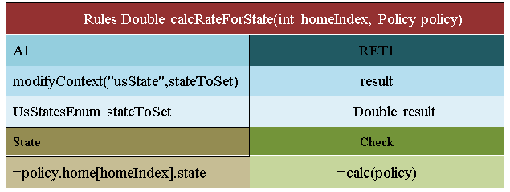

## Working with Projects

This chapter describes creating an OpenL Tablets project. For more information on projects, see [Projects](#projects).

The following topics are included in this chapter:

-   [Project Structure](#project-structure)
-   [Rules Runtime Context Management from Rules](#rules-runtime-context-management-from-rules)
-   [Project, Module, and Rule Dependencies](#project-module-and-rule-dependencies)
-   [Project Localization](#project-localization)

### Project Structure

The best way to use the OpenL Tablets rule technology in a solution is to create an OpenL Tablets project in OpenL Studio. A typical OpenL Tablets project contains Excel files which are physical storage of rules and data in the form of tables. No Excel functionality, such as formulas and tab references, is used in OpenL Tablets. On the logical structure level, Excel files represent modules of the project where each Excel file is considered as one module.

When creating a project, the decision if and how to divide tables into one or many Excel files, or modules, is driven by the idea of how to present business logic in the most structural way. Generally, it depends on the project size. For a small project, all tables can fit in one file. For a bigger sized project, it is a good practice to divide tables per file according to their business purposes: datatype tables in one file, lookup tables in another file, decision tables and spreadsheet tables in the third file, and tests in the fourth file and so on. The number of files, or module, per project is unlimited.

Additionally, a project can contain `rules.xml`, Java classes, JAR files, Groovy scripts, according to developer’s needs, and other related documents, such as guides and instructions.

Thereby, the structure can be adjusted according to the developer’s preferences, for example, to comply with the Maven structure.

**Note for experienced users:** The `rules.xml `project file is a rules project descriptor that contains project and configuration details. For instance, a user may redefine a module name there that is the same as a name of the correspoturns a copy of the current runtime context.nding Excel file by default. When updating project details via OpenL Studio, the `rules.xml `file is automatically created or updated accordingly.  
For more information on configuring `rules.xml, `see [OpenL Tablets Developers Guide > Rules Project Descriptor](https://openldocs.readthedocs.io/en/latest/documentation/guides/developer_guide#rules-project-descriptor).

The following topics are included in this section:

-   [Multi Module Project](#multi-module-project)
-   [Creating a Project](#creating-a-project)
-   [Project Sources](#project-sources)

#### Multi Module Project

Projects with several rule modules are called **multi module projects.** All modules inside one project have mutual access to each other's tables. It means that a rule or table of a module of a project is accessible and can be referenced and used from any rule of any module of the same project.

When there are many modules, OpenL Tablets engine may start processing modules from any of them. That is why it is important to specify the root file and compilation order of modules in a project. For this purpose, **module dependencies** are used.

To run a rule table from another project, connect projects by dependencies as described in [Project, Module, and Rule Dependencies](#project-module-and-rule-dependencies).

#### Creating a Project

The simplest way to create an OpenL Tablets project is to create a project from template in the installed OpenL Studio.

A new project is created containing simple template files that users can apply as the basis for a custom rule solution.

#### Project Sources

Project sources can be added from developer created artifacts, such as jars, Java classes, and Groovy scripts, which contain a reference to the folder with additional compiled classes to be imported by the module. For that, a rules project must contain the `rules.xml` file created in the project root folder.

Saved classpath is automatically added to the `rules.xml` file. After that, classpath can be used in rules. Classpath can indicate both specific jar and folder with libraries. The asterisk \* symbol can be used for the varying part in the classpath.


*Classpath description in the rules.xml*

To use a classpath in dependent projects, place a common classpath inside the main dependency project and then reuse it in all dependent projects.

**Note**: All sources defined for the project are loaded by the same source loader classloader. In other words, Java classes or Groovy scripts from one source can be used by classes or Groovy script from another source. Datatype classes or any other classes generated by rules are not visible in source loader classloader. In other words, any classes generated by rules are not visible in Java classes or Groovy script loaded by source loader classloader but can be loaded via Java reflection via the current thread classloader.

### Rules Runtime Context Management from Rules

The following additional internal methods for modification, retrieving, and restoring runtime context support work with runtime context from OpenL Tablets rules:

| Method                                                   | Description                                                                                                                                                                                                                                                                                                                                                                           |
|----------------------------------------------------------|---------------------------------------------------------------------------------------------------------------------------------------------------------------------------------------------------------------------------------------------------------------------------------------------------------------------------------------------------------------------------------------|
| getContext()                                             | Returns a copy of the current runtime context. <br/> <br/>*Using the getContext function in a method*                                                                                                                                                                                                                                 |
| emptyContext()                                           | Returns new empty runtime context.                                                                                                                                                                                                                                                                                                                                                    |
| setContext(IRulesRuntimeContext context)                 | Replaces the current runtime context with the specified one.                                                                                                                                                                                                                                                                                                                          |
| modifyContext(String propertyName, Object propertyValue) | Modifies the current context by one property: adds a new one or replaces by specified <br/>if property with such a name already exists in the current context. <br/> <br/>*Using modifyContext in a rules table* <br/><br/>**Note:** All properties from the current context remain available after modification, <br/>so it is only one property update. |
| restoreContext()                                         | Discharges the last changes in runtime context. <br/>The context is rolled back to the state before the last **setContext** or **modifyContext**. <br/> <br/>*Using restoreContext in a method table*                                                                                                                                      |

**ATTENTION:** All changes and rollbacks must be controlled manually: all changes applied to runtime context will remain after rule execution. Make sure that the changed context is restored after the rule is executed to prevent unexpected behavior of rules caused by unrestored context.

**Note:** The `org.openl.rules.context` package must be imported as illustrated in the following figure so that a user can work with runtime context from rules:


### Project, Module, and Rule Dependencies

**Dependencies** provide more flexibility and convenience. They may divide rules into different modules and structure them in a project or add other related projects to the current one. For example, if a user has several projects with different modules, all user projects share the same domain model or use similar helpers rules, and to avoid rules duplication, put the common rules and data to a separate module and add this module as dependency for all required modules.

| Term               | Description                                                                                                                          |
|--------------------|--------------------------------------------------------------------------------------------------------------------------------------|
| Dependency module  | Module that is used as a dependency.                                                                                                 |
| Dependency project | Project that is used as a dependency.                                                                                                |
| Root module        | Module that has dependency declaration, explicit via environment or implicit via project dependency, to replace with another module. |
| Root project       | Project that has dependency declaration to replace with another project.                                                             |

The following topics are included in this section:

-   [Dependencies Description](#dependencies-description)
-   [Dependencies Configuration](#dependencies-configuration)
-   [Import Configuration](#import-configuration)
-   [Components Behavior](#components-behavior)

#### Dependencies Description

The **module dependency** feature allows making a hierarchy of modules when rules of one module depend on rules of another module. As mentioned before, all modules of one project have mutual access to each other's tables. Therefore, module dependencies are intended to order them in the project if it is required for compilation purposes. Module dependencies are commonly established among modules of the same project. An exception is as follows.

The following diagram illustrates a project in which the content of **Module_1** and **Module_2** depends on the content of **Module_3**, where thin black arrows are module dependencies:
  

  
*Example of a project with modules hierarchy*

In addition, **project dependency** enables accessing modules of other projects from the current one:


  
*Example of a project dependency with all modules*

The previous diagram displays that any module of **Project1** can execute any table of any module of **Project2**: thick gray arrow with the **All Modules** label is a project dependency with all dependency project modules included. This is equivalent to the following schema when each module of **Project1** has implicit dependency declaration to each module of **Project2**:


  
*Interpretation of a project dependency (with all modules)*

The project dependency with the **All Modules** setting switched on provides access to any module of a dependency project from the current root project.

Users may combine module and project dependencies if only a particular module of another project must be used. An example is as follows:


  
*Example of a project and module dependencies combined*

In the example, for defined external **Project2**, only the content of **Module2_2** is accessible from **Project1**: thick gray arrow without label is a project dependency which defines other projects where dependency module can be located.

If the project dependency does not have the **All Modules** setting enabled, dependencies are determined on the module level, and such project dependencies serve the isolation purpose thus enabling getting a dependency module from particular external projects.


*Defining dependencies for projects in OpenL Studio*

After adding a dependency, all its rules, data fields, and data types are accessible from the root module. The root module can call dependency rules.

Dependencies can also be used to call a specific rule from another project that have a similar structure or similar approach to rules model naming, for example, datatype table naming or using rules with the same or similar signature. To add a dependency rule, use the following syntax:

```
`Project`.tableName()
`Project/module`.tableName()
```

`Project`.tableName() must be used if the table name is unique within the whole project.
`Project/module`.tableName() must be used if the table name is not unique among the modules.


*Example of calling a rule from another project*

This syntax is applicable when there is a dependency on a project and the **All Modules** option is disabled. It allows accessing a specific rule of a different project while all the other tables remain invisible.

#### Dependencies Configuration

This section describes dependencies configuration.

1.  To add a dependency to a module, add the instruction to a configuration table as described in [Configuration Table](#configuration-table) using the **dependency** command and the name of the module to be added.
    
    A module can contain any number of dependencies. Dependency modules can also have dependencies. Avoid using cyclic dependencies.
    
    
    
    *Example of configuring module dependencies*
     
1.  To configure a project dependency, in a rules project descriptor, in the `rules.xml` file created in the project root folder, in the **Dependency** section, for the **name** tag used for defining the dependency project name, set the **autoIncluded** tag to **true** or **false**.
    
    
    
    *Example of configuring project dependencies – fragment of rules.xml*

For more information on configuring rules.xml, see [OpenL Tablets Developers Guide > Rules Project Descriptor](https://openldocs.readthedocs.io/en/latest/documentation/guides/developer_guide#rules-project-descriptor).

By a business user, project dependencies are easily set and updated in OpenL Studio as described in [OpenL Studio Guide > Defining Project Dependencies](https://openldocs.readthedocs.io/en/latest/documentation/guides/webstudio_user_guide#defining-project-dependencies).

A project can contain any number of dependencies. Dependency projects may also have dependencies. Avoid cyclic dependencies.

When OpenL Tablets is processing a module, if there is any dependency declaration, it is loaded and compiled before the root module. When all required dependencies are successfully compiled, OpenL Tablets compiles the root module with awareness about rules and data from dependencies.

#### Import Configuration

Using import instructions allows adding external rules and data types from developer created artifacts, such as jars, Java classes, and Groovy scripts, located outside the Excel based rule tables. In the import instruction, list all Java packages, Java classes, and libraries that must become accessible in the module.

Import configuration is defined using the **Environment** table as described in [Configuration Table](#configuration-table). Configuration can be made for any user mode, single-user mode or multi-user mode. For proper import configuration, classpath must be registered in project sources as described in [Project Sources](#project-sources).

In the following example, the **Environment** table contains an import section with reference to the corresponding Java package:


*Example of configuring module import*

**Note:** For importing packages or classes, the same syntax is used. Firstly, OpenL Tablets tries to import the specified class. If it is not found, the system identifies it as a package and imports all classes from the specified package.

To import the library to the module, the following syntax is used:

```
org.packagename.ClassName.*
```

It adds all static methods from the corresponding class. A user can call these methods inside OpenL rules directly without indicating the class name. An example is using `rotate(str, shift)` instead of `StringUtils.rotate(str, shift)`.

Common Java imports can be placed only into the main, or dependency, project or module. When working with a dependent project, there is no need to specify **Import** in this project. Import data is retrieved directly from the dependency project. Dependency instruction makes all import instructions applied to the dependent module.

#### Components Behavior

All OpenL Tablets components can be divided into three types:

-   Rules in rule tables as described in [Decision Table](#decision-table), [Spreadsheet Table](#spreadsheet-table), [Method Table](#method-table), [TBasic Table](#tbasic-table).
-   Data in data tables as described in [Data table](#data-table).
-   Data types in data type tables as described in [Datatype Table](#datatype-table).

The following table describes behavior of different OpenL Tablets components in dependency infrastructure:

| Operations or components                                      | Rules                                                                                                                                                                                                                                                                                                                                                                                                                                          | Datatypes                                                | Data                                                     |
|---------------------------------------------------------------|------------------------------------------------------------------------------------------------------------------------------------------------------------------------------------------------------------------------------------------------------------------------------------------------------------------------------------------------------------------------------------------------------------------------------------------------|----------------------------------------------------------|----------------------------------------------------------|
| Can access components in a <br/>root module from dependency.       | Yes.                                                                                                                                                                                                                                                                                                                                                                                                                                           | Yes.                                                     | Yes.                                                     |
| Both root and dependency <br/>modules contain <br/>a similar component. | 1. Rules with the same signature and without <br/>dimension properties: duplicate exception. <br/>2. Methods with the same signature <br/>and with a number of dimension properties: <br/>wrapped by Method Dispatcher.<br/>At runtime, a method that matches the runtime<br/> context properties is executed. <br/>3. Methods with the same signature and with <br/>property active: <br/>only one table can be set to true. <br/>Appropriate validation checks <br/>this case at compilation time. | Duplicate exception.                                     | Duplicate exception.                                     |
| None of root and dependency <br/>modules contain the component.    | **There is no such method** <br/>exception during compilation.                                                                                                                                                                                                                                                                                                                                                                                      | **There is no such data type** <br/>exception during compilation. | **There is no such field** <br/>exception during compilation. |
  

### Project Localization
  
This section introduces project localization and describes how to enable it in the OpenL Tablets project.
  
#### Introducing Project Localization

To enable the i18n localization, the **msg(String code, Object... params)** function and new **locale** property are introduced.
  
The **msg(String code, Object... params)** function reads localization message bundles in the i18n format. All localization bundles are stored in the OpenL Tablets project, the **i18n** folder. The name of the localization bundle matches the following pattern:
  
`message%locale%.properties` where `%locale%` is a placeholder.

Examples ordered by descending priority are as follows:
  
-   **message_no_NO_NY.properties** – localization bundle for the Norwegian language, Norway country, Nynorsk form.
-   **message_de_LU.properties** – localization bundle for the German language, Luxembourg country.
-   **message_de.properties** – localization bundle for the German language.
-   **message.properties** – default localization bundle applied to all countries and languages. It has the lowest priority.

Localization bundles files are key-value plain text files where keys and values are separated with = character, for example, `greetings = Hello`.

For more information on supported locales, see [JDK 11 Supported Locales](https://www.oracle.com/java/technologies/javase/jdk11-suported-locales.html).

To support the i18n localization, a new **locale** property of the **java.lang.Locale** type is added to IRulesRuntimeContext to support i18n localization. When the **msg(String code, Object... params)** function is invoked, the current locale is retrieved from IRulesRuntimeContext and the list of message bundles is configured based on it.

#### Enabling Localization in the OpenL Tablets Project

To enable location in the OpenL Tablets project, proceed as follows:

1.  In the OpenL Tablets project, create the **i18n** folder.
    
2.  In this folder, create a default **message.properties** file with the following contents:
      
    ```
    greetings = Hello, {0}.
    farewell = Goodbye, {0}.
    inquiry = How are you?
    
    ```
      
    When a default message bundle is created, its messages are translated into various languages. For example, for French, the **message_fr_FR.properties** properties file is created and its contains the following lines:

    ```
    greetings = Bonjour, {0}.
    farewell = Au revoir, {0}.
    inquiry = Comment allez-vous?
    ```
    
    Note that the values on the right are translated while the keys on the left size remain the same. It is important to maintain the keys without alterations as they serve as references when rules retrieve the translated text.
    
3.  Define the required locale in the runtime context property. By default, OpenL Rule Services automatically populates the ‘locale’ context property with the value from the Accept-Language HTTP header in the request (RFC3282). Alternatively, the ‘locale’ context property can be explicitly specified in the request body if needed.

4.  Define a localization message for this locale:
    
    ```
    '= msg("greetings", "John Smith") // Bonjour, John Smith
    '= msg("farewell", "John Smith") // Au revoir, John Smith
    '= msg("inquiry") // Comment allez-vous?
    
    ```

In this case, all localization messages are retrieved from **message_fr_FR.properties**. If the locale is set up for another language, for example, **uk_UA**, but the appropriate message bundle is not created, the properties are retrieved from the default file **message.properties**.

**Note: **The **message.properties** file must be encoded using the [UTF-8](https://en.wikipedia.org/wiki/UTF-8) character set. Use the following tool for quick encoding: [https://native2ascii.net/](https://native2ascii.net/).
  
