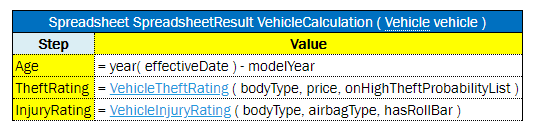
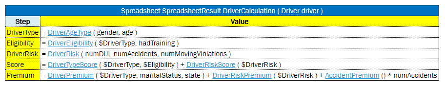

-   array of values
-   custom data type with several attributes
-   other spreadsheets nested in the current one

For this purpose, the same syntax described in [Specifying Data for Aggregated Objects](#specifying-data-for-aggregated-objects) can be used. It also includes simplified options.

```
_res_.$<column name>$<row name>[i]
_res_.$<column name>$<row name>.<attribute name>
_res_.$<column of Main Spreadsheet>$<row of Main Spreadsheet>.$<column of Nested Spreadsheet>$<row of Nested Spreadsheet>
```

\_res_.\$\<column of Main Spreadsheet\>\$\<row of Main Spreadsheet\>[i].\$\<column of Nested Spreadsheet\>\$\<row of Nested Spreadsheet\>

where `i` – sequence number of an element, starts from 0.

Consider an advanced example provided in the following figure. The **PolicyCalculation** spreadsheet table performs lots of calculations regarding an insurance policy, including specific calculations for vehicles and a main driver of the policy. In order to evaluate vehicle and drivers, for example, calculate their score and premium, the **VehicleCalculation** and **DriverCalculation** spreadsheet tables are invoked in cells of the PolicyCalculation rule table.


*Example of the PolicyCalculation spreadsheet table*



*Example of the VehicleCalculation spreadsheet table*



*The advanced sample spreadsheet table*

The structure of the resulting **PolicyCalculation** spreadsheet is rather complex. Any cell of the result can be tested as illustrated in the **PolicyCalculationTest** test table.


*Test for the advanced sample spreadsheet table*

To test a spreadsheet that returns a single value, use the same logic as for decision tables.

#### TBasic Table

A **TBasic** table is used for code development in a more convenient and structured way rather than using Java or Business User Language (BUL). It has several clearly defined structural components. Using Excel cells, fonts, and named code column segments provides clearer definition of complex algorithms.

**Important:** As this table type is Java code related, TBasic table must not be used unless there is a critical need for it and no other table type can represent the logic in a simpler way more comprehensive for business users.

In a definite UI, it can be used as a workflow component.

The format of the TBasic table header is as follows:

```
TBasic <ReturnType> <TechnicalName> (ARGUMENTS)
```

The following table describes the TBasic table header syntax:

| Element       | Description                                       |
|---------------|---------------------------------------------------|
| TBasic        | Reserved word that defines the type of the table. |
| ReturnType    | Type of the return value.                         |
| TechnicalName | Algorithm name.                                   |
| ARGUMENTS     | Input arguments as for any executable table.      |

The following table explains the recommended parts of the structured algorithm:

| **Element**                             | **Description**                                                 |
|-----------------------------------------|-----------------------------------------------------------------|
| Algorithm precondition or preprocessing | Executed when the component starts execution.                   |
| Algorithm steps                         | Represents the main logic of the component.                     |
| Postprocess                             | Identifies a part executed when the algorithm part is executed. |
| User functions and subroutines          | Contains user functions definition and subroutines.             |

#### Column Match Table

A **column match** table has an attached algorithm. The algorithm denotes the table content and how the return value is calculated. Usually, this type of table is referred to as a **decision tree**.

The format of the column match table header is as follows:

```
ColumnMatch <ALGORITHM> <return type> <table name> (<input parameters>)
```

The following table describes the column match table header syntax:

| Element              | Description                                       |
|----------------------|---------------------------------------------------|
| ColumnMatch          | Reserved word that defines the type of the table. |
| \<ALGORITHM\>        | Name of the algorithm. This value is optional.    |
| \<return type\>      | Type of the return value.                         |
| \<table name\>       | Valid name of the table.                          |
| \<input parameters\> | Input parameters as for any executable table.     |

The following predefined algorithms are available:

| Element  | Reference                                 |
|----------|-------------------------------------------|
