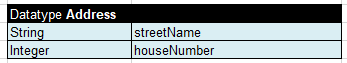

*Datatype table containing value \_DEFAULT\_*

FinancialData refers to the FinancialData data type for default values.


*Datatype table with defined default values*

During execution, the system takes default values from FinancialData data type.


*Datatype table with default values*

**Note:** For array types \_DEFAULT_creates an empty array.

**Note:** It is strongly recommended to leave an empty column right after the third column with default values if such column is used. Otherwise, in case the data type has 3 or less attributes, errors occur due to transposed tables support in OpenL Tablets.


*Datatype table with comments nearby*

**Note:** A default value can be defined for String fields of the Datatype table by assigning the "" empty string.

For more information on using runtime context properties in Datatype tables, see [Runtime Context Properties in Datatype Tables](#runtime-context-properties-in-datatype-tables).

Datatype table output results can be customized the same way as spreadsheets as described in [Spreadsheet Result Output Customization](#spreadsheet-result-output-customization).
  
If a spreadsheet returns a data type rather than SpreadsheetResult and the attributes of this data type must be filtered, that is, included or excluded from the final output structure, attributes of this data type must be marked with ~ or *. An example is available in [Introducing Datatype Tables](https://openldocs.readthedocs.io/en/latest/documentation/guides/reference_guide/#introducing-datatype-tables).
  


*Filtering data type attributes for the output structure*

##### Inheritance in Data Types

In OpenL Tablets, one data type can be inherited from another one.

A new data type that inherits from another one contains all fields defined in the parent data type. If a child data type defines fields that are already defined in the parent data type, warnings, or errors, if the same field is declared with different types in the child and the parent data type, are displayed.

To specify inheritance, the following header format is used in the Datatype table:

`Datatype <TypeName> extends <ParentTypeName>`

##### Vocabulary Data Types

**Vocabulary data types** are used to define a list of possible values for a particular data type, that is, to create a vocabulary for data.

The vocabulary data type is created as follows:

1.  The first row is the header.
    
    It starts with the **Datatype** keyword, followed by the vocabulary data type name. The predefined data type is in angle brackets based on which the vocabulary data type is created at the end.
    
1.  The second and following rows list values of the vocabulary data type.
    
    The values can be of the indicated predefined data type only.

In the example described in [Introducing Datatype Tables](#introducing-datatype-tables), the data type **Person** has an attribute **gender** of the **Gender** data type which is the following vocabulary data type.


*Example of vocabulary datatype table with String parameters*

Thus, data of Gender data type can only be **Male** or **Female**.

OpenL Tablets checks all data of the vocabulary data type one whether its value is in the defined list of possible values. If the value is outside of the valid domain, or defined vocabulary, OpenL Tablets displays an appropriate error. Usage of vocabulary data types provides data integrity and allows users to avoid accidental mistakes in rules.

#### Data Table

A **data table** contains relational data that can be referenced by its table name from other OpenL Tablets tables or Java code as an array of data.

Data tables are widely used during testing rules process when a user defines all input test data in data tables and reuses them in several test tables of a project by referencing the data table from test tables. As a result, different tests use the same data tables to define input parameter values, for example, to avoid duplicating data.

Data tables can contain data types supported by OpenL Tablets or types loaded in OpenL Tablets from other sources. For more information on data types, see [Datatype Table](#datatype-table) and [Working with Data Types](#working-with-data-types).

The following topics are included in this section:

-   [Using Simple Data Tables](#using-simple-data-tables)
-   [Using Advanced Data Tables](#using-advanced-data-tables)
-   [Specifying Data in Data Tables with List and Map Fields](#specifying-data-in-data-tables-with-list-and-map-fields)
-   [Specifying Data for Aggregated Objects](#specifying-data-for-aggregated-objects)
-   [Ensuring Data Integrity](#ensuring-data-integrity)

##### Using Simple Data Tables

Simple data tables define a list of values of data types that have a simple structure.

1.  The first row is the header of the following format:
    
    `Data <data type> <data table name>`
    
    where data type is a type of data the table contains, it can be any predefined or vocabulary data type. For more information on predefined and vocabulary data types, refer to [Working with Data Types](#working-with-data-types) and [Datatype Table](#datatype-table).
    
1.  The second row is a keyword **this**.
2.  The third row is a descriptive table name intended for business users.
3.  In the fourth and following rows, values of data are provided.

An example of a data table containing an array of numbers is as follows.


*Simple data table*

##### Using Advanced Data Tables

Advanced data tables are used for storing information of a complex structure, such as custom data types and arrays. For more information on data types, see [Datatype Table](#datatype-table).

1.  The first row of an advanced data table contains text in the following format:
    
    `Data <data type> <data table name>`
   
1.  Each cell in the second row contains an attribute name of the data type.
    
    For an array of objects, the [i] syntax can be used to define an array of simple datatypes, and [i]. \<attributeName\> to define an array of custom datatypes.
    
1.  The third row contains attribute display names.
2.  Each row starting from the fourth one contains values for specific data rows.

The following diagram displays a datatype table and a corresponding data table with concrete values below it.


*Datatype table and a corresponding data table*

**Note:** There can be blank cells left in data rows of the table. In this case, OpenL Tablets considers such data as non-existent for the row and does not initialize any value for it, that is, there will be a **null** value for attributes or even **null** for the array of values if all corresponding cells for them are left blank.

There might be a situation when a user needs a Data table column with unique values, while other columns contain values that are not unique. In this case, add a column with the predefined \_PK\_ attribute name, standing for the primary key. It is called an **explicit definition** of the primary key.


*A Data table with unique \_PK\_ column*

If the \_PK\_ column is not defined, the first column of the table is used as a primary key. This is called an **implicit definition** of the primary key.


*Referring from one Data table to another using a primary key*

A user can call any value from a data table using the following syntax:

```
<datatable name>[<number of row>] Example: testcars[0]
<datatable name>["<value of PK>"] Example: testcars["BMW 35"]
```

##### Specifying Data in Data Tables with List and Map Fields

A **list** represents an ordered sequence of objects. Unlike array, a list can contain elements of any type.
A **map** is a collection of key-value pairs. Each element of the map always has two values, a key and a value.

To define data table for lists and maps, use the following syntax:

-   for lists, [i]:\<element datatype\>
    
    [i] is order number
    
-   for maps, [“key”]:\<element datatype\>

If a datatype table field is a list or a map, use the following syntax:

-   for lists, \<attribute name\>[i]:\<element datatype\>
-   for maps, \<attribute name\>[“key”]:\<element datatype\>

An example of the data table with a list of values used for zip codes is as follows:


*Data table using a list field defined in the datatype table*

Values of the list type can also be defined as a comma-separated list.

An example of the datatype table for this data table is as follows:


*Datatype table with a list field*

An example of the data table with a map of values used for zip codes is as follows:


*Data table for the Map data type containing an aggregated object*

An example of the datatype table for this table is as follows:



*A datatype table for the address custom data type*

##### Specifying Data for Aggregated Objects

Assume that the data, which values are to be specified and stored in a data table, is an object of a complex structure with an attribute that is another complex object. The object that includes another object is called an **aggregated object**. To specify an attribute of an aggregated object in a data table, the following name chain format must be used in the row containing data table attribute names:

`<attribute name of aggregated object>.<attribute name of object>`

To illustrate this approach, assume there are two data types, `ZipCode` and `Address,` defined:


*Complex data types defined by Datatype tables*

In the data type structure, the `Address` data type contains a reference to the `ZipCode` data type as its attribute `zip`. An example of a data table that specifies values for both data types at the same time is as follows.


*Specifying values for aggregated objects*

In the preceding example, columns **Zip1** and **Zip2** contain values for the `ZipCode` data type referenced by the `Address` aggregated data type.

**Note:** The attribute name chain can be of any arbitrary depth, for example, `account.person.address.street`.

If a data table must store information for an array of objects, OpenL Tablets allows defining attribute values for each element of an array.

**The first option** is to use the following format in the row of data table attribute names:

`<attribute name of aggregated object>[i].<attribute name of object>`

where `i` – sequence number of an element, starts from 0.

The following example illustrates this approach.


*Specifying values for an array of aggregated objects using the flatten structure*

The first policy, **Policy1**, contains two vehicles: **Honda Odyssey** and **Ford C-Max**; the second policy, **Policy2**, contains the only vehicle **Toyota Camry**; the third policy, **Policy3**, contains two vehicles: **VW Bug** and **Mazda 3**.

**Note:** The approach is valid for simple cases with an array of simple data type values, and for complex cases with a nested array of an array, for example, `policy.vehicles[0].coverages[2].limit`.

**The second option** is to leave the format as is, omitting the [] syntax in column definition  
