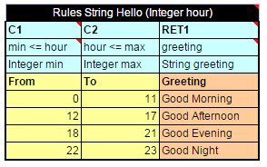
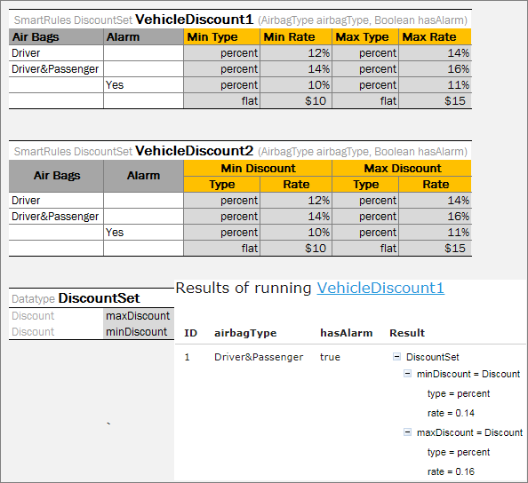
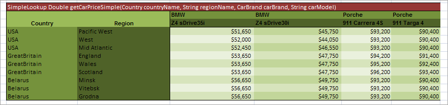
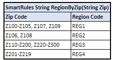
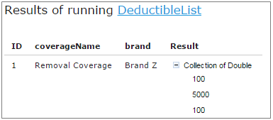
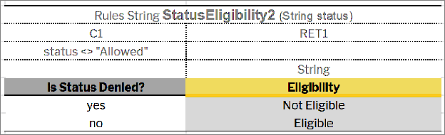
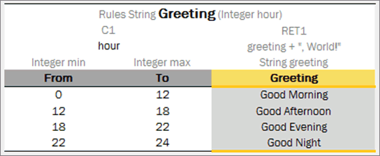
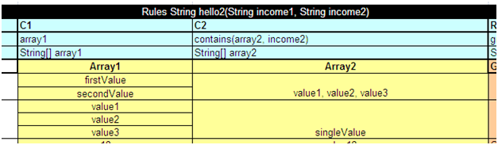
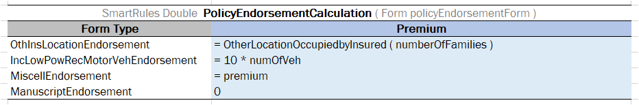
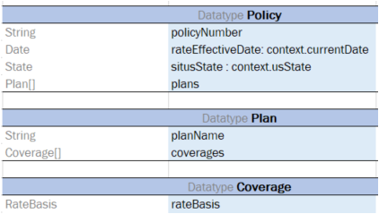

1.  The engine looks into each spreadsheet and tries to identify logical tables.
    
    Logical tables must be separated by at least one empty row or column or start at the very first row or column. Table parsing is performed from left to right and from top to bottom. The first populated cell that does not belong to a previously parsed table becomes the top-left corner of a new logical table.
    
1.  The engine reads text in the top left cell of a recognized logical table to determine its type.
    
    If the top left cell of a table starts with a predefined keyword, such table is recognized as an OpenL Tablets table.
    
    The following are the supported keywords:
    
    | Keyword               | Table type                                  |
    |-----------------------|---------------------------------------------|
    | Constants           | [Constants Table](#constants-table)        |
    | ColumnMatch         | [Column Match Table](#column-match-table)   |
    | Data                | [Data Table](#data-table)                  |
    | Datatype            | [Datatype Table](#datatype-table)           |
    | Environment         | [Configuration Table](#configuration-table) |
    | Method              | [Method Table](#method-table)               |
    | Properties          | [Properties Table](#properties-table)       |
    | Rules               | [Decision Table](#decision-table)           |
    | Run                 | [Run Table](#run-table)                    |
    | SimpleLookup        | [Simple Lookup Table](#simple-lookup-table) |
    | SimpleRules         | [Simple Rules Table](#simple-rules-table)   |
    | SmartLookup         | [Smart Lookup Table](#smart-lookup-table)   |
    | SmartRules          | [Smart Rules Table](#smart-rules-table)    |
    | Spreadsheet         | [Spreadsheet Table](#spreadsheet-table)     |
    | TablePart           | [Table Part](#table-part)                   |
    | TBasic or Algorithm | [TBasic Table](#tbasic-table)               |
    | Test                | [Test Table](#test-table)                  |
    
    All tables that do not have any of the preceding keywords in the top left cell are ignored. They can be used as comments in Excel files.
    
1.  The engine determines the width and height of the table using populated cells as clues.

It is a good practice to merge all cells in the first table row, so the first row explicitly specifies the table width. The first row is called the table **header**.

**Note:** To put a table title before the header row, an empty row must be used between the title and the first row of the actual table.

### Naming Conventions

The following conventions apply to the rule, field, and function names:

-   The first character of the name must be **Java letter,** that is, a Unicode character, underscore, or dollar sign.
-   The name must consist of Java letters and Java digits.

A **Java digit** is a collection of numbers from 0 to 9.

*Examples of correct and incorrect rule table names*

### Table Types

OpenL Tablets supports the following table types:

-   [Decision Table](#decision-table)
-   [Datatype Table](#datatype-table)
-   [Data Table](#data-table)
-   [Test Table](#test-table)
-   [Run Table](#run-table)
-   [Method Table](#method-table)
-   [Configuration Table](#configuration-table)
-   [Properties Table](#properties-table)
-   [Spreadsheet Table](#spreadsheet-table)
-   [TBasic Table](#tbasic-table)
-   [Column Match Table](#column-match-table)
-   [Constants Table](#constants-table)
-   [Table Part](#table-part)

#### Decision Table

A **decision table** contains a set of rules describing decision situations where the state of a number of conditions determines execution of a set of actions and returned value. It is a basic table type used in OpenL Tablets decision making.

*Decision table example*

The following topics are included in this section:

-   [Decision Table Structure](#decision-table-structure)
-   [Decision Table Interpretation](#decision-table-interpretation)
-   [Simple and Smart Rules Tables](#simple-and-smart-rules-tables)
-   [Simple and Smart Lookup Tables](#simple-and-smart-lookup-tables)
-   [External Tables Usage in Smart Decision Tables](#external-tables-usage-in-smart-decision-tables)
-   [Ranges and Arrays in Smart and Simple Decision Tables](#ranges-and-arrays-in-smart-and-simple-decision-tables)
-   [Rules Tables](#rules-tables)
-   [Collecting Results in Decision Table](#collecting-results-in-decision-table)
-   [Local Parameters in Decision Table](#local-parameters-in-decision-table)
-   [Transposed Decision Tables](#transposed-decision-tables)
-   [Representing Values of Different Types](#representing-values-of-different-types)
-   [Using Calculations in Table Cells](#using-calculations-in-table-cells)
-   [Referencing Attributes](#referencing-attributes)
-   [Calling a Table from Another Table](#calling-a-table-from-another-table)
-   [Using Referents from Return Column Cells](#using-referents-from-return-column-cells)
-   [Using Rule Names and Rule Numbers in the Return Column](#using-rule-names-and-rule-numbers-in-the-return-column)
-   [Using References to Expressions](#using-references-to-expressions)

##### Decision Table Structure

An example of a decision table is as follows:

*Decision table*

The following table describes the full structure of a decision table with the **Rules** keyword:

| Row  number  | Mandatory | Description                                                                                                                                                                                                                                                                                                                                                                                                                                                                                                                                                                                                                                                                                                                                                                                                                                                                                                                                                                                                                                                                                                                                                                                                                                                                                                                                                                                                                                                                                                                                                                                                                                                                                                                                                         |
|-------------|-----------|---------------------------------------------------------------------------------------------------------------------------------------------------------------------------------------------------------------------------------------------------------------------------------------------------------------------------------------------------------------------------------------------------------------------------------------------------------------------------------------------------------------------------------------------------------------------------------------------------------------------------------------------------------------------------------------------------------------------------------------------------------------------------------------------------------------------------------------------------------------------------------------------------------------------------------------------------------------------------------------------------------------------------------------------------------------------------------------------------------------------------------------------------------------------------------------------------------------------------------------------------------------------------------------------------------------------------------------------------------------------------------------------------------------------------------------------------------------------------------------------------------------------------------------------------------------------------------------------------------------------------------------------------------------------------------------------------------------------------------------------------------------------|
| 1           | Yes       | Table header, which has the following pattern: `<keyword> <rule header>` where `<keyword>` is either 'Rules' or 'DT' and `<rule header>` is  a signature of a table with names and types of the rule and its parameters used to access the decision table and provide input parameters.                                                                                                                                                                                                                                                                                                                                                                                                                                                                                                                                                                                                                                                                                                                                                                                                                                                                                                                                                                                                                                                                                                                                                                                                                                                                                                                                                                                                                                                                              |
| 2           | Yes       | Row consisting of the following cell types:   - **Condition column header**  Identifies that the column contains a rule condition and its parameters.  It must start with the “C” character followed by a number or be “MC1” for the 1st column with merged rows.  If the condition has several parameters, the cell must be merged on all its parameter columns.  **Examples**: `C1, C5, C8, MC1`   - **Horizontal condition column header**  Identifies that the column contains a horizontal rule condition and its parameter (horizontal condition can have only one parameter).  It must start with the “HC” character followed by a number. Horizontal conditions are used in lookup tables only.  **Examples**: `HC1, HC5, HC8`   - **Action column header**  Identifies that the column contains rule actions. It must start with the “A” character followed by a number.  **Examples:**` A1, A2, A5`   - **Return value column header**  Identifies that the column contains values to be returned to the calling program.  A table can have multiple return columns, however, only the first fired non-empty value is returned.  **Example:** `RET1`   All other cells in this row are ignored and can be used as comments.  If a table contains action columns, the engine executes actions for all rules with true conditions.  If a table has a return column, the engine stops processing rules after the first executed rule with true conditions and non-empty result found.                                                                                                                                                                                                                                                                                                        |
| 3           | Yes       | Row containing cells with expression statements for condition, action, and return value column headers.  OpenL Tablets supports Java grammar enhanced with OpenL Tablets Business Expression (BEX) grammar features.  For more information on the BEX language, see [Appendix A: BEX Language Overview](#appendix-a-bex-language-overview).   In most cases, OpenL Tablets Business Expression grammar covers all the variety of expression statements  and an OpenL user does not need to learn Java syntax.  The code in these cells can use any objects and functions visible to the OpenL Tablets engine as elsewhere.  For more information on enabling the OpenL Tablets engine to use custom Java packages, see [Configuration Table](#configuration-table).   Purpose of each cell in this row depends on the cell above is as follows:   - **Condition column header**  Specifies the logical expression of the condition. It can reference parameters in the table header and parameters in cells below.  The cell can contain several expressions, but the last expression must return a Boolean value.  All condition expressions must be true to execute a rule.   - **Horizontal condition**  The same as **Condition column header.**   - **Action column header**  Specifies expression to be executed if all conditions of the rule are true.  The expression can reference parameters in the rule header and parameters in the cells below.   - **Return value column header**  Specifies expression used for calculating the return value.  The type of the last expression must match the return value specified in the rule header.  The explicit return statement with the keyword “return” is also supported.  This cell can reference parameters in the rule header and parameters in the cells below. |
| 4           | Yes       | Row containing parameter definition cells. Each cell in this row specifies the type and name of parameters in the cells below it.  Parameter name must be one word long.  Parameter type must be one of the following: simple data types aggregated data types or Java classes visible to the engine arrays  of the above types as described in [Representing Arrays](#representing-arrays).                                                                                                                                                                                                                                                                                                                                                                                                                                                                                                                                                                                                                                                                                                                                                                                                                                                                                                                                                                                                                                                                                                                                                                                                                                                                                                                                                                            |
| 5           | Yes       | Descriptive column titles. The rule engine does not use them in calculations but they are intended for business users working with the table.  Cells in this row can contain any arbitrary text and be of any layout that does not correspond to other table parts.  The height of the row is determined by the first cell in the row.                                                                                                                                                                                                                                                                                                                                                                                                                                                                                                                                                                                                                                                                                                                                                                                                                                                                                                                                                                                                                                                                                                                                                                                                                                                                                                                                                                                                                                |
| 6 and  below | Yes       | Concrete parameter values. Any cell can contain formula, a mathematical one or a rule call, instead of concrete value and calculate the value.  This formula can reference parameters in the rule header and any parameters of condition columns in the return column.                                                                                                                                                                                                                                                                                                                                                                                                                                                                                                                                                                                                                                                                                                                                                                                                                                                                                                                                                                                                                                                                                                                                                                                                                                                                                                                                                                                                                                                                                               |

A user can merge cells of parameter values to substitute multiple single cells when the same value needs to be defined in these single cells. During rule execution, OpenL Tables unmerges these cells.

The additional **Rule** column with merged cells is used as the first column when the return value must be a list of values written in multiple rows of the same column, that is, a vertically arranged array. The Rule column determines the height of the result value list.

*A table with the Rule column as the first column*

*Result in the vertically arranged array format*

The rule column can be defined for rules tables and smart rules tables.

##### Decision Table Interpretation

Rules inside decision tables are processed one by one in the order they are placed in the table. A rule is executed only when all its conditions are true. If at least one condition returns false, all other conditions in the same row are ignored.

Blank parameter value cell of the condition is interpreted as a true condition and this condition is ignored for a particular rule row or column. If the condition column has several parameters, the condition with all its parameter cells blank is interpreted as a true condition.

**Note:** As OpenL Tablets returns the first true condition, it is a good practice to list all possible non-blank parameters and their combinations in case of multiple conditioning first, and then list the blank parameters.

Blank parameter value cell of the return/action column is ignored, the system does not calculate the return/action expression of the current rule and starts processing the next rule. If the return/action column has several parameters, all parameters cells need to be blank to ignore the rule.

If the empty return value is calculated by the expression, the system starts processing the next rule searching for a non-empty result.

The following example contains empty case interpretation. For **Senior Driver**, the marital status of the driver does not matter. Although there is no combination of **Senior Driver** and **Single** mode, the result value is 500 as for an empty marital status value.

*Empty case interpretation in the Decision table*

##### Simple and Smart Rules Tables

Practice shows that most of decision tables have a simple structure: there are conditions for input parameters of a decision table that check equality of input and condition values, and a return value. Because of this, OpenL Tablets have simplified decision table representations. A simplified decision table allows skipping condition and return columns declarations, and thus the table consists of a header, column titles and condition and return values, and, optionally, properties.

The following topics are included in this section:

-   [Simple Rules Table](#simple-rules-table)
-   [Smart Rules Table](#smart-rules-table)
-   [Multiple Return Columns in Smart Rules Tables](#multiple-return-columns-in-smart-rules-tables)
-   [Result of Custom Data Type in Smart and Simple Rules Tables](#result-of-custom-data-type-in-smart-and-simple-rules-tables)

###### Simple Rules Table

A simplified decision table which has simple conditions for each parameter and a simple return can be easily represented as a **simple rules table**.

Unlike smart rules, a simple rule table uses all input parameters to associate them with condition columns in strict order, determined by simple logic, and using no titles. The value of the first column is compared with the value of the first input parameter, and so on. The value of the last column (return column) returns as a result. This means that input parameters must be in the same order as the corresponding condition columns, and the number of inputs must be equal to the number of conditions.

The simple rules table header format is as follows:

`SimpleRules <Return type> RuleName(<Parameter type 1> parameterName1, (<Parameter type 2> parameterName 2….)`

The following is an example of a simple rules table header:

*Simple rules table example*

**Note:** If a string value contains a comma, the value must be delimited with the backslash (\\) separator followed by a comma. Otherwise, it is treated as an array of string elements as described in [Ranges and Arrays in Smart and Simple Decision Tables](#ranges-and-arrays-in-smart-and-simple-decision-tables).

Restrictions for a simplified decision table are as follows:

-   Condition values must be of the same type or be an array or range of the same type as corresponding input parameters.
-   Return values must have the type of the return type from the decision table header.

###### Smart Rules Table

A decision table which has simple conditions for input parameters and a direct return (without expression) can be easily represented as a **smart rules table**. Comparing to a simple rules table, a smart rules table type is used more frequently because smart rules are more flexible and cover wider range of business requirements.

The smart rules table header format is as follows:

`SmartRules <Return type> RuleName(<Parameter type 1> parameterName1, (<Parameter type 2> parameterName 2…)`

*Smart rules table with simple return value*

OpenL Tablets identifies which condition сolumns correspond to which input parameters by condition titles and parameter names. First of all, OpenL parses a parameter name and splits it into words, as it interprets a part starting with a capital letter as a separate word. Then it calculates the percentage of matching words in all columns and selects the column with the highest percentage of coincidence. If the analysis returns more than one result, OpenL throws an error and requires a more unique name for the column.

**Note:** OpenL Tablets matches input parameters or its fields to the conditions columns using the score. The score is calculated based on words used in parameter naming. If the particular parameter has the highest score for the particular condition, matching occurs. If several parameters have the same score, the system displays a warning message “Ambiguous matching of column titles to DT columns. Use more appropriate titles.” To overcome this issue and improve matching, use extended names for conditions.

In case of a custom datatype input, OpenL verifies all fields of the input object to match them separately with appropriate conditions using field names, in addition to input names, and column titles.

*Smart rules table with object-input*

OpenL is capable of matching abbreviations as well.

During rules execution, the system checks condition and input values on equality or inclusion and returns the result from the return columns, that is, the last columns identified as the result.

In the example above, the **driverType** value is compared with values from the **Type of Driver** column, the **maritalStatus** value is compared with the **Marital Status** column values, and the value from the **Driver Premium** column is returned as the result.

**Note:** To insure the system checks a condition with an appropriate input parameter, the user can ”hover” with a mouse over the column title and see the hint with this information in OpenL Studio.

If a string value of the condition contains a comma, the value must be delimited with the backslash (\\) separator followed by the comma. Otherwise, it is treated as an array of string elements as described in [Ranges and Arrays in Smart and Simple Decision Tables](#ranges-and-arrays-in-smart-and-simple-decision-tables):

*Comma within a string value in a Smart table*

To define a range of values, two columns of the condition can be merged. In this case, the whole condition is interpreted as` min <= input parameter && input parameter < max`.

*Using min and max values for a range in the condition column*

Special conditions not matching any particular input fields can be used in smart rules tables, for example, for validation rules definition. Column header for such condition must contain the word ‘true’. If there are other condition headers containing the word ‘true’, the name must be explicitly declared as “Is True?”. All values in such column are expressions or Boolean values. Such condition can also be used in the smart lookup tables.

*Example of a condition that is a Boolean expression*

If there is a horizontal condition of the Boolean type and the condition title is not a merged cell, it is preferable to use the title **is true?** instead of **true** because the title can be interpreted as a horizontal condition and cause wrong compilation.

A smart rule table can contain multiple and compound returns as described in [Multiple Return Columns in Smart Rules Tables](#multiple-return-columns-in-smart-rules-tables) and use external tables as described in [External Tables Usage in Smart Decision Tables](#external-tables-usage-in-smart-decision-tables).

###### Multiple Return Columns in Smart Rules Tables

A smart rules table can contain up to three return columns. If the first return column contains a non-empty result, it is returned, otherwise, the next return column is scanned until the non-empty result is found or the last return column is verified.

The following example illustrates a table with multiple return columns.

*Example of a smart rules table with multiple return columns*

In this example, the **QuoteVolume** rule has one condition, **Coverage Type,** and two return columns, **Volume 1** and **Volume 2.** An example of the test table for this rule table is as follows.

*Example of the test table for a rule table with multiple return columns*

In the test table, **Plan 1** is not of the **Medical** coverage type, so the second rule line is applied. In the test table, for the first test case, both **History Premium** and **History Rate** are provided, so **Volume** is calculated as 480 by the rule of **Volume 1** column. For the second and third test case, one of inputs is missing, so **Volume 1** returns an empty result, and the second return column calls another rule causing the result of 500 returned.

**Note for experienced users:** In case of a complex return object, only one compound return consisting of several return columns is allowed. All other returns can be defined using the formulas, that is, the `new() `operator or by calling another rule that returns the object of the corresponding type. For more information on complex return objects, see [Result of Custom Data Type in Smart and Simple Rules Tables](#result-of-custom-data-type-in-smart-and-simple-rules-tables).

###### Result of Custom Data Type in Smart and Simple Rules Tables

A simplified rules table can return the value of compound type (custom data type) – the whole data object. To accomplish this, the user must make return column titles close to the corresponding fields of the object so the system can associate the data from the return columns with the returned object fields correctly. For more information on datatype tables, see [Datatype Table](#datatype-table).

In the example below, the rule **VehicleDiscount** determines the vehicles’s discount type and rate depending on air bags type and alarm indicator:

*Smart rules table with compound return value*

**Note:** To insure the system matches the return column with an appropriate return object field, the user can ”hover” over the column title and see the hint with this information in OpenL Studio.

**Note:** Return object fields are automatically filled in with input values if the return field name and input field name are matched.

*Return object fields automatically filled in with input values*

If the rule returns the result of a very complex object (with nested objects inside), then there are several options for creating column titles:

-   titles in one row with names that can be matched to the object fields unambiguously (the previously described approach) as shown in the example below, rule **VehicleDiscount1**;
-   titles in several rows to define the hierarcy (structure) of the return object; in this case the user can merge cells associated with fields of a nested object as shown on the example below, rule **VehicleDiscount2**. Using this option, merging condition titles is required.

*Smart rules tables with compound return value*

##### Simple and Smart Lookup Tables

This section introduces lookup tables and includes the following topics:

-   [Understanding Lookup Tables](#understanding-lookup-tables)
-   [Lookup Tables Implementation Details](#lookup-tables-implementation-details)
-   [Simple Lookup Table](#simple-lookup-table)
-   [Smart Lookup Table](#smart-lookup-table)

###### Understanding Lookup Tables

A **lookup table** is a special modification of the decision table which simultaneously contains vertical and horizontal conditions and returns value on crossroads of matching condition values.

That means condition values can appear either on the left of the lookup table or on the top of it. The values on the left are called **vertical** and values on the top are called **horizontal**. Any lookup table must have at least one vertical and at least one horizontal value.

*A lookup table example*

###### Lookup Tables Implementation Details

This section describes internal OpenL Tablets logic.

At first, the table goes through parsing and validation.

-   On parsing, all parts of the table, such as header, columns headers, vertical conditions, horizontal conditions, return column, and their values, are extracted.
-   On validation, OpenL checks if the table structure is proper.

Then OpenL Tablets transforms a lookup table into a regular decision table internally and processes it as a regular decision table.

###### Simple Lookup Table

A lookup decision table with simple conditions that check equality of an input parameter and a condition value and a simple return can be easily represented as **simple lookup table**. This table is similar to simple rules table but has horizontal conditions. The number of parameters to be associated with horizontal conditions is determined by the height of the first column title cell.

The simple lookup table header format is as follows:

`SimpleLookup <Return type> RuleName(<Parameter type 1> parameterName1, (<Parameter type 2> parameterName2,….)`

The following is an example of a simple lookup table.

*Simple lookup table example*

###### Smart Lookup Table

A lookup decision table with simple conditions that check equality or inclusion of an input parameter with a condition value and a direct return (without expression) can be easily represented as a **smart lookup table**. This table resembles a smart rules table but has horizontal conditions.

The smart lookup table header format is as follows:

`SmartLookup <Return type> RuleName(<Parameter type 1> parameterName1, (<Parameter type 2> parameterName2,….)`

*Smart lookup table example*

Condition matching algorithm for smart lookup tables is the same as for smart rules tables. For vertical conditions, the system searches for input parameters suitable by title and then, for horizontal conditions, the system selects input parameters starting with the first of the rest inputs.

Boolean conditions can be used in the smart lookup tables as column headers. For more information on these conditions, see [Smart Rules Table](#smart-rules-table).

The number of horizontal conditions is determined by the height of the first column title cell. This means that title cells of the vertical conditions must be merged on all rows which go for horizontal conditions.

The following is an example of a smart lookup table with several horizontal conditions:

*Smart lookup table with several horizontal conditions*

OpenL Tablets supports titles for horizontal conditions. A horizontal condition title is defined either together with the last vertical condition header, separated by a slash character, or as a separate column after all vertical conditions.

*Slash character in a red cell indicating that the cell contains condition titles for a vertical condition "Rating of Agency" and a horizontal condition "Total Assets*

*Algorithm identifying the third column as horizontal condition titles because the third column values are empty*

If the height of the horizontal condition is 1, and there is a vertical condition with an empty column, the horizontal titles must be started with a slash /.

##### External Tables Usage in Smart Decision Tables

Conditions, returns, and actions declarations can be separated and stored in specific tables and then used in Smart Decision Tables via column titles. It allows using the Smart Table type for Decision rule even in case of the complicated condition or return calculation logic. Another benefit is that condition and return declarations can be reused in several rules, for example, Conditions table as a template. An example is as follows.

*Using external conditions in a smart rules table*

In this example, the first condition definition is taken from a separate Conditions table, an external table, and matched by column titles **Agency** and **Rating of Agency.** In OpenL Studio, such titles have links leading to the corresponding table. Other conditions are matched implicitly with input parameters by their names. In OpenL Studio, such titles have hints with all corresponding information.

Names of external tables have higher priority over input parameters. First of all, the engine checks if an external table with such name exists and if it is not found, the engine treats the column title as an input parameter. In the preceding example, OpenL Tablets first searches for an external table named **Agency** and finds it. Otherwise, the engine would treat **Agency** as input parameter.

External condition/return/action title must exactly match the title of the condition/return/action in the smart decision table. Inputs are matched by smart logic analyzing data types and names. Exact name matching is not required.

The external element table structure is as follows:

1.  The first row is the header containing the keyword, such as **Actions**, **Conditions**, or **Returns**, and optionally the name of the table.
2.  The first column under the header contains keyword, such as **Inputs**, **Expression**, **Parameter**, and **Title.**
3.  Every column, starting from the second one, represents the element, that is, condition, action, and return definition.
    
    Rows with the corresponding keyword contain the following information in the condition, action, and return definition rows:
    
    | **Element** | **Description**                                                                                                                                                                                     |
    |-------------|-------------------------------------------------------------------------------------------------------------------------------------------------------------------------------------------------|
    | Input       | Defines input parameters required for expression calculation of the element. It can be common for several expressions when cells are merged.  Input is optional for **Returns** and **Actions**. |
    | Expression  | Specifies the logical expression of the element. It must be merged accordingly if an element includes several parameters defined below.                                                         |
    | Parameter   | Stores parameter definition of the element.                                                                                                                                                     |
    | Title       | Provides a descriptive column title that is later used in the Smart Decision rule.                                                                                                              |
    
1.  The first column with keywords can be omitted if the default order **Inputs – Expression – Parameter – Title** is used.

##### Ranges and Arrays in Smart and Simple Decision Tables

Range and array data types can be used in simplified and smart rules and lookup tables. If a condition is represented as an array or range, the rule is executed for any value from that array or range. As an example, in the following image, there is the same Car Price for all regions of Belarus and Great Britain, so, using an array, three rows for each of these countries can be replaced by a single one as displayed in the following table.

*Simple lookup table with an array*

If a string value contains a comma, the value must be delimited with the backslash (\\) separator followed by a comma as illustrated for **Driver\\, Passenger\\, Side** in the following example. Otherwise, it is treated as an array of string elements.

*Comma within a string value in a Simple Rule table*

The following example explains how to use a range in a simple rules table.

*Simple rules table with a Range*

OpenL looks through the **Condition** column, that is, **ZIP Code**, meets a range, which is not necessarily the first one, and defines that all the data in the column are IntRange, where Integer is defined in the header, **Integer vehicleZip**.

Simple and smart rules and smart lookup tables support using arrays of ranges. In the following example, the Z100-Z105, Z107, Z109 condition is a string range array where single elements Z107, Z109 are treated by system as ranges Z107-Z107, Z109-Z109.

*Using arrays of ranges in a table*

**Note:** String ranges are only supported in smart rules tables. For more information on range data types in OpenL Tablets, see [Range Data Types](#range-data-types).

##### Rules Tables

A **rules table** is a regular decision table with vertical and optional horizontal conditions where the structure of the condition and return columns is explicitly declared by a user by starting column headers with the characters specific for each column as described in [Decision Table Structure](#decision-table-structure).

By default, each row of the decision table is a separate rule. Even if some cells of condition columns are merged, OpenL Tablets treats them as unmerged. This is the most common scenario.

Vertical conditions are marked with the Cn and MC1 characters. The MC1 column plays the role of the Rule column in a table. It determines the height of the result value list. An example is as follows.

*A Decision table with merged condition values*

Earthquake Coverage for Brand Y and Brand X has a different list of values, so they are not merged although their first condition is the same.

*A list of values as a result*

The horizontal conditions are marked as HC1, HC2 and so on. Every lookup matrix must start from the HC or RET column. The first HC or RET column must go after all vertical conditions, such as C, Rule, and comment columns. There can be no comment column in the horizontal conditions part. The RET section can be placed in any place of the lookup headers row. HC columns do not have the Titles section.

*A lookup table example*

The first cell of column titles must be merged on all rows that contain horizontal condition values. The height of the titles row is determined by the first cell in the row. For example, see the **Country** cell in the previous example.

To use multiple column parameters for a condition, return, or action, merge the column header and expression cells. Use this approach if a condition cannot be presented as a simple AND combination of one-parameter conditions.

*Example of the merged column header and expression cells*

Any type of decision tables described previously, that is, Simple Rules, Smart Rules, Simple Lookup, and Smart Lookup, can be transformed into a Rules table with a detailed condition and return column declaration. Rules table is the most generic but least frequently used table type because other table types have simplified syntax and inbuilt logic satisfying specific business needs in a more user-friendly way.

Colors identify how values are related to conditions. The same table represented as a decision table is as follows:

*Lookup table representation as a decision table*

##### Collecting Results in Decision Table

A decision table returns only the first fired, non-empty result in common case. But there are business cases when all rules in a table must be checked and all results found returned. To do so, use:

-   `Collect` keyword right before `<Return type> `in the table header for Simple and Smart rule table types;
-   `CRET` as the return value column header for a regular decision table type;
-   Define `<Return type> `as an array.

In the example below, rule **InterestTable** returns the list of interest schemes of a particular plan:

*Collecting results in Smart and Simple rule table*

In the following example, rule **PriceTable** collects car price information for desired specified country and/or ”make” of a car:

*Collecting results in regular Decision table*

**Note for experienced users:** Smart and Simple rule tables can return the collection of List, Set, or Collection type. To define a type of a collection element, use the following syntax: `Collect as <Element type> <Collection type> `for example, `SmartRules Collect as String List Greeting (Integer hour).`

##### Local Parameters in Decision Table

When declaring a decision table, the header must contain the following information:

-   column type
-   code snippet
-   declarations of parameters
-   titles

Recent experience shows that in 95% of cases, users add very simple logic within code snippet, such as just access to a field from input parameters. In this case, parameter declaration for a column is useless and can be skipped.

The following topics are included in this section:

-   [Simplified Declarations](#simplified-declarations)
-   [Performance Tips](#performance-tips)

###### Simplified Declarations

**Case\#1**

The following image represents a situation when users must provide an expression and simple equal operation for condition declaration.

*Decision table requiring an expression and simple equal operation for condition declaration*

This code snippet can be simplified as displayed in the following example.

*Simplified decision table*

OpenL Engine creates the required parameter automatically when a user omits parameter declaration with the following information:

1.  The parameter name will be **P1**, where 1 is index of the parameter.
2.  The type of the parameter will be the same as the expression type.

In this example, it will be Boolean.

In the next step, OpenL Tablets will create an appropriate condition evaluator.

**Note:** The parameter name can be omitted in the situation when the `contains(P1, expression value)` operation for condition declaration is to be applied. The type of the parameter must be an array of the expression value type.

*Simplified condition declaration*

**Case\#2**

The following example illustrates the **Greeting** rule with the **min \<= value and value \< max** condition expression.

*The Greeting rule*

Instead of the full expression **min \<= value and value \< max**, a user can simply use **value** and OpenL Tablets automatically recognizes the full condition.

*Simplified Greeting rule*

###### Performance Tips

Time for executing the OpenL Tablets rules heavily depends on complexity of condition expressions. To improve performance, use simple or smart decision table types and simplified condition declarations.

To speed up rules execution, put simple conditions before more complicated ones. In the following example, simple condition is located before a more complicated one.

*Simple condition location*

The main benefit of this approach is performance: expected results are found much faster.

OpenL Tablets enables users to create and maintain tests to ensure reliable work of all rules. A business analyst performs unit and integration tests by creating test tables on rules through OpenL Studio. As a result, fully working rules are created and ready to be used.

For test tables, to test the rule table performance, a business analyst uses the Benchmark functionality. For more information on this functionality, see [OpenL Studio Guide](https://openldocs.readthedocs.io/en/latest/documentation/guides/webstudio_user_guide).

##### Transposed Decision Tables

Sometimes decision tables look more convenient in the transposed format where columns become rows and rows become columns. For example, an initial and transposed version of decision table resembles the following:

*Transposed decision table*

OpenL Tablets automatically detects transposed tables and is able to process them correctly.

##### Representing Values of Different Types

The following sections describe how to present some values – list or range of numbers, dates, logical values – in OpenL table cells. The following topics are included in this section:

-   [Representing Arrays](#representing-arrays)
-   [Representing Date Values](#representing-date-values)
-   [Representing Boolean Values](#representing-boolean-values)
-   [Representing Range Types](#representing-range-types)

###### Representing Arrays

For all tables that have properties of the `enum[]` type or fields of the array type, arrays can be defined as follows:

-   horizontally
-   vertically
-   as comma separated arrays

The first option is to arrange array values horizontally using multiple subcolumns. The following is an example of this approach:

*Arranging array values horizontally*

In this example, the contents of the `set` variable for the first rule are `[1,3,5,7,9],` and for the second rule, `[2,4,6,8]`. Values are read from left to right.

The second option is to present parameter values vertically as follows:

*Arranging array values vertically*

In the second case, the boundaries between rules are determined by the height of the leftmost cell. Therefore, an additional column must be added to the table to specify boundaries between arrays.

In both cases, empty cells are not added to the array.

The third option is to define an array by separating values by a comma. If the value itself contains a comma, it must be escaped using back slash symbol “`\`”` `by putting it before the comma.

*Array values separated by comma*

In this example, the array consists of the following values:

-   test 1
-   test 3, 4
-   test 2

*Array values separated by comma. The second example*

In this example, the array consists of the following values:

-   value1
-   value2
-   value3

Two-dimensional arrays can be used in rules tables, where mixing values and expressions in arrays is allowed. An example is as follows:

*Using two-dimensional arrays in a rules table*

###### Representing Date Values

To represent date values in table cells, either Excel format or one of the following format must be used for the text:
* `<year>-<month>-<date>` (ISO 8601)
* `<month>/<date>/<year>` (US)

Note: In Excel, inputted text can be treated as a date and converted into Excel's date format. To prevent this, it's necessary to precede the text with an apostrophe to signify that it should be treated as text. Excel recognizes these values as simple text and does not automatically convert them into a date format.

The following are valid date value examples:
* `1980-07-12`
* `5/7/1981`
* `10/20/2002`

OpenL Tablets recognizes all Excel date formats.

###### Representing Boolean Values

OpenL Tablets supports either Excel Boolean format or the following formats of Boolean values as a text:

-   true, yes, y
-   false, no, n

OpenL Tablets recognizes the Excel Boolean value, such as native Excel Boolean value TRUE or FALSE. For more information on Excel Boolean values, see Excel help.

###### Representing Range Types

In OpenL, the following data types are designed to work with ranges:

-   IntRange
-   DoubleRange

For more information on these data types used for ranges, see [Range Data Types](#range-data-types).

*Decision table with IntRange*

**Note:** Be careful with using `Integer.MAX_VALUE` in a decision table. If there is a range with the border `max_number `equals to `Integer.MAX_VALUE`, for example, `[100; 2147483647]`, it is not included to the range. This is a known limitation.

##### Using Calculations in Table Cells

OpenL Tablets can perform mathematical calculations involving method input parameters in table cells. For example, instead of returning a concrete number, a rule can return a result of a calculation involving one of the input parameters. The calculation result type must match the type of the cell. When editing tables in Excel files, start the text in the cells containing calculations with an apostrophe followed by =, and for the tables in OpenL Studio, start the text with =, without an apostrophe. Excel treats such values as a plain text.

The following decision table demonstrates calculations in table cells.

*Decision table with calculations*

The table transforms a twelve hour time format into a twenty four hour time format. The column `RET1` contains two cells that perform calculations with the input parameter `ampmHr`.

Calculations use regular Java syntax, similar to the one used in conditions and actions.

**Note:** Excel formulas are not supported by OpenL Tablets. They are used as pre-calculated values.

##### Referencing Attributes

To address an attribute of an object in a rule, use the following syntaxes:

-   \<object name\>.\<attribute name\>
    
    
    
    *Defining an object attribute*
    
-   \<attribute name\> (\<object name\>)
    
    
    
    *Defining an object attribute*
    
The following rules apply:

-   When a complex object is used as an input parameter in a rule, it is recommended to use a simplified reference without the input parameter name to address the direct attributes of this object.
-   If input parameters do not have objects with the same attributes, the input parameter name can be omitted in the reference.
-   If a complex object X is used as an input parameter in a rule, and this object has complex object Y as its attribute, when referencing object Y attributes in a rule, the input parameter name of the object X can be omitted.

An example of a redundant reference as follows:

*A spreadsheet with a redundant reference*

A full reference is redundant here and can be omitted as numberOfFamilies is an attribute of the policyEndorsementForm input paramter. The correct way to use the reference is as follows:

*A spreadsheet with correct reference*

An example of referencing an attribute of a complex object that is an attribute of a complex object input parameter is as follows:

*A model describing complex objects structure and their attributes*

*A rule that is using reference to the attributes of the nested complex object*

In this example, the input parameter in the rule is a complex object Policy, and one of its attributes is a complex object Plan. The Plan object includes its own attributes where one of them, Coverage, is a complex object as well.

Part of the rule logic is to check rate basis across all plans and coverages to make sure it is the same across all policy. To get to the rate basis attribute from the Policy object, go 2 levels down and omit the Policy level as Policy is already used as an input parameter: Plan (1st level down) \> Coverage (2nd level down).

policyNumber, situsState do not have the policy.situsState reference as they are direct attributes of Policy. This means omitting input parameter reference of the top level.

The same syntax can be used in the array of objects, for example, cars.model or model(cars). The models of all cars in the received array are returned.

##### Calling a Table from Another Table

When one table’s results are required for calculation in another table, the first table can be called using `‘= TableName ( <inputParameter1 attribute name>, <inputParameter2 attribute name>, <inputParameterN attribute name> ) `where input parameters can be retrieved as follows:

-   from the current table
-   specifically declared as in the following ChildBenefitRate table example
