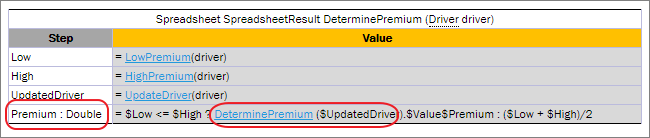
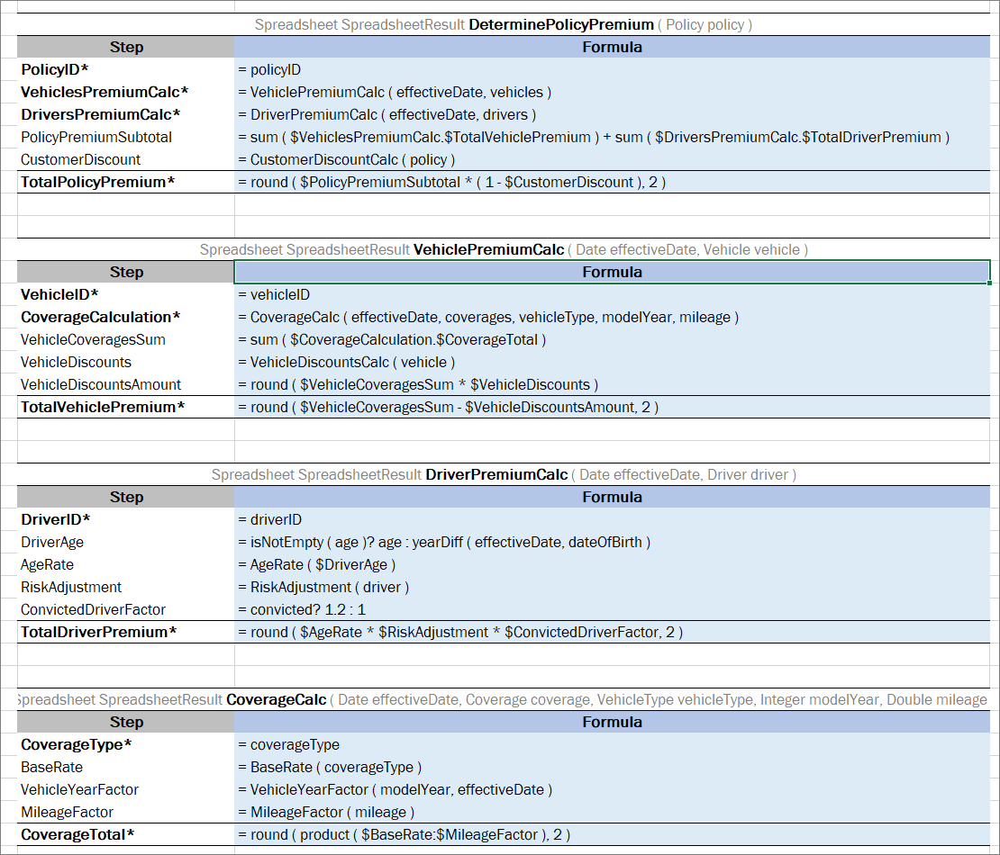

For more information on dependency and import configurations, see [Project, Module, and Rule Dependencies](#project-module-and-rule-dependencies).

##### Defining Dependencies between Modules in the Configuration Table

Often several or even all modules in the project have the same symbols in the beginning of their name. In such case, there are several options how to list several dependency modules in the **Environment** table:

-   adding each dependency module by its name
-   adding a link to all dependency modules using the common part of their names and the asterisk \* symbol for the varying part
-   adding a link to several dependency modules using the question mark ? symbol to replace one symbol anywhere in the name

All modules that have any letter or number at the position of the question mark symbol will be added as dependency.

The second option, that is, using the asterisk symbol after the common part of names, is considered a good practice because of the following reasons:

-   Any new version of dependency module is not omitted in future and requires no changes to the configuration table.
-   The configuration table looks simpler.


*Configuration table with dependency modules added by their name*


*Configuration table with link to all dependency modules*

**Note:** When using the asterisk \* symbol, if the name of the module where dependency is defined matches the pattern, this module is automatically excluded from dependent modules to avoid circular dependencies.

The following example illustrates how displaying dependency modules in the configuration table impacts resulting values calculation. The following modules are defined in the project for an auto insurance policy:

-   `Auto-Rating Algorithm.xlsx`
-   `Auto-Rating-Domain Model.xlsx`
-   `Auto-Rating-FL-01012016.xlsx`
-   `Auto-Rating-OK-01012016.xlsx`
-   `Auto-Rating Test Data.xlsx`

The purpose of this project is to calculate the Vehicle premium. The main algorithm is located in the `Auto-Rating Algorithm.xlsx` Excel file.


*Rule with the algorithm to calculate the Vehicle premium*

This file also contains the configuration table with the following dependency modules:

| Module                          | Description                                                                       |
|---------------------------------|-----------------------------------------------------------------------------------|
| `Auto-Rating-Domain Model.xlsx` | Contains the domain model.                                                        |
| `Auto-Rating-FL-01012016.xlsx`  | Contains rules with the FL state specific values used in the premium calculation. |
| `Auto-Rating-OK-01012016.xlsx`  | Contains rules with the OK state specific values.                                 |

All these modules have a common part at the beginning of the name, `Auto-Rating-.`

The configuration table can be defined with a link to all these modules as follows:


*Configuration table in the Auto-Rating Algorithm.xlsx file*

**Note:** The dash symbol `-` added to the dependency modules names in a common part helps to prevent inclusion of dependency on `Auto-Rating Algorithm` itself.

#### Properties Table

A **properties** table is used to define the module and category level properties inherited by tables. The properties table has the following structure:

| Element    | Description                                                                                                                                                                                                                                                                                                                                                                                                                                                                                                                                                                                                                                                                                |
|------------|--------------------------------------------------------------------------------------------------------------------------------------------------------------------------------------------------------------------------------------------------------------------------------------------------------------------------------------------------------------------------------------------------------------------------------------------------------------------------------------------------------------------------------------------------------------------------------------------------------------------------------------------------------------------------------------------|
| Properties | Reserved word that defines the type of the table. It can be followed by a Java identifier. In this case, the properties table value <br/>becomes accessible in rules as a field of such name and of the **TableProperties** type.                                                                                                                                                                                                                                                                                                                                                                                                                                                               |
| scope      | Identifies levels on which the property inheritance is defined. Available values are as follows: <br/>- **Module** <br/>Identifies properties defined for the whole module and inherited by all tables in it. <br/>There can be only one table with the **Module** scope in one module. <br/> <br/>*A properties table with the Module level scope* <br/><br/>- **Category** <br/>Identifies properties applied to all tables where the category name equals the name specified in the **category** element. <br/>By default, a category name equals to the worksheet name. <br/> <br/>*A properties table with the Category level scope* |
| category   | Defines the category if the **scope** element is set to **Category**. If no value is specified, the category name is retrieved from the sheet name.                                                                                                                                                                                                                                                                                                                                                                                                                                                                                                                                        |
| Module     | Identifies whether properties can be overridden and inherited on the module level.                                                                                                                                                                                                                                                                                                                                                                                                                                                                                                                                                                                                         |

#### Spreadsheet Table

In OpenL Tablets, a **spreadsheet** table is an analogue of the Excel table with rows, columns, formulas, and calculations as contents even though none of Excel formulas are used in OpenL Tables. Spreadsheets can also call decision tables or other executable tables to make decisions on values, and based on those, make calculations.

The format of the spreadsheet table header is as follows:

```
Spreadsheet SpreadsheetResult <table name> (<input parameters>)
```

or

```
Spreadsheet <return type> <table name> (<input parameters>)
```

The following table describes the spreadsheet table header syntax:

| Element              | Description                                                                                                                                                                                                                                   |
|----------------------|-----------------------------------------------------------------------------------------------------------------------------------------------------------------------------------------------------------------------------------------------|
| Spreadsheet          | Reserved word that defines the type of the table.                                                                                                                                                                                             |
| SpreadsheetResult    | Type of the return value. SpreadsheetResult returns the calculated content of the whole table.                                                                                                                                                |
| \<return type\>      | Data type of the returned value. If only a single value is required, its type must be defined here as a return data type and calculated <br/>in the row or column named RETURN, or in the last row or column if the RETURN keyword is not defined. |
| \<table name\>       | Valid name of the table as for any executable table.                                                                                                                                                                                          |
| \<input parameters\> | Input parameters as for any executable table.                                                                                                                                                                                                 |

The first column and row of a spreadsheet table, after the header, make the table column and row names. Values in other cells are the table values. An example is as follows.


*Spreadsheet table organization*

It is common practice to create a spreadsheet table with two columns only: **Step** where business step names are specified, and **Formula** containing action description. A spreadsheet table cell can contain:

-   simple values, such as a string or numeric values
-   values of other data types
-   formulas, which can be mathematical expressions, rule calls, and other operators or functions

Formulas are preceded by an apostrophe followed by = if editing a table in Excel, or directly with = if editing a table in OpenL Studio.

-   another cell value or a range of another cell values referenced in a cell formula

The following table describes how a cell value can be referenced in a spreadsheet table.

| Cell name             | Reference       | Description                                                   |
|-----------------------|-----------------|---------------------------------------------------------------|
| `$columnName`         | By column name. | Used to refer to the value of another column in the same row. |
| `$rowName`            | By row name.    | Used to refer to the value of another row in the same column. |
| `$columnName$rowName` | Full reference. | Used to refer to the value of another row and column.         |

For more information on how to specify a range of cells, see [Using Ranges in Spreadsheet Table](#using-ranges-in-spreadsheet-table). Below is an example of a spreadsheet table with different calculations for an auto insurance policy. Table cells contain simple values, formulas, references to the value of another cell, and other information.


*Spreadsheet table with calculations as content*

The data type for each cell can be determined by OpenL Tablets automatically or it can be defined explicitly for each row or column. The data type for a whole row or column can be specified using the following syntax:

```
<column name or row name> : <data type>
```

**Note:** If both column and row of the cell have a data type specified, the data type of the column is taken.

In OpenL Rule Services, spreadsheet output can be customized by adding or removing rows and columns to display as described in [Spreadsheet Result Output Customization](#spreadsheet-result-output-customization).

The following topics are included in this section:

-   [Parsing a Spreadsheet Table](#parsing-a-spreadsheet-table)
-   [Accessing Spreadsheet Result Cells](#accessing-spreadsheet-result-cells)
-   [Using Ranges in Spreadsheet Table](#using-ranges-in-spreadsheet-table)
-   [Auto Type Discovery Usage](#auto-type-discovery-usage)
-   [Custom Spreadsheet Result](#custom-spreadsheet-result)
-   [Spreadsheet Result Output Customization](#spreadsheet-result-output-customization)
-   [Testing Spreadsheet Result](#testing-spreadsheet-result)

##### Parsing a Spreadsheet Table

OpenL Tablets processes spreadsheet tables in two different ways depending on the return type:

1.  A spreadsheet returns the result of **SpreadsheetResult** data type.
2.  A spreadsheet returns the result of any other data type different from **SpreadsheetResult**.

In the first case, users get the value of SpreadsheetResult type that is an analog of result matrix. All calculated cells of the spreadsheet table are accessible through this result. The following example displays a spreadsheet table of this type.

  


*Spreadsheet table returns the SpreadsheetResult datatype*

In the second case, the returned result type is a data type as in all other rule tables, so there is no need for **SpreadsheetResult** in the rule table header. The value of the last row, or the latest one if there are several columns, is returned. OpenL Tablets calculates line by line as follows:


*Spreadsheet table returning a single value*

##### Accessing Spreadsheet Result Cells

A value of the SpreadsheetResult type means that this is actually a table, or matrix, of values which can be of different types. A cell is defined by its table column and row. Therefore, a value of a particular spreadsheet cell can be accessed by cell’s column and row names as follows:

```
<spreadsheet result variable>.$<column name>$<row name>
```

or

`$<column name>$<row name>(<spreadsheet result variable>)`

If a spreadsheet has one column only, besides the column holding step names, spreadsheet cells can be referenced by row names. If there is one row and multiple columns, a cell can be referenced by the column name.


*Referencing a cell by a row name*

The same functionality is available in test tables as described in [Testing Spreadsheet Result](#testing-spreadsheet-result).

The spreadsheet cell can also be accessed using the `getFieldValue(String <cell name>) `function, for instance, `(Double) $FinancialRatingCalculation.getFieldValue ("$Value$FinancialRating")`. This is a more complicated option.

**Note:** If the cell name in columns or rows contains forbidden symbols, such as space or percentage, the cell cannot be accessed. For more information on symbols that are not allowed, see Java method documentation.

##### Using Ranges in Spreadsheet Table

The following syntax is used to specify a range in a spreadsheet table:

```
$FirstValue:$LastValue
```

An example of using a range this way in the **TotalAmount** column is as follows.


*Using ranges of Spreadsheet table in functions*

**Note:** In expressions, such as `min/max($FirstValue:$LastValue)`, there must be no space before and after the colon ':'  operator.

**Note:** It is impossible to make math operations under ranges which names are specified with spaces. Please use step names without spaces.

##### Auto Type Discovery Usage

OpenL Tablets determines the cell data type automatically without its definition for a row or column. A user can turn on or off this behavior using the **autotype** property. If any row or column contains explicit data type definition, it supersedes automatically determined data type. The following example demonstrates that any data type can be correctly determined in auto mode. A user can put the mouse cursor over the “=” symbol to check the type of the cell value in OpenL Studio.


*Auto Type Discovery Property Usage inside Spreadsheet table*

The SpreadsheetResult cell type is automatically determined if a user refers to it from another table according to the following logic:

1.  Search for a cell with the same name is performed through all spreadsheets, and its type is set for the current cell.
2.  If several spreadsheets have cells with the same name but different types, the nearest common type is set for the current cell.

**Recommendation:** To ensure the system identifies types correctly, within the project, use data of the same type in the steps with the same name.

This logic also works when a user explicitly defines the type of the value as common SpreadsheetResult, for instance, in the following input parameter definition:


*Defining the value type as SpreadsheetResult*

However, there are several limitations of auto type discovering when the system cannot possibly determine the cell data type:

-   Type identification algorithm is not able to properly identify the cell type when a cell refers to another cell with the same name because of occurred circular dependencies.
   
    
    
    *Limitation for referring to another cell with the same name*
    
-   A user explicitly defines the return type of other Rules tables, such as Decision tables, as common SpreadsheetResult as follows:
    
    
    
    *Explicitly defining the return type of other rules tables*
    
    The type of undefined cells must be explicitly defined as a custom spreadsheet result type or any other suitable type to avoid uncertain Object typing.
    
-   There is a circular dependency in a spreadsheet table calling the same spreadsheet rule itself in a cell. This cell type must be explicitly defined to allow correct auto type discovering of the whole spreadsheet table as follows:
    
    
    
    *Defining a cell type explicitly*
    
##### Custom Spreadsheet Result

Usage of spreadsheet tables that return the SpreadsheetResult type is improved by having a separate type for each such spreadsheet table, that is, custom SpreadsheetResult data type, which is determined as follows:

```
SpreadsheetResult<Spreadsheet table name>
```

Custom SpreadsheetResult data type is automatically generated by a system and substitutes common SpreadsheetResult type. This provides the following advantages:

-   The system understands the structure of the spreadsheet result, that is, knows names of columns and rows, and data types of cell values.
    
    In other words, there is no need to indicate a data type when accessing the cell.
    
-   Test spreadsheet cell can be of any complex type.
    
    For more information on test spreadsheet result, see [Testing Spreadsheet Result](#testing-spreadsheet-result).

To understand how this works, consider the following spreadsheet.


*An example of a spreadsheet*

The return type is **SpreadsheetResult**, but it becomes **SpreadsheetResultCoveragePremium** data type. Now it is possible to access any calculated cell in a very simplified way without indicating its data type, for example, as displayed in the following figure.


*Calling Spreadsheet cell*

In this example, the spreadsheet table cell is accessed from the returned custom spreadsheet result.

There is no need to specify a custom SpreadsheetResult data type in the header of the spreadsheet table itself. The return data type is still SpreadsheetResult. Only when passing such spreadsheet as input to another table, the full name must be declared. For example, if the CensusEmployeeCalc spreadsheet is an input parameter for the ClaimCostCalculation spreadsheet, (SpreadsheetResultCensusEmployeeCalc censusCalc) must be included in the list of inputs.


*Example of calling a spreadsheet to be used as input*


*Using a custom spreadsheet as an input parameter*

##### United Spreadsheet Result

The combined SpreadsheetResult type is used when the rules table returns different SpreadsheetResults to prevent the cell type loss. The united SpreadsheetResult is returned in the following cases:

-   A rule returns SpreadsheetResult.
-   Different spreadsheets are called in a ternary operation.
    
    For more information on ternary operations, see [Ternary Operator](#ternary-operator).
    
-   The array of SpreadsheetResult is created by united spreadsheet cells (\$Step1:\$Step10).


*Example of a rule returning a united spreadsheet result*

A united spreadsheet result can be used as an input parameter.

-   If the united spreadsheet result is generated as a result of the rule returning spreadsheet results, the input parameter has the (SpreadsheetResultSpreadsheetName inputValueName) format. **Example:** SpreadsheetResultClaimCost claimCostCalc.
-   If the united spreadsheet result is generated as a result of the ternary operation of by uniting spreadsheet cells, the input parameter has the (SRSpr1 & SRSpr2 ruleName) format.
  
An example is as follows:

```
Rate = coverage.fundingType == "FullyInsured" ? RateCalculation ( rateBasis, $TotalVolume, $NumberOfLives, $MonthlyPremiumPreliminary) : ASORate (calculatedClass.$TotalNetClaimCost, TLR, $NumberOfLives, coverage)
```

If passing results of the Rate step to another rule, the type of the spreadsheet defined in this step is a united spreadsheet SRRateCalculation & SRASORate.


##### Spreadsheet Result Output Customization

To simplify integration with OpenL rules, customize serialization output of SpreadsheetResult objects by adding or removing steps or columns from spreadsheet result output.

- To identify steps or columns to be returned in the SOAP/REST response, mark them using the \* asterisk symbol.
- To ensure that certain steps or columns are not included in output, mark them with the ~ tilde symbol.

Consider the following spreadsheets.


*Spreadsheets example*

For these spreadsheets, output result is as follows.

```
{
  "PremiumCalc": {
    "PolicyID": "P1",
    "VehiclesPremiumCalc": [
      {
        "VehicleID": "V1",
        "CoverageCalculation": [
          {
            "CoverageType": "Bodily Injury",
            "BaseRate": 150,
            "VehicleYearFactor": 1.35,
            "MileageFactor": 1.19,
            "CoverageTotal": 240.98
          },
          {
            "CoverageType": "Property Damage",
            "BaseRate": 130,
            "VehicleYearFactor": 1.35,
            "MileageFactor": 1.19,
            "CoverageTotal": 208.85
          }
        ],
        "VehicleCoveragesSum": 449.83,
        "VehicleDiscounts": 0.08,
        "VehicleDiscountsAmount": 36,
        "TotalVehiclePremium": 413.83
      }
    ],
    "DriversPremiumCalc": [
      {
        "DriverID": "D1",
        "DriverAge": 44,
        "AgeRate": 1,
        "RiskAdjustment": 1,
        "ConvictedDriverFactor": 1.2,
        "TotalDriverPremium": 1.2
      }
    ],
    "PolicyPremiumSubtotal": 415.03,
    "CustomerDiscount": 0.12,
    "TotalPolicyPremium": 365.23
  }
}
```

In the following example, some steps are marked with the asterisk to be included in the output.



*Example of spreadsheets with mandatory steps*

An output for these tables is as follows:

```
{
  "PremiumCalc": {
    "PolicyID": "P1",
    "VehiclesPremiumCalc": [
      {
        "VehicleID": "V1",
        "CoverageCalculation": [
          {
            "CoverageType": "Bodily Injury",
            "CoverageTotal": 240.98
          },
          {
            "CoverageType": "Property Damage",
            "CoverageTotal": 208.85
          }
        ],
        "TotalVehiclePremium": 413.83
      }
    ],
    "DriversPremiumCalc": [
      {
        "DriverID": "D1",
        "TotalDriverPremium": 1.2
      }
    ],
    "TotalPolicyPremium": 365.23
  }
}
```

Within a project, different tables can contain ~ or * markings. Using one or another depends on whether a user needs more steps to include or exclude into the final result. An example is as follows.


*An example of spreadsheets with steps marked to be included and excluded*

An output result for these spreadsheets is as follows.

```
{
  "PremiumCalc": {
    "PolicyID": "P1",
    "VehiclesPremiumCalc": [
      {
        "VehicleID": "V1",
        "CoverageCalculation": [
          {
            "CoverageType": "Bodily Injury",
            "CoverageTotal": 240.98
          },
          {
            "CoverageType": "Property Damage",
            "CoverageTotal": 208.85
          }
        ],
        "TotalVehiclePremium": 413.83
      }
    ],
    "DriversPremiumCalc": [
      {
        "DriverID": "D1",
        "TotalDriverPremium": 1.2
      }
    ],
    "TotalPolicyPremium": 365.23
  }
}
```

It is also possible to filter spreadsheet columns identifying the ones to be displayed or hidden in the output result. Use the ~ or * markings depending on whether there are more columns to include or exclude from the final result. The following naming rules apply:

- If a spreadsheet has two columns, the step name in API is **RowName**.
- If a spreadsheet has more than two columns, the step name in API is **ColumnName_RowName**.

**Note:** If there is only one spreadsheet column marked as mandatory, its name in API is just **RowName.** If there is only one spreadsheet column left after exclusion besides the step column, its name in API is also just **RowName**.

An example is as follows. 
  


*A spreadsheet table with three columns*

An output result for this spreadsheet is as follows.

```
{
  "Value_BankID": "commerz",
  "Description_BalanceDynamicIndexCalculation": "Calculate Indices B, B1, B2, B3 accoding to Financial Data and Quality Indicators",
  "Value_BalanceDynamicIndexCalculation": 0.94,
  "Description_BankQualitativeIndexCalculation": "Calculate Indices B, B1, B2, B3 accoding to Financial Data and Quality Indicators",
  "Value_BankQualitativeIndexCalculation": 0.9,
  "Description_IsAdequateNormativeIndexCalculation": "Calculate Indices B, B1, B2, B3 accoding to Financial Data and Quality Indicators",
  "Value_IsAdequateNormativeIndexCalculation": 1,
  "Description_BankRating": "Bank Rating R = B x B1 x B2 x B3",
  "Value_BankRating": 0.85,
  "Description_BankRatingGroup": "Calculate Bank Rating Group",
  "Value_BankRatingGroup": "R2",
  "Description_LimitIndex": "Calculate Limit Index Kl",
  "Value_LimitIndex": 1,
  "Description_Limit": "Max Limit which Bank is Allowed\nL = Kl x Lmax",
  "Value_Limit": 5000
}	
```

Note that the step names are in the **ColumnName_RowName** format.

An example of the same spreadsheet with one of the columns excluded using the tilda ~ sign is as follows.
  


*A spreadsheet table with excluded column*

An output result for this spreadsheet is as follows.

```
{
  "BankID": "commerz",
  "BalanceDynamicIndexCalculation": 0.94,
  "BankQualitativeIndexCalculation": 0.9,
  "IsAdequateNormativeIndexCalculation": 1,
  "BankRating": 0.85,
  "BankRatingGroup": "R2",
  "LimitIndex": 1,
  "Limit": 5000
}
```

Note that the step names are in the **RowName** format because there is only one column left besides the **Step** column. 
  
Now consider the following example that illustrates simultaneous usage of asterix in columns and steps.
  


*A spreadsheet table with filtered columns and steps*

An output result for this spreadsheet is as follows.

```
