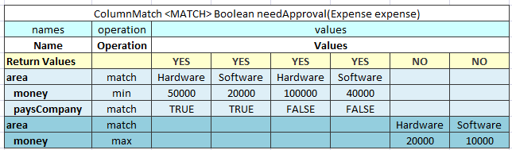
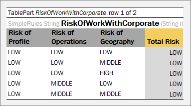
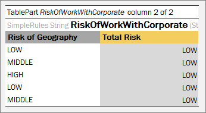

Besides the mandatory columns, such as names, operations, and values, the **MATCH** table expects that the first data row contains **Return Values**, one of which is returned as a result of the ColumnMatch table execution.



*An example of the MATCH algorithm table*

The MATCH algorithm works from top to bottom and left to right. It takes an argument from the upper row and matches it against check values from left to right. If they match, the algorithm returns the corresponding return value, which is the one in the same column as the check value. If values do not match, the algorithm switches to the next row. If no match is found in the whole table, the **null** object is returned.

If the return type is primitive, such as **int**, **double**, or **Boolean**, a runtime exception is thrown.

The MATCH algorithm supports **AND** conditions. In this case, it checks whether all arguments from a group match the corresponding check values and checks values in the same value sub column each time. The **AND** group of arguments is created by indenting two or more arguments. The name of the first argument in a group must be left indented.

##### SCORE Algorithm

The **SCORE** algorithm calculates the sum of weighted ratings or scores for all matched cases. The **SCORE** algorithm has the following mandatory columns:

-   names
-   operations
-   weight
-   values

The algorithm expects that the first row contains **Score**, which is a list of scores or ratings added to the result sum if an argument matches the check value in the corresponding sub column.


*An example of the SCORE algorithm table*

The SCORE algorithm works up to down and left to right. It takes the argument value in the first row and checks it against values from left to right until a match is found. When a match is found, the algorithm takes the score value in the corresponding sub column and multiples it by the weight of that row. The product is added to the result sum. After that, the next row is checked. The rest of the check values on the same row are ignored after the first match. The 0 value is returned if no match is found.

The following limitations apply:

-   Only one score can be defined for each row.
-   AND groups are not supported.
-   Any number of rows can refer to the same argument.
-   The SCORE algorithm return type is always Integer.

##### WEIGHTED Algorithm

The **WEIGHTED** algorithm combines the SCORE and simple MATCH algorithms. The result of the SCORE algorithm is passed to the MATCH algorithm as an input value. The MATCH algorithm result is returned as the WEIGHTED algorithm result.

The WEIGHTED algorithm requires the same columns as the SCORE algorithm. Yet it expects that first three rows are **Return Values**, **Total Score**, and **Score**. **Return Values** and **Total Score** represent the MATCH algorithm, and the **Score** row is the beginning of the SCORE part.


*An example of the WEIGHTED algorithm table*

The WEIGHTED algorithm requires the use of an extra method table that joins the SCORE and MATCH algorithm. Testing the SCORE part can become difficult in this case. Splitting the WEIGHTED table into separate SCORE and MATCH algorithm tables is recommended.

#### Constants Table

A **constants** table allows defining constants of different non-custom types. These constants can be then used across the whole project and they do not have to be listed as input parameter in the table header.

An example of a constants table and constants usage is as follows.


*Constants table and usage example*

In this example, users can create names for some values and use those in rule cells without the “=” symbol. Constants are used in the body of the table but are not listed in the header as input.

The format of the constants table is as follows:

1.  The first row is a table header, which has the following format:
    
    Constants \<optional table name\>
    
1.  The second row contains cells with a type, name, and value of the constant.

An expression can be used for a constant, for example, 1/3. To define an empty string, use the \_DEFAULT\_ value.

#### Table Part

The **Table Part** functionality enables the user to split a large table into smaller parts, or partial tables. Physically, in the Excel workbook, the table is represented as several table parts which logically are processed as one rules table.

This functionality is suitable for cases when a user is dealing with `.xls` file format using a rules table with more than 256 columns or 65,536 rows. To create such a rule table, a user can split the table into several parts and place each part on a separate worksheet.

Splitting can be vertical or horizontal. In vertical case, the first N1 rows of an original rule table are placed in the first table part, the next N2 rows in the second table part, and so on. In horizontal case, the first N1 columns of the rule table are placed in the first table part, the next N2 columns in the second table part, and so on. The header of the original rule table and its properties definition must be copied to each table part in case of horizontal splitting. Merging of table parts into the rule table is processed as depicted in the following figures.


*Vertical merging of table parts*


*Horizontal merging of table parts*

All table parts must be located within one Excel file.

Splitting can be applied to any tables of decision, data, test and run types.

The format of the TablePart header is as follows:

```
TablePart <table id> <split type> {M} of {N}
```

The following table describes the TablePart header syntax:

| Element        | Description                                                                                                                    |
|----------------|--------------------------------------------------------------------------------------------------------------------------------|
| TablePart      | Reserved word that defines the type of the table.                                                                              |
| \<table id\>   | Unique name of the rules table. It can be the same as the rules table name if the rules table is not overloaded by properties. |
| \<split type\> | Type of splitting. It is set to **row** for vertical splitting and **column** for horizontal splitting.                        |
| {M}            | Sequential number of the table part: 1, 2, and so on.                                                                          |
| {N}            | Total number of table parts of the rule table.                                                                                 |

The following examples illustrate vertical and horizontal splitting of the **RiskOfWorkWithCorporate** decision rule.



*Table Parts example. Vertical splitting part 1*


*Table Parts example. Vertical splitting part2*


*Table Part example. Horizontal splitting part 1*



*Table Parts example. Horizontal splitting part 2*

### Table Properties
