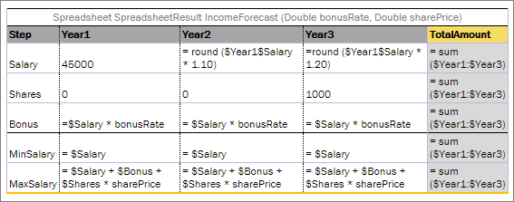

{
  "BankID": "commerz",
  "Limit": 5000
}
```
  
**Note:** If the Maven plugin is used for generating a spreadsheet result output model, system integration can be based on generated classes. A default Java package for generated Java beans for particular spreadsheet tables is set using the spreadsheetResultPackage table property. Nevertheless, it is recommended to avoid any integration based on generated classes.

##### Testing Spreadsheet Result

Cells of a spreadsheet result, which is returned by the rule table, can be tested as displayed in the following spreadsheet table.



*A sample spreadsheet table*

Simplified syntax is used to pull results from a spreadsheet table if a spreadsheet table contains only one column besides the row name column:` _res_.$<row name>`.


*Test for the sample spreadsheet table*

Columns marked with the grey color determine income values, and columns marked with yellow determine the expected values for a specific number of cells. It is possible to test as many cells as needed.

The result of running this test in OpenL Studio is provided in the following output table.


*The sample spreadsheet test results*

It is possible to test cells of the resulting spreadsheet which contain values of complex types, such as:

