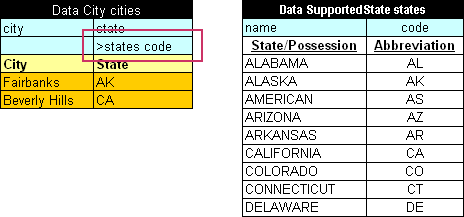

`<attribute name of aggregated object>.<attribute name of object>, `and define elements of an array in several rows, or in several columns in case of a transposed table.

*Specifying values for an array of aggregated objects using the matrix structure*

The following rules and limitations apply:

-   The cells of the first column, or aggregated object or test case keys, must be merged with all lines of the same aggregated object or test case.

    A primary key column can be defined if data columns cannot be used for this purpose, for example, for complicated cases with duplicates.

-   The cells of the first column holding array of objects data, or array element keys, must be merged to all lines related to the same element, or have the same value in all lines of the element, or have the first value provided and other left blank thus indicating duplication of the previous value.

    A primary key column can be defined, for example, `policy.vehicles._PK_,` if data columns cannot be used for this purpose. Thus, the primary key cannot be left empty.

-   In non-keys columns where only one value is expected to be entered, the value is retrieved from the first line of the test case and all other lines are ignored.
    
    Even if these following lines are filled with values, no equality verification is performed.
    
-   Primary key columns must be put right before the corresponding object data.
    
    In particular, all primary keys cannot be defined in the very beginning of the table.

**Note:** All mentioned formats of specifying data for aggregated objects are applicable to the input values or expected result values definition in the Test and Run tables.

##### Ensuring Data Integrity

If a data table contains values defined in another data table, it is important to specify this relationship. The relationship between two data tables is defined using **foreign keys**, a concept that is used in database management systems. Reference to another data table must be specified in an additional row below the row where attribute names are entered. The following format must be used:

`> <referenced data table name> <column name of the referenced data table>`

In the following example, the **cities** data table contains values from the **states** table. To ensure that correct values are entered, a reference to the **code** column in the **states** table is defined.

*Defining a reference to another data table*

If an invalid state abbreviation is entered in the **cities** table, OpenL Tablets reports an error.

The target column definition is not required if it is the first column or \_PK\_ column in the referenced data table. For example, if a reference is made to the **name** column in the **states** **table**, the following simplified reference can be used:

`>states`

If a data table contains values defined as a part of another data table, the following format can be used:

`> <referenced data table name>.<attribute name> <column name>`

The difference from the previous format is that an attribute name of the referenced data table, which corresponding values are included in the other data table, is specified additionally.

If `<column name>` is omitted, the reference by default is constructed using the first column or \_PK\_ column of the referenced data table.

In the following diagram, the **claims** data table contains values defined in the **policies** table and related to the **vehicle** attribute. A reference to the **name** column of the **policies** table is omitted as this is the first column in the table.

*Defining a reference to another data table*

**Note:** To ensure that correct values are provided, cell data validation lists can be used in Excel, thus limiting the range of values that can be entered.

**Note:** The same syntax of data integration is applicable to the input values or expected result values definition in the Test and Run tables.

**Note:** The attribute path can be of any arbitrary depth, for example, `>policies.coverage.limit`.

If the array is stored in the field object of the data table, array elements can be referred. An example is as follows.

*Referring array elements in a test table*

#### Test Table

This section describes test tables and context variables available in these tables. The following topics are included:

-   [Understanding Test Tables](#understanding-test-tables)
-   [Context Variables Available in Test Tables](#context-variables-available-in-test-tables)
-   [Creating a Test Table for a Spreadsheet or Decision Table with SpreadsheetResult as Input Parameter](#creating-a-test-table-for-a-spreadsheet-or-decision-table-with-spreadsheetresult-as-input-parameter)

##### Understanding Test Tables

A **test table** is used to perform unit and integration tests on executable rule tables, such as decision tables, spreadsheet tables, and method tables. It calls a particular table, provides test input values, and checks whether the returned value matches the expected value.

For example, in the following diagram, the table on the left is a decision table but the table on the right is a unit test table that tests data of the decision table.

*Decision table and its unit test table*

A test table has the following structure:

1.  The first row is the table header, which has the following format:
    
    `Test <rule table name> <test table name>`
    
    **Test** is a keyword that identifies a test table. The second parameter is the name of the rule table to be tested. The third parameter is the name of the test table and is optional.
   
1.  The second row provides a separate cell for each input parameter of the rule table followed by the **\_res\_** column, which typically contains the expected test result values.
2.  The third row contains display values intended for business users.
3.  Starting with the fourth row, each row is an individual test case.

For more information on how to specify values of input parameters and expected test results of complex constructions, see [Specifying Data for Aggregated Objects](#specifying-data-for-aggregated-objects) and [Ensuring Data Integrity](#ensuring-data-integrity).

If a test table field is a list or a map, it can be used to create a data table or test table in the same way as for data tables as described in [Specifying Data in Data Tables with List and Map Fields](#specifying-data-in-data-tables-with-list-and-map-fields).

**Note for experienced users:** Test tables can be used to execute any Java method. In this case, a method table must be used as a proxy.

When a test table is called, the OpenL Tablets engine calls the specified rule table for every row in the test table and passes the corresponding input parameters to it.

