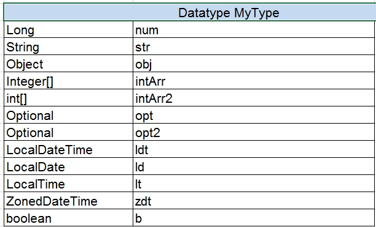

## OpenL Rule Services Configuration

OpenL Rule Services architecture allows extending mechanisms of services loading and deployment according to the particular project requirements.

This section describes OpenL Rule Services configuration and includes the following topics:

-   [OpenL Rule Services Default Configuration](#openl-rule-services-default-configuration)
-   [OpenL Rule Services Default Configuration Files](#openl-rule-services-default-configuration-files)
-   [Service Manager](#service-manager)
-   [Configuration Points](#configuration-points)

### OpenL Rule Services Default Configuration

All OpenL Rule Services configuration is specified in Spring configuration files and `application*.*properties` files. The `application.properties` file is located inside the application `.war `file (inside WEB-INF/classes folder), in a user’s directory or in a working directory.

The configuration file located inside the `.war `file contains default settings for all properties. Use it as a reference of possible settings and redefine as required in your configuration file, such as the `application.properties` file located in a user’s home directory.

All settings used in `application.properties` file can be defined as JVM options. In this case, JVM options override settings defined in files.

By default, OpenL Rule Services is configured as follows:

1.  A data source is configured as `FileSystemDataSource` located in the `"${user.home}/.openl/datasource"` folder.
2.  All services are exposed as REST services using the CXF framework.
3.  `LastVersionProjectsServiceConfigurer` is used as a default service configurer that takes the last version of each deployment and creates the service for each project using all modules contained in the project.

### OpenL Rule Services Default Configuration Files

If necessary, modify the OpenL Rule Services configuration by overriding the existing configuration files. All overridden Spring beans must be defined in the `openl-ruleservice-override-beans.xml `file. The following table lists Spring configuration files used in OpenL Rule Services:

| File                                          | Description                                                                                                                                    |
|-----------------------------------------------|------------------------------------------------------------------------------------------------------------------------------------------------|
| `openl-ruleservice-beans.xml`                 | Main configuration file that includes all other configuration files. This file is searched by OpenL Rule Services in the classpath root. |
| `openl-ruleservice-core-beans.xml`            | Configuration for ServiceManager and InstantiationFactory.                                                                                     |
| `openl-ruleservice-datasource-beans.xml`      | Configuration for data sources.                                                                                                                |
| `openl-ruleservice-loader-beans.xml`          | Configuration for rules loader.                                                                                                                |
| `openl-ruleservice-publisher-beans.xml`       | Common publisher configurations.                                                                                                               |
| `openl-ruleservice-jaxrs-publisher-beans.xml` | Configuration for RESTful services publisher.                                                                                                  |
| `openl-ruleservice-rmi-publisher-beans.xml`   | Configuration for RMI services publisher.                                                                                                      |
| `openl-ruleservice-kafka-publisher-beans.xml` | Configuration for Kafka services publisher.                                                                                                    |
| `openl-ruleservice-conf-beans.xml`            | Configuration for Service Configurer.                                                                                                          |
| `openl-ruleservice-store-log-data-beans.xml`  | Configuration for external request and response storages.                                                                                      |
| `application.properties        `                      | Main configuration file containing properties for OpenL Rule Services configuration.                                                    |

For more information on configuration files, see [Configuration Points](#configuration-points).

### Service Manager

**Service Manager** is the main component of OpenL Rule Services frontend joining all major parts, such as a loader, rule service publishers, and Service Configurer. For more information on OpenL Rule Services frontend components, see [OpenL Tablets Developers Guide](https://openldocs.readthedocs.io/en/latest/documentation/guides/developer_guide).

Service Manager manages all currently running services and intelligently controls all operations for deploying, undeploying, and redeploying the services. These operations are only performed in the following cases:

-   initial deployment at application startup
-   processing after data source update

Service Manager always acts as a data source listener as described in further sections of this chapter.

### Configuration Points

Any part of OpenL Rule Services frontend can be replaced by the user’s own implementation. For more information on the system architecture, see [OpenL Tablets Developers Guide](https://openldocs.readthedocs.io/en/latest/documentation/guides/developer_guide).

If the common approach is used, the following components must be configured:

| Component                   | Description                                                                                     |
|-----------------------------|-------------------------------------------------------------------------------------------------|
| **Data source**             | Informs the OpenL Tablets system where to retrieve user’s rules.                                |
| **Service exposing method** | Defines the way services are exposed, for example, as a web service or a simple Java framework. |

The following sections describe how to configure these components:

-   [Configuring a Data Source](#configuring-a-data-source)
-   [Service Configurer](#service-configurer)
-   [Service Exposing Methods](#service-exposing-methods)
-   [Configuring System Settings](#configuring-system-settings)
-   [CORS Filter Support](#cors-filter-support)
-   [Logging Requests to OpenL Rule Services and Their Responds in a Storage](#logging-requests-to-openl-rule-services-and-their-responds-in-a-storage)

    **Note:** There is a specific rule of parsing parameter names in methods. The algorithm checks the case of the second letter in a word and sets the first letter case the same as for the second letter. For example, parameters for `MyMethod (String fParam, String Sparam)` in REST requests are defined as `FParam` and `sparam`.

#### Configuring a Data Source

The system supports the following data source implementations:

-   [File System](#file-system)
-   [Relational Database](#relational-database)
-   [Amazon AWS S3](#amazon-aws-s3)
-   [GIT](#git)
-   [Classpath JAR](#classpath-jar)

##### File System

Using a file system as a data source for projects means that projects are stored in a local folder. By default, the configuration folder represents a single deployment containing all the projects and does not support multiple deployments and project versions. This data source is used by default.

To configure a local file system as a data source, proceed as follows:

1.  In `application.properties`, set `production-repository.factory = repo-file`.
    <br/>By default, the `${user.home}/.openl/openl-ruleservice/datasource` folder is used as a local folder for projects.
2.  To enable versioning support for deployment, set the `ruleservice.datasource.filesystem.supportVersion` setting to `true`.

    **Note:** For proper parsing of Java properties file, the path to the folder must be defined with a slash (‘/’) as the folders delimiter. Back slash “\\” is not allowed.

##### Relational Database

To use a relational database repository as a data source, proceed as follows:

1.  Add the appropriate driver library for a database.
    For example, for MySQL 5.6, it is the `mysql-connector-java-5.1.31.jar`.
2.  In the `application.properties` file, set repository settings as follows:
3.  Set `production-repository.factory = repo-jdbc`.
4.  Set the value for `production-repository.uri` according to the database as follows:

    | Database       | URL value                                                                                   |
    |----------------|---------------------------------------------------------------------------------------------|
    | MySQL, MariaDB | jdbc:mysql://[host][:port]/[schema]                                                         |
    | Oracle         | jdbc:oracle:thin:@//[HOST][:PORT]/SERVICE                                                   |
    | MS SQL         | jdbc:sqlserver://[serverName[\instanceName][:portNumber]][;property=value[;property=value]] |
    | PostrgeSQL     | jdbc:postrgesql://[host][:port]/[schema]                                                    |

    For example, for MySQL:
    ```properties
    production-repository.uri = jdbc:mysql://localhost:3306/deployment-repository
    ```

5.  Set login and password for a connection to the database in production-repository.login and production-repository.password settings.

    **Note:**        The password must be encoded via Base64 encoding schema if the repository.encode.decode.key property is not empty. 
    
    ```properties
    production-repository.factory = repo-jdbc
    production-repository.uri = jdbc:h2:mem:repo;DB_CLOSE_DELAY=-1
    production-repository.login = root
    production-repository.password = admin
    # Secret key for password code/decode
    secret.key=
    #secret.cipher=AES/CBC/PKCS5Padding
    ```

##### Amazon AWS S3

To use an AWS S3 repository as a data source, proceed as follows:

1.  To build a customized version of OpenL Rule Services with dependencies on `*org.openl.rules.repository.aws`, create a `pom.xml` file with the following content:

    ```xml
    <?xml version="1.0" encoding="UTF-8"?>
    <project xmlns="http://maven.apache.org/POM/4.0.0" xmlns:xsi="http://www.w3.org/2001/XMLSchema-instance" xsi:schemaLocation="http://maven.apache.org/POM/4.0.0 http://maven.apache.org/maven-v4_0_0.xsd">
        <modelVersion>4.0.0</modelVersion>
        <groupId>com.example.openl</groupId>
        <artifactId>webservice-aws</artifactId>
        <packaging>war</packaging>
        <version>1.0-beta</version>

    <properties>
            <project.build.sourceEncoding>UTF-8</project.build.sourceEncoding>
            <org.openl.version>#Define OpenL Tablets version here#</org.openl.version>
        </properties>
        <dependencies>
            <dependency>
                <groupId>org.openl.rules</groupId>
                <artifactId>org.openl.rules.repository.aws</artifactId>
                <version>${org.openl.version}</version>
            </dependency>
            <dependency>
                <groupId>org.openl.rules</groupId>
                <artifactId>org.openl.rules.ruleservice.ws</artifactId>
                <type>war</type>
                <version>${org.openl.version}</version>
            </dependency>
        </dependencies>
        <dependencyManagement>
            <dependencies>
                <dependency>
                    <groupId>com.fasterxml.jackson.core</groupId>
                    <artifactId>jackson-databind</artifactId>
                    <version>2.9.5</version>
                </dependency>
                <dependency>
                    <groupId>com.fasterxml.jackson.core</groupId>
                    <artifactId>jackson-annotations</artifactId>
                    <version>2.9.5</version>
                </dependency>
                <dependency>
                    <groupId>commons-codec</groupId>
                    <artifactId>commons-codec</artifactId>
                    <version>1.11</version>
                </dependency>
            </dependencies>
        </dependencyManagement>
    </project>
    ```
        
1.  Set the following properties in the `application.properties` file:
    
    ```
    properties
    production-repository.factory = repo-aws-s3
    production-repository.bucket-name = yourBucketName
    production-repository.region-name = yourS3Region
    production-repository.access-key = yourAccessKey
    production-repository.secret-key = yourSecretKey
    ```
  
    
##### GIT

To use a Git repository as a data source, proceed as follows:

1.  To build a customized version of OpenL Rule Services with dependencies on `*org.openl.rules.repository.git`, create a `pom.xml` file with the following content:
    
    ```xml
    <?xml version="1.0" encoding="UTF-8"?>
    <project xmlns="http://maven.apache.org/POM/4.0.0" xmlns:xsi="http://www.w3.org/2001/XMLSchema-instance" xsi:schemaLocation="http://maven.apache.org/POM/4.0.0 http://maven.apache.org/maven-v4_0_0.xsd">
        <modelVersion>4.0.0</modelVersion>
        <groupId>com.example.openl</groupId>
        <artifactId>webservice-git</artifactId>
        <packaging>war</packaging>
        <version>1.0-beta</version>

        <properties>
            <project.build.sourceEncoding>UTF-8</project.build.sourceEncoding>
            <org.openl.version>>#Define OpenL Tablets version here#</org.openl.version>
        </properties>
        <dependencies>
            <dependency>
                <groupId>org.openl.rules</groupId>
                <artifactId>org.openl.rules.repository.git</artifactId>
                <version>${org.openl.version}</version>
            </dependency>
            <dependency>
                <groupId>org.openl.rules</groupId>
                <artifactId>org.openl.rules.ruleservice.ws</artifactId>
                <type>war</type>
                <version>${org.openl.version}</version>
            </dependency>
        </dependencies>
    </project>
    ```
        
1.  Build it with Maven: `mvn clean package`.
2.  Replace `webservice.war` with the war file you built.
3.  Set the following properties to the `application.properties` file (change necessary fields):

    ```properties
    production-repository.factory = repo-git
    production-repository.uri = https://github.com/<your-name>/your-repo.git
    production-repository.login = your-login
    production-repository.password = your-password
    ```

4.  Additionally, to override default values, add these optional properties:
    
    ```xml
    properties
    # The branch where deployed projects can be found.
    production-repository.branch = master
    # Committer's display name. If null, username will be “OpenL_Deployer”.
    production-repository.user-display-name =
    # Committer's email. If null, email will be empty.
    production-repository.user-email =
    # Repository connection timeout in seconds. Must be greater than zero.
    production-repository.connection-timeout = 60
    # Repository changes check interval in seconds. Must be greater than 0.
    production-repository.listener-timer-period = 10
    ```

##### Classpath JAR

If rule projects with the `rules.xml` project descriptor are packed into a JAR file and placed in the classpath, these projects are deployed in the configured data source at the application launch.

Proceed as follows:

1.  Put the JAR file with the project to `\<TOMCAT_HOME>\webapps\<rule services file name>\WEB-INF\lib`.
2.  In the `application.properties` file, set up the `ruleservice.datasource.deploy.classpath.jars = true`.

By default, this property is set to `true`.

**Note:** Project deployment is skipped if the data source already contains the project with the same name.

#### Service Configurer

This section introduces Service Configurer and includes the following topics:

-   [Understanding Service Configurer](#understanding-service-configurer)
-   [Deployment Configuration File](#deployment-configuration-file)
-   [Service Description](#service-description)
-   [Configuring the Deployment Filter](#configuring-the-deployment-filter)

##### Understanding Service Configurer

Service Configurer resolves a list of services to be exposed, such as modules contained in each service, service interface, and runtime context provision.

Modules for a service can be retrieved for different projects. Each deployment containing in a data source has a set of properties and can be represented in several versions. Deployment consists of projects that also have properties and contain some modules. There can be only one version of a specific project in the deployment.

Each module for a service can be identified by the deployment name, deployment version, project name inside the deployment, and module name inside the project.

Different module gathering strategies according to their needs can be implemented by extending `org.openl.rules.ruleservice.conf.ServiceConfigurer` interface. Users can choose deployments and projects with concrete values of a specific property, such as service for some LOB property or service containing modules with an expiration date before a specific date, or versions of deployments, or both these approaches.

OpenL Tablets users typically need web services containing several rule projects or modules. In this case, multiple modules can be united in one service using the `org.openl.rules.ruleservice.core.ServiceDescription` service description. Service description contains information about the required service, such as the service name, URL, and service class, and can be expanded to contain new configurations. To instantiate several modules, users can rely on the OpenL Tablets multi-module mechanism that combines a group of modules into a single rules engine instance.

The `org.openl.rules.ruleservice.conf.LastVersionProjectsServiceConfigurer` default implementation of Service Configurer retrieves all deployments from a data source and publishes the latest versions of projects with unique version from the corresponding deployment configuration file `rules-deploy.xml. `In other words, if the `version` tag is not used in service description files for the same project versions, only one latest deployment version is published; otherwise, all deployment versions with unique `version` tag are published.

##### Deployment Configuration File

Default implementation of Service Configurer uses the `rules-deploy.xml` deployment configuration file from the project root folder. This file is created manually or via OpenL Studio. An example of the `rules-deploy.xml` file is as follows:

```xml
<rules-deploy>
    <isProvideRuntimeContext>true</isProvideRuntimeContext>
    <serviceName>myService</serviceName>
    <serviceClass>com.example.MyService </serviceClass>
    <url>com.example.MyService</url>
    <publishers>
        <publisher>RESTFUL</publisher>
    </publishers>
    <configuration>
        <entry>
            <string>someString</string>
            <string>someString</string>
        </entry>
    </configuration>
</rules-deploy>
```

When deploying a project to OpenL Rule Services, if the rules-deploy.xml file is missing or publishers are not defined, only the RESTful service is deployed according to the following property:

`ruleservice.publishers=RESTFUL`

| Tag                               |  Description                                                                                                                                                                                                                                                                                                                                                                                                                                                                                                                                                                                                                                                                                                                                                                                                                                                                                     | Required            |
|-----------------------------------|--------------------------------------------------------------------------------------------------------------------------------------------------------------------------------------------------------------------------------------------------------------------------------------------------------------------------------------------------------------------------------------------------------------------------------------------------------------------------------------------------------------------------------------------------------------------------------------------------------------------------------------------------------------------------------------------------------------------------------------------------------------------------------------------------------------------------------------------------------------------------------------------------|---------------------|
| isProvideRuntimeContext           | Identifies, if set to `true`, that a project provides a runtime context.  <br/>The default value is defined in the `application.properties` file.                                                                                                                                                                                                                                                                                                                                                                                                                                                                                                                                                                                                                                                                                                                                                     | No                  |
| serviceName                       | Defines a service name. <br/>The service name defined in the file is displayed for a deployed project in the embedded mode only. <br/>Otherwise, the service name is derived from its path. <br/>A default pattern is "{deployment_configuration_name}/{project_name}".                                                                                                                                                                                                                                                                                                                                                                                                                                                                                                                                                                                                                                         | No                  |
| serviceClass                      | Defines a service class. If it is not defined, a generated class is used.                                                                                                                                                                                                                                                                                                                                                                                                                                                                                                                                                                                                                                                                                                                                                                                                                        | No                  |
| rmiServiceClass                   | Define a service class to be used by RMI publisher.                                                                                                                                                                                                                                                                                                                                                                                                                                                                                                                                                                                                                                                                                                                                                                                                                                              | Yes <br/>if RMI is used |
| version                           | Defines a service version.                                                                                                                                                                                                                                                                                                                                                                                                                                                                                                                                                                                                                                                                                                                                                                                                                                                                       | No                  |
| url                               | Defines URL for a service.                                                                                                                                                                                                                                                                                                                                                                                                                                                                                                                                                                                                                                                                                                                                                                                                                                                                       | No                  |
| annotationTemplateClassName       | Defines an interface being used as a template to annotate dynamic generated interface class.                                                                                                                                                                                                                                                                                                                                                                                                                                                                                                                                                                                                                                                                                                                                                                                                     | No                  |
| groups                            | Defines a list of comma-separated groups used for this project.                                                                                                                                                                                                                                                                                                                                                                                                                                                                                                                                                                                                                                                                                                                                                                                                                                  | No                  |
| publishers                        | Defines a list of publishers for a project. <br/>Available values are as follows: <br/>- [RESTFUL](#cxf-rest-publisher) <br/>- [RMI](#rmi-publisher) <br/>- [KAFKA](#kafka-publisher) <br/>If the publisher list is empty, the service is deployed as a Java object without network API defined. <br/>This can be useful if deploying multiple projects in one deployment <br/>where some of these projects must not define the network API.                                                                                                                                                                                                                                                                                                                                                                                                                                                                                             | No                  |
| configuration                     | Is used as extension point for custom service configuration.                                                                                                                                                                                                                                                                                                                                                                                                                                                                                                                                                                                                                                                                                                                                                                                                                                     | No                  |
| jackson.serializationInclusion    | Serialization option for JSON based services.                                                                                                                                                                                                                                                                                                                                                                                                                                                                                                                                                                                                                                                                                                                                                                                                                                                    | No                  |
| jackson.defaultDateFormat         | Used to define date format is used in JSON.                                                                                                                                                                                                                                                                                                                                                                                                                                                                                                                                                                                                                                                                                                                                                                                                                                                      | No                  |
| jackson.caseInsensitiveProperties | Deserialization option for JSON based services.                                                                                                                                                                                                                                                                                                                                                                                                                                                                                                                                                                                                                                                                                                                                                                                                                                                  | No                  |
| jackson.failOnUnknownProperties   | Deserialization option for JSON based services. <br/>For more information on this property, see [Configuring JSON Payload Serialization and Deserialization](#configuring-json-payload-serialization-and-deserialization).                                                                                                                                                                                                                                                                                                                                                                                                                                                                                                                                                                                                                                                                            | No                  |
| jackson.propertyNamingStrategy    | Used to configure names of output spreadsheet attributes. <br/>Supported attribute name strategies are as follows: <br/><br/>**org.openl.rules.serialization.spr.LowerCamelCaseStrategy** <br/>All name elements, excluding the first one, start with a capitalized letter, followed by lowercase ones. <br/>The first letter is lowercased, and there are no separators.  <br/>**Example:** columnName. <br/><br/>**org.openl.rules.serialization.spr.SnakeCaseStrategy** <br/>All letters are lowercase with underscores used as separators between name elements. <br/>**Example:** columnname_rowname. <br/><br/>**org.openl.rules.serialization.spr.LowerCaseStrategy** <br/>All letters are lowercase with no separators. <br/>**Example:** columnname. <br/><br/>**org.openl.rules.serialization.spr.UpperCamelCaseStrategy** <br/>All name elements start with a capitalized letter, followed by lowercase ones, and there are no separators. <br/>**Example:** ColumnNameRowName. |                     |
| rootClassNamesBinding             | Defines a list of classes for automatically define inheritance between defined classes and properly registering them.                                                                                                                                                                                                                                                                                                                                                                                                                                                                                                                                                                                                                                                                                                                                                                            | No                  |

##### Service Description

Commonly each service is represented by rules and service interface and consists of the following elements:

| Service                                | Description                                                                                                                                                                                                                                                    |
|----------------------------------------|----------------------------------------------------------------------------------------------------------------------------------------------------------------------------------------------------------------------------------------------------------------|
| Service name                           | Unique service identifier. <br/>If a service name is defined in the `rules-deploy.xml `file, it is displayed for the service in the embedded mode only. <br/>Otherwise, the service name is generated from the path as "{deployment_configuration_name}/{project_name}". |
| Service URL                            | URL path for the service. It is absolute for the console start and relative to the context root for the `ws.war` case.                                                                                                                                         |
| Service class                          | Interface of the service to be used at the server and the client side.                                                                                                                                                                                         |
| Version                                | Number of the service version.                                                                                                                                                                                                                                 |
| Rules                                  | Module or a set of modules to be combined as a single rules module.                                                                                                                                                                                            |
| **Provide runtime context** flag       | Identifier of whether the runtime context must be added to all rule methods. <br/>If it is set to `true`, the `IRulesRuntimeContext` argument must be added to each method in the service class.                                                                  |

##### Configuring the Deployment Filter

The system provides the ability to set up the Deployment Filter to filter deployments from configured data source when several applications use the same data source. Filtering selects deployments by name.

The property `ruleservice.datasource.deployments` is defined in the `application.properties` file and it is disabled by default.

To enable the Deployment Filter, set the exact deployment names using a comma separator, or use the wildcard character to enable the filter to match patterns in the deployment name:

`ruleservice.datasource.deployments = foo-deployment, bar-*`

The wildcard character “\*” matches any characters in the deployment name as follows:

-   If a single asterisk is used, any of the `foo-*`, `*deployment.single` wildcard character patterns detect `foo-deployment`.
-   If multiple asterisks are used, any of the `*deploy*, *deployment*` single wildcard character patterns detect `foo-deployment`.

#### Service Exposing Methods

Common flow of service exposing is as follows:

1.  Retrieve service descriptions from a data source.
2.  Undeploy the currently running services that are not in services defined by Service Configurer.

Some services can become unnecessary in the new version of the product.

1.  Redeploy currently running services that are still in services defined by Service Configurer, such as service update.
2.  Deploy new services not represented earlier.

To set the method of exposing services, configure a Spring bean with the `ruleServiceManager` name in `openl-ruleservice-publisher-beans.xml`.

This bean supports mapping a concrete publisher for a service configuration or uses a default publisher if the publisher is not defined in the `rules-deploy.xml `deployment configuration file.

To add a publisher, use any framework by implementations of `org.openl.rules.ruleservice.publish.RuleServicePublisher `interface and register it in the `ruleServicePublisher` bean.

OpenL Rule Services supports following publisher implementations out of the box:

-   [CXF REST Publisher](#cxf-rest-publisher)
-   [RMI Publisher](#rmi-publisher)
-   [Kafka Publisher](#kafka-publisher)

##### CXF REST Publisher

CXF REST Service Publisher implementation class is org.openl.rules.ruleservice.publish.JAXRSRuleServicePublisher. The Spring configuration for this publisher is located in the `openl-ruleservice-jaxrs-publisher-beans.xml `file.

The following URL can be used to retrieve a list of methods for a service:

`webserver_context_path/ws_app_war_name/admin/services/{serviceName}/methods/`

###### Defining a Date Format for JSON Serialization and Deserialization

REST services support the ISO-8601 standard for date type representation and accept the `yyyy-MM-dd'T'HH:mm:ss.SSS` format. Time and time zones are optional in requests. Time zones in ISO-8601 are represented as local time, with the location unspecified, as UTC, or as an offset from UTC. For more information on the ISO-8601 standard, see <https://en.wikipedia.org/wiki/ISO_8601>.

Date format can be defined in the `ruleservice.jackson.defaultDateFormat `property, in the `application.properties` file. The default date format value is as follows:

`ruleservice.jackson.defaultDateFormat=yyyy-MM-dd'T'HH:mm:ss.SSS`

This value is used by the system for all published projects that do not have the date format defined in the deployment configuration `rules-deploy.xml` file.

The `jackson.defaultDateFormat` value must be in the same syntax of the date time pattern as `SimpleDateFormat` described in <https://docs.oracle.com/en/java/javase/11/docs/api/java.base/java/text/SimpleDateFormat.html>.

Note that changing this setting affects all projects in the system. To change the date format for a particular project, modify the date format in the `rules-deploy.xml` deployment configuration file as follows:

```xml
<rules-deploy>
   ….
    <configuration>
        <entry>
            <string>jackson.defaultDateFormat</string>
            <string>yyyyMMddHHmmss</string>
        </entry>
    </configuration>
</rules-deploy>
```

###### Configuring JSON Payload Serialization and Deserialization

Default JSON properties serialization and deserialization behavior can be changed via `ruleservice.jackson.serializationInclusion`, `ruleservice.jackson.caseInsensitiveProperties`, and `ruleservice.jackson.failOnUnknownProperties` in the `application.properties` file. The default value for this property is set as follows:

```properties
ruleservice.jackson.serializationInclusion = USE_DEFAULTS
ruleservice.jackson.caseInsensitiveProperties = false
ruleservice.jackson.failOnUnknownProperties = false
```

These values are used by the system for all published projects that do not have these properties defined in the `rules-deploy.xml` file.

`ruleservice.jackson.serializationInclusion` is used for JSON serialization. Supported values are as follows:

| Value        | Description                                                                                                                                                                                                              |
|--------------|--------------------------------------------------------------------------------------------------------------------------------------------------------------------------------------------------------------------------|
| ALWAYS       | A property is always included, regardless of the property value.                                                                                                                                                         |
| NON_ABSENT   | Properties with no null values including no content null values are used.                                                                                                                                                |
| NON_DEFAULT  | All values except for the following are included: <br/>values considered empty <br/>primitive or wrapper default values <br/>date and time values that have a timestamp of \`0L\`, that is, \`long\` value of milliseconds since epoch  |
| NON_EMPTY    | Properties with empty values are excluded.                                                                                                                                                                               |
| NON_NULL     | Properties with non-null values are included.                                                                                                                                                                            |
| USE_DEFAULTS | Defaults settings or annotations either from the class level or ObjectMapper level are used.                                                                                                                             |

For more information on serialization values, see <https://fasterxml.github.io/jackson-annotations/javadoc/2.6/com/fasterxml/jackson/annotation/JsonInclude.Include.html>.

JSON payload of the same datatype with different `serializationInclusion` property values are as follows:



*JSON payload of the same datatype with different* `serializationInclusion` *values*

`ruleservice.jackson.caseInsensitiveProperties `is a JSON deserialization. The system matches JSON property names to a Java class ignoring case sensitivity if this property is enabled.

`ruleservice.jackson.failOnUnknownProperties `is a JSON deserialization. The system fails if a missing field in a datatype is present in the JSON request. By default, the system ignores JSON properties in a request that cannot be matched to existing Java classes.

`ruleservice.jackson.failOnEmptyBeans` is used in JSON serialization. The system fails when a fieldless datatype is present in the response. If this property is enabled, which is a default value, an exception is thrown to indicate non-serializable datatypes. If the property is disabled, non-serializable objects are serialized as empty objects, that is, without any properties.

**Note:** Changing these settings affects all projects in the system. To modify `serializationInclusion` for a particular project, modify the `rules-deploy.xml` deployment configuration file as follows:

```xml
<rules-deploy>
    …
    <configuration>
        <entry>
            <string>jackson.serializationInclusion</string>
            <string>NON_ABSENT</string>
        </entry>
        <entry>
            <string>jackson.failOnUnknownProperties</string>
            <string>true</string>
        </entry>
        <entry>
            <string>jackson.caseInsensitiveProperties </string>
            <string>NON_ABSENT</string>
        </entry>
        <entry>
            <string>jackson.failOnEmptyBeans</string>
            <string>false</string>
        </entry>
    </configuration>
</rules-deploy>
```

OpenL Rule Services uses a Jackson library to serialize an object to JSON and deserialize JSON to an object. This library supports configuration via MixIn annotation. For more information on MixIn annotations, see Jackson documentation <https://github.com/FasterXML/jackson-docs/wiki/JacksonMixInAnnotations>.

To register MixIn classes for a project, annotate the MixIn class with the org.openl.rules.ruleservice.databinding.annotation.MixInClassFor or org.openl.rules.ruleservice.databinding.annotation.MixInClassFor annotation and add this class to the rules-deploy.xml deployment configuration file as described further in this section. These annotations expect the class name that is used for registering MixIn class in the object mapper.

JAXB annotations is supported in the MixIn classes out of the box because the system is configured to use com.fasterxml.jackson.module.jaxb.JaxbAnnotationIntrospector as a secondary annotation interceptor in the object mapper for the deployed service.

Example of the Jackson MixIn class implementation is as follows:

```groovy
@MixInClass(“org.openl.generated.beans.Customer”)
public abstract class CustomerMixIn {

    @JsonProperty(required = true)
    protected Integer customerID;

    @JsonIgnore
    protected Integer privateField;

    @JsonFormat(pattern = “yyyy-MM-dd”)
    protected Date dob;

    @JsonProperty(“genderCd”)
    @ApiModelProperty(example = “male”)
    protected String gender;
}
```

Example of the deployment configuration file is as follows:

```xml
<rules-deploy>
    …
    <configuration>
        <entry>
            <string>rootClassNamesBinding</string>
            <string>org.example.custom.mixin.CustomerMixIn</string>
        </entry>
    </configuration>
</rules-deploy>
```

##### RMI Publisher

RMI Service Publisher implementation class is `org.openl.rules.ruleservice.publish.RmiRuleServicePublisher`. The Spring configuration for this publisher is located in the `openl-ruleservice-rmi-publisher-beans.xml `file.

**Note:** The full RMI service address is `rmi://hostname:port/rmi name specified by you in rules.xml file`.

The appropriate port and host name for RMI can be defined in the `application.properties` file.

By default, these properties are defined as follows:

```properties
ruleservice.rmiPort = 1099 // Port for RMI
ruleservice.rmiHost = 127.0.0.1 // Used as host for RMI
```

##### Kafka Publisher

The system handles messages from the Kafka input topic and publishes rules calculation results to an output topic or dead letter topic if any error occurs during message processing.

Only Kafka brokers 0.11.0 and later are supported.

The following topics are included in this section:

-   [Modes for Exposing Services](#modes-for-exposing-services)
-   [Supported Message Headers](#supported-message-headers)
-   [Custom Message Serialization](#custom-message-serialization)
-   [Date Format Definition and JSON Serialization and Deserialization Configuration](#date-format-definition-and-json-serialization-and-deserialization-configuration)
-   [Spring Kafka Integration Support](#spring-kafka-integration-support)

###### Modes for Exposing Services

Kafka Publisher allows exposing the services in the following modes:

| Mode                                                                             | Description                                                                                                                                                                                                                                                                                                                                                                                                                                                                                          |
|----------------------------------------------------------------------------------|------------------------------------------------------------------------------------------------------------------------------------------------------------------------------------------------------------------------------------------------------------------------------------------------------------------------------------------------------------------------------------------------------------------------------------------------------------------------------------------------------|
| A user configures Kafka settings <br/>for each rules method to expose <br/>as a service. | - All messages in all input topics belong to one rule method and have the same format. <br/>- One Kafka Consumer and two Kafka producers, that is, output topic and dead letter topic, are created for each exposed method. <br/>- Input topic, output topic, and DLT must be created for each method.                                                                                                                                                                                                               |
| A user configures Kafka settings <br/>for a service.                                | - All methods from this service are exposed as services. <br/>- Messages in the input topic belong to different rule methods and are of different format, depending on the method input parameters. <br/>- The method name is set via Kafka Headers. <br/>- One Kafka consumer and two producers, that is, output topic and dead letter topic, are created for a service. <br/>- One input topic, one output topic, and one DLT is enough for the OpenL Tablets service. <br/>- A service can be exposed in both modes at the same time.  |

The following topics are included in this section:

-   [Enabling Kafka Publisher for a Service](#enabling-kafka-publisher-for-a-service)
-   [Configuring Application Level Kafka Settings](#configuring-application-level-kafka-settings)
-   [Configuring Service Level Kafka Settings](#configuring-service-level-kafka-settings)

###### Enabling Kafka Publisher for a Service

By default, Kafka Publisher is not used for deployed projects. To enable it, add the Kafka Publisher type to `rules-deploy.xml` as follows:

```xml
<rules-deploy>
    …
    <publishers>
        <publisher>KAFKA</publisher>
    </publishers>
    …
</rules-deploy>
```

###### Configuring Application Level Kafka Settings

OpenL Rule Services can be configured via the `application.properties` file or environment variables. Kafka-related settings are as follows:

| Property name                       | Default value    | Description                                                    |
|-------------------------------------|------------------|----------------------------------------------------------------|
| ruleservice.kafka.bootstrap.servers | localhost:9092   | Comma separated Kafka broker hosts.                            |
| `ruleservice.kafka.group.id`        | openl-webservice | Group name for all Kafka consumers created by the application. |

###### Configuring Service Level Kafka Settings

If an OpenL Tablets service is configured to use Kafka Publisher, the OpenL Tablets service must contain the `kafka-deploy.yaml` file in the same place where rules-deploy.xml deployment configuration is located.
Kafka settings for a service:

```yaml
service:
    in.topic.name: in-topic-for-service
    out.topic.name: out-topic-for-service
    dlt.topic.name: dlt-topic-for-service
    consumer.configs:
        auto.offset.reset: earliest
    producer.configs:
        acks: all
    dlt.producer.configs:
        acks: all
```

Kafka setting for each rules method that want to expose as a service:

```yaml
methods:
  - method.name: method1
    in.topic.name: in-topic-for-method1
    out.topic.name: out-topic-for-method1
    dlt.topic.name: dlt-topic-for-method1
    dlt.producer.configs:
        acks: 1
  - method.name: method2
    in.topic.name: in-topic-for-method2
    out.topic.name: out-topic-for-method2
    dlt.topic.name: dlt-topic-for-method2
    consumer.configs:
        auto.offset.reset: latest
```

Configuring Kafka consumers or Kafka producer is supported via `producer.configs`, `consumer.configs`, and `dlt.producer.configs`. These settings can be used for a service or each method.

Configurations in `methods` section extend and override the configuration from the `service` section.

The default configuration for all methods or service is supported if `producer.configs`, `consumer.configs` and `dlt.producer.configs` are defined at the top level of `kafka-deploy.yaml`.

It is possible to reference on the environment or system properties from the YAML configuration. For example the following is used by default in OpenL RuleServices:

```yaml
consumer.configs:
    bootstrap.servers: ${ruleservice.kafka.bootstrap.servers}
    group.id: ${ruleservice.kafka.group.id}
    client.id: ${random.uuid}
```

For a complete list of configuration properties, see [https://kafka.apache.org/documentation/\#consumerconfigs](https://kafka.apache.org/documentation/#consumerconfigs) and [https://kafka.apache.org/documentation/\#producerconfigs](https://kafka.apache.org/documentation/#producerconfigs).

###### Supported Message Headers

Configurations `out.topic.name` and `dlt.topic.name` are optional, and the system can handle an output topic name and DLT topic name from record headers. A list of supported headers is as follows:

| Header name                      | Description                                                                                                                                                                                                                                                                                             |
|----------------------------------|---------------------------------------------------------------------------------------------------------------------------------------------------------------------------------------------------------------------------------------------------------------------------------------------------------|
| `methodName`                     | Method name. <br/>If an OpenL Tablets service is configured to use one input topic for all rule methods, this header defines a rule method name to invoke. <br/>If a rule method name is not unique in rules, for example, when overloading is used for a method, <br/>`methodParameters` header must be used as well. |
| `methodParameters`               | Comma separated list of rule method types. Wildcards are supported.                                                                                                                                                                                                                                     |
| `kafka_correlationId`            | Information to correlate requests and replies.                                                                                                                                                                                                                                                          |
| `kafka_replyPartition`           | Partition number on which to send the reply.                                                                                                                                                                                                                                                            |
| `kafka_replyTopic`               | Default reply topic. If this header is defined, the output topic from a header is used by Kafka Publisher for this message.                                                                                                                                                                             |
| `kafka_replyDltPartition`        | Partition number on which to send the reply DLT topic.                                                                                                                                                                                                                                                  |
| `kafka_replyDltTopic`            | Default reply DLT topic. If this header is defined, the DLT topic from a header is used by Kafka Publisher for this message.                                                                                                                                                                            |
| `kafka_dlt-exception-fqcn`       | Exception class name for a record published sent to a dead-letter topic.                                                                                                                                                                                                                                |
| `kafka_dlt-exception_message`    | Exception message for a record published to a dead-letter topic.                                                                                                                                                                                                                                        |
| `kafka_dlt-original-offset`      | Original offset for a record published to a dead-letter topic.                                                                                                                                                                                                                                          |
| `kafka_dlt-original-topic`       | Original topic for a record published to a dead-letter topic.                                                                                                                                                                                                                                           |
| `kafka_dlt-original-partition`   | Original partition for a record published to a dead-letter topic.                                                                                                                                                                                                                                       |
| `kafka_dlt-original-message-key` | Original message key for a record published to a dead-letter topic.                                                                                                                                                                                                                                     |

###### Custom Message Serialization

By default, Kafka Publisher uses the JSON format.

To use custom serializers and deserializers, do the following:

-   Implement custom deserializer for input parameters via the implementation `org.openl.rules.ruleservice.kafka.ser.MessageDeserializer` class.
-   Register a custom implemented deserializer in the `value.serializer` Kafka configuration property for particular consumers.

###### Date Format Definition and JSON Serialization and Deserialization Configuration

JSON configuration is the same as described for the REST services:

-   [Defining a Date Format for JSON Serialization and Deserialization](#defining-a-date-format-for-json-serialization-and-deserialization)
-   [Configuring JSON Payload Serialization and Deserialization](#configuring-json-payload-serialization-and-deserialization)

    **Note:** The same JSON serialization and deserialization configuration is used for REST publisher and Kafka publisher.

###### Spring Kafka Integration Support

Kafka Publisher supports Spring Kafka headers to work with Spring Kafka Request Reply design pattern implementation out of the box.

#### Configuring System Settings

Rules behavior in OpenL Tablets can be extended using one of the following options:

-   [Dispatching Table Properties](#dispatching-table-properties)
-   [Table Dispatching Validation Mode](#table-dispatching-validation-mode)
-   [Configuring a Number of Threads to Rules Compilation](#configuring-a-number-of-threads-to-rules-compilation)
-   [Enabling Logging to Console](#enabling-logging-to-console)
-   [Configuring the Instantiation Strategy](#configuring-the-instantiation-strategy)

These settings are defined in the `application.properties` configuration file.

##### Dispatching Table Properties

Previously selecting tables that correspond to the current runtime context was processed by Java code. Now rules dispatching is the responsibility of the generated Dispatcher decision table. Such table is generated for each group of methods overloaded by dimension properties. The Dispatcher table works like all decision tables, so the first rule matched by properties is executed even if there are several tables matched by properties. Previously, in Java code dispatching, AmbiguousMethodException would be thrown in such case.

To support both functionalities, the dispatching.mode system property is introduced. It has the following possible values:

| **Value** | **Description**                                                                                                                                                               |
|-----------|-------------------------------------------------------------------------------------------------------------------------------------------------------------------------------|
| **java**  | Dispatching is processed by Java code. <br/>The benefit of such approach is stricter dispatching: if several tables are matched by properties, AmbiguousMethodException is thrown. |
| **dt**    | Deprecated. Dispatching is processed by the Dispatcher decision table.                                                                                                        |

If the system property is not specified or if the dispatching.mode property has an incorrect value, the Java approach is used by default.

##### Table Dispatching Validation Mode

An explanation of table dispatching validation is as follows.

Consider a rule table for which some business dimension properties are set up. There is only one version of this rule table. The following table describes options of versioning functionality behavior for this case depending on the dispatching.validation property value located in webstudio\\WEB-INF\\conf:

| **Value** | **Versioning behavior description**                                                                                                                                                                                                                                                              |
|-----------|--------------------------------------------------------------------------------------------------------------------------------------------------------------------------------------------------------------------------------------------------------------------------------------------------|
| True      | Versioning functionality works as for a rule that has only one version. <br/>OpenL Tablets reviews properties values of this rule table and executes the rule if the specified properties values match runtime context. <br/>Otherwise, the **No matching methods for context** error message is returned. |
| False     | OpenL Tablets ignores properties of this rule table, and this rule is always executed and returns the result value despite of runtime context.                                                                                                                                                   |

For table testing, dispatching validation is enabled by setting the dispatching.validation property value to true. The property is located in the application.properties file. In this case, versioning functionality works as for a rule that has only one version, and OpenL Tablets reviews properties values of this rule table and executes the rule if the specified properties values match runtime context. In production, this property value must be set to false.

By default, the dispatching.validation value is set to false in OpenL Rule Services and to true in OpenL Studio.

##### Configuring a Number of Threads to Rules Compilation

The system supports parallel rules compilation. Rules compilation consumes a large amount of memory. If the system tries to compile too many rules at once, it fails with an out of memory exception.

Use the `ruleservice.instantiation.strategy.maxthreadsforcompile `property in the `application.properties` file to limit the number of threads to compile rules.

By default, only three threads are used to compile rules in parallel:

```properties
ruleservice.instantiation.strategy.maxthreadsforcompile = 3
```

For example, to permit only one thread to compile rules, set value to one as follows:

```properties
ruleservice.instantiation.strategy.maxthreadsforcompile = 1
```

##### Enabling Logging to Console

To enable logging all requests to OpenL Rule Services and their responds to standard output, set the `ruleservice.logging.enabled `property in the `application.properties` file to `true`. This feature is very valuable in development. By default, it is disabled.

#### CORS Filter Support

**Cross-Origin Resource Sharing (CORS)** is a specification which is a standard mechanism that enables cross-origin requests. The specification defines a set of Access-Control-\* headers that allow the browser and server to communicate about which requests are allowed. The filter also protects against HTTP response splitting. If request is invalid or is not permitted, the request is rejected with HTTP status code 403 (Forbidden). For more information on CORS, see <https://fetch.spec.whatwg.org/>.

The CORS filter supports the following initialization parameters:

| Attribute               | Description                                                                                                                                                                                                                                                                                                                                                                    |
|-------------------------|--------------------------------------------------------------------------------------------------------------------------------------------------------------------------------------------------------------------------------------------------------------------------------------------------------------------------------------------------------------------------------|
| cors.allowed.origins  | A list of [origins](https://tools.ietf.org/html/rfc6454) that are allowed to access the resource. <br/>A \* can be specified to enable access to resource from any origin. <br/>Otherwise, an allowed list of comma-separated origins can be provided.  <br/>**Examples:** https://www.w3.org, https://www.example.com.  <br/>The empty string means that no origin is allowed to access the resource. |
| cors.allowed.methods  | A comma separated list of HTTP methods that can be used to access the resource using cross-origin requests. <br/>These methods are also included as a part of the `Access-Control-Allow-Methods` header in pre-flight response.  <br/>**Example:** GET,POST.                                                                                                                                 |
| cors.allowed.headers  | A comma separated list of request headers for making an actual request. <br/>These headers are also returned as a part of the `Access-Control-Allow-Headers` header in pre-flight response.  <br/>**Example:** Origin,Accept.                                                                                                                                                                |
| cors.preflight.maxage | The number of seconds a browser is allowed to cache the result of the pre-flight request. <br/>This attribute is included as a part of the `Access-Control-Max-Age` header in the pre-flight response. <br/>A negative value prevents a CORS filter from adding this response header to the pre-flight response.                                                                         |

The default CORS configuration is as follows:

```properties
cors.allowed.origins =
cors.allowed.methods = GET,OPTIONS,HEAD,PUT,POST
cors.allowed.headers = Content-Type,Accept,api_key,Authorization
cors.preflight.maxage = 7200
```

#### Logging Requests to OpenL Rule Services and Their Responds in a Storage

The system provides an ability to store all requests to OpenL Rule Services and their responds in a storage. The setting is defined in the `application.properties` file. The following topics describe logging setup:

-   [Understanding Logging to an External Storage](#understanding-logging-to-an-external-storage)
-   [Enabling Logging to an External Storage](#enabling-logging-to-an-external-storage)
-   [Storing Log Records in Apache Cassandra](#storing-log-records-in-apache-cassandra)
-   [Storing Log Records in the Relational Database](#storing-log-records-in-the-relational-database)
-   [Storing Log Records in Hive](#storing-log-records-in-hive)

##### Understanding Logging to an External Storage

OpenL Rule Services supports storing requests and responses for the REST and Kafka publishers in the external storage. This feature is designed to support any external storage and use the Apache Casandra out of the box.

For each request to OpenL Rule Services, the system creates an object of the `org.openl.rules.ruleservice.storelogdata.StoreLogData` class, which is populated with data during request processing and then can be stored in the configured storage. It contains the following data:

| Field name           | Description                                                                                                                |
|----------------------|----------------------------------------------------------------------------------------------------------------------------|
| requestMessage       | Request data for logging, such as request body, URL, request header, and request content type.                             |
| responseMessage      | Response data for logging, such as response body, response status, and response header.                                    |
| incomingMessageTime  | Time when request is received by the server.                                                                               |
| outcomingMessageTime | Time when response message preparation is completed and the message is ready to be sent to the client.                     |
| service              | OpenL Tablets service used for the call. Data includes service name, compiled OpenL Tablets rules, and other information.  |
| inputName            | Method used for the call.                                                                                                  |
| parameters           | Parameters of the call, which is an array of objects after binding request message to models.                              |

When the logging data is collected, the system invokes the storing service responsible for saving logging data. The storing service must implement the `org.openl.rules.ruleservice.storelogdata.StoreLogDataService` interface.

##### Enabling Logging to an External Storage

By default, logging requests to OpenL Rule Services and their responds is disabled:

```properties
ruleservice.store.logs.enabled = false
```

To enable logging, set `ruleservice.store.logs.enabled = true`.

##### Storing Log Records in Apache Cassandra

Apache Cassandra is a free and open-source, distributed, wide column storage database that can be used as external storage. To start using Apache Cassandra, proceed as follows:

1.  Download the OpenL Rule Services full web application at <https://openl-tablets.org/downloads> or use the following Maven command:

    ```sh
    mvn dependency:copy -Dartifact=org.openl.rules:org.openl.rules.ruleservice.ws.full:<openl version here>:war -DoutputDirectory=./
    ```

1.  Enable the Cassandra Storing Log feature using the `ruleservice.store.logs.cassandra.enabled=true` setting in the `application.properties` file.
2.  Set up Cassandra connection settings defined in the `application.properties` file as described in the following lines:
        
    ```properties
    datastax-java-driver.basic.load-balancing-policy.local-datacenter = datacenter1
    datastax-java-driver.basic.contact-points.0 = 127.0.0.1:9042
    datastax-java-driver.basic.session-keyspace = openl_ws_logging
    datastax-java-driver.advanced.protocol.version = V4
    datastax-java-driver.advanced.auth-provider.username =
    datastax-java-driver.advanced.auth-provider.password =
    ```
        
    For more information on Cassandra, see <https://docs.datastax.com/en/developer/java-driver/4.5/manual/core/configuration/>. For more information on connection configuration options, see <https://docs.datastax.com/en/developer/java-driver/4.5/manual/core/configuration/reference/>.
        
3.  Before running the application, create a keyspace in Cassandra as described in <https://docs.datastax.com/en/cql/3.1/cql/cql_reference/create_keyspace_r.html>.
4.  To create a schema in the Cassandra database, start OpenL Rule Services for the first time with the `ruleservice.store.logs.cassandra.schema.create = true` property.
        
    By default, this option is enabled. When the schema is created, set this property to the `false` value.

As a result, the following table with the `openl_log_data` name is created in the Cassandra database:

| Column name    | Type      | Description                                                    |
|----------------|-----------|----------------------------------------------------------------|
| ID             | TEXT      | Unique ID for the request. It is a primary key for the record. |
| INCOMINGTIME   | TIMESTAMP | Incoming request time.                                         |
| METHOD_NAME    | TEXT      | Method of a service that was called.                           |
| OUTCOMINGTIME  | TIMESTAMP | Outgoing response time.                                        |
| PUBLISHER_TYPE | TEXT      | Request source, such as web service or REST service.           |
| REQUEST        | TEXT      | Request body.                                                  |
| RESPONSE       | TEXT      | Response body.                                                 |
| SERVICE_NAME   | TEXT      | Deployment service that was called.                            |
| URL            | TEXT      | URL of the request.                                            |

**Note:** Only methods annotated with `org.openl.rules.ruleservice.storelogdata.cassandra.annotation.StoreLogDataToCassandra `are used for storing their requests and responses in Apache Cassandra. The system supports customization to use different tables for each OpenL Tablets project, use product specific table names, and configure a set of columns of tables. For more information on customization using annotations, see [Service Customization through Annotations](#service-customization-through-annotations).

##### Storing Log Records in the Relational Database

To start using a relational database, proceed as follows:

1.  Download the OpenL Rule Services full web application at <https://openl-tablets.org/downloads> or use the following Maven command:
        
    ```sh
    mvn dependency:copy -Dartifact=org.openl.rules:org.openl.rules.ruleservice.ws.full:<openl version here>:war -DoutputDirectory=./
    ```
        
1.  Enable the relational database Storing Log feature using the `ruleservice.store.logs.db.enabled=true` setting` `in the `application.properties` file.
2.  Set up the Hibernate connection settings defined in the `application.properties` file as described in the following lines:
                
    ```properties
    hibernate.connection.driver_class=oracle.jdbc.driver.OracleDriver
    hibernate.connection.url=
    hibernate.connection.username=
    hibernate.connection.password=
    hibernate.show_sql=false
    hibernate.hbm2ddl.auto=update
    hibernate.connection.provider_class=org.hibernate.hikaricp.internal.HikariCPConnectionProvider
    hibernate.hikari.connectionTimeout=20000
    hibernate.hikari.minimumIdle=10
    hibernate.hikari.maximumPoolSize=20
    hibernate.hikari.idleTimeout=300000
    ```

Relational database is supported via the Hibernate framework. Hibernate connection properties, such as `hibernate.connection.driver_class` and `hibernate.connection.url`, must be used to configure a connection to a relational database. For a full list of properties, see Hibernate documentation at [https://docs.jboss.org/hibernate/orm/5.6/userguide/html_single/Hibernate_User_Guide.html\#database](https://docs.jboss.org/hibernate/orm/5.6/userguide/html_single/Hibernate_User_Guide.html#database).

If table creating is enabled in Hibernate, the system creates the following table with the `openl_log_data` name:

| Column name    | Type      | Description                                                    |
|----------------|-----------|----------------------------------------------------------------|
| ID             | TEXT      | Unique ID for the request. It is a primary key for the record. |
| INCOMINGTIME   | TIMESTAMP | Incoming request time.                                         |
| METHOD_NAME    | TEXT      | Method of a service that was called.                           |
| OUTCOMINGTIME  | TIMESTAMP | Outgoing response time.                                        |
| PUBLISHER_TYPE | TEXT      | Request source, such as web service or REST service.           |
| REQUEST        | TEXT      | Request body.                                                  |
| RESPONSE       | TEXT      | Response body.                                                 |
| SERVICE_NAME   | TEXT      | Deployment service that was called.                            |
| URL            | TEXT      | URL of the request.                                            |

**Note:** Only methods annotated with `org.openl.rules.ruleservice.storelogdata.db.annotation.StoreLogDataToDB `are used for storing their requests and responses in a relational database. The system supports customization to use different tables for each OpenL Tablets project, use product specific table names, and configure a set of columns for tables. For more information on customization using annotations, see [Service Customization through Annotations](#service-customization-through-annotations).

##### Storing Log Records in Hive

Apache Hive is supported as external storage out of the box. The Hive data warehouse software facilitates reading, writing, and managing large datasets residing in distributed storage using SQL. Structure can be projected onto data already in storage. A command line tool and JDBC driver are provided to connect users to Hive.

The system uses the JDBC driver to communicate with the Hive server that process application requests.

To start using Hive, proceed as follows:

1.  Download the OpenL Rule Services full web application at <https://openl-tablets.org/downloads> or use the following Maven command:
        
    ```sh
    mvn dependency:copy -Dartifact=org.openl.rules:org.openl.rules.ruleservice.ws.all:<openl version here>:war -DoutputDirectory=./
    ```
        
1.  Set up Hive connection settings defined in the `application.properties` file as follows:
        
    ```properties
    ruleservice.store.logs.hive.enabled = true
    hive.connection.url = jdbc:hive2://localhost:10000/default
    hive.connection.username =
    hive.connection.password =
    hive.connection.pool.maxSize = 10
    ```

The following properties can be modified to configure Hive:

| Property                                 | Description                                                                                                                                                                                             |
|------------------------------------------|---------------------------------------------------------------------------------------------------------------------------------------------------------------------------------------------------------|
| ruleservice.store.logs.hive.enabled      | Property to enable storing Hive logs.                                                                                                                                                                   |
| hive.connection.url                      | URL for connecting to the Hive server. <br/>**Example:** `hive.connection.url = jdbc:hive2://localhost:10000/default`                                                                         |
| hive.connection.username                 | Username for connecting to the Hive server.                                                                                                                                                           |
| hive.connection.password                 | Password for connecting to the Hive server.                                                                                                                                                           |
| hive.connection.pool.maxSize             | OpenL Tablets uses HikariCP JDBC connection pool for managing Hive connections. The default pool size is 10. <br/>For more information on HikariCP, see <https://github.com/brettwooldridge/HikariCP>. |
| ruleservice.store.logs.hive.table.create | If set to true, property that enables the SQL script to create a table before making a record in it.                                                                                                  |

As a result, the following table with the default openl_log_data name is created in Hive:

| **Column name** | **Type**  | **Description**                                                |
|-----------------|-----------|----------------------------------------------------------------|
| ID              | STRING    | Unique ID for the request. It is a primary key for the record. |
| INCOMINGTIME    | TIMESTAMP | Incoming request time.                                         |
| METHODNAME      | STRING    | Method of a service that was called.                           |
| OUTCOMINGTIME   | TIMESTAMP | Outgoing response time.                                        |
| PUBLISHERTYPE   | STRING    | Request source, such as web service or REST service.           |
| REQUEST         | STRING    | Request body stored as JSON.                                   |
| RESPONSE        | STRING    | Response body stored as JSON.                                  |
| SERVICENAME     | STRING    | Deployment service that was called.                            |
| URL             | STRING    | URL of the request.                                            |

**Note:** Only methods annotated with org.openl.rules.ruleservice.storelogdata.hive.annotation.StoreLogDataToHive are used for storing their requests and responses to Hive. The system supports customization to use different tables for each OpenL Tablets project, use product specific table names, and configure a set of columns of the tables. For more information on customization using annotations, see [Service Customization through Annotations](#service-customization-through-annotations).

