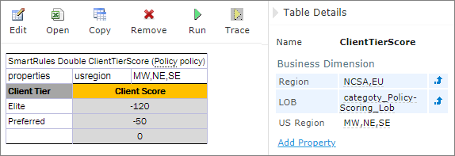
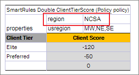
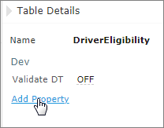
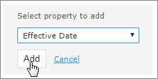
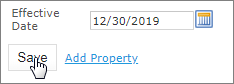
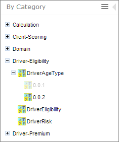
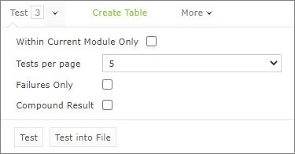
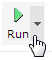
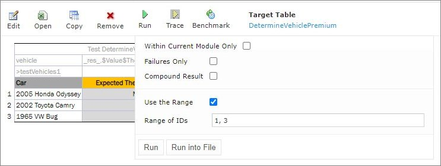
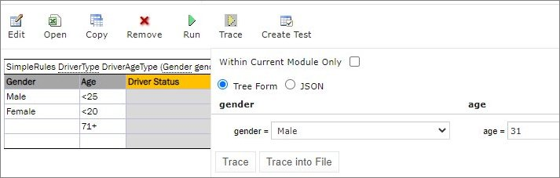

## Editing and Testing Functionality

This chapter describes advanced OpenL Studio functions, such as table editing, performing unit tests, rule tracing, and benchmarking. The following sections are included in this chapter:

-   [Editing Tables](#editing-tables)
-   [Using Table Versioning](#using-table-versioning)
-   [Performing Unit Tests](#performing-unit-tests)
-   [Tracing Rules](#tracing-rules)
-   [Using Benchmarking Tools](#using-benchmarking-tools)

### Editing Tables

This section describes table editing and includes the following topics:

-   [Editing a Comma Separated Array of Values](#editing-a-comma-separated-array-of-values)
-   [Editing Default Table Properties](#editing-default-table-properties)
-   [Editing Inherited Table Properties](#editing-inherited-table-properties)

#### Editing a Comma Separated Array of Values

OpenL Studio allows editing comma separated arrays of values. A multi selection window displaying all values appears enabling the user to select the required values.

*Editing comma separated arrays*

#### Editing Default Table Properties

This section describes table properties available in OpenL Studio. For more information on table properties, see [OpenL Tablets Reference Guide > Table Properties](https://openldocs.readthedocs.io/en/latest/documentation/guides/reference_guide/table-properties).

If default property values are defined for a table, they appear only in the right hand **Properties** section, but not in the table. In the following example, there are **Active = true** and **Fail On Miss = false** default properties.

*Default table properties example*

Default properties can be overridden at the table level; in other words, they can be changed as follows:

1.  In the **Properties** section, click the default property to be changed.

    lnstead of the property value, a checkbox appears:
    
    
    
    *Updating a default property*
    
1.  Select or deselect the checkbox as needed and click the **Save** button.
    
    The property appears in the table with its new value.
    
    
    
    *Default property was updated by a user*

#### Editing Inherited Table Properties

Module or category level properties are those inherited from a **Properties** table as described in [OpenL Tablets Reference Guide > Properties Table](https://openldocs.readthedocs.io/en/latest/documentation/guides/reference_guide/#properties-table). In the **Properties** section of the given table, inherited properties appear in a different color and are accompanied with a link to the **Properties** table where they are defined. The values of the inherited properties are not stored in the table, they are displayed in the **Properties** section, since they are inherited and applied to this table. Inherited properties can be overridden at a Table level, i.e. they can be changed.

*An example of inherited category-level properties*

To change an inherited property, perform the following steps:

1.  In the **Properties** section, click the inherited property to be changed.
2.  Enter or select the required values from the drop-down list and click **Save**.
    
    
    
    *Updating an inherited property*
    
    The system displays the property in the table.
    
    
    
    *Inherited category-level property updated by a user*

The following topics are included in this section:

-   [Editing System Properties](#editing-system-properties)
-   [Editing Properties for a Particular Table Type](#editing-properties-for-a-particular-table-type)

##### Editing System Properties

By default, OpenL Studio applies system properties to each created or edited table. For information on how to switch off this option, please refer to [Managing Common Settings](#managing-common-settings). The values of the System properties are provided in the table and in the Properties section.

The **modifiedBy** property value is set using the name of the currently logged in user. The **modifiedOn** property is set according to the current date. These properties are applied upon each save.

The **createdBy** property value is set using the name of the currently logged in user. The **createdOn** property is set according to the current date. These properties are applied on the first save only while creating or copying a table in OpenL Studio.

The **createdBy** and **modifiedBy** properties are only applied in the multi-mode as described in [Security Overview](#security-overview).

System properties cannot be edited in UI. The OpenL Studio users can delete those properties if required.

*An example of system properties*

##### Editing Properties for a Particular Table Type

Some properties are only applicable to particular types of tables. When opening a table in OpenL Studio, the properties section displays properties depending on the type of the table.

For example, such property as **Validate DT** is available for Decision Tables. That means it can be selected in the drop-down list after clicking the **Add** link at the bottom of the **Properties** section. The following figure shows properties applied to a Decision Table:

*Properties for the Decision table type*

When opening a Data Table in the same project, these properties are not available for selecting from the drop-down list in the **Properties** section.

*The Decision table properties that are not available for a Data table*

When performing the “Copy” action, properties unsuitable for the current table type do not appear in the wizard.

To add a new property for the selected table, perform the following steps:

1.  In the **Properties** pane, click the **Add Property** link.
    
    
    
    *Add new property for the current table*
    
1.  Enter the required property or select it from the drop-down list and click the **Add** button.
    
    
    
    *Selected table property to be added*
    
1.  Specify the property value and then click the **Save** button to complete.
    
    All steps are collected in the following figure:
    
    
    
    *Saving a new property for the current table*

### Using Table Versioning

The table versioning mechanism is based on copying the existing table and is initiated in OpenL Studio by clicking the **Copy** button. Then select **New Version** in the **Copy as** list, enter the data as needed and click **Copy** to save.

A new table version has the same identity, that is, signature and dimensional properties of the previous version. When a new table version is created, the previous version becomes inactive since only one table version can be active at a time. By default, all tables are active. The following is an example of an inactive table version.

*An inactive table version*

Versions of the same table are grouped in the module tree under the table name. Clicking the table name displays the active version. If all tables are set to inactive, the latest created version is displayed.

*Displaying table versions in the module tree*

The table version is defined in a three digit format, such as 4.0.1. Table versions must be set in an increasing order.

*Entering a new version number*

### Performing Unit Tests

Unit tests are used in OpenL Tablets to validate data accuracy. OpenL Tablets Test tables with predefined input data call appropriate rule tables and compare actual test results with predefined expected results.

For example, in the following diagram, the table on the left is a decision table but the table on the right is a unit test table that tests data of the decision table:

*Decision table and its test table*

OpenL Studio supports visual controls for creating and running project tests. Test tables can be modified like all other tables in OpenL Studio. For information on modifying a table, see [Modifying Tables](#modifying-tables). Test results are displayed in a simple format directly in the user interface.

The following topics are included in this section:

-   [Adding Navigation to a Table](#adding-navigation-to-a-table)
-   [Running Unit Tests](#running-unit-tests)
-   [Creating a Test](#creating-a-test)

#### Adding Navigation to a Table

OpenL Studio adds a view navigation link to the appropriate test table and vice versa. See the following example:

*Navigation link to target table*

#### Running Unit Tests

This section provides the methods used to run unit tests. The following topics are included in this section:

-   [Executing All Module Tests at Once](#executing-all-module-tests-at-once)
-   [Executing Tests for a Single Table](#executing-tests-for-a-single-table)
-   [Displaying Failures Only](#displaying-failures-only)
-   [Displaying Compound Result](#displaying-compound-result)

##### Executing All Module Tests at Once

The system automatically executes all test runs, test cases, in every unit test in a module, including tests in module dependencies, and displays a summary of results.

Test results display resembles the following sample:

*Results of running all project tests*

1.  To run all module tests, click the **Run Tests**  icon in the top line menu of Rules Editor.
    
    Failed test cases are represented by  mark. Passed tests are represented by  mark.
    
    By default, all tests are run in multi-module mode, and the system executes all tests of the project, including project dependencies.
    
1.  To run the tests in the current module and its dependent modules only, select the **Within Current Module Only** check box in the button menu or test results page.
    
    
    
    *Defining test settings*
    
    In the example above, test results are displayed with five test tables, unit tests, per page. This setting is configured for each user individually in User Profile as **Tests per page** setting.
    
1.  To change the setting for a particular test run without updating user settings, click the arrow to the right of the **Run Tests**  and choose a required number of **Tests per page**. There is an alternative way: the same setting options are displayed on the top of the window after executing all tests. The following picture provides an illustration:
    
    
    
    *Number of tests per page setting*
    
1.  To export test results into an Excel file, in the **Run** or **Test** drop-down menu, select **Run into File** or **Test into File.** The generated file contains both results and input parameters.

##### Executing Tests for a Single Table

This section describes test execution. Proceed as follows:

1.  To execute all test runs for a particular rule table, select the rule table in the module tree and, in the upper part of the middle pane, click **Test** .
    
    Test results resemble the following:
    
    
    
    *Results of executing all test runs for one rule table*
    
    If the table contains Value types, such as IntValue, the results are clickable and enable a user to view the calculation history.
    
1.  To test a rule table even if no tests have been created for the given table yet, proceed as follows:
2.  In the module tree, select the required rule table and click the green **Run** arrow  above the table.
    
    The form for entering required values to test rule table appears.
    
    
    
    *Testing a rule table without tests*
1.  To run a test for the currently opened module and its dependent modules only, ensure that the **Within Current Module Only** option is selected.
2.  In the pop-up window, click **Run**.
    
        The results of the testing are displayed.
    
    
    
    *Result of running virtual test*
3. To export the results to an Excel file, click the "Run Into File" button. This action will generate an Excel file named "test-results.xlsx", which includes two sheets: 'Result' and 'Parameters'.   By default, the 'Parameters' sheet lists each attribute's name and value on separate rows. For a more compact table format, deselect the ***Flat Parameter Layout*** option.  To exclude any empty input values, select the ***Skip Empty Parameters*** checkbox.
    The following examples illustrate how ***Flat Parameter Layout*** and ***Skip Empty Parameters*** affect the "test-results.xlsx" file: 
    
   *"Flat Parameter Layout” = ***True***, “Skip Empty Parameters” = ***False*** (***default***)*
    
   *"Flat Parameter Layout” = ***False***, “Skip Empty Parameters” = ***False****  
    
   *"Flat Parameter Layout” = ***True***, “Skip Empty Parameters” = ***True****

1.  For test tables, to select test cases to be executed, proceed as follows:
2.  Navigate to the **Run** button above the Test table and click the small black arrow .
3.  In the pop-up window that appears, select or clear the check boxes for the appropriate IDs, and to run several particular test cases, define them in the **Use the Range** field.
    
    
    
    *Select test cases via Range field to be executed*
    
1.  If necessary, specify whether the test must be run in the current module only.
2.  In the pop-up window, click **Run**.
    
    Only the selected test cases are executed.
    
    
    
    *Result of selective testing*
    
1.  To export test results into an Excel file, click **Test** and select **Test into File.**

##### Displaying Failures Only

There are cases when a user wants to examine results of failed test cases only. For example, the project contains a test with more than 50 test cases and a user just needs to know whether project rules are operating correctly, that is, whether all test cases are passed. If a user runs the test, a huge table of results is returned, which is difficult to review and find failures to correct the rule or case. For such situations, OpenL Studio provides an option to display failed test cases only.

This option is configured for each user individually in User Profile as the **Failures Only** setting. There are multiple ways to change the setting for a particular test run without updating user settings:

-   Click the arrow to the right of the **Run Tests**  and in a pop-up window that appears, clear or select **Failures** **only**.
-   Select the Test table, navigate to the **Run** button above the table, click the **Run** arrow , and in the pop-up window that appears, select or clear **Failures only**.
-   Select or clear the **Failures only** setting that appears on the top of the window upon executing all tests at once as displayed in Figure 107: Number of tests per page setting.

Additionally, the number of failed test cases displayed for one unit test can be limited. For example, a user is testing rules iteratively and is interested just in the first several failures in order to analyze and correct them, and re-execute tests, sequentially correcting errors. To do this, change **All** on an appropriate value next to **Failures per test** label or **first** label (for method 3). The setting is available only if **Failures only** is selected.

*Settings for displaying failed test cases only*

##### Displaying Compound Result

The result of a rule table execution can be a single value or compound value such as spreadsheet. A test table specifies what is tested, full result or particular parts of it, and their expected results of each test case. In the following example, *IncomeForecastTest* is intended to check Minimal and Maximal Total Salary values in the resulting spreadsheet:

*Testing tables with compound result on*

After running the test, OpenL Studio displays each test case with input values and actual results marked as passed or failed.

*Testing spreadsheet result*

In cases when test result is complex (compound), there is an option to display the full result of running test cases as well, not only values which are being tested. It is configured for each user individually in User Profile as “**Compound Result**” setting. If the option is switched on, the result of running *IncomeForecastTest* looks as follows:

*Displaying compound result*

This setting for a particular test run (without updating user settings) can be changed in the same ways as it is described in [Displaying Failures Only](#displaying-failures-only).

#### Creating a Test

OpenL Studio provides a convenient way to create a new test table.

When an executable table, such as Decision, Method, Spreadsheet, ColumnMatch, or TBasic table, is created, the **Create Test** item becomes available.

*Create new test table*

Proceed as follows:

1.  To create a Test table for the current table, click the **Create Test** button.
    
    OpenL Studio runs a two-step wizard for creating an appropriate Test table.
    
1.  Enter test input values and expected result values to complete the Test table.

### Tracing Rules

OpenL Studio provides a rule tracing view for all appropriate OpenL Tablets methods. These methods include the following:

-   All test tables
-   All Rule tables with the possibility of specifying input parameters
-   Method tables with preset parameters

Tracing of a rule enables users to determine how results for complex rules are obtained.

**Note:** Before tracing, ensure that the browser does not block pop-up windows. Otherwise, trace results will not be displayed. For more information on how to unblock pop-up windows, refer to the specific browser Help.

When using the tracing functionality, users can check the result of each step of the rule and how the result was obtained without creating test cases. For that, perform the following steps:

1.  In Rules editor, open a rule table to be traced and click **Trace**  in the middle pane.
2.  Enter parameters to be traced in the pop-up window.
3.  If necessary, specify whether tracing must be applied to the rules of the current module and its dependent modules only.
    
    
    
    *Tracing a rule for a rule table*
    
1.  To use JSON data and prefill fields with data extracted from log or provided by developers, select **JSON.**
    
    
    
    *Selecting the JSON option for tracing*
    
    The same functionality is available for running rules. Settings defined in rule deploy configuration are applied to the JSON input as well. For example, if Provide runtime context is set to true, in JSON, context must be defined. Thus, the same JSON request can be used in OpenL Tablets Rule Services and OpenL Studio.
    
1.  Click the **Trace** button.

If there is a set of test cases and the result of each step of the rule and how the result was obtained need checking, trace the Test table as follows:
    
1.  Open the required Test table.
2.  To open a pop-up with test cases to be traced, click the **Trace** button.
    
    
    
    *Tracing of a Test table*
    
1.  In the pop-up, select or deselect the test cases as needed.
    
    All test cases can be checked or unchecked by using the checkbox on the left of **Test Parameter(s)**.
    
1.  If necessary, specify whether tracing must be limited to the current module only.
2.  Click **Trace** to start the process.
    
    The system displays the tracing results in a separate browser window as illustrated in the following example:
    
    
    
    *Tracing results*
    
The left side displays a tree consisting of rule tables as tree nodes and fired rule rows as tree leaves. Selected **Detailed trace tree** option enables to view all rule calls.

-   If that option is cleared, only successful calls will be displayed.

    This option can only be used for a Decision table or if a Decision table is used in complex rules.

-   If an element in the tree is selected, the corresponding rule table is displayed in the right pane.

    The fired rule rows are highlighted using the specified color. The highlight color and transparency level can be configured by clicking the  buttons above the rule table. Note that the gray button is selected by default.

In addition, the right pane displays the actual parameters used in the particular rule call and the returned result.
The example above demonstrates the results of tracing a decision table. For other rule tables, the picture slightly differs but the meaning is essentially the same.

For a decision table, the tracing results are displayed as follows:

-   The rules that were traced are not highlighted and appear as white rows.
-   Successfully completed or returned rules are boxed with green lines.
-   The failed rules are displayed in red.

### Using Benchmarking Tools

OpenL Studio provides benchmarking tools for measuring execution time for all appropriate OpenL Tablets elements. In OpenL Tablets, everything that can be run can be benchmarked too. Benchmarking is useful for optimizing the rule structure and identifying critical paths in rule calculation.

The benchmarking icon is displayed above the table to be traced.

*Controls for measuring performance*

For a test table, select the test cases as follows:

1.  Open the required test table.
2.  Navigate to the **Benchmark** button above the test table and click the small right-hand black arrow to open a pop-up with test cases as needed.
3.  Select or deselect the test cases as needed.
    
    By default, all cases are selected. All test cases can be also checked or unchecked by using the checkbox on the left of **Test Parameter(s)**.
    
1.  Click the **Benchmark** button within the pop-up.

Clicking the benchmarking icon runs the corresponding method or set of methods and displays the results in a table.

*Benchmarking results*

Benchmark is displayed using the following parameters:

| Parameter      | Description                                                                             |
|----------------|-----------------------------------------------------------------------------------------|
| Test Case (ms) | Time of one test case execution, in milliseconds.                                       |
| Test Cases/sec | Number of such test cases that can be executed per second.                              |
| Test Cases     | Number of test cases in a Test table.                                                   |
| Runs (ms)      | Time required for all test cases of the table, or rule set, execution, in milliseconds. |
| Runs/sec       | Number of such rule sets that can be executed per second.                               |

OpenL Studio remembers all benchmarking runs executed within one session. Every time a new benchmark is run, a new row is added to the results table.
Benchmarking results can be compared to identify the most time consuming methods. Select the required check boxes and click **Compare** to compare results in the results table.
Comparison results are displayed below the benchmarking table.

*Comparing benchmarking results*

