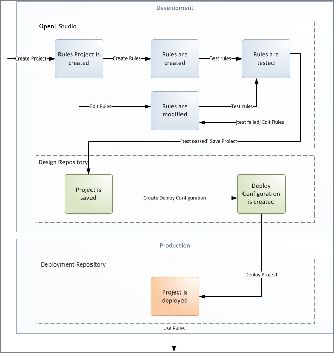

## Introducing OpenL Studio

This chapter introduces main OpenL Studio concepts. The following topics are included in this chapter:

-   [What Is OpenL Studio?](#what-is-openl-studio)
-   [Working with Projects in OpenL Studio](#working-with-projects-in-openl-studio)
-   [OpenL Studio Components](#openl-studio-components)
-   [Security Overview](#security-overview)

### What Is OpenL Studio?

**OpenL Studio** is a web application employed by business users and developers to view, edit, and manage business rules and rule projects created using OpenL Tablets technology. For more information on OpenL Tablets, see [OpenL Tablets Reference Guide](https://openldocs.readthedocs.io/en/latest/documentation/guides/reference_guide/).

By using OpenL Studio, users can modify rules directly in a web browser without installing additional tools. OpenL Studio provides an advanced functionality for creating and modifying rules, viewing errors, and executing tests.

### Working with Projects in OpenL Studio

OpenL Studio is intended for a multi-user environment. It provides a centralized storage of rule projects called **Design repository**. Design repository is stored on the OpenL Studio server and can be accessed by any user. However, users cannot modify projects directly in Design repository. Instead, to make modifications to a project, users must execute the following procedure:

| Step | Action            | Description                                                                                                                                                                                                                                                                                                                                                                                                                                                                                                                 |
|------|-------------------|-----------------------------------------------------------------------------------------------------------------------------------------------------------------------------------------------------------------------------------------------------------------------------------------------------------------------------------------------------------------------------------------------------------------------------------------------------------------------------------------------------------------------------|
| 1    | Open a project.   | When a project is opened, its status is set to **No Changes**, and a copy of it is created in the user’s workspace,  a specific location on the OpenL Studio server.  Work copies of projects made editable by a particular user are stored there. Users can only access their personal workspaces.                                                                                                                                                                                                                |
| 2    | Modify a project. | After any modification of a project, its status is set to **In Editing**.  A project in the **In Editing** status is locked in Design repository to avoid loss of information.  Other users cannot edit it until the project is saved.  Other users can only open the project in read-only mode, with the **No Changes** status.  Modifications to a project in the **In** **Editing** status are performed on the working copy stored in the user's workspace.  Modifications do not become immediately visible to other users. |
| 3    | Save a project.   | Saving a project copies the modified copy of the project from the user's workspace to Design repository.  A new revision of the project is created in Design repository.  A project can be restored to any of its previous revisions. In this case, its status is set to **Viewing Revision.**  From this moment, changes are visible to other users and the project is available for editing.                                                                                                                                 |

Closing a project deletes it from the user's workspace without saving changes and does not affect the revision in Design repository. Closed projects can be browsed in repository editor but are not available in Rules Editor.

The following diagram illustrates general rules project lifecycle. This is a simplified schema of rules development workflow where activities as opening, opening for editing, closing, deleting, and erasing the current project or deploying configuration are omitted.

*Rules project development workflow*

Development of rules starts with creating a new project that will contain the rules. If the project already exists, it must be opened for editing. Then rules are created or updated and properly tested. After rules are completed and all tests are passed, a user saves the project. At this point, the updated revision of the project is saved to Design repository and applied changes of the project become available for viewing and editing by other users. If no more changes to the project are planned in the nearest future, a user can close the project.

Saved project revision is used to create deploy configuration. Several projects can be included in the same deploy configuration. Deploy configurations are used to deploy updates to the production environment.

If the project is not required any more, it can be deleted.

### OpenL Studio Components

OpenL Studio consists of the following main components:

| Component                        | Description                                                                                                                                                                                                                                                                                                                                                                                                                                                                                                                                                                                                                                                                                                                                                                                                                                      |
|----------------------------------|--------------------------------------------------------------------------------------------------------------------------------------------------------------------------------------------------------------------------------------------------------------------------------------------------------------------------------------------------------------------------------------------------------------------------------------------------------------------------------------------------------------------------------------------------------------------------------------------------------------------------------------------------------------------------------------------------------------------------------------------------------------------------------------------------------------------------------------------------|
| Rules Editor                     | Graphic user interface running in a web browser allowing users to browse rule modules, modify table data, and run tests.  Rule project configurations are browsed and updated there as well.   Rules Editor is the default user interface displayed when a user opens OpenL Studio.  Rules Editor does not display all rule module files but provides a logical view of rules stored in a module.  This view is convenient for users who modify business rules.   Rules Editor displays only modules available in projects stored in the user's workspace.  To retrieve a project to the user's workspace, open the project as described in [Working with Projects in OpenL Studio](#working-with-projects-in-openl-studio).  For more information on using Rules Editor, see [Using Rules Editor](#using-rules-editor). |
| Repository editor                | Graphic user interface running in a web browser allowing users to browse and manage projects in Design repository.  Unlike Rules Editor, repository editor displays physical contents of rule projects.  Users can easily switch between Rules Editor and repository editor in user interface.   Repository editor provides the following main functions:  - uploading projects from the file system to Design repository  - editing, saving, opening, and closing projects  - modifying project structure and properties managing project revisions  - copying and deleting projects in Design repository  - managing and tracing deploy configurations  For more information on using repository editor, see [Using Repository Editor](#using-repository-editor).                                                                                                 |
| Design repository                | Centralized storage of rule projects accessible by all OpenL Studio users.   Projects uploaded to Design repository are visible to other users.  Design repository creates a separate project revision each time a project is saved.  Any project revision can be opened.                                                                                                                                                                                                                                                                                                                                                                                                                                                                                                                                                                 |
| Deploy configurations  repository | Centralized storage of final rule projects to be delivered to the production environment where solution applications use them.  Projects can be deployed to deployment repository from Design repository using deploy configurations.  **Deploy configuration** is a specific OpenL Studio project type.  It identifies rule projects and project revisions to be deployed to deployment repository.  Deploy configurations are saved and versioned so that developers can identify which specific rule project revisions are deployed.                                                                                                                                                                                                                                                                                                   |
| Deployment repositories          | Production storages of deployed rule projects where solution applications use them.                                                                                                                                                                                                                                                                                                                                                                                                                                                                                                                                                                                                                                                                                                                                                              |
| User workspace                   | Project storage on the server containing projects edited by users. Each user has a personal workspace unavailable to other users.                                                                                                                                                                                                                                                                                                                                                                                                                                                                                                                                                                                                                                                                                                                |

### Security Overview

OpenL Studio supports the following user modes:

| Mode             | Description                                                                                                                                                                                                                                                                                                                                                                                                                                                                                                                                                                                                                                                                                                                                                   |
|------------------|---------------------------------------------------------------------------------------------------------------------------------------------------------------------------------------------------------------------------------------------------------------------------------------------------------------------------------------------------------------------------------------------------------------------------------------------------------------------------------------------------------------------------------------------------------------------------------------------------------------------------------------------------------------------------------------------------------------------------------------------------------------|
| Demo mode        | This is a multi user mode with the list of users predefined in the database. All changes in the database will be lost after the application restart.  The user’s projects will be located in the `user-workspace\<user name>` folder.                                                                                                                                                                                                                                                                                                                                                                                                                                                                                                                     |
| Single user mode | In this mode, only one user who is currently logged in on the computer can work in OpenL Studio.  This mode is selected when OpenL Studio is installed on the local machine.  All user projects are located in the root of the `user-workspace` directory.  Single user mode is set by default and does not require additional settings, including logon to the system.  Moreover, the system works faster in this mode but neither user management nor access control is provided.                                                                                                                                                                                                                                                           |
| Multi user mode  | This mode enables multiple users to work in OpenL Studio and supports a security mechanism restricting access  to certain product functions based on user access rights. Each OpenL Studio user is identified by a unique name.  When a user opens OpenL Studio in a web browser, he or she must log into the system.  Users can have varied levels of access in OpenL Studio. For example, system administrators usually have full access  to all OpenL Studio functions, whereas other users may only have access rights to view or modify business rules.  OpenL Studio is used to authenticate and manage user credentials/permissions.  In this mode, user’s projects are located in the `user-workspace\<user name>` directory. |
| Active Directory | In this mode, multiple users can run OpenL Studio using their unique user names.  The user’s projects will be located in the `user-workspace\<user name>` directory.  Active Directory will be used to authenticate and manage user credentials.  A place where user permissions will be managed can be OpenL Studio or Active Directory.                                                                                                                                                                                                                                                                                                                                                                                                         |
| SSO: CAS         | In this mode, multiple users can run OpenL Studio using their unique user names.  The user’s projects will be located in the `user-workspace\<user name>` directory.  CAS (Central Authentication Service) server will be used to authenticate and manage user credentials.  A place where user permissions will be managed can be OpenL Studio or SSO identity provider.                                                                                                                                                                                                                                                                                                                                                                         |
| SSO: SAML        | In this mode, multiple users can run OpenL Studio using their unique user names.  The user’s projects will be located in the `user-workspace\<user name>` directory.  SAML (Security Assertion Markup Language) supporting Identity Provider server will be used to authenticate and manage user credentials.  A place where user permissions will be managed can be OpenL Studio or SSO Identity provider.                                                                                                                                                                                                                                                                                                                                       |
| SSO:OAuth2       | Multiple users can run OpenL Studio using their unique user names.  User projects will be located in the `user-workspace\<user name>` directory.  OAuth2 (Open Authorization) supporting the identity provider server is used to authenticate and manage user credentials.                                                                                                                                                                                                                                                                                                                                                                                                                                                                            |

