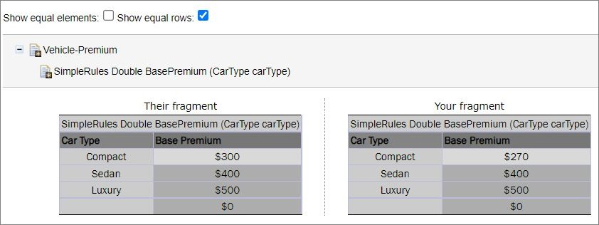

## Working with Project Branches

This section introduces project branches and describes how to use them. Branches are useful when several users work on the same project simultaneously and then merge the changes or keep them as separate project versions.

The following topics are included in this section:

-   [Creating a Branch](#creating-a-branch)
-   [Working with Branches](#working-with-branches)
-   [Resolving Conflicts](#resolving-conflicts)
-   [Using Protected Branches](#using-protected-branches)

### Creating a Branch

A branch is created by copying an existing project. Both predefined and user-defined names can be used for a branch. For more information on name patterns, see [Setting Up a Connection to a Git Repository](#setting-up-a-connection-to-a-git-repository).

Proceed as follows:

1.  In OpenL Studio, in the editor or repository, select a project.
2.  Click **Copy.**
3.  In the **New Branch Name** field, proceed with the default value or enter a new branch name.

The newly created project branch is displayed as an active branch and ready for work.

**Note:** When a project in the **Closed** status is copied, the project in the newly created branch has the **No changes** status.

### Working with Branches

This section describes how to view existing branches, switch between them in the editor and repository, enable and disable branches, and delete branches. Proceed as follows:

1.  To display a current project branch, in OpenL Studio, in the editor or repository, open a project.
    
    The current project branch is displayed.
    
1.  To switch between branches in the editor, click the last link in the address bar identifying the branch name and in the list that appears, select the required branch.
    
    
    
    *Switching between branches in the editor*
    
1.  To switch between branches in the repository, for a project, in the **Branch** field, select the required branch.
2.  To disable or enable a branch for a project, in the repository, click the dots next to the branch name field and in the window that appears, clear or select the appropriate branch check box.
    
    This list also contains branches created outside of OpenL Studio.
    
    
    
    *Enabling and disabling branches for a project*
    
1.  To delete a non-default branch, switch to this branch in the project properties and click **Delete Branch.**
    
    The non-default branch is deleted completely, it cannot be later restored, and it does not appear in the **Manage branches** list. The project in the branch is erased. If the non-default branch contains commits not merged to the default branch, a warning message is displayed upon deletion attempt.
    
    
    
    *Deleting a non-default branch with unmerged commits*
    
1.  To delete a default branch, in the repository, select the required project branch and click **Delete.**
    
    The project is archived and disappears from the list of active projects.
    
1.  To completely delete the default branch or restore the archived project, proceed as follows:
2.  Click the filter icon and clear the **Hide deleted projects** check box.
3.  In the branch drop-down list, select an archived branch.
4.  To restore an archived project, select it in the list of projects and click **Undelete.**
5.  To completely remove the project and the branch, click **Erase.**
6.  To merge two branches, click **Sync** and select one of the following options:
    
    | Option                | Description                                                                   |
    |-----------------------|-------------------------------------------------------------------------------|
    | Receive their updates | Changes from a selected branch are copied to the currently active branch.     |
    | Send your updates     | Changes from the currently active branch are uploaded to the selected branch. |
    
    If upon saving there is a conflict due to updates in the same module sheet, the **Resolve conflicts** window appears.
    
    
    
    *Resolving conflicts on merging branches*
    
    Conflicts can be resolved by selecting one of the following options:
    
    | Option             | Description                                                                                                                  |
    |--------------------|------------------------------------------------------------------------------------------------------------------------------|
    | Use yours          | Changes in the currently active branch are applied on merge. The changes applied by another user are lost.                   |
    | Use theirs         | Changes in the selected branch are applied on merge. The changes made by you are lost.                                       |
    | Upload merged file | Depending on the selected merging options, changes in the manually updated and uploaded file override changes in the branch. |
    
1.  To view the changes made by another user, compare them to your changes, or view the base version of the file, select a corresponding option in the **Compare** column.

### Resolving Conflicts

If the same version of the project is edited by several users, upon submitting their changes using different clients, the conflict error message appears asking which version must be saved. Changes in other versions are discarded.


*An error message upon saving conflicting versions*

The error message contains the **Compare** link that allows viewing both conflicting versions for comparison.



*Comparing conflicting versions*

### Using Protected Branches

OpenL Tablets allows defining a list of protected branches for Git design repository to avoid pushing erroneous changes into main or release branches.

If a branch is marked as protected, all actions that can impact Git history, such as deleting a project or module or synchronizing to a protected branch, are forbidden. In this case, separate branches are modified and then merged into the protected branch only via the Git CI process.

Branches can be defined as protected using the following property:

```
repository.design.protected-branches
```

Branches must be separated by comma.

Wildcards can be used to specify a group of branches, such as release-\*, so all branches that start with release- keyword are protected.

By default, branches are not protected.

Branches can also be defined as protected in OpenL Studio administrative tab as described in [Setting Up a Connection to a Git Repository](#setting-up-a-connection-to-a-git-repository).

